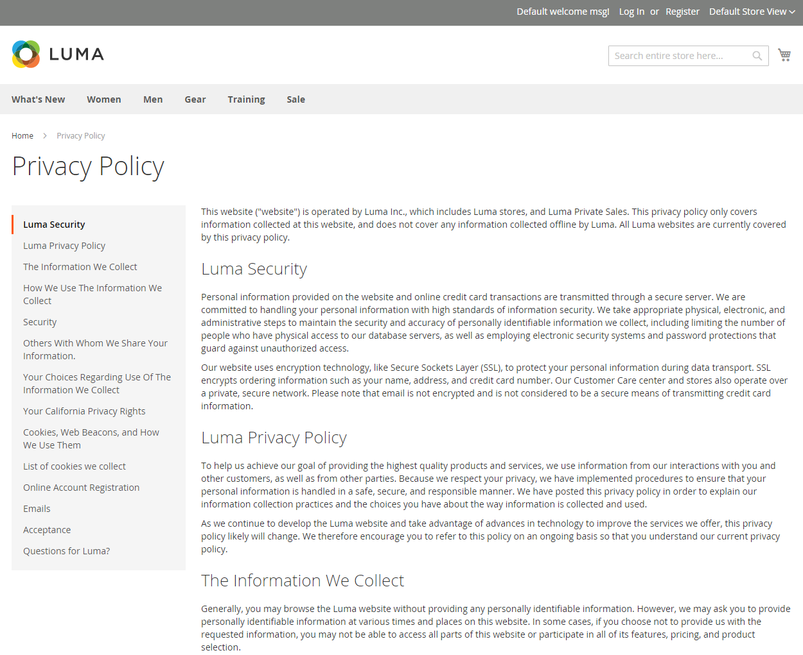
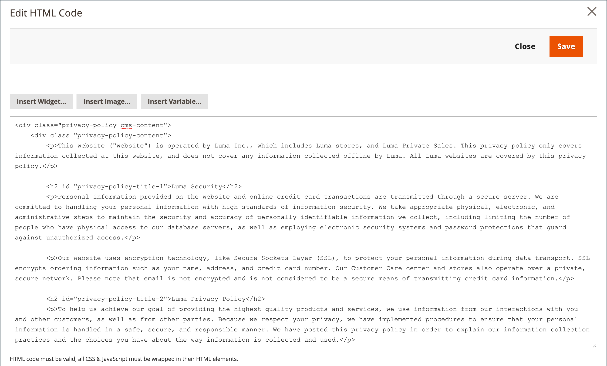

# Privacybeleid opslaan

Je winkel bevat een voorbeeld van privacybeleid dat moet worden bijgewerkt met je eigen gegevens. Uw privacybeleid zou het type informatie moeten beschrijven dat uw bedrijf verzamelt, en hoe het wordt gebruikt. Ook de bestandsnamen van [cookies](compliance-cookie-law.md#default-cookies) die worden geplaatst op de computers van mensen die uw winkel bezoeken. Extra cookies die zijn gekoppeld aan extensies en invoegtoepassingen van derden, moeten in de lijst worden opgenomen.

## Persoonlijke gegevens

Er zijn twee algemeen aanvaarde classificaties van persoonsgegevens, die doorgaans worden afgekort als PI en PII. Het voorbeeldprivacybeleid in de voorbeeldgegevens van de Luminantie verwijst naar Persoonlijk identificeerbare informatie (PII). Bovendien zijn er talrijke variaties van deze definities die verband houden met wettelijke regelingen van verschillende landen, regio&#39;s en staten. Voor deze algemene discussie kunnen de volgende definities worden gebruikt:

### Persoonlijke gegevens (PI)

Alle informatie die redelijkerwijs kan worden geïdentificeerd of gebruikt om een persoon direct of indirect te identificeren. Persoonlijke gegevens kunnen betrekking hebben op een persoon, zoals een klant, werkgever, verkoper of aannemer.

### Persoonlijk identificeerbare informatie (PII)

Elke weergave van informatie die de identiteit mogelijk maakt van een persoon op wie de informatie van toepassing is, kan redelijkerwijs op directe of indirecte wijze worden afgeleid. PII wordt gedefinieerd als informatie die een persoon rechtstreeks identificeert (zoals naam, adres, socialezekerheidsnummer of ander identificatienummer). Het is ook informatie waarmee een agentschap specifieke personen wil identificeren met andere gegevenselementen (indirecte identificatie). Deze gegevenselementen kunnen een combinatie van geslacht, ras, geboortedatum, geografische indicator en andere beschrijvingen omvatten. Het bevat ook informatie die het mogelijk maakt fysieke of online contact op te nemen met een bepaalde persoon, is hetzelfde als persoonlijk identificeerbare informatie. Deze informatie kan op papier, in elektronische vorm of in andere media worden bewaard.

{width="600" zoomable="yes"}

## Je privacybeleid bewerken

>[!TIP]
>
>De voorbeeldgegevens van de Luminantie bevatten een privacybeleid dat u kunt wijzigen voor uw gebruik.

1. Op de _Beheerder_ zijbalk, ga naar **[!UICONTROL Content]** > _[!UICONTROL Elements]_>**[!UICONTROL Pages]**.

1. Zoek in het raster **[!UICONTROL Privacy Policy]**. Dan, in _[!UICONTROL Action]_kolom, klik **[!UICONTROL Select]**en kiest u **[!UICONTROL Edit]**.

   >[!NOTE]
   >
   >Als u de URL-sleutel van de pagina met privacybeleid wijzigt, moet u ook een [aangepaste URL herschrijven](../merchandising-promotions/url-rewrite-custom.md) om verkeer naar de nieuwe sleutel van URL om te leiden. Anders wordt de koppeling in de voettekst geretourneerd `404 Page Not Found`.

1. Breid uit **[!UICONTROL Content]** en brengt u de gewenste wijzigingen aan in de inhoud.

   Ga voor meer informatie over het gebruik van gereedschappen voor pagina-inhoud naar [De inhoud voltooien](../content-design/page-add.md#step-2-complete-the-content) in de _Inhoud- en ontwerphandleiding_.

   {width="600" zoomable="yes"}

1. Klik op **[!UICONTROL Save Page]**.
