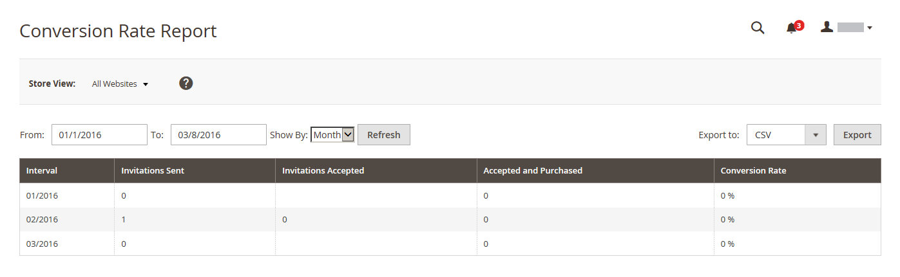

# Privéverkooprapporten

{{ee-feature}}

De verslagen van de privé verkoop verstrekken informatie over [evenementen en particuliere verkoop](../merchandising-promotions/events-private-sales.md).

## [!UICONTROL Invitations Report]

De [!UICONTROL Invitations Report] geeft het aantal [uitnodigingen](../merchandising-promotions/invitations.md) verzonden tijdens de opgegeven periode, en het nummer dat is geaccepteerd en verwijderd.

Op de _Beheerder_ zijbalk, ga naar **[!UICONTROL Reports]** > _[!UICONTROL Private Sales]_>**[!UICONTROL Invitations]**.

{width="600"}

## [!UICONTROL Invited Customers Report]

De [!UICONTROL Invited Customers Report] toont alle klanten die uitnodigingen voor een privé verkoop of een gebeurtenis zijn verzonden. Dit omvat de naam en het e-mailadres, de klantengroep, het aantal verzonden uitnodigingen en het geaccepteerde nummer.

Op de _Beheerder_ zijbalk, ga naar **[!UICONTROL Reports]** > _[!UICONTROL Private Sales]_>**[!UICONTROL Invited Customers]**.

{width="600"}

## [!UICONTROL Conversion Rate Report]

De [!UICONTROL Conversion Rate Report] het aantal verzonden en aanvaarde uitnodigingen, het aantal uitnodigingen dat tot een aankoop heeft geleid en de omrekeningskoers als een percentage.

Op de _Beheerder_ zijbalk, ga naar **[!UICONTROL Reports]** > _[!UICONTROL Private Sales]_>**[!UICONTROL Conversions]**.

{width="600"}
