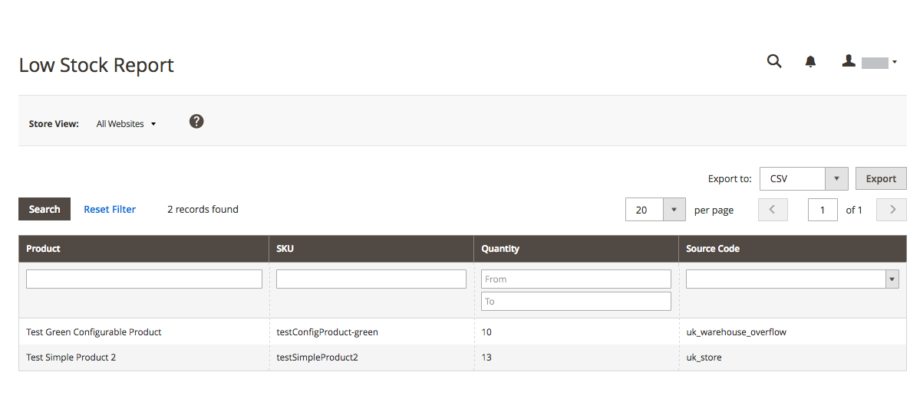

# Productrapporten

De productrapporten geven u insight over bekeken en bestelde producten, bestsellers, voorraadniveaus en downloads.

## [!UICONTROL Product Views Report]

In [!UICONTROL Product Views Report] worden de producten weergegeven die gedurende een tijdsinterval of een datumbereik zijn weergegeven. Het rapport bevat de productnaam, de prijs en het aantal weergaven.

Voor _Admin_ sidebar, ga **[!UICONTROL Reports]** > _[!UICONTROL Products]_>**[!UICONTROL Views]**.

{width="600"}

## [!UICONTROL Bestsellers Report]

[!UICONTROL Bestsellers Report] toont vijf top-verkopende vijf tijdens een interval van tijd of datumwaaier. Het rapport bevat de productnaam, de prijs en de bestelde hoeveelheid.

Voor _Admin_ sidebar, ga **[!UICONTROL Reports]** > _[!UICONTROL Products]_>**[!UICONTROL Bestsellers]**.

{width="600"}

## [!UICONTROL Low Stock Report]

In [!UICONTROL Low Stock Report] worden alle producten weergegeven met voorraadniveaus binnen een opgegeven bereik. Als [[!DNL Inventory Management]](../inventory-management/introduction.md) is ingeschakeld, bevat het rapport per bron een lage voorraadinventarishoeveelheid met de vermelde broncode.

Voor _Admin_ sidebar, ga **[!UICONTROL Reports]** > _[!UICONTROL Products]_>**[!UICONTROL Low Stock]**.

{width="600"}

## [!UICONTROL Ordered Products Report]

In [!UICONTROL Ordered Products Report] worden alle producten weergegeven die voor een opgegeven tijdinterval of datumbereik zijn geordend. Het rapport bevat de productnaam en de bestelde hoeveelheid.

Voor _Admin_ sidebar, ga **[!UICONTROL Reports]** > _[!UICONTROL Products]_>**[!UICONTROL Ordered]**.

{width="600"}

## [!UICONTROL Downloads Report]

In [!UICONTROL Downloads Report] worden alle downloads tijdens het opgegeven tijdinterval of datumbereik weergegeven. Het rapport bevat de productnaam, downloadkoppeling en SKU, met het aantal aankopen en downloads.

Voor _Admin_ sidebar, ga **[!UICONTROL Reports]** > _[!UICONTROL Products]_>**[!UICONTROL Downloaded]**.

{width="600"}
