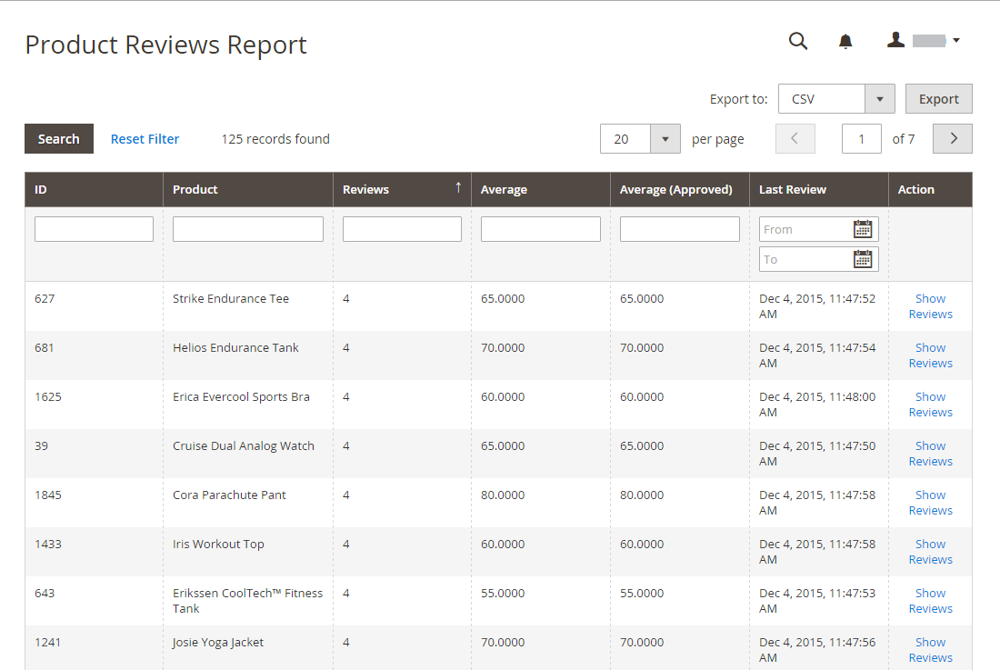

# Evaluatierapporten

Als u de ingebouwde [!DNL Commerce] recensies gebruikt, bieden de overzichtsrapporten informatie over productrevisies door klant en door product.

## [!UICONTROL Customer Reviews Report]

[!UICONTROL Customer Reviews Report] biedt een lijst met alle klanten die productrevisies hebben verzonden. Het rapport bevat het aantal beoordelingen dat door elke klant is ingediend en een koppeling naar de lijst met revisies.

Voor _Admin_ sidebar, ga **[!UICONTROL Reports]** > _[!UICONTROL Reviews]_>**[!UICONTROL By Customers]**.

{width="600"}

## [!UICONTROL Product Reviews Report]

In [!UICONTROL Product Reviews Report] worden alle producten weergegeven die door klanten zijn gecontroleerd. Het rapport bevat het aantal beoordelingen en de gemiddelde beoordeling, het product is voor het laatst beoordeeld en een link naar de lijst van beoordelingen voor elk product.

Voor _Admin_ sidebar, ga **[!UICONTROL Reports]** > _[!UICONTROL Reviews]_>**[!UICONTROL By Products]**.

{width="600"}
