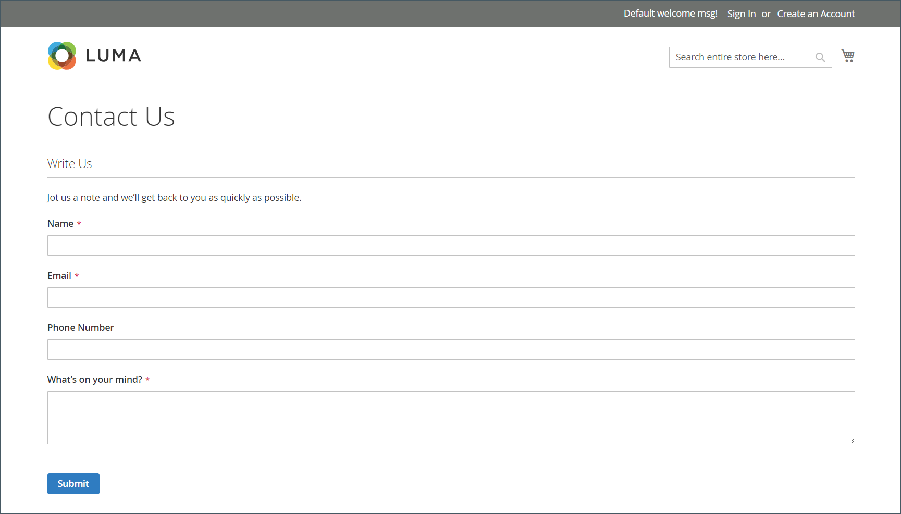
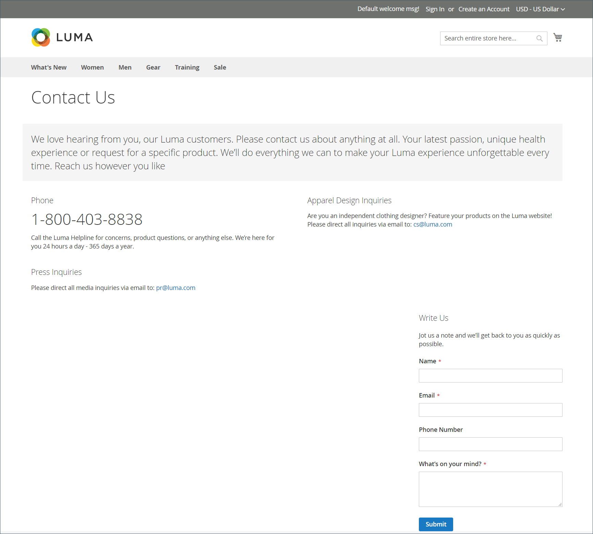

# Winkelgegevens

De basisinformatie voor uw winkel omvat de naam en het adres van de winkel, het telefoonnummer en het e-mailadres die worden weergegeven in e-mailberichten, facturen en andere berichten die naar uw klanten worden verzonden.

{width="900" zoomable="yes"}

## [!UICONTROL Store Information]

De _[!UICONTROL Store Information]_biedt de basisinformatie die in verkoopdocumenten en andere mededelingen wordt weergegeven.

1. Op de _Beheerder_ zijbalk, ga naar **[!UICONTROL Stores]** > _[!UICONTROL Settings]_>**[!UICONTROL Configuration]**.

1. Onder **[!UICONTROL General]** in het linkernavigatievenster kiest u **[!UICONTROL General]**.

1. Uitbreiden  de **[!UICONTROL Store Information]** sectie.

   {width="700"}

1. Stel de opties in op basis van de gegevens van uw winkel:

   - Voer de **[!UICONTROL Store Name]** die u in alle mededelingen wilt gebruiken.

   - Voer de **[!UICONTROL Store Phone Number]**, opgemaakt zoals u wilt.

   - Voor **[!UICONTROL Store Hours of Operation]**, voer de openingstijden voor je winkel in. Bijvoorbeeld: `Mon - Fri, 9-5, Sat 9-noon PST`.

   - Selecteer de **[!UICONTROL Country]** waar uw bedrijf wordt gevestigd.

   - Selecteer de **[!UICONTROL Region/State]** met het land.

   - Voer de **[!UICONTROL Store Address]**. Als het adres lang is, ga het adres op verder **Adresregel van winkel 2**.

   - Voer, indien van toepassing, de **[!UICONTROL VAT Number]** van uw winkel.

     Als u het nummer wilt verifiëren, klikt u op de knop **[!UICONTROL Validate VAT Number]** knop. Zie voor meer informatie [Validatie van BTW-id](../stores-purchase/vat.md#vat-id-validation).

1. Klik op **[!UICONTROL Save Config]**.

Voor meer informatie over de configuratieopties van de opslaginformatie, zie [_Referentiehandleiding voor configuratie_](../configuration-reference/general/general.md#store-information).

## [!UICONTROL Locale Options]

De landinstelling bepaalt de vele instellingen die in de hele winkel worden gebruikt. Sommige zijn:

- Taal
- Land
- Belastingtarief
- Valuta
- Prijs
- Getalnotatie

De landinstelling bepaalt de tijdzone en taal die voor elke winkel worden gebruikt en identificeert de dagen van de werkweek in het gebied.

1. Op de _Beheerder_ zijbalk, ga naar **[!UICONTROL Stores]** > _[!UICONTROL Settings]_>**[!UICONTROL Configuration]**.

1. In het linkernavigatievenster onder **[!UICONTROL General]**, kiest u **[!UICONTROL General]**.

1. Uitbreiden  de **[!UICONTROL Locale Options]** sectie.

   {width="700"}

1. Selecteer uw **[!UICONTROL Timezone]** in de lijst.

1. Set **[!UICONTROL Locale]** naar de winkeltaal.

1. Set **[!UICONTROL Weight Unit]** naar de maateenheid die doorgaans wordt gebruikt voor verzendingen vanuit uw landinstelling.

1. Set **[!UICONTROL First Day of the Week]** tot de dag die wordt beschouwd als de eerste dag van de week in uw gebied.

1. In de **[!UICONTROL Weekend Days]** selecteert u de dagen die in een weekend in uw gebied vallen.

   Houd Ctrl (PC) of Command (Mac) ingedrukt en klik op elk item om meerdere dagen te selecteren.

1. Klik op **[!UICONTROL Save Config]**.

Zie voor meer informatie over de configuratieopties voor landinstellingen de [Referentiehandleiding voor configuratie](../configuration-reference/general/general.md#locale-options).

## [!UICONTROL State Options]

In veel landen is de staat, provincie of regio een verplicht onderdeel van een postadres. De informatie wordt gebruikt voor verzendings- en factureringsgegevens, voor het berekenen van belastingtarieven, enzovoort. Voor landen waar de staat niet wordt vereist, kan het gebied volledig van het adres worden weggelaten, of als facultatief gebied worden omvat.

Omdat de standaardadresformaten van land tot land variëren, kunt u het malplaatje ook uitgeven dat wordt gebruikt om het adres voor facturen, verpakkingsslips, en verzendetiketten te formatteren.

1. Op de _Beheerder_ zijbalk, ga naar **[!UICONTROL Stores]** > _[!UICONTROL Settings]_>**[!UICONTROL Configuration]**.

1. Onder **[!UICONTROL General]** in het linkernavigatievenster kiest u **[!UICONTROL General]**.

1. Uitbreiden  de **[!UICONTROL State Options]** sectie.

   {width="700"}

1. Gebruik de **[!UICONTROL State is required for]** lijst om elk land te selecteren waar Regio/Staat een vereiste vermelding is.

1. Set **[!UICONTROL Allow to Choose State if it is Optional for Country]** op een van de volgende wijzen:

   `Yes` - In landen waar het veld Staat niet vereist is, wordt het veld Staat als een facultatieve vermelding opgenomen.

   `No` - In landen waar het veld Staat niet vereist is, wordt het veld Staat weggelaten.

1. Klik op **[!UICONTROL Save Config]**.

Voor meer informatie over de opties van de staatsconfiguratie, zie [Referentiehandleiding voor configuratie](../configuration-reference/general/general.md#state-options).

## [!UICONTROL Country Options]

In de landopties wordt het land aangegeven waar uw bedrijf zich bevindt en het land waaruit u de betaling accepteert.

### Landopties voor uw winkel instellen

1. Op de _Beheerder_ zijbalk, ga naar **[!UICONTROL Stores]** > _[!UICONTROL Settings]_>**[!UICONTROL Configuration]**.

1. In het linkernavigatievenster onder **[!UICONTROL General]**, kiest u **[!UICONTROL General]**.

1. Uitbreiden  de **[!UICONTROL Country Options]** sectie.

   >[!NOTE]
   >
   >Wis indien nodig de **[!UICONTROL Use system value]** Schakel het selectievakje in voor elke instelling die u wilt wijzigen.

   {width="700"}

1. Kies de optie **[!UICONTROL Default Country]** waar uw bedrijf wordt gevestigd.

1. In de **[!UICONTROL Allow Countries]** selecteert u elk land waaruit u bestellingen accepteert.

   Standaard worden alle landen in de lijst geselecteerd. Als u meerdere landen wilt selecteren, houdt u Ctrl (PC) of Command (Mac) ingedrukt en klikt u op elk item.

1. Gebruik de **[!UICONTROL Zip/Postal Code is Optional for]** een lijst om elk land te selecteren waar je zaken doet waarvoor geen postcode of postcode als onderdeel van het adres van de straat hoeft te worden opgenomen.

1. In de **[!UICONTROL European Union Countries]** Selecteer elk land in de EU waar u zaken doet.

   Standaard worden alle EU-landen geselecteerd. Als u de landen wilt selecteren die u nodig hebt, houdt u Ctrl (PC) of Command (Mac) ingedrukt en klikt u op elk item.

1. In de **[!UICONTROL Top Destinations]** Selecteer de primaire landen die u als verkoopdoel wilt gebruiken.

1. Klik op **[!UICONTROL Save Config]**.

### Landopties instellen voor specifieke leveringsmethode

U kunt ook de verzending naar specifieke landen configureren voor elke beschikbare server [leveringsmethode](../stores-purchase/delivery.md) (UPS, FedEx, enzovoort).

1. Op de _Beheerder_ zijbalk, ga naar **[!UICONTROL Stores]** > _[!UICONTROL Settings]_>**[!UICONTROL Configuration]**.

1. Vouw in het navigatievenster aan de linkerkant de optie **[!UICONTROL Sales]** en kiest u **[!UICONTROL Delivery Methods]**.

1. Selecteer de verzendmaatschappij waarop u specifieke landen wilt toepassen.

1. Voor **[!UICONTROL Ship to Applicable Countries]** schakelt u de optie **[!UICONTROL Use system value]** selectievakje en selecteer de optie **[!UICONTROL Specific Countries]** -optie.

1. In de **[!UICONTROL Top Destinations]** selecteer de primaire landen die je als doel voor verzending hebt ingesteld.

   {width="700"}

1. Klik op **[!UICONTROL Save Config]**.

### Bronnen voor probleemoplossing

Voor hulp bij het oplossen van problemen van de landconfiguratie, zie het volgende [!DNL Commerce] Kennisbank-artikelen ondersteunen:

- [Een land toevoegen](https://experienceleague.adobe.com/docs/commerce-knowledge-base/kb/how-to/how-to-add-a-new-country-to-magento-2.html)
- [Opgegeven landId bestaat niet](https://experienceleague.adobe.com/docs/commerce-knowledge-base/kb/support-tools/patches/v1-0-15/mdva-33393-magento-patch-provided-countryid-does-not-exist.html)

## [!UICONTROL Merchant Location]

De Merchant plaats die wordt gebruikt om te vormen [betalingsmethoden](../stores-purchase/payments.md). Als er geen waarde is voor deze instelling, [Standaardland](#uicontrol-country-options) wordt ingesteld.

1. Op de _Beheerder_ zijbalk, ga naar **[!UICONTROL Stores]** > _[!UICONTROL Settings]_>**[!UICONTROL Configuration]**.

1. Vouw in het navigatievenster aan de linkerkant de optie **[!UICONTROL Sales]** en kiest u **[!UICONTROL Payment Methods]**.

1. Uitbreiden  de **Handelsplaats** en kies uw **[!UICONTROL Merchant Country]**.

   {width="600"}

1. Klik op **[!UICONTROL Save Config]**.

Zie voor meer informatie over de configuratieopties voor betalingsmethoden de [Referentiehandleiding voor configuratie](../configuration-reference/sales/payment-methods.md).

## Valuta

Valuta-instelling - Hiermee wordt de basis gedefinieerd [valuta](../stores-purchase/currency-configuration.md) en eventuele aanvullende valuta&#39;s die als betaling worden geaccepteerd. Hiermee stelt u ook de importverbinding en het schema in waarmee de valutakoersen automatisch worden bijgewerkt.

Valutasymbolen - Definieert de [valutasymbolen](../stores-purchase/currency-configuration.md#step-5-customize-currency-symbols-optional) die in productprijzen en verkoopdocumenten zoals bestellingen en facturen worden weergegeven. [!DNL Commerce] ondersteunt valuta&#39;s uit meer dan 200 landen over de hele wereld.

Valuta&#39;s bijwerken - Valuta&#39;s kunnen worden aangepast [bijgewerkt](../stores-purchase/currency-update.md) handmatig of geïmporteerd in uw winkel, indien nodig, of volgens een vooraf gedefinieerd schema.

Valutaschooser - Als er meerdere valuta&#39;s beschikbaar zijn, wordt de [valutaselectie](../stores-purchase/currency.md) is beschikbaar in de koptekst van de winkel.

## [!UICONTROL Store Email Addresses]

U kunt maximaal vijf verschillende e-mailadressen hebben om verschillende functies of afdelingen voor elke winkel of weergave te vertegenwoordigen. Naast de volgende vooraf gedefinieerde e-mailidentiteiten zijn er een paar aangepaste identiteiten die u kunt instellen op basis van uw behoeften.

- Algemene contactpersoon
- Verkoopvertegenwoordiger
- Klantenondersteuning

Elke identiteit en het bijbehorende e-mailadres kunnen worden gekoppeld aan specifieke automatische e-mailberichten en worden weergegeven als de afzender van e-mailberichten die vanuit uw winkel worden verzonden.

### Stap 1: Opstelling de e-mailadressen voor uw domein

Voordat u e-mailadressen voor de winkel kunt configureren, moet u elk adres instellen als geldig e-mailadres voor uw domein. Volg de instructies van uw serverbeheerder of e-mailhostingprovider om elk e-mailadres te maken dat u nodig hebt.

### Stap 2: Vorm de e-mailadressen voor uw opslag

1. Op de _Beheerder_ zijbalk, ga naar **[!UICONTROL Stores]** > _[!UICONTROL Settings]_>**[!UICONTROL Configuration]**.

1. Onder **[!UICONTROL General]** in het linkernavigatievenster kiest u **[!UICONTROL Store Email Addresses]**.

1. Uitbreiden  de **[!UICONTROL General Contact]** en voer de volgende handelingen uit:

   {width="600"}

   - Voor **[!UICONTROL Sender Name]**, voert u de naam in van de persoon die is gekoppeld aan de identiteit Algemene contactpersoon om te worden weergegeven als de afzender van e-mailberichten.

   - Voor **[!UICONTROL Sender Email]**, voert u het bijbehorende e-mailadres in.

1. Herhaal dit proces voor elk e-mailadres van de winkel dat u wilt gebruiken.

1. Klik op **[!UICONTROL Save Config]**.

### Stap 3: Werk de configuratie van de verkoopmail bij

Als u aangepaste e-mailadressen gebruikt, moet u de configuratie van gerelateerde e-mailberichten bijwerken, zodat de juiste identiteit wordt weergegeven als de afzender.

1. Vouw in het navigatievenster aan de linkerkant de optie **[!UICONTROL Sales]** en kiest u **[!UICONTROL Sales Emails]**.

   De pagina heeft een afzonderlijke sectie voor elk van de volgende elementen:

   - Opmerkingen bestellen en bestellen
   - Factuur- en factuuropmerkingen
   - Opmerkingen over verzending en verzending
   - Opmerkingen creditnota en creditnota
   - Opmerkingen van RMA, RMA-autorisatie, RMA-beheerder en RMA-klanten  (alleen Adobe Commerce)

1. Beginnen met **[!UICONTROL Order]** Vouw de sectie voor elk bericht uit en controleer of de juiste afzender is geselecteerd.

   {width="600"}

1. Klik op **[!UICONTROL Save Config]**.

Voor meer informatie over de de configuratieopties van de Verkoop E-mail, zie [_Referentiehandleiding voor configuratie_](../configuration-reference/sales/sales-emails.md).

## Formulier Contact opnemen

De _Contact opnemen_ een koppeling in de voettekst van de winkel is een gemakkelijke manier voor klanten om contact met u te houden. Klanten kunnen het formulier invullen en een bericht naar uw winkel sturen. Een norm [!DNL Commerce] de installatie toont het gebrek _Contact opnemen_ formulier. Nadat u het formulier hebt verzonden, verschijnt er een bedankje

Het is belangrijk om te begrijpen dat het standaardformulier Contact opnemen rechtstreeks vanuit code wordt weergegeven in plaats van vanuit een CMS-pagina.

{width="700"}

De opslagvoettekst bevat een koppeling naar de pagina Contact opnemen die in de hele winkel beschikbaar is.

{width="700"}

De voorbeeldgegevens van de Luminantie bevatten aanvullende informatie op de pagina Contact opnemen die laat zien hoe u de pagina voor uw winkel kunt aanpassen.

{width="700"}

### Het contactformulier configureren

1. Op de _Beheerder_ zijbalk, ga naar **[!UICONTROL Stores]** > _[!UICONTROL Settings]_>**[!UICONTROL Configuration]**.

1. In het linkernavigatievenster onder **[!UICONTROL General]**, kiest u **[!UICONTROL Contacts]**.

1. Uitbreiden  de **[!UICONTROL Contact Us]** sectie en set **[!UICONTROL Enable Contact Us]** tot `Yes`.

   {width="600"}

1. Uitbreiden  de **[!UICONTROL Email Options]** en stel de opties voor e-mailcontact in:

   {width="600"}

   - Voor **[!UICONTROL Send Emails to]**, voert u het e-mailadres in waarnaar berichten uit het formulier Contact met ons worden verzonden.

   - Set **[!UICONTROL Email Sender]** aan de opslagidentiteit die als afzender van het bericht van het formulier Contact met ons verschijnt. Bijvoorbeeld: Aangepaste e-mail 2.

   - Set **[!UICONTROL Email Template]** naar de sjabloon die wordt gebruikt voor berichten die worden verzonden vanuit het formulier Contact met ons.

1. Wanneer u wilt meedoen, klikt u op **[!UICONTROL Save Config]**.

### De inhoud aanpassen

U kunt de inhoud in het dialoogvenster _Contact opnemen_ vorm om de behoeften van uw opslag en klantende dienstbeleid te passen.

### Methode 1: Voorbeeldgegevens gebruiken

De Luma-voorbeeldgegevens bevatten een _Contactgegevens_ blokkeren die voor uw winkel kunnen worden aangepast. De `contact-us-info` [blok](../content-design/blocks.md) kan eenvoudig worden gewijzigd om uw eigen inhoud toe te voegen aan de pagina Contact opnemen.

1. Op de _Beheerder_ zijbalk, ga naar **[!UICONTROL Content]** > _[!UICONTROL Elements]_>**[!UICONTROL Blocks]**.

1. Zoek de **[!UICONTROL Contact Us Info]** in de lijst en open in **[!UICONTROL Edit]** -modus.

   {width="700"}

1. Klik onder aan de blokpagina op **[!UICONTROL Edit with Page Builder]**.

   {width="700"}

   >[!NOTE]
   >
   >Als u [[!DNL Page Builder] uitgeschakeld](../page-builder/setup.md#disable-dnl-page-builder), kunt u de editor gebruiken [werkbalk](../content-design/editor.md) om de tekst op te maken en [afbeeldingen](../content-design/editor-insert-image.md) en [koppelingen](../content-design/editor-insert-link.md).

1. Houd de muisaanwijzer boven de container HTML om de gereedschapset weer te geven en kies de optie _Instellingen_ (  ).

1. Bewerk de HTML-code op basis van de contactgegevens van uw winkel en klik op **[!UICONTROL Save]**.

   {width="700"}

1. Sluit het [!DNL Page Builder] werkgebied en klik op **[!UICONTROL Save Block]**.

### Methode 2: zonder steekproefgegevens

>[!IMPORTANT]
>
>Vanaf de release 2.4.0 kan het contactformulier niet meer bellen in een CMS-blok of CMS-pagina. Alle aanpassingen van het contactformulier moeten worden uitgevoerd met de indeling xml of aangepaste themasjablonen.

Klanten hebben standaard toegang tot het contactformulier via de _Contactkoppeling_ in de voettekst van de winkelpagina&#39;s. Voor meer informatie over het aanpassen van de contactpagina, verwijs naar [Frontend Developer Guide][theme-guide].

[theme-guide]: https://developer.adobe.com/commerce/frontend-core/guide/themes/
