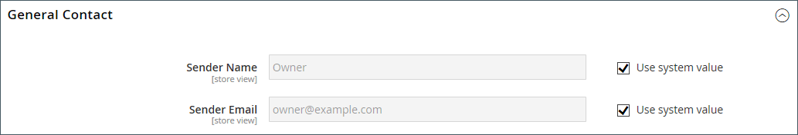

# Winkelgegevens

De basisinformatie voor uw winkel omvat de naam en het adres van de winkel, het telefoonnummer en het e-mailadres die worden weergegeven in e-mailberichten, facturen en andere berichten die naar uw klanten worden verzonden.

{width="900" zoomable="yes"}

## [!UICONTROL Store Information]

De sectie _[!UICONTROL Store Information]_&#x200B;bevat de basisinformatie die wordt weergegeven in verkoopdocumenten en in andere communicatie.

1. Voor _Admin_ sidebar, ga **[!UICONTROL Stores]** > _[!UICONTROL Settings]_>**[!UICONTROL Configuration]**.

1. Kies onder **[!UICONTROL General]** in het linkernavigatievenster de optie **[!UICONTROL General]** .

1. Breid  de **[!UICONTROL Store Information]** sectie uit.

   {width="700"}

1. Stel de opties in op basis van de gegevens van uw winkel:

   - Voer de **[!UICONTROL Store Name]** in die u in alle communicatie wilt gebruiken.

   - Voer de **[!UICONTROL Store Phone Number]** in, opgemaakt zoals u deze wilt weergeven.

   - Voer voor **[!UICONTROL Store Hours of Operation]** de openingstijden voor uw winkel in. Bijvoorbeeld: `Mon - Fri, 9-5, Sat 9-noon PST` .

   - Selecteer **[!UICONTROL Country]** waar uw bedrijf zich bevindt.

   - Selecteer **[!UICONTROL Region/State]** met het land.

   - Voer de **[!UICONTROL Store Address]** in. Als het adres lang is, ga het adres op **Lijn 2 van het Adres van de Opslag** verder.

   - Voer, indien van toepassing, de **[!UICONTROL VAT Number]** van uw winkel in.

     Klik op de knop **[!UICONTROL Validate VAT Number]** om het nummer te controleren. Meer leren, zie [ de bevestiging van identiteitskaart van BTW ](../stores-purchase/vat.md#vat-id-validation).

1. Klik op **[!UICONTROL Save Config]** als de bewerking is voltooid.

Voor meer informatie over de configuratieopties van de opslaginformatie, zie de [_Gids van de Verwijzing van de Configuratie_](../configuration-reference/general/general.md#store-information).

## [!UICONTROL Locale Options]

De landinstelling bepaalt de vele instellingen die in de hele winkel worden gebruikt. Sommige zijn:

- Taal
- Land
- Belastingtarief
- Valuta
- Prijs
- Getalnotatie

De landinstelling bepaalt de tijdzone en taal die voor elke winkel worden gebruikt en identificeert de dagen van de werkweek in het gebied.

1. Voor _Admin_ sidebar, ga **[!UICONTROL Stores]** > _[!UICONTROL Settings]_>**[!UICONTROL Configuration]**.

1. Kies **[!UICONTROL General]** onder **[!UICONTROL General]** in het linkernavigatievenster.

1. Breid  de **[!UICONTROL Locale Options]** sectie uit.

   {width="700"}

1. Selecteer de **[!UICONTROL Timezone]** in de lijst.

1. Stel **[!UICONTROL Locale]** in op de opslagtaal.

1. Stel **[!UICONTROL Weight Unit]** in op de maateenheid die doorgaans wordt gebruikt voor verzendingen vanuit uw landinstelling.

1. Stel **[!UICONTROL First Day of the Week]** in op de dag die wordt beschouwd als de eerste dag van de week in uw gebied.

1. Selecteer in de lijst **[!UICONTROL Weekend Days]** de dagen die in uw gebied in een weekend vallen.

   Houd Ctrl (PC) of Command (Mac) ingedrukt en klik op elk item om meerdere dagen te selecteren.

1. Klik op **[!UICONTROL Save Config]** als de bewerking is voltooid.

Voor meer informatie over de opties van de scèneconfiguratie, zie de [ Gids van de Verwijzing van de Configuratie ](../configuration-reference/general/general.md#locale-options).

## [!UICONTROL State Options]

In veel landen is de staat, provincie of regio een verplicht onderdeel van een postadres. De informatie wordt gebruikt voor verzendings- en factureringsgegevens, voor het berekenen van belastingtarieven, enzovoort. Voor landen waar de staat niet wordt vereist, kan het gebied volledig van het adres worden weggelaten, of als facultatief gebied worden omvat.

Omdat de standaardadresformaten van land tot land variëren, kunt u het malplaatje ook uitgeven dat wordt gebruikt om het adres voor facturen, verpakkingsslips, en verzendetiketten te formatteren.

1. Voor _Admin_ sidebar, ga **[!UICONTROL Stores]** > _[!UICONTROL Settings]_>**[!UICONTROL Configuration]**.

1. Kies onder **[!UICONTROL General]** in het linkernavigatievenster de optie **[!UICONTROL General]** .

1. Breid  de **[!UICONTROL State Options]** sectie uit.

   {width="700"}

1. Gebruik de lijst **[!UICONTROL State is required for]** om elk land te selecteren waar Regio/Staat een verplicht item is.

1. Stel **[!UICONTROL Allow to Choose State if it is Optional for Country]** in op een van de volgende opties:

   `Yes` - In landen waar het statusveld niet vereist is, wordt het veld Staat opgenomen als een optionele vermelding.

   `No` - In landen waar het staatsgebied niet wordt vereist, weglaat het gebied van de Staat.

1. Klik op **[!UICONTROL Save Config]** als de bewerking is voltooid.

Voor meer informatie over de opties van de staatsconfiguratie, zie de [ Gids van de Verwijzing van de Configuratie ](../configuration-reference/general/general.md#state-options).

## [!UICONTROL Country Options]

In de landopties wordt het land aangegeven waar uw bedrijf zich bevindt en het land waaruit u de betaling accepteert.

### Landopties voor uw winkel instellen

1. Voor _Admin_ sidebar, ga **[!UICONTROL Stores]** > _[!UICONTROL Settings]_>**[!UICONTROL Configuration]**.

1. Kies **[!UICONTROL General]** onder **[!UICONTROL General]** in het linkernavigatievenster.

1. Breid  de **[!UICONTROL Country Options]** sectie uit.

   >[!NOTE]
   >
   >Schakel indien nodig het selectievakje **[!UICONTROL Use system value]** uit voor elke instelling die u wilt wijzigen.

   {width="700"}

1. Kies **[!UICONTROL Default Country]** waar uw bedrijf zich bevindt.

1. Selecteer in de lijst **[!UICONTROL Allow Countries]** elk land waaruit u bestellingen accepteert.

   Standaard worden alle landen in de lijst geselecteerd. Als u meerdere landen wilt selecteren, houdt u Ctrl (PC) of Command (Mac) ingedrukt en klikt u op elk item.

1. Met de lijst **[!UICONTROL Zip/Postal Code is Optional for]** kunt u elk land selecteren waar u zaken doet waarvoor geen postcode of postcode moet worden opgenomen als onderdeel van het adres van de straat.

1. Selecteer in de lijst **[!UICONTROL European Union Countries]** elk land in de EU waar u zaken doet.

   Standaard worden alle EU-landen geselecteerd. Als u de landen wilt selecteren die u nodig hebt, houdt u Ctrl (PC) of Command (Mac) ingedrukt en klikt u op elk item.

1. Selecteer in de lijst **[!UICONTROL Top Destinations]** de primaire landen die u wilt verkopen.

1. Klik op **[!UICONTROL Save Config]** als de bewerking is voltooid.

### Landopties instellen voor specifieke leveringsmethode

U kunt het verschepen aan specifieke landen voor elke beschikbare [ leveringsmethode ](../stores-purchase/delivery.md) (UPS, FedEx, etc.) ook vormen.

1. Voor _Admin_ sidebar, ga **[!UICONTROL Stores]** > _[!UICONTROL Settings]_>**[!UICONTROL Configuration]**.

1. Vouw in het navigatievenster aan de linkerkant **[!UICONTROL Sales]** uit en kies **[!UICONTROL Delivery Methods]** .

1. Selecteer de verzendmaatschappij waarop u specifieke landen wilt toepassen.

1. Schakel bij **[!UICONTROL Ship to Applicable Countries]** het selectievakje **[!UICONTROL Use system value]** uit en selecteer de optie **[!UICONTROL Specific Countries]** .

1. Selecteer in de lijst **[!UICONTROL Top Destinations]** de primaire landen die u als doel voor verzending wilt instellen.

   {width="700"}

1. Klik op **[!UICONTROL Save Config]** als de bewerking is voltooid.

### Bronnen voor probleemoplossing

Raadpleeg de volgende artikelen in de Support Knowledge Base voor hulp bij het oplossen van problemen met de landconfiguratie: [!DNL Commerce]

- [ hoe te om een land ](https://experienceleague.adobe.com/docs/commerce-knowledge-base/kb/how-to/how-to-add-a-new-country-to-magento-2.html) toe te voegen

## [!UICONTROL Merchant Location]

[!BADGE &#x200B; slechts PaaS &#x200B;]{type=Informative url="https://experienceleague.adobe.com/en/docs/commerce/user-guides/product-solutions" tooltip="Is alleen van toepassing op Adobe Commerce op Cloud-projecten (door Adobe beheerde PaaS-infrastructuur) en op projecten in het veld."}

Het plaatsen van de Plaats van de Merchant wordt gebruikt om [ betalingsmethodes ](../stores-purchase/payments.md) te vormen. Als er geen waarde voor dit het plaatsen is, wordt het [ StandaardLand ](#uicontrol-country-options) plaatsen gebruikt.

1. Voor _Admin_ sidebar, ga **[!UICONTROL Stores]** > _[!UICONTROL Settings]_>**[!UICONTROL Configuration]**.

1. Vouw in het navigatievenster aan de linkerkant **[!UICONTROL Sales]** uit en kies **[!UICONTROL Payment Methods]** .

1. Breid  uit de **Merchant Plaats** sectie en kies uw **[!UICONTROL Merchant Country]**.

   {width="600"} plaatst

1. Klik op **[!UICONTROL Save Config]** als de bewerking is voltooid.

Voor meer informatie over de configuratieopties van de Methoden van de Betaling, zie de [ Gids van de Verwijzing van de Configuratie ](../configuration-reference/sales/payment-methods.md).

## Valuta

De Opstelling van de Valuta - bepaalt de basis [ munt ](../stores-purchase/currency-configuration.md) en om het even welke extra valuta die als betaling worden goedgekeurd. Hiermee stelt u ook de importverbinding en het schema in waarmee de valutakoersen automatisch worden bijgewerkt.

Valutasymbolen - bepaalt de [ muntsymbolen ](../stores-purchase/currency-configuration.md#step-5-customize-currency-symbols-optional) die in productprijzen en verkoopdocumenten zoals orden en facturen verschijnen. [!DNL Commerce] ondersteunt valuta&#39;s uit meer dan 200 landen over de hele wereld.

Het bijwerken van de Tarieven van de Valuta - de tarieven van de Valuta kunnen [&#128279;](../stores-purchase/currency-update.md) manueel worden bijgewerkt of in uw opslag worden ingevoerd zoals nodig, of volgens een vooraf bepaald programma.

De Chooser van de Valuta - als de veelvoudige valuta&#39;s beschikbaar zijn, [ muntkiezer ](../stores-purchase/currency.md) is beschikbaar in de kopbal van de opslag.

## [!UICONTROL Store Email Addresses]

U kunt maximaal vijf verschillende e-mailadressen hebben om verschillende functies of afdelingen voor elke winkel of weergave te vertegenwoordigen. Naast de volgende vooraf gedefinieerde e-mailidentiteiten zijn er een paar aangepaste identiteiten die u kunt instellen op basis van uw behoeften.

- Algemene contactpersoon
- Verkoopvertegenwoordiger
- Klantenondersteuning

Elke identiteit en het bijbehorende e-mailadres kunnen worden gekoppeld aan specifieke automatische e-mailberichten en worden weergegeven als de afzender van e-mailberichten die vanuit uw winkel worden verzonden.

### Stap 1: Opstelling de e-mailadressen voor uw domein

Voordat u e-mailadressen voor de winkel kunt configureren, moet u elk adres instellen als geldig e-mailadres voor uw domein. Volg de instructies van uw serverbeheerder of e-mailhostingprovider om elk e-mailadres te maken dat u nodig hebt.

### Stap 2: stel de basis-URL in voor gegenereerde koppelingen

[!BADGE &#x200B; slechts SaaS &#x200B;]{type=Positive url="https://experienceleague.adobe.com/en/docs/commerce/user-guides/product-solutions" tooltip="Alleen van toepassing op Adobe Commerce as a Cloud Service-projecten (door Adobe beheerde SaaS-infrastructuur)."}

Sommige klant-onder ogen ziet e-mails omvatten verbindingen aan de opslag, zoals die die klanten helpen hun wachtwoorden terugstellen. Om ervoor te zorgen dat de koppelingen naar de winkel goed werken, moet u de basis-URL voor de winkel definiëren.

1. Voor _Admin_ sidebar, ga **[!UICONTROL Stores]** > _[!UICONTROL Settings]_>**[!UICONTROL Configuration]**.

1. Kies onder **[!UICONTROL General]** in het linkernavigatievenster de optie **[!UICONTROL Store Email Addresses]** .

1. Voer in de sectie **[!UICONTROL Storefront Base URL]** field **[!UICONTROL General]** de basis-URL voor de winkel in, bijvoorbeeld `https://www.example.com/` . De URL moet eindigen met een slash.

   {width="600"}

### Stap 3: Vorm de e-mailadressen voor uw opslag

[!BADGE &#x200B; SaaS slechts &#x200B;]{type=Positive url="https://experienceleague.adobe.com/en/docs/commerce/user-guides/product-solutions" tooltip="Alleen van toepassing op Adobe Commerce as a Cloud Service- en Adobe Commerce Optimizer-projecten (door Adobe beheerde SaaS-infrastructuur)."} de e-mailadressen van de Afzender worden gevormd wanneer uw instantie provisioned is. Als u deze adressen moet veranderen, creeer een kaartje van de Steun.

1. Voor _Admin_ sidebar, ga **[!UICONTROL Stores]** > _[!UICONTROL Settings]_>**[!UICONTROL Configuration]**.

1. Kies onder **[!UICONTROL General]** in het linkernavigatievenster de optie **[!UICONTROL Store Email Addresses]** .

1. Breid  de **[!UICONTROL General Contact]** sectie uit en doe het volgende:

   {width="600"}

   - Voer bij **[!UICONTROL Sender Name]** de naam in van de persoon die is gekoppeld aan de identiteit Algemene contactpersoon om te worden weergegeven als de afzender van e-mailberichten.

   - Voer bij **[!UICONTROL Sender Email]** het bijbehorende e-mailadres in.

1. Herhaal dit proces voor elk e-mailadres van de winkel dat u wilt gebruiken.

1. Klik op **[!UICONTROL Save Config]** als de bewerking is voltooid.

### Stap 4: Werk de configuratie van de e-mail van de verkoop bij

Als u aangepaste e-mailadressen gebruikt, moet u de configuratie van gerelateerde e-mailberichten bijwerken, zodat de juiste identiteit wordt weergegeven als de afzender.

1. Vouw in het navigatievenster aan de linkerkant **[!UICONTROL Sales]** uit en kies **[!UICONTROL Sales Emails]** .

   De pagina heeft een afzonderlijke sectie voor elk van de volgende elementen:

   - Opmerkingen bestellen en bestellen
   - Factuur- en factuuropmerkingen
   - Opmerkingen over verzending en verzending
   - Opmerkingen creditnota en creditnota
   - RMA, Vergunning RMA, Admin Commentaren van RMA, en de Commentaren van de Klant RMA  (slechts Adobe Commerce)

1. Vouw, om te beginnen met **[!UICONTROL Order]**, de sectie voor elk bericht uit en controleer of de juiste afzender is geselecteerd.

   {width="600"}

1. Klik op **[!UICONTROL Save Config]** als de bewerking is voltooid.

Voor meer informatie over de de configuratieopties van E-mail van de Verkoop, zie de [_Gids van de Verwijzing van de Configuratie_](../configuration-reference/sales/sales-emails.md).

## Formulier Contact opnemen

De _verbinding van het Contact van ons_ in footer van de opslag is een gemakkelijke manier voor klanten om in contact met u te houden. Klanten kunnen het formulier invullen en een bericht naar uw winkel sturen. Een standaard [!DNL Commerce] installatie toont de standaard _vorm van het Contact van ons_. Nadat u het formulier hebt verzonden, verschijnt er een bedankje

Het is belangrijk om te begrijpen dat het standaardformulier Contact opnemen rechtstreeks vanuit code wordt weergegeven in plaats van vanuit een CMS-pagina.

{width="700"}

De opslagvoettekst bevat een koppeling naar de pagina Contact opnemen die in de hele winkel beschikbaar is.

{width="700"}

De voorbeeldgegevens van de Luminantie bevatten aanvullende informatie op de pagina Contact opnemen die laat zien hoe u de pagina voor uw winkel kunt aanpassen.

{width="700"}

### Het contactformulier configureren

1. Voor _Admin_ sidebar, ga **[!UICONTROL Stores]** > _[!UICONTROL Settings]_>**[!UICONTROL Configuration]**.

1. Kies **[!UICONTROL Contacts]** onder **[!UICONTROL General]** in het linkernavigatievenster.

1. Breid  de **[!UICONTROL Contact Us]** sectie uit en reeks **[!UICONTROL Enable Contact Us]** aan `Yes`.

   {width="600"}

1. Breid  de **[!UICONTROL Email Options]** sectie uit en plaats de opties van het e-mailcontact:

   {width="600"}

   - Voer bij **[!UICONTROL Send Emails to]** het e-mailadres in waarnaar berichten uit het formulier Contact met ons worden verzonden.

   - Stel **[!UICONTROL Email Sender]** in op de opslagidentiteit die wordt weergegeven als de afzender van het bericht in het formulier Contact opnemen. Bijvoorbeeld: Aangepaste e-mail 2.

   - Stel **[!UICONTROL Email Template]** in op de sjabloon die wordt gebruikt voor berichten die vanuit het formulier Contact met ons worden verzonden.

1. Klik op **[!UICONTROL Save Config]** wanneer u wilt concurreren.

### De inhoud aanpassen

U kunt de inhoud in de _vorm van het Contact van ons_ aanpassen om de behoeften van uw opslag en klantende dienstbeleid te passen.

### Methode 1: Voorbeeldgegevens gebruiken

De de steekproefgegevens van de Luma omvatten het blok van Info van het a _Contact van het Gebruik_ dat voor uw opslag kan worden aangepast. Het `contact-us-info` [ blok ](../content-design/blocks.md) kan gemakkelijk worden gewijzigd om uw eigen inhoud aan de pagina van het Contact toe te voegen.

1. Voor _Admin_ sidebar, ga **[!UICONTROL Content]** > _[!UICONTROL Elements]_>**[!UICONTROL Blocks]**.

1. Zoek het **[!UICONTROL Contact Us Info]** -blok in de lijst en open in de **[!UICONTROL Edit]** -modus.

   {width="700"}

1. Klik onder aan de blokpagina op **[!UICONTROL Edit with Page Builder]** .

   {width="700"}

   >[!NOTE]
   >
   >Als u [[!DNL Page Builder]  gehandicapt ](../page-builder/setup.md#disable-dnl-page-builder) hebt, kunt u de redacteur [ toolbar ](../content-design/editor.md) gebruiken om de tekst te formatteren, en [ beelden ](../content-design/editor-insert-image.md) toe te voegen en [ verbindingen ](../content-design/editor-insert-link.md).

1. Beweeg over de container van HTML om toolbox te tonen en de _pictogram van Montages_ te kiezen ( ).

1. Bewerk de HTML-code op basis van de contactgegevens van je winkel en klik op **[!UICONTROL Save]** .

   {width="700"}

1. Sluit het [!DNL Page Builder] -werkgebied en klik op **[!UICONTROL Save Block]** .

### Methode 2: zonder steekproefgegevens

>[!IMPORTANT]
>
>Vanaf de release 2.4.0 kan het contactformulier niet meer worden gebeld binnen een CMS-blok of CMS-pagina. Alle aanpassingen van het contactformulier moeten worden uitgevoerd met de indeling xml of aangepaste themasjablonen.

Door gebrek, hebben de kopers toegang tot de contactvorm gebruikend de _verbinding van het Contact_ in footer van de storefront pagina&#39;s. Voor meer informatie over het aanpassen van de contactpagina, verwijs naar de [ Gids van de Ontwikkelaar van het Front ][theme-guide].

[theme-guide]: https://developer.adobe.com/commerce/frontend-core/guide/themes/
