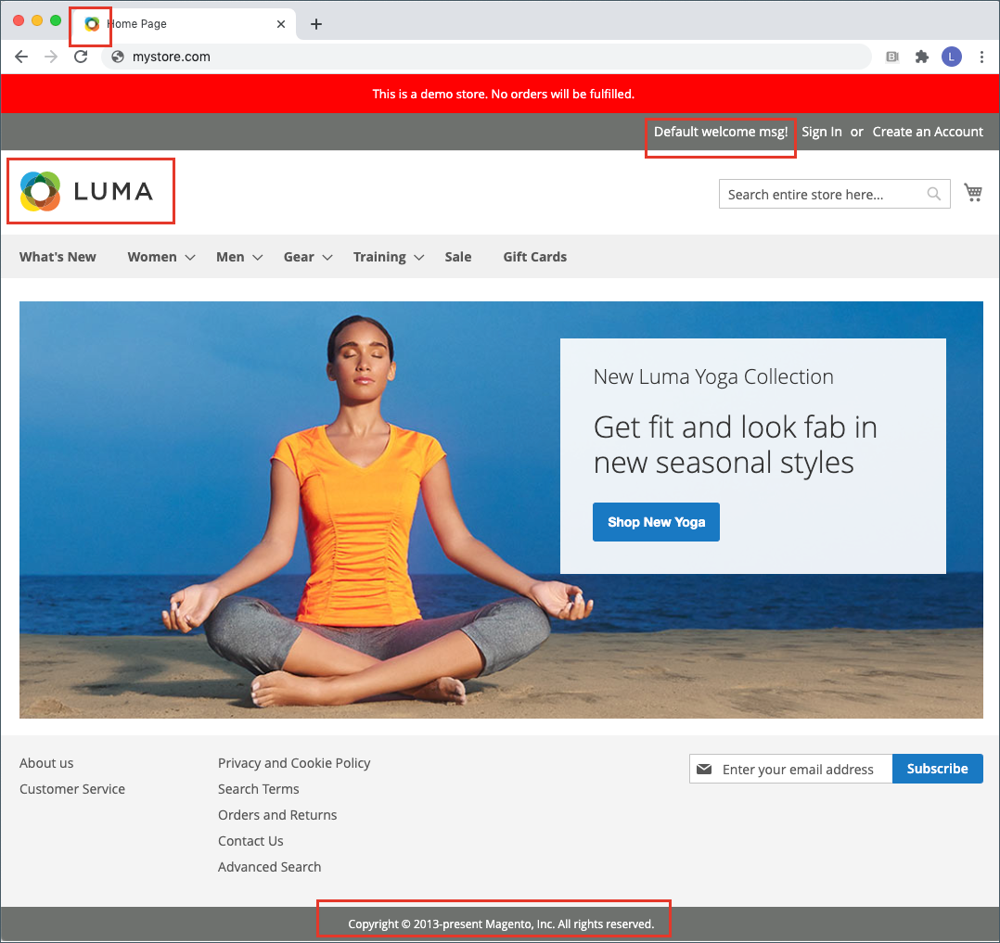

# Storefront-branding

Een van de eerste dingen die je wilt doen, is: [het logo wijzigen](#upload-your-logo) in de koptekst en [een favicon uploaden](#add-a-favicon) voor de browser. Nu moet u [Voeg uw welkomstbericht toe](#change-the-welcome-message) en [de copyrightkennisgeving bijwerken](#change-the-copyright-notice) in de voettekst. Deze taken zijn een paar eenvoudige ontwerpelementen die u meteen kunt uitvoeren. Terwijl uw winkel in ontwikkeling is, kunt u [de aanmaning voor de winkeldemo inschakelen](#set-the-store-demo-notice)en verwijder deze vervolgens wanneer u klaar bent om te starten.

{width="600" zoomable="yes"}

## Uw logo uploaden

De grootte en locatie van het logo in de koptekst wordt bepaald door het winkelthema. Uw logo kan worden opgeslagen als een GIF-, PNG- of JPG (JPEG) bestandstype en worden geüpload vanuit de beheerder van uw winkel.

{width="600"}

De afbeelding van het logo bevindt zich op de volgende locatie op de server. Willekeurig afbeeldingsbestand met de naam `logo.svg` wordt gebruikt als het standaardthemalogo.

Volledig pad - `app/design/frontend/[vendor]/[theme]/web/images/logo.svg`

Relatief pad -  `images/logo.svg`

Als u de grootte van het logo of andere afbeeldingen die in het thema worden gebruikt niet weet, opent u de pagina in een browser, klikt u met de rechtermuisknop op de afbeelding en inspecteert u het element.

>[!NOTE]
>
>Naast het logo in de koptekst wordt ook uw logo weergegeven op [e-mailsjablonen](../systems/email-templates.md#prepare-your-email-logo) en [PDF-facturen](../stores-purchase/sales-documents.md) en andere verkoopdocumenten. De logo&#39;s die voor e-mailsjablonen en facturen worden gebruikt, hebben verschillende groottevereisten en moeten afzonderlijk worden geüpload.

Ondersteunde bestandsindelingen voor logo&#39;s:

| Bestandsindeling | Beschrijving |
|--- |--- |
| PNG | (Portable Network Graphics) Dit nieuwere alternatief voor de indeling GIF ondersteunt maximaal 16 miljoen kleuren (24 bits). De compressie-indeling zonder verlies produceert een bitmapafbeelding van hoge kwaliteit met heldere tekst, maar een groter bestand dan sommige indelingen. De PNG-indeling ondersteunt transparante lagen en is ontworpen voor onlineweergave en -streaming. |
| GIF | (Graphics Interchange Format) Een breed ondersteunde en oudere bitmapindeling die is beperkt tot 256 kleuren (8 bits). De indeling GIF ondersteunt eenvoudige animatie en transparante lagen. |
| JPG (JPEG) | (Joint Photographic Expert Group) Een gecomprimeerde bitmapindeling die door de meeste digitale camera&#39;s wordt gebruikt. De compressie met verlies veroorzaakt gegevensverlies, wat soms opvalt als vage vlekken in tekst. |

{style="table-layout:auto"}

1. Op de _Beheerder_ zijbalk, ga naar **[!UICONTROL Content]** > _[!UICONTROL Design]_>**[!UICONTROL Configuration]**.

   {width="700"}

1. Zoek de archiefmening die u wilt vormen en klikken **[!UICONTROL Edit]** in de _[!UICONTROL Action]_kolom.

1. Uitbreiden  de **[!UICONTROL Header]** sectie.

   {width="600"}

1. Als u een nieuw logo wilt uploaden, klikt u **[!UICONTROL Upload]** en kiest u het bestand in uw systeem.

1. Voer de **[!UICONTROL Logo Image Width]** en **[!UICONTROL Logo Image Height]** in pixels.

1. Voor **[!UICONTROL Logo Image Alt]**, voert u de tekst in die u wilt weergeven wanneer iemand de cursor boven de afbeelding houdt.

1. Klik op **[!UICONTROL Save Configuration]**.

## Een favicon toevoegen

_favicon_ is kort voor _favoriete pictogram_ en verwijst naar het kleine pictogram op het lusje van elke browser pagina. Afhankelijk van de browser wordt het favicon ook weergegeven in de adresbalk, vlak voor de URL.

Een favicon heeft doorgaans een grootte van 16 x 16 pixels of 32 x 32 pixels. [!DNL Commerce] accepteert de bestandstypen ICO, PNG, APNG, GIF en JPG (JPEG), hoewel niet alle browsers deze indelingen ondersteunen. De meest ondersteunde bestandsindeling voor een favicon is ICO. U kunt andere typen afbeeldingsbestanden gebruiken, maar de indeling wordt mogelijk niet door alle browsers ondersteund. Er zijn veel gratis gereedschappen online beschikbaar waarmee u een ICO-afbeelding kunt genereren of een afbeelding kunt omzetten in die indeling.

{width="600"}

[!DNL Commerce] ondersteunt de volgende bestandsindelingen als favicon:

| Bestandsindeling | Beschrijving |
|--- |--- |
| ICO | Deze indeling voor afbeeldingsbestanden is ontworpen voor pictogramafbeeldingen op kleine grootte. De ICO-indeling wordt vooral gebruikt in Microsoft® Windows OS en kan afbeeldingen tot 256 x 256 pixels en 16 miljoen kleuren (24 bits) met 8 bits transparantie bevatten. |
| PNG | (Portable Network Graphics) Dit nieuwere alternatief voor de indeling GIF ondersteunt maximaal 16 miljoen kleuren (24 bits). De compressie-indeling zonder verlies produceert een bitmapafbeelding van hoge kwaliteit met heldere tekst, maar een groter bestand dan sommige indelingen. De PNG-indeling ondersteunt transparante lagen en is ontworpen voor onlineweergave en -streaming. |
| APNG | (Geanimeerde Portable Network Graphics) Een bestandsindeling die vergelijkbaar is met PNG en eenvoudige animatie ondersteunt. |
| GIF | (Graphics Interchange Format) Een breed ondersteunde en oudere bitmapindeling die is beperkt tot 256 kleuren (8 bits). De indeling GIF ondersteunt eenvoudige animatie en transparante lagen. |
| JPG (JPEG) | (Joint Photographic Expert Group) Een gecomprimeerde bitmapindeling die door de meeste digitale camera&#39;s wordt gebruikt. De compressie met verlies veroorzaakt gegevensverlies, wat soms opvalt als vage vlekken in tekst. |

{style="table-layout:auto"}

### Stap 1: Een favicon maken

1. Maak met de afbeeldingseditor van uw keuze een afbeelding van 16 x 16 of 32 x 32 pixels van het logo.

1. (Optioneel) Gebruik een van de beschikbare online gereedschappen om het bestand om te zetten in de indeling .ico en het bestand op te slaan op uw computer.

### Stap 2: Upload het favicon naar uw winkel

1. Op de _Beheerder_ zijbalk, ga naar **[!UICONTROL Content]** > _[!UICONTROL Design]_>**[!UICONTROL Configuration]**.

1. Zoek in het raster de winkelweergave die u wilt configureren en klik op **[!UICONTROL Edit]** in de _[!UICONTROL Action]_kolom.

1. Onder _[!UICONTROL Other Settings]_, uitbreiden  de **[!UICONTROL HTML Head]**sectie.

   {width="600"}

1. Als u het huidige favicon wilt verwijderen, klikt u op de knop _Verwijderen_ () in de linkerbenedenhoek van de afbeelding.

1. Klikken **[!UICONTROL Upload]** en open het favicon-bestand dat u hebt voorbereid.

   {width="400"}

1. Klik op **[!UICONTROL Save Configuration]**.

### Stap 3: De cache vernieuwen

1. Klik op de knop **[!UICONTROL Cache Management]** in het bericht boven aan de werkruimte.

1. Selecteer in de lijst de optie **[!UICONTROL Page Cache]** selectievakje dat is gemarkeerd `Invalidated`.

1. Set **[!UICONTROL Actions]** tot `Refresh` en klik op **[!UICONTROL Submit]**.

1. Als u het nieuwe favicon wilt weergeven, gaat u terug naar uw winkel en vernieuwt u de browser.

## Het welkomstbericht wijzigen

Het welkomstbericht in de koptekst wordt uitgebreid om de naam van de klant op te nemen die is aangemeld. Voordat u de winkel start, moet u de standaardinstelling wijzigen _Welkom_ tekst voor elke archiefweergave.

{width="600"}

1. Op de _Beheerder_ zijbalk, ga naar **[!UICONTROL Content]** > _[!UICONTROL Design]_>**[!UICONTROL Configuration]**.

1. Zoek in het raster de winkelweergave die u wilt configureren en klik op **[!UICONTROL Edit]** in de _[!UICONTROL Action]_kolom.

1. Onder _[!UICONTROL Other Settings]_, uitbreiden  de **[!UICONTROL Header]**sectie.

1. Voor **[!UICONTROL Welcome Text]**, voert u de tekst in van het welkomstbericht dat u in de koptekst van uw winkel wilt weergeven.

   {width="600"}

1. Klik op **[!UICONTROL Save Configuration]**.

1. Klik op de knop **[!UICONTROL Cache Management]** Klik boven aan de werkruimte en volg de instructies om de cache te vernieuwen.

## De copyrightmelding wijzigen

In de winkel wordt op elke pagina een copyrightvermelding weergegeven. Als beste praktijken, zou de auteursrechtkennisgeving het huidige jaar moeten omvatten, en uw bedrijf identificeren als wettige eigenaar van de inhoud op de plaats.

{width="600"}

De `&copy;` de tekencode wordt gebruikt om het copyrightsymbool in te voegen, zoals in de volgende voorbeelden wordt getoond:

- Voorbeeld van lange notatie

  `Copyright &copy; 2013-present Luma, Inc. All rights reserved.`

- Voorbeeld van korte indeling

  `&copy; 2021 Luma, Inc. All rights reserved.`

**_De copyrightmelding bijwerken:_**

1. Op de _Beheerder_ zijbalk, ga naar **[!UICONTROL Content]** > _[!UICONTROL Design]_>**[!UICONTROL Configuration]**.

1. Zoek in het raster de winkelweergave die u wilt configureren en klik op **[!UICONTROL Edit]** in de _[!UICONTROL Action]_kolom.

1. Onder _Overige instellingen_, uitbreiden de **[!UICONTROL Footer]** sectie.

   {width="600"}

1. Voor **[!UICONTROL Copyright]**, voert u de copyrightvermelding in die u in de voettekst van elke pagina wilt weergeven.

   Gebruik de `&copy;` tekencode om een copyrightsymbool in te voegen.

1. Klik op **[!UICONTROL Save Configuration]**.

## Melding van opslagdemo instellen

Als uw winkel online is, maar nog steeds in aanbouw is, kunt u boven aan de pagina een demo van de winkel weergeven om mensen te laten weten dat de winkel nog niet geopend is voor zakelijk gebruik. Wanneer u klaar bent om _live gaan_, verwijder gewoon het bericht. Het lijkt op het spiegelen in het venster van _Gesloten_ tot _Openen_. De indeling van de demo-kennisgeving wordt bepaald door het thema van uw winkel.

{width="600"}

1. Op de _Beheerder_ zijbalk, ga naar **[!UICONTROL Content]** > _[!UICONTROL Design]_>**[!UICONTROL Configuration]**.

1. Zoek in het raster de winkelweergave die u wilt configureren en klik op **[!UICONTROL Edit]** in de _[!UICONTROL Action]_kolom.

1. Onder _[!UICONTROL Other Settings]_, uitbreiden  de **[!UICONTROL HTML Head]**sectie.

   {width="600"}

1. Omlaag naar beneden schuiven en de **[!UICONTROL Display Demo Store Notice]** naar uw voorkeur.

1. Klik op **[!UICONTROL Save Configuration]**.

1. Als u wordt gevraagd de cache bij te werken, klikt u op **[!UICONTROL Cache Management]** in het systeembericht en volg de instructies om de cache te vernieuwen.
