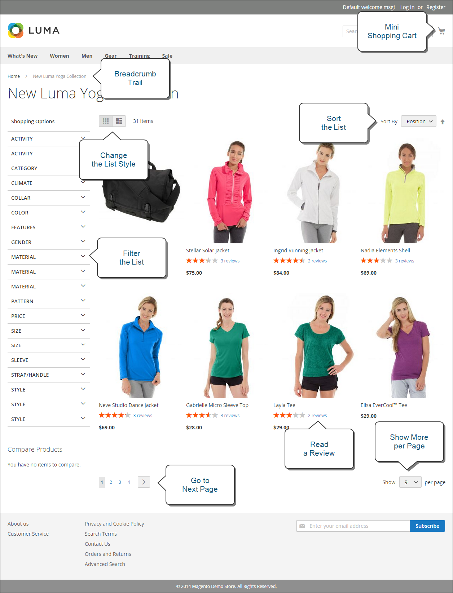
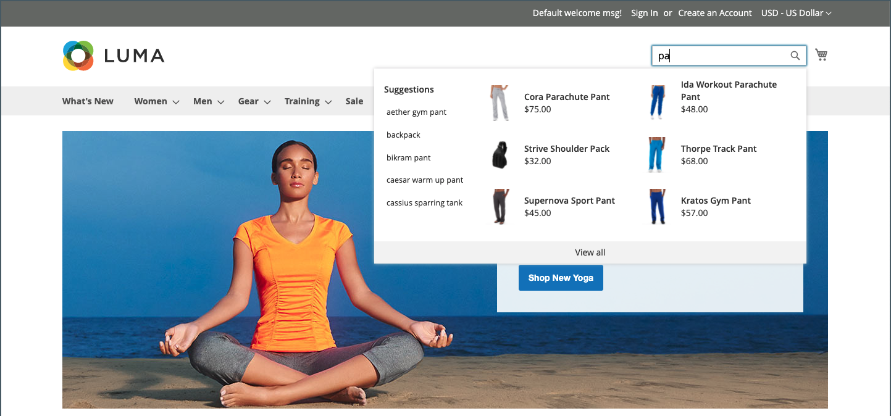
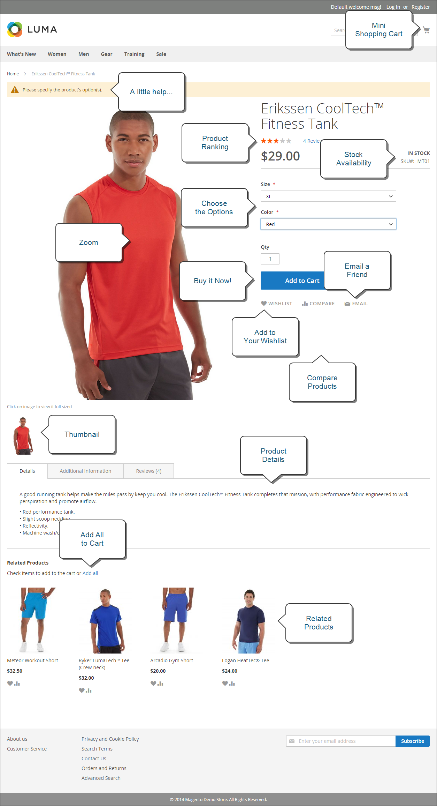

# Wat is de winkel?

In uw Adobe Commerce- of Magento Open Source-implementatie is de winkel het externe, openbare gedeelte van uw winkel. Het biedt de inhoud en functionele componenten die uw klanten gebruiken om te winkelen en aan te schaffen.

De wegklanten nemen aan een verkoop soms wordt genoemd de _weg aan aankoop_, en uw opslag omvat de componenten voor klanten om deze weg te voltooien. In de volgende secties vindt u een overzicht van de basispaginatypen die een strategische waarde bieden. De plaatsen waar klanten gewoonlijk bezoeken tijdens het winkelen in uw winkel. Terwijl u ze bekijkt, moet u rekening houden met verschillende opslagfuncties die in elk stadium van de reis van de klant kunnen worden gebruikt.

## Commerce Storefront

Met de introductie van [!DNL **Commerce Storefront die door Edge Delivery Services**] wordt aangedreven, biedt Adobe een krachtige, scalable, en betrouwbare opslagront aan die hefboomwerkingen geavanceerde technologie om superieure snelheid en gebruikerservaring te leveren.

- **Verbeterde prestaties**: Het ontvangen van winkelcentra op Edge Delivery Services verzekert snellere ladingstijden en betere plaatsprestaties, die tot hogere omzettingspercentages en betere SEO-classificaties kunnen leiden.

- **Schaalbaarheid**: De architectuur steunt naadloze schrapen om verhoogd verkeer en grotere productcatalogi te behandelen zonder prestaties te compromitteren.

- **Flexibiliteit**: De opslag is hoogst klantgericht, toestaand ondernemingen om het winkelen ervaring aan hun unieke behoeften aan te passen.

- **Verbeterde gebruikerservaring**: De eigenschappen zoals geavanceerd caching, updates in real time, en gepersonaliseerde inhoudslevering dragen aan een vlottere en boeiendere het winkelervaring bij.

### Belangrijkste kenmerken

De Commerce Storefront van Edge Delivery Services biedt verschillende belangrijke functies die zowel handelaren als ontwikkelaars ten goede komen. Met deze functies kunnen bedrijven aantrekkelijke boodschapervaringen creëren en tegelijk de flexibiliteit behouden om hun winkelvoorkeuren aan te passen en te schalen aan hun behoeften.

Voor meer gedetailleerde informatie en begeleiding bij vestiging en het optimaliseren van uw Opslag van Commerce, zie de [ Documentatie van de Opslag van Adobe Commerce ](https://experienceleague.adobe.com/en/docs/commerce).

>[!BEGINTABS]

>[!TAB  Merchants ]

De Commerce Storefront van Edge Delivery Services biedt een intuïtieve, op documenten gebaseerde ontwerpervaring die het voor handelaren eenvoudig maakt om inhoud te maken en te beheren. Met vertrouwde gereedschappen, zoals Microsoft Word of Google Docs, kunnen verkopers rijke inhoud maken, terwijl ze versiebeheer behouden en met teamleden samenwerken.

- **Vereenvoudigde inhoudsverwezenlijking**: Creeer en geef inhoud uit gebruikend vertrouwde op document-gebaseerde auteurshulpmiddelen, zoals Microsoft Word of Google Docs.
- **Voorproef in real time**: Zie veranderingen onmiddellijk met levende voorproefmogelijkheden alvorens te publiceren.
- **de controle van de Versie**: De veranderingen van de inhoud van het spoor en rollen gemakkelijk terug naar vorige versies.
- **Samenwerkings werkschema**: De veelvoudige teamleden kunnen aan inhoud gelijktijdig met ingebouwde overzichtsprocessen werken.
- **Inhoud hergebruikt**: Creeer inhoudsblokken die over veelvoudige pagina&#39;s kunnen worden opnieuw gebruikt om consistentie te handhaven.

>[!TAB  Ontwikkelaars ]

Dankzij de implementatie zonder koppen kunnen ontwikkelaars de front-end presentatielaag loskoppelen van de back-end handelsfunctionaliteit, waardoor ze flexibele, aangepaste winkels kunnen maken die zijn gebouwd met moderne technologieën en tegelijk de robuuste back-endservices van Commerce kunnen benutten.

- **API-eerste architectuur**: Bouw de ervaringen van de douane frontend gebruikend moderne kaders terwijl het leveraging van de backenddiensten van Commerce.
- **Composable componenten**: Creeer en stel modulaire, herbruikbare componenten op die in verschillende paginalay-outs kunnen worden geassembleerd.
- **Verlengbaar platform**: Voeg douanefunctionaliteit door APIs en webhooks toe zonder kerncode te wijzigen.
- **Moderne ontwikkelingshulpmiddelen**: Gebruik industrie-standaardontwikkelingshulpmiddelen en werkschema&#39;s voor snellere implementatie en plaatsing.

>[!ENDTABS]

>[!NOTE]
>
>Hoewel de Commerce Storefront talrijke voordelen biedt, blijft Adobe de originele, op Luma gebaseerde winkel ondersteunen. Ondernemingen die momenteel Luma gebruiken, kunnen zonder onderbreking blijven werken en hebben de optie om in hun eigen tempo over te schakelen naar de nieuwe winkel. De overige secties op deze pagina zijn gebaseerd op Luminantiepunten.

## Homepage

Wist u dat de meeste mensen slechts een paar seconden op een pagina doorbrengen voordat ze besluiten om ergens anders te blijven of te gaan? Het is niet lang om een indruk te maken. Studies tonen aan dat mensen ook van foto&#39;s houden, vooral van andere mensen. Welk ontwerp u ook kiest, alles op uw homepage zou bezoekers naar de volgende stap in het verkoopproces moeten bewegen. Het is de bedoeling dat zij hun aandacht in een samenhangende stroom van het ene punt van belang naar het andere vestigen.

{width="700"}

## Cataloguspagina

Aanbiedingen op cataloguspagina&#39;s hebben doorgaans kleine productafbeeldingen en korte beschrijvingen en kunnen worden opgemaakt als een lijst of als een raster. U kunt blokken, video&#39;s en beschrijvingen met veel trefwoorden toevoegen en ook speciale ontwerpen maken voor een speciale aanbieding of seizoen. U kunt een speciale categorie maken voor een levensstijl of merk die een curated collectie producten uit verschillende categorieën bevat.

De oorspronkelijke productbeschrijving geeft kopers meestal genoeg informatie om er beter uit te zien. Mensen die weten wat ze willen, kunnen het product aan hun winkelwagentjes toevoegen en gaan. Klanten die winkelen terwijl ze zich aanmelden bij hun account, genieten van een persoonlijke winkelervaring.

{width="700"}

## Zoekresultaten

Wist u dat mensen die zoeken bijna twee keer zo vaak een aankoop doen als mensen die alleen op navigatie vertrouwen? U zou deze shoppers kunnen overwegen om _pre-gekwalificeerd_ te zijn.

### [!DNL Live Search]

Met [[!DNL Live Search] ](https://experienceleague.adobe.com/en/docs/commerce/live-search/overview) voor Adobe Commerce biedt uw winkel een snelle, superrelevante en intuïtieve zoekervaring en is deze zonder extra kosten beschikbaar voor Adobe Commerce.

{width="700"} typt

### Standaardcataloguszoekopdracht

Met [ standaardcatalogusonderzoek ](../catalog/search.md), omvat uw opslag een vakje van het Onderzoek in de hoger-juiste hoek, en een verbinding aan Geavanceerd Onderzoek in footer. Alle zoektermen die kopers verzenden, worden opgeslagen, zodat je precies kunt zien wat ze zoeken. U kunt suggesties aanbieden, en synoniemen en gemeenschappelijke misspellingen ingaan. Geef vervolgens een specifieke pagina weer wanneer een zoekterm wordt ingevoerd.

{width="700"}

## Productpagina

De productpagina gaat veel verder! Het eerste wat uw ogen op de productpagina raakt, is de hoofdafbeelding met een zoomgalerie met hoge resolutie en een miniatuurgalerie. Naast de prijs en beschikbaarheid is er een gedeelte met tabbladen met meer informatie en een lijst met verwante producten.

{width="700"}

## Winkelwagentje

Het winkelwagentje geeft het ordertotaal weer, inclusief eventuele kortingsbonnen, geschatte verzendkosten en belastingen. Deze functies maken het een goede plaats om vertrouwensbadges en -zegels weer te geven. U kunt de winkelwagentje ook gebruiken als een mogelijkheid voor één laatste voorstel. U kunt bijvoorbeeld cross-sell-items instellen die worden weergegeven als opties voor impulsaankopen wanneer bepaalde producten zich in het winkelwagentje bevinden.

{width="700"}

## Afhandelingspagina

Het uitcheckproces bestaat uit twee stappen:

1. Verzendgegevens

   De eerste stap van het afrekenproces is dat de klant de verzendadresgegevens invult en de verzendmethode kiest. Als de klant een account heeft, wordt het verzendadres automatisch ingevoerd, maar kan het indien nodig worden gewijzigd.
Als een gastklant een e-mailadres ingaat dat zoals eerder geregistreerd wordt erkend, wordt de login herinnering getoond als het [!UICONTROL Enable Guest Checkout Login] gebied in de opslagconfiguratie aan `Yes` wordt geplaatst (zie [[!UICONTROL Checkout Options]](../configuration-reference/sales/checkout.md#checkout-options) in de _Gids van de Verwijzing van de Configuratie_). Nochtans, kan dit het plaatsen klanteninformatie aan niet voor authentiek verklaarde gebruikers blootstellen.

   {width="700"}

1. Gegevens bekijken en betalen

   De tweede stap van het afrekeningsproces is dat de klant de betalingsmethode kiest en eventueel een kortingscode toepast.

   >[!NOTE]
   >
   >Hoewel in [!DNL Commerce] meerdere couponcodes kunnen worden geconfigureerd, kan een klant slechts één couponcode op de kaart toepassen. (Zie de [ codes van de Coupon ](../merchandising-promotions/price-rules-cart-coupon.md#coupon-codes) voor meer informatie.)

   {width="700"}

De vooruitgangsbar bij de bovenkant van de pagina volgt elke stap van het controleproces, en de _Samenvatting van de Orde_ toont de informatie die tot dit punt was ingegaan.

>[!NOTE]
>
>De uitzondering op een controle in twee stappen is van toepassing op virtuele en/of downloadbare producten. Als het winkelwagentje alleen dergelijke producten bevat, wordt de afhandeling automatisch omgezet in een procedure in één stap, omdat de verzendgegevens niet vereist zijn.
