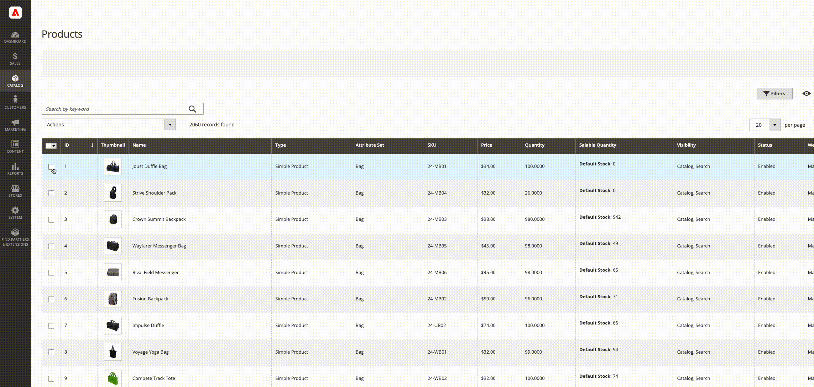
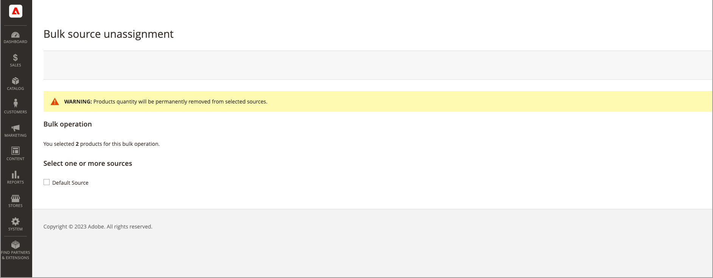

# Bulkbrontoewijzing en -toewijzing

Gebruik de _Bronnen toewijzen_ om een of meer bronnen aan uw producten toe te voegen. Het hulpmiddel helpt wanneer het creëren van en het toewijzen van douanebronnen aan uw StandaardVoorraad of douanevoorraden en het voorbereiden van nieuwe plaatsen en inventaris.

Nadat u nieuwe aangepaste bronnen hebt toegevoegd, kunt u [inventarishoeveelheden per product](quantities-assign-per-product.md) of voor meerdere producten via de Admin of via het [importfunctie](inventory-import-export.md).

## Bronnen en hoeveelheden toewijzen

1. Op de _Beheerder_ zijbalk, ga naar **[!UICONTROL Catalog]** > **[!UICONTROL Products]**.

1. Selecteer de producten waarvoor u de bronnen wilt wijzigen.

   Blader of zoek naar de producten en selecteer de selectievakjes.

1. Klik op de knop **[!UICONTROL Actions]** bovenaan en kies **[!UICONTROL Assign Inventory Source]**.

1. Klikken **[!UICONTROL OK]** in het bevestigingsdialoogvenster.

1. Voor alle bronnen die u aan de producten wilt toevoegen, selecteer checkboxes.

1. Klik op **[!UICONTROL Assign Sources]**.

   {width="600" zoomable="yes"}

De bronnen worden toegevoegd aan de producten met een inventarishoeveelheid van 0. U kunt [voorraadhoeveelheden](quantities-assign-per-product.md) per bron.

## Toewijzing van bronnen en hoeveelheden ongedaan maken

Wanneer u de toewijzing van een bron uit een product ongedaan maakt, geeft u aan dat het product niet langer op die locatie is opgeslagen. Dit proces ontruimt volledig alle inventarisgegevens voor bron momenteel die aan het product wordt toegewezen. Als u de bestaande voorraad naar een nieuwe locatie wilt verplaatsen, kunt u de opdracht _Overdrachtsinventarisatie_ -optie.

{{$include /help/_includes/unassign-source.md}}

Het wordt ten zeerste aanbevolen alle bestellingen en verzendingen voor deze producten in te vullen voordat de bron wordt verwijderd.

1. Op de _Beheerder_ zijbalk, ga naar **[!UICONTROL Catalog]** > **[!UICONTROL Products]**.

1. Selecteer de producten waarvoor u bronnen wilt wijzigen.

   Blader of zoek naar de producten en selecteer de selectievakjes.

1. Klik op de knop **[!UICONTROL Actions]** bovenaan en kies **[!UICONTROL Unassign Inventory Source]**.

1. Klikken **[!UICONTROL OK]** in het bevestigingsdialoogvenster.

1. Selecteer de bron die u uit de producten wilt verwijderen.

   Op de pagina wordt een waarschuwing weergegeven dat bij het verwijderen van de toewijzing alle specifieke bron- en kwantiteitsgegevens uit het product worden verwijderd.

1. Klik op **[!UICONTROL Unassign Sources]**.

   {width="600" zoomable="yes"}
