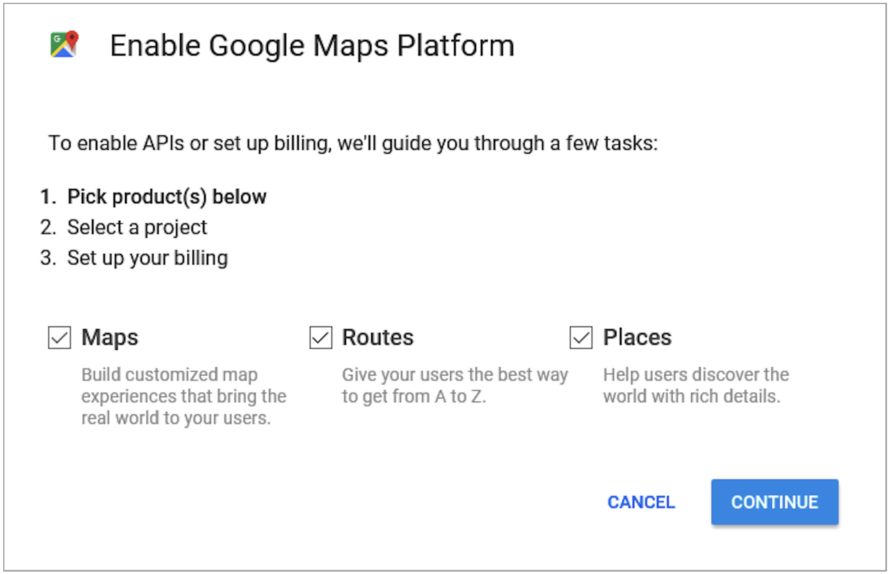
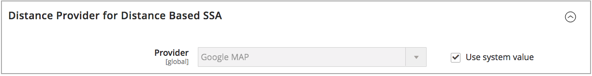

# Het algoritme voor prioriteitsafstand configureren

Het algoritme van de Prioriteit van de Afstand vergelijkt de plaats van het verzendende bestemmingsadres met bronplaatsen om de dichtstbijzijnde bron te bepalen om verzendingen te vervullen. De afstand kan worden bepaald door fysieke afstand of tijd die wordt doorgebracht van de ene naar de andere locatie, met behulp van databasegegevens of het rijden, lopen of fietsen. Gebruik dit [&#x200B; Algoritme van de Selectie van Source &#x200B;](selection-reservations.md) om de dichtste bron aan het verschepen bestemmingsadressen aan te bevelen.

>[!NOTE]
>
>Als u het Prioritaire Algoritme van de Afstand gebruikt, wordt het ingaan van het volledige straatadres en de coördinaten van GPS voor uw [&#x200B; bronnen &#x200B;](sources-add.md) geadviseerd.

U hebt twee opties om de afstand en de tijd te berekenen om de dichtstbijzijnde bron voor verzending te vinden:

- **MAP van Google** - gebruikt [ de Diensten van het Platform van de Kaarten van Google ][1] om de afstand en de tijd tussen het verschepende bestemmingsadres en bronplaatsen te berekenen. Bij deze optie worden de GPS-coördinaten (Latitude and Longitude) van de bron gebruikt en kan het adres van de straat worden gebruikt, afhankelijk van de berekeningsmodus. Een sleutel van Google API wordt vereist met [ Geocoding API ][2] en [ toegelaten de Matrijs van de Afstand API ][3], en u kunt lasten door Google veroorzaken.

- **Offline Berekening** - berekent de afstand gebruikend gedownloade en ingevoerde geocode gegevens gebruikend postcodes/postcodes en GPS coördinaten om de dichtstbijzijnde bron aan het verschepende bestemmingsadres te bepalen. Als u deze optie wilt configureren, hebt u mogelijk hulp van ontwikkelaars nodig om geocodes in eerste instantie te downloaden en importeren aan de hand van opdrachtregelinstructies.

>[!NOTE]
>
>Voor multi-store website met verscheidene landen, vorm de [&#x200B; standaardbelastingbestemming &#x200B;](../stores-purchase/tax-class.md#default-tax-destination){target="_blank"} voor elk land.

## Google-kaarten gebruiken

U hebt geen Google-account nodig om aan de slag te gaan. Het proces omvat Google-account en het maken van projecten, indien nodig. Deze optie vereist dat er een factureringsaccount en betalingsmethode aan uw Google-account worden toegevoegd om de configuratie te voltooien en het algoritme te gebruiken.
Google MAP op afstand gebaseerd algoritme wordt echter aanbevolen als geavanceerder en nauwkeuriger in vergelijking met Offlineberekening.

### Stap 1: De Google API-sleutel maken

De sleutel is van het [ Platform van de Kaarten van Google ][1] en zou [ Geocoding API ][2] en [ toegelaten de Matrijs van de Afstand moeten hebben ][3]. Voor details, zie [&#x200B; het Vormen het Prioritaire Algoritme van de Afstand &#x200B;](distance-priority-algorithm.md).

1. Bezoek [ het Platform van de Kaarten van Google ][1] en klik **[!UICONTROL Get Started]**.

1. Selecteer **[!UICONTROL Maps, Routes, and Places]** en klik op **[!UICONTROL Continue]** om het platform in te schakelen.

   {width="350" zoomable="yes"}

1. Meld u aan met een Google-account of maak een account.

1. Een project instellen:

   - Selecteer een project of ga een nieuwe projectnaam in.

   - Selecteer `Yes` als u de voorwaarden wilt accepteren.

   - Klik op **[!UICONTROL Next]**.

1. Voer een factureringsaccount in of maak er een. U kunt een factureringsaccount later overslaan en toevoegen.

   U hebt een factureringsaccount nodig om deze service te kunnen gebruiken.

1. Klik op **[!UICONTROL Console]** om de opties voor het Google Cloud Platform te openen en te configureren.

   - Open uw project.

   - Vouw het menu uit en klik op **[!UICONTROL APIs & Services]** > **[!UICONTROL Library]** .

     {width="350" zoomable="yes"}

   - Onderzoek naar [ Coderen API ][2] en [ Matrijs API van de Afstand ][3]. Selecteer en laat elke dienst toe.

1. Vouw het menu uit, klik op **[!UICONTROL APIs & Services]** > **[!UICONTROL Credentials]** en kopieer de Google API-sleutel.

   {width="350" zoomable="yes"}

### Stap 2: De Google MAP-provider configureren

1. Voor _Admin_ sidebar, ga **[!UICONTROL Stores]** > _[!UICONTROL Settings]_>**[!UICONTROL Configuration]**.

1. Vouw in het linkerdeelvenster **[!UICONTROL Catalog]** uit en kies **[!UICONTROL Inventory]** .

1. Breid  de _[!UICONTROL Distance Provider for Distance Based SSA]_&#x200B;sectie uit en reeks **[!UICONTROL Provider]**&#x200B;aan `Google MAP`.

   {width="350" zoomable="yes"}

1. Breid  de _[!UICONTROL Google Distance Provider]_&#x200B;sectie uit en vorm de montages:

   - Voer bij **[!UICONTROL Google API Key]** de gekopieerde sleutel in van uw Google-account.

   - Selecteer voor **[!UICONTROL Computation mode]** een configuratie.

     >[!NOTE]
     >
     >Wanneer het gebruiken van dit algoritme voor het verschepen, als de routes en de gegevens niet voor de geselecteerde wijze van de Berekening (rij, fietsen, of het lopen) voor een lading terugkeren, blijft SSA aan het gebruiken van de Prioriteit van Source in gebreke. Het plaatsen van de [&#x200B; prioriteit voor bronnen per voorraad &#x200B;](stocks-prioritize-sources.md) wordt geadviseerd.

     | Optie | Beschrijving |
     | ----- | ----- |
     | `Driving` | (Standaard) Vereist standaard rijrichtingen die het wegennet gebruiken. |
     | `Walking` | Verzoekt lopende richtingen met gebruik van voetgangerspaden en zijkanten (indien beschikbaar). |
     | `Bicycling` | Verzoekt fietsrichtingen met fietspaden en de voorkeurstraten (indien beschikbaar). De [ Dienst van de Matrijs van de Afstand ][4] is slechts beschikbaar in de V.S. en sommige Canadese steden. |

   - Selecteer bij **[!UICONTROL Value]** een waardetype:

     | Optie | Beschrijving |
     | ----- | ----- |
     | `Distance` | (Standaard) Geeft de afstand tussen punten in metriek (kilometers en meters) of imperial (mijlen en voeten). |
     | `Time to Destination` | Retourneert de tijd die nodig is om van de bronlocaties naar het verzendadres te gaan in uren en minuten. |

   {width="350" zoomable="yes"}

1. Klik op **[!UICONTROL Save Config]** als de bewerking is voltooid.

## Offline berekening gebruiken

Offlineberekeningen gebruiken landcodes om de afstand tussen de verzendbestemming en de bronadressen te bepalen. Voor deze optie is mogelijk hulp van ontwikkelaars nodig bij het configureren. Gebruik een [!DNL Inventory Management] bevel CLI om gegevens van [ geonames.org ][5] te downloaden en in te voeren.

>[!NOTE]
>
>De ingevoerde geocodes van [ geonames.org ][5] hebben beperkingen voor sommige landen, zoals Canada en Ierland. Verwijs naar [ de dossiers van de Code van GeoNames Postal ][6] voor meer informatie.

### Stap 1: geocodes downloaden en importeren

Volledige bevel-lijn configuratie om geocodes landen te downloaden en in te voeren om te verzenden naar en bronplaatsen in te hebben. Voor deze stap is mogelijk hulp van de ontwikkelaar nodig bij het uitvoeren van opdrachtregeltaken. Verwijs naar [&#x200B; Geocodes van de Invoer &#x200B;](cli.md#import-geocodes).

Vul deze opdrachten altijd in als u meer geocodes wilt toevoegen.

### Stap 2: De berekening instellen

1. Voor _Admin_ sidebar, ga **[!UICONTROL Stores]** > _[!UICONTROL Settings]_>**[!UICONTROL Configuration]**.

1. Vouw in het linkerdeelvenster **[!UICONTROL Catalog]** uit en kies **[!UICONTROL Inventory]** .

1. Breid  de _[!UICONTROL Distance Provider for Distance Based SSA]_&#x200B;sectie uit.

1. Schakel het selectievakje **[!UICONTROL Use system value]** uit en stel **[!UICONTROL Provider]** in op `Offline Calculation` .

   {width="350" zoomable="yes"}

1. Klik op **[!UICONTROL Save Config]** als de bewerking is voltooid.

[1]: https://cloud.google.com/maps-platform/
[2]: https://developers.google.com/maps/documentation/geocoding/start
[3]: https://developers.google.com/maps/documentation/distance-matrix/start
[4]: https://developers.google.com/maps/documentation/javascript/distancematrix#travel_modes
[5]: https://www.geonames.org/
[6]: https://download.geonames.org/export/zip/readme.txt
