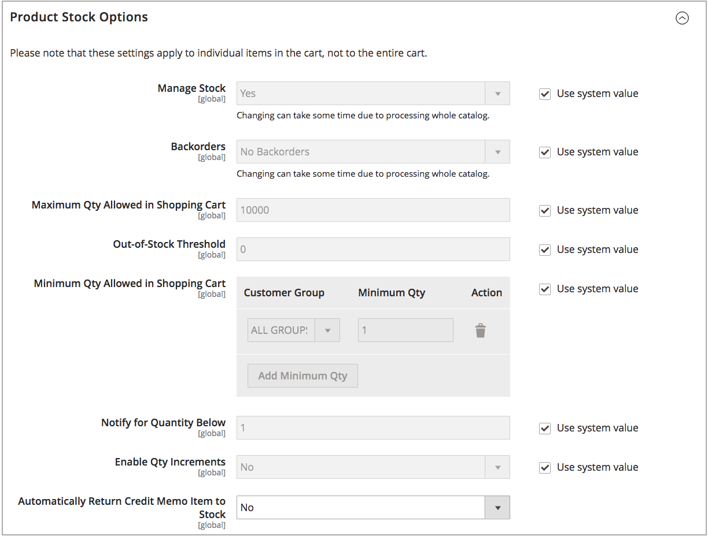

# Inschakelen [!DNL Inventory Management]

Schakel [!DNL Inventory Management] op het wereldwijde winkel- of productniveau. Wanneer de _Stock beheren_ optie is ingeschakeld, [!DNL Inventory Management] volgt automatisch producthoeveelheden beschikbaar voor de plaats door gevormde voorraden en bronnen. Elke functie en optie begint het volgen en het melden wanneer toegelaten, zonder extra configuratie.

Uw bedrijf loopt en inventarisupdates bij de snelheid van verkoop. Als klanten winkelen, ontvangt u nauwkeurige, bijgewerkte informatie voor beschikbare voorraad per verkoopkanaal en bron. Beschikbare verkoopbare hoeveelheden worden per voorraad bijgewerkt wanneer klanten producten aan winkelwagentjes toevoegen en aankopen voltooien, en wanneer en u bestellingen beheert, verzendingen maakt en terugbetalingen uitgeeft. Aanschaffen van nieuwe of overgedragen voorraad-update naar uw bronnen, direct beschikbaar voor online verkoop. Backorders voltooien tot gespecificeerde drempels zonder oneindige orden of extra configuraties. En u gaat en voltooit gedeeltelijke of volledige ladingen over één of meerdere bronnen met aanbevelingen in, die u volledige controle over ordenaleving en voorraad geven.

>[!NOTE]
>
>Standaard, [!DNL Inventory Management] is ingeschakeld bij installatie of upgrade [!DNL Commerce]. Afhankelijk van uw bedrijfsbehoeften, kunt u volgen willen toelaten of onbruikbaar maken [!DNL Inventory Management] binnen [!DNL Commerce].

Hoe deze instelling werkt in inventarissen van één en meerdere bronnen:

- Te gebruiken [!DNL Inventory Management], enable _[!UICONTROL Manage Stock]_.

- [!UICONTROL Manage Stock] de montages op de configuratie van het productniveau treden de archiefconfiguratie met voeten.

- Als u Order Management of services van derden (zoals ERP) wilt gebruiken, schakelt u [!UICONTROL Manage Stock].

- Als de configuratie van het productniveau het systeemgebrek gebruikt, treedt de opslagconfiguratie met voeten.

Met [!DNL Inventory Management] Toegelaten, zie het volgende om alle montages te vormen:

- [Algemene opties configureren](global-options.md) - Instellingen die van invloed zijn op de gehele catalogus, worden beschouwd als de standaardinstellingen van het systeem.

- [Productopties configureren](product-options.md) - Instellingen voor een specifiek product dat algemene opties overschrijft.

## In- of uitschakelen [!DNL Inventory Management]

1. Op de _Beheerder_ zijbalk, ga naar **[!UICONTROL Stores]** > _[!UICONTROL Settings]_>**[!UICONTROL Configuration]**.

1. Vouw in het linkerdeelvenster uit **[!UICONTROL Catalog]** en kiest u **[!UICONTROL Inventory]**.

1. Uitbreiden  _Opties voor productvoorraad_ en configureren:

   {width="600" zoomable="yes"}

   - Om inventaris te beheren en alles te gebruiken [!DNL Commerce] functies, set **[!UICONTROL Manage Stock]** tot `Yes` (standaard).

   - Uitschakelen [!DNL Inventory Management]schakelt u de optie **[!UICONTROL Use system value]** selectievakje en set **[!UICONTROL Manage Stock]** tot `No`.

1. Klik op **[!UICONTROL Save Config]**.

## De voorraad voor een winkel beheren

Zie [Globale opties configureren](global-options.md).

## De voorraad voor een product beheren

Zie [Productopties configureren](product-options.md).
