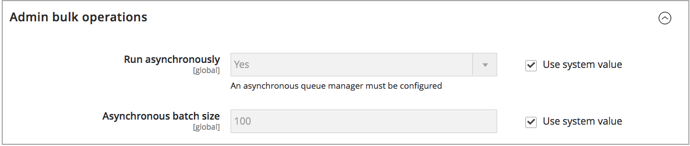

# Globale opties configureren: [!DNL Inventory Management]

Configureer de standaardconfiguratieopties voor product en voorraad voor uw websites. Sommige van deze montages kunnen per product door [ worden met voeten getreden die de Opties van het Product ](product-options.md) vormen. Om de montages van de Prioriteit van de Afstand te vormen, zie [ het Vormen het Prioritaire Algoritme van de Afstand ](distance-priority-algorithm.md).

## Wereldwijd product- en voorraadopties configureren

1. Voor _Admin_ sidebar, ga **[!UICONTROL Stores]** > _[!UICONTROL Settings]_>**[!UICONTROL Configuration]**.

1. Vouw in het linkerdeelvenster **[!UICONTROL Catalog]** uit en kies **[!UICONTROL Inventory]** .

1. Breid  de **[!UICONTROL Stock Options]** sectie uit en plaats de opties:

   {width="600" zoomable="yes"}

   - Stel **[!UICONTROL Decrease Stock When Order is Placed]** in op `Yes` als u de hoeveelheid op de hand wilt aanpassen.

   - Als u items wilt retourneren naar de voorraad wanneer een bestelling wordt geannuleerd, **[!UICONTROL Set Items' Status to be in Stock When Order in Cancelled]** naar `Yes` .

   - Als u wilt doorgaan met het weergeven van producten in de catalogus die niet meer in voorraad zijn, stelt u **[!UICONTROL Display Out of Stock Products]** in op `Yes` .

   - Als [ prijsalarm ](alert-setup.md) wordt toegelaten, kunnen de klanten zich aanmelden om worden op de hoogte gebracht wanneer het product terug in voorraad is.

   - Voer een bedrag in voor **[!UICONTROL Only X left Threshold]** om het begin in te stellen voor de weergave van de laatste voorraad op de productpagina.

     Het bericht wordt weergegeven wanneer de voorraad de drempel bereikt. Als de waarde bijvoorbeeld is ingesteld op `3` , wordt het bericht `Only 3 left` weergegeven wanneer de hoeveelheid in voorraad de waarde drie bereikt. Het bericht wordt aangepast aan de hoeveelheid in voorraad tot de hoeveelheid nul bereikt.

   - Als u het bericht In voorraad of Uit voorraad wilt weergeven op de productpagina, stelt u **[!UICONTROL Display Products Availability In Stock on Storefront]** in op `Yes` .

   - Stel **[!UICONTROL Enable Inventory Check On Cart Load]** in op `Yes` om de voorraad te controleren wanneer u een product in de winkelwagen laadt. Als deze optie is uitgeschakeld, wordt de voorraadcontrole overgeslagen. Als u deze optie uitschakelt, wordt het afrekenen versneld, vooral als er veel winkelwagentjes zijn. Als u de pre-validatie echter overslaat, kunnen klanten later tijdens het afrekenen fouten van het type &quot;out of stock&quot; zien.

   - Stel **[!UICONTROL Synchronize with Catalog]** in op `Yes` om consistentie tussen voorraad en catalogus te behouden. Als deze optie is ingeschakeld, worden de inventarisgegevens aangepast aan de wijzigingen in de catalogus (zoals het verwijderde product, de gewijzigde productSKU en het gewijzigde producttype).

1. Breid  de **[!UICONTROL Product Stock Options]** sectie uit en plaats de opties:

   - Om [ inventariscontrole ](enable.md) voor uw catalogus te activeren, plaats **[!UICONTROL Manage Stock]** aan `Yes`.

     {width="600" zoomable="yes"}

   - Stel **[!UICONTROL Backorders]** in op een van de volgende opties:

     | Optie | Beschrijving |
     | ----- | ----- |
     | `No Backorders` | [ Achterorden ](backorders.md) worden niet goedgekeurd wanneer het product uit voorraad is. |
     | `Allow Qty Below 0` | Achterorden worden geaccepteerd als de hoeveelheid onder nul daalt. |
     | `Allow Qty Below 0 and Notify Customer` | Backorders worden geaccepteerd als het aantal minder is dan nul en het systeem de klant meldt dat de bestelling nog steeds kan worden geplaatst. |

   - Voer de **[!UICONTROL Maximum Qty Allowed in Shopping Cart]** in.

   - Voer een bedrag in voor de **[!UICONTROL Out-of-Stock Threshold]** :

     | Waarde | Beschrijving |
     | ----- |-----|
     | Positief bedrag | Voer een positieve waarde in als Achterordes uitgeschakeld is. |
     | Nul | Als Achterorden ingeschakeld is en u `0` invoert, zijn oneindige achterorden mogelijk. |
     | Negatief bedrag | Als Achterorden ingeschakeld, wordt u aangeraden een negatief bedrag in te voeren. Het bedrag wordt toegevoegd aan de verkoopbare hoeveelheid. Voer bijvoorbeeld `-50` in om bestellingen tot dit bedrag toe te staan. |

   - Voer de **[!UICONTROL Minimum Qty Allowed in Shopping Cart]** in voor de geselecteerde groep en hoeveelheden.

   - Voer bij **[!UICONTROL Notify for Quantity Below]** het voorraadniveau in dat een melding activeert dat het item uit voorraad is.

   - Stel **[!UICONTROL Enable Qty Increments]** in op `Yes` als u kwantitatieve stappen voor het product wilt activeren. Voer bij **[!UICONTROL Qty Increments]** vervolgens het aantal items in dat moet worden aangeschaft om aan de vereiste te voldoen.

     Een artikel dat in stappen van zes wordt verkocht, kan bijvoorbeeld worden aangeschaft in hoeveelheden van `6` , `12` , `18` , enzovoort.

   - Voor [!DNL Inventory Management] wordt **[!UICONTROL Automatically Return Credit Memo Item to Stock]** ingesteld op `No` . Wanneer u een creditnota indient, voert u deze in en selecteert u deze om de voorraad terug te brengen naar bronnen.

1. Breid  de **[!UICONTROL Admin bulk operations]** sectie uit en plaats de opties:

   {width="600" zoomable="yes"}

   - Stel **[!UICONTROL Run asynchronously]** in om bulkbewerkingen asynchroon uit te voeren voor acties voor grote producten

     Deze verrichtingen omvatten bulk [ toewijzend en unassigning bronnen ](bulk-assignment.md), en [ overbrengend inventaris aan bron ](inventory-transfer.md). Het verzamelt bulkacties tot de Asynchrone partijgrootte, dan stelt die acties in werking. Deze optie is standaard uitgeschakeld. U wordt aangeraden de prestaties te beoordelen met acties in bulk voordat u deze inschakelt.

     >[!NOTE]
     >
     >Om _asynchrone rijmanagers_ te vormen en te steunen, moet u een bevel uitgeven gebruikend de bevellijn. Voor deze stap is mogelijk hulp van ontwikkelaars nodig. Zie [ de gebruikers van de het berichtrij van het Begin ](https://experienceleague.adobe.com/docs/commerce-operations/configuration-guide/cli/start-message-queues.html) in de _Gids van de Configuratie_.

   - Indien ingeschakeld, stelt u de **[!UICONTROL Asynchronous batch size]** in. De standaardbatch-grootte is 100. Wanneer de bulkprocessen dit bedrag bereiken, teweegbrengt het systeem het.

1. Klik op **[!UICONTROL Save Config]** als de bewerking is voltooid.
