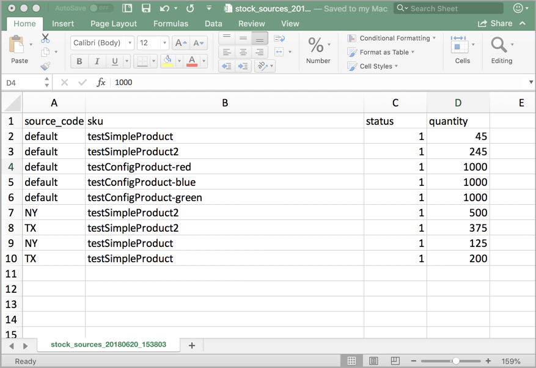
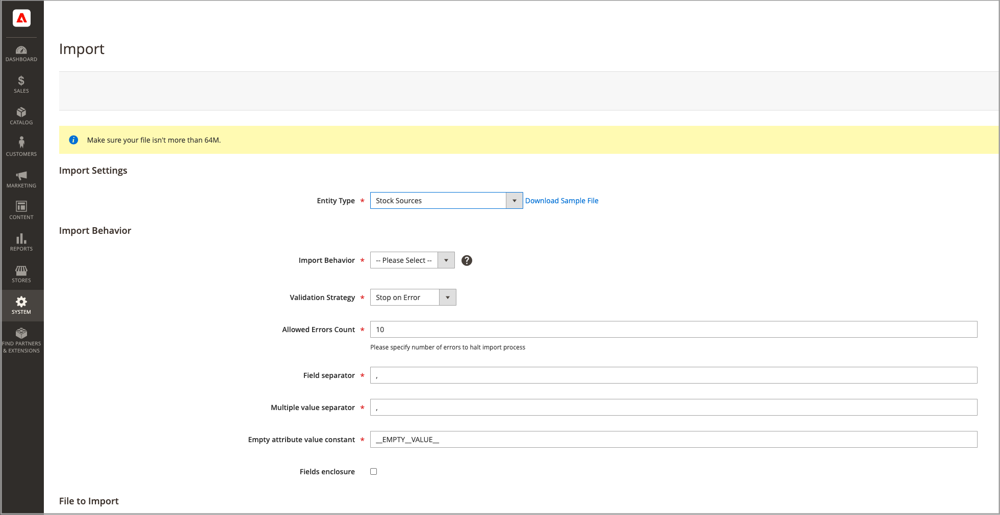

# Invoer- en uitvoervoorraad

Voor catalogi met veel producten gebruikt u de native import- en exportfuncties met uitgebreide [!DNL Inventory Management] opties voor het bijwerken van bronnen en hoeveelheden per SKU. Met deze opties kunt u nieuwe bronnen toevoegen en inventarishoeveelheden bijwerken voor alle bronnen of een specifieke bron. U kunt bijvoorbeeld producten exporteren voor een bron in Duitsland zonder dat dit van invloed is op de productinformatie voor bronnen in Frankrijk, Engeland of de VS.

- [!DNL Commerce] Wijst automatisch de Standaardbron aan uw producten toe wanneer het bevorderen [!DNL Commerce] of nieuwe producten importeren. Als u producten importeert waaraan een aangepaste bron is toegewezen, wordt de standaardbron nog toegevoegd met een hoeveelheid van 0. Gebruik deze importinstructies om bronnen en hoeveelheden bij te werken.

- Single-source-handelaren gebruiken import om alleen producthoeveelheden bij te werken. Alle bestaande en toegevoegde producten worden toegewezen aan de Standaardbron.

- Multisource-handelaren gebruiken import om meerdere bronnen en hoeveelheden per rij per SKU toe te voegen.

Als u updates wilt importeren, exporteert u eerst een CSV-bestand voor een bepaalde of alle bronnen. Bewerk het CSV-bestand en voeg een rij per SKU toe voor elke bron en hoeveelheid. U hebt de code van de bron nodig wanneer u een bron toevoegt en hoeveelheden voorraad toevoegt. U kunt geen voorraden toevoegen of bijwerken met functies voor importeren en exporteren.

## CSV-bestandsinhoud

Het export-import bestand bevat de volgende informatie, afhankelijk van de bron:

- `source_code` - De code voor bronnen in [!DNL Commerce]. Er is een rij voor elke bron en SKU.
- `sku` - De SKU voor het product in [!DNL Commerce]. De SKU moet overeenkomen met een product in uw winkel om correct te kunnen worden bijgewerkt [!DNL Inventory Management] gegevens.
- `status` - 0 voor bestanden uit de voorraad. 1 voor In voorraad. Deze waarde moet 1 zijn om voorraad van deze bron aan te schaffen.
- `quantity` - De totale hoeveelheid voorraad die beschikbaar is voor deze SKU en bron.

Gebruik een CSV-bestand om snel meerdere producten en toegewezen bronnen bij te werken en eventuele onnauwkeurigheden in de voorraadadministratie te corrigeren in plaats van één voor één via de toepassingsinterface. Exporteer voor een basisbestand eerst en werk het bestand zo nodig bij.

{width="600" zoomable="yes"}

## Productgegevens exporteren voor alle bronnen

1. Op de _Beheerder_ zijbalk, ga naar **[!UICONTROL System]** > _[!UICONTROL Data Transfer]_>**[!UICONTROL Export]**.

1. Voor **[!UICONTROL Entity Type]**, kiest u `Stock Sources`.

   De uitvoer haalt slechts gegevens voor producten met een SKU uit.

1. Klik op **[!UICONTROL Continue]**.

   Het bestand wordt gegenereerd en gedownload om te openen en te bewerken.

Nadat u de inventarishoeveelheden en productgegevens hebt bijgewerkt, importeert u het bestand weer in [!DNL Commerce].

{width="350" zoomable="yes"}

## Productgegevens exporteren voor een specifieke bron

1. Op de _Beheerder_ zijbalk, ga naar **[!UICONTROL System]** > _[!UICONTROL Data Transfer]_>**[!UICONTROL Export]**.

1. Voor **[!UICONTROL Entity Type]**, kiest u `Stock Sources`.

   De uitvoer haalt slechts gegevens voor producten met een SKU uit.

1. Gebruik de **[!UICONTROL Entity Attributes]** de geëxporteerde producten voor een bepaalde bron filteren.

   Voor `source_code`voert u de code voor de bron in het filterveld in.

1. Klik op **[!UICONTROL Continue]**.

   Het bestand wordt gegenereerd en gedownload om te openen en te bewerken.

Nadat u de inventarishoeveelheden en productgegevens hebt bijgewerkt, importeert u het bestand weer in [!DNL Commerce].

## Productgegevens importeren

1. Op de _Beheerder_ zijbalk, ga naar **[!UICONTROL System]** > _[!UICONTROL Data Transfer]_>**[!UICONTROL Import]**.

1. Voor **[!UICONTROL Entity Type]**, kiest u `Stock Sources`.

   De uitvoer haalt slechts gegevens voor producten met een SKU uit.

1. Configuraties selecteren voor de **[!UICONTROL Import Behavior]**.

1. Selecteer het CSV-bestand dat u wilt importeren.

1. Klikken **[!UICONTROL Check Data]** en voltooi de import.

{width="600" zoomable="yes"}
