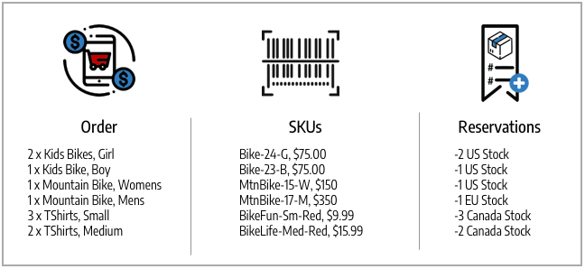

# Status van bestelling en voorbehouden

[!DNL Inventory Management] ondersteunt gedeeltelijke en volledige facturering, betalingen, verzending en annuleringen per bestelling. Terwijl u een bestelling beheert via verwerking, facturering, verzending en mogelijk terugbetalingen, [!DNL Commerce] voert automatisch een voorbehoud in of wijzigt dit om de verkoopbare hoeveelheid voor een voorraad (of verkoopkanaal) en de hoeveelheid voorraad ter plaatse per bron bij te werken. U hoeft geen actieve toegang te krijgen tot reserveringen of deze in te voeren. Als u acties uitvoert om een bestelling te voltooien, te annuleren of terug te betalen, gebeurt dit voor u.

Met deze voorbehouden wordt altijd de verkoopbare hoeveelheid aangepast, met positieve of negatieve bedragen om de hoeveelheid te verhogen of te verlagen. Het resultaat is een update van uw eigen voorraad en verkoopbare hoeveelheden voor actuele productbeschikbaarheid.

Zie voor meer informatie over bestellingen en verzendingen [Bestellingen en verzendingen beheren](shipments.md).

## Opties voor orderbeheer

Afhankelijk van de voorraadstatus en de verzoeken van de klant, kunt u orden met gedeeltelijke betalingen en annuleringen, gedeeltelijke verzendingen uit veelvoudige bronnen of voor achterorden, of creditnota&#39;s bijwerken om teruggekeerde producten terug te keren.

### Overbrengingen

Na het factureren van bevelen, verzend gedeeltelijke of volledige verzendingen tot u de volledige orde vervult. Bij elke zending wordt de boeking geconverteerd, waarbij het bedrag wordt afgetrokken van de producthoeveelheid per bron. Vergoedingen voor reservering worden ingevoerd om de verkoopbare hoeveelheid voor uw voorraad bij te werken. Als u gedeeltelijke verzendingen verzendt, brengt elke verzending dat bedrag in mindering op de hoeveelheid en de reserveringen van uw product. Alle niet-verscheepte productreserveringen blijven van kracht tot ze ook worden verzonden, zodat uw verkoopbare bedrag actueel is en u controle hebt over de productvoorraad en ondersteuning biedt voor meerdere bronverzendingen en -backorders.

### Geannuleerde bestellingen

Als een klant zijn bestelling vóór verzending (gedeeltelijk of volledig) annuleert, wordt een nieuwe boeking ingevoerd om het voorraadbedrag terug te brengen naar de verkoopbare hoeveelheid. De reserveringen annuleren elkaar in feite, waarbij de hoeveelheid niet van enige bron wordt afgetrokken. Andere afnemers kunnen deze producthoeveelheden actief aankopen via de bijbehorende voorraden en verkoopkanalen.

### Terugbetaalde bestellingen

Als een klant om terugbetaling verzoekt, geeft u de creditnota voor de gedeeltelijke of volledige productbedragen uit. Wanneer u de geretourneerde producten ontvangt, voert u een creditnota in om de middelen te verstrekken en de productbedragen bij te werken. Als u de optie Terug naar voorraad selecteert, [!DNL Commerce] de hoeveelheden worden toegevoegd aan de producten en de bronnen die de orders hebben verzonden en de boekingsvergoedingen om de verkoopbare hoeveelheden voor de betrokken voorraden bij te werken.

## Ordertypen

Eenvoudige bestellingen beginnen met een winkelwagentje, blijven betalen en eindigen met een bevredigende levering. In deze bestellingen [!DNL Inventory Management] eenvoudig voorbehouden verwerken tegen de beschikbaarheid (of verkoopbare hoeveelheid) in de kar en de afhandeling, en aftrekken van de voorraad ter plaatse bij verzending.

{width="600" zoomable="yes"}

Een gecompliceerder bestelling kan gedeeltelijk worden geannuleerd, gedeeltelijk worden verzonden en terugbetaald. In dergelijke situaties hebben de voorbehouden invloed op de beschikbare voorraad om hoeveelheden voor annuleringen en restituties toe te voegen en de hoeveelheden te verlagen wanneer ze worden besteld en verzonden.

{width="600" zoomable="yes"}

De reserveringen van de beschikbaarheid en inventarisveranderingen komen op basis van de ordestatus voor.

## Status en voorbehouden

In de volgende tabellen wordt de status van de order en creditnota met reserveringswijzigingen gespecificeerd die zijn ingevoerd door [!DNL Commerce] om je voorraad te beheren.

| Status van bestelling | Beschrijving | Voorbehoud voor verkoopbare hoeveelheid |
|--|--|--|
| [!UICONTROL Open] | Nieuw en recent verzonden, geen verwerking | Voorbehoud wordt bewaard wanneer de orde voor het dossier wordt voorgelegd. |
| [!UICONTROL Canceled] | Geannuleerd geheel of gedeeltelijk vóór betaling | Voorwaardelijke verrekening wordt geboekt om de volledige of gedeeltelijke hoeveelheid weer op de verkoopbare hoeveelheid terug te brengen. |
| [!UICONTROL On Hold] | Betaling en verzending niet verwerkt of gefactureerd | Voorbehoud blijft van kracht. |
| [!UICONTROL Suspected Fraud] | Niet verwerkt wegens fraude | Indien goedgekeurd of herzien, blijft de reservering op zijn plaats. Indien geweigerd, blijft de reservering van kracht totdat de handelaar besluit deze goed te keuren of te annuleren. Indien de boeking wordt geannuleerd, wordt de volledige hoeveelheid teruggeboekt naar de verkoopbare hoeveelheid. |
| [!UICONTROL Pending] | Te betalen | De reservering blijft van kracht. |
| [!UICONTROL Processing] | Betalingsverwerking niet ontvangen | De reservering blijft van kracht. |
| [!UICONTROL Pending Payment] | Betaling niet ontvangen | De reservering blijft van kracht. |
| [!UICONTROL Payment Review] | Betaling wordt herzien voor verwerking en voltooiing | De reservering blijft van kracht. |
| [!UICONTROL Complete] | Betaald en volledig verzonden | Het reserveringsbedrag wordt afgetrokken van de producthoeveelheid voor de geselecteerde bron wanneer het geheel of gedeeltelijk wordt gefactureerd. De reserveringsvergoeding wordt geboekt om de totale verkoopbare hoeveelheid bij te werken. |
| [!UICONTROL Closed] | Geretourneerd of gearchiveerd | Indien gearchiveerd, worden de hoeveelheden niet gewijzigd. Indien de reserveringsvergoeding geheel of gedeeltelijk wordt terugbetaald, wordt deze geboekt en omgerekend om de producthoeveelheden per bron en de verkoopbare hoeveelheid per voorraad op te tellen. |

| Status creditcard | Beschrijving | Voorbehoud voor verkoopbare hoeveelheid |
|--|--|--|
| [!UICONTROL Open] | De terugbetaling is verschuldigd, niet voltooid | Er is geen wijziging in de bedenkingen. |
| [!UICONTROL Refunded] | Voltooid, geld terugbetaald | Indien de reserveringsvergoeding geheel of gedeeltelijk wordt terugbetaald, wordt deze geboekt en omgerekend om de producthoeveelheden per bron en de verkoopbare hoeveelheid per voorraad op te tellen. |

## Complexe voorbeeldvolgorde

Blake Sanders bestelt fietsen en kleding voor hun familievakantie en plezier. Zij zien wat grote verkoop op uw Biking Adventures opslag met voorraad en bronnen die de Verenigde Staten, Canada, en Europa overspannen.

Ze kopen twee grote park fietsen voor hun kleine kinderen, een BMX fiets voor hun tiener, een mooie berg fiets voor zichzelf en een moderne Duitse fiets voor hun echtgenoot. De winkel had een verkoop op schattige hemden, dus kochten ze er wat voor de hele familie om mee te doen. Zie de onderstaande lijst met vacatureaankopen, de overeenkomende SKU&#39;s en de reserveringen ten aanzien van de verkoopbare voorraden.

{width="600" zoomable="yes"}

Ze laten hun familie zien wat ze vonden, maar ze veranderen. Voordat de betaling is voltooid, annuleren ze twee van de 33-BikeFun SKU&#39;s (kinderen vonden ze niet leuk). Dit is een gedeeltelijke annulering wegens hangende betaling, dus er is geen creditnota nodig. Om bij te werken, [!DNL Commerce] wordt toegevoegd aan de verkoopbare voorraad voor Canada. De bestelling wordt betaald en alle producten worden op tijd geleverd voor vakantie. [!DNL Commerce] actualiseert de verkoopbare hoeveelheid en de bronhoeveelheden voor de verzendende producten.

Maar het shirt paste niet helemaal bij hun echtgenoot. Blake vraagt om terugbetaling en stuurt zijn shirt terug. De creatie van de kredietmemo voegt een 54-BikeLife-shirt toe aan de Canadese voorraad en het Canadese pakhuis.

- **Verzonden producten** - met aangekochte en verzonden producten, [!DNL Commerce] werkt de voorraad bij. Reserveringscompensaties worden omgezet in inhoudingen van de geleverde voorraad op de aangevoerde bron. De beschikbare verkoopbare hoeveelheid wordt bijgewerkt voor de voorraad.

- **Geannuleerde producten** - door de voorraad te annuleren, [!DNL Commerce] verwijdert de reservering voor dat product. De reserveringsvergoeding wordt op het voorraadniveau geboekt om de verkoopbare hoeveelheden voor de gedeeltelijke annulering van twee hemden op te tellen. Dit heeft geen invloed op de inventarishoeveelheid op bronniveau.

- **Creditnota/Afgelost product** - Door de voorraden met boekhouding te leveren, moet deze worden opgeteld bij de hoeveelheden. Bij het uitgeven van de creditnota kunt u selecteren om aan voorraad terug te keren. [!DNL Commerce] Hiermee voegt u een voorraadhoeveelheid toe aan de verzendbron voor het product. De reserveringscompensaties worden ingevoerd om eventuele resterende voorbehouden te wissen. De verkoopbare hoeveelheid wordt opnieuw berekend ten opzichte van de bijgewerkte hoeveelheid.

{width="600" zoomable="yes"}
