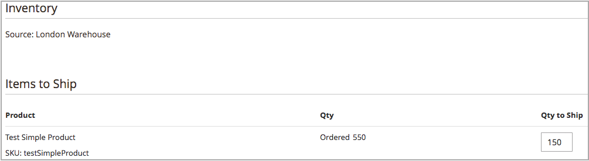

# Multibronzendingen maken

Met [!DNL Inventory Management] verzendt u een of meer verzendingen terwijl u een voorraad hebt. Herhaal deze instructies met de aanbevolen of handmatig ingevoerde hoeveelheden en bronnen om zo nodig extra verzendingen te genereren. In deze instructies wordt gedetailleerd beschreven hoe leveranciers uit meerdere bronnen zendingen verzenden. Single-source de handelaren verzenden zendingen zonder deze extra stappen (zie [ een lading ](../stores-purchase/shipments.md#create-a-shipment){target="_blank"} in de gids van de kerngebruiker creëren).

Gebruik bij het maken van verzendingen het Source-selectiealgoritme voor berekende aanbevelingen. Volg en gebruik deze aanbevelingen of stel de bedragen per bron in, die douaneverzendingen produceren. U beheert de uitgaande voorraad voor elke bestelling, waarbij u de af te trekken bedragen instelt, een of meer verzendingen verzendt en de voorraad en de achterstand instelt terwijl de voorraad beschikbaar is. Voer voor elk regelitem in de volgorde een bedrag in dat van de bronhoeveelheid moet worden afgetrokken.

U wilt mogelijk gedeeltelijke verzendingen verzenden naar:

- Terugboekingen uitvoeren als inventarisatie wordt binnengekomen

- Aftrekposten van voorraden naar bron

Terwijl u verzendingen invoert, worden de ingevoerde hoeveelheden in de voorraad afgetrokken. In feite worden de punten van voorbehoud omgezet in de feitelijke aftrekposten voor de hoeveelheid.

## Een verzending maken

1. Voor _Admin_ sidebar, ga **[!UICONTROL Sales]** > **[!UICONTROL Orders]**.

1. Zoek de volgorde en open de weergavemodus.

1. Als de bestelling is betaald en gefactureerd en klaar is om te worden verzonden, klikt u op **[!UICONTROL Ship]** .

1. Voltooi de Source-selectie voor het verzenden van producten per bron:

   - Klik op **[!UICONTROL Source Selection Algorithm]** en selecteer een algoritme om verzendaanbevelingen weer te geven.

     | Algorithm | Beschrijving |
     |--|--|
     | [ Prioriteit van Source ](source-priority-algorithm.md) | beveelt aan om zendingen uit bronnen te verzenden volgens de orders van bronnen die aan het bestand zijn toegewezen. |
     | [ Prioriteit van de Afstand ](distance-priority-algorithm.md) | Aanbevolen verzendingen van bronnen die zich het dichtst bij het verzendadres bevinden op basis van de fysieke afstand of de kortste levertijd. |

     >[!IMPORTANT]
     >
     >Wanneer het gebruiken van het Prioriteitsalgoritme van de Afstand voor het verschepen en routes en gegevens keert niet voor de geselecteerde [ wijze van de Berekening ](distance-priority-algorithm.md) (het besturen, het fietsen, of het lopen) voor een lading terug, blijft SSA aan de Prioriteit van Source in gebreke. Het wordt geadviseerd dat u ook de [ prioriteit voor bronnen per voorraad ](stocks-prioritize-sources.md) plaatst.

   - Selecteer bij **[!UICONTROL Select a Source to Ship from]** een bron om een verzending te verzenden.

   - Houd voor elk regelitem de aanbevolen hoeveelheid of voer een bepaald bedrag in de **[!UICONTROL Qty to Deduct]** in. Deze waarde geeft het bedrag aan dat wordt afgetrokken van de inventaris van de geselecteerde bron.

   - Klik op **[!UICONTROL Proceed to Shipment]**.

     {width="350" zoomable="yes"} in

1. Controleer de pagina _[!UICONTROL New Shipment]_en voer zo nodig aanvullende wijzigingen in.

   In de sectie _[!UICONTROL Inventory]_worden de bron, de producten die worden verzonden, de totale geordende hoeveelheid en de hoeveelheid die wordt verzonden weergegeven.

   {width="350" zoomable="yes"}

1. Klik op **[!UICONTROL Submit Shipment]** om te voltooien.
