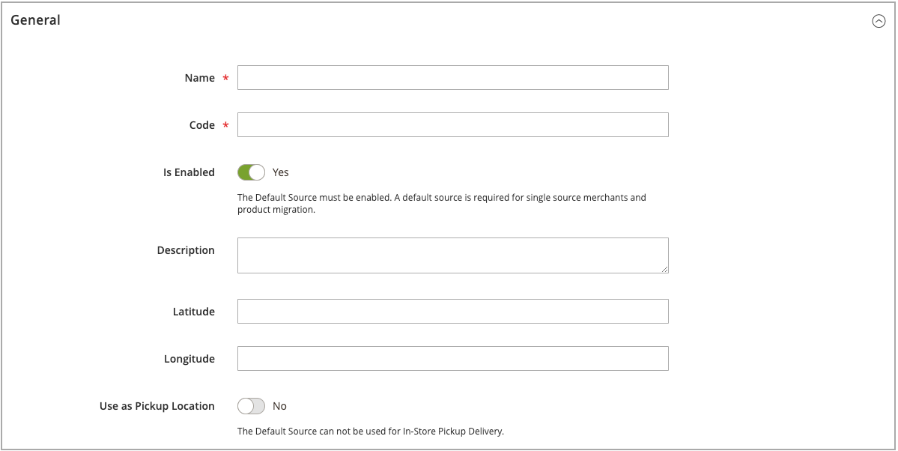

# Een bron toevoegen

Beheer de inventarisatie en bestelling op meerdere locaties met aangepaste bronnen. Maak een bron voor elke locatie, zoals pakhuizen, baksteen- en mortierwinkels, distributiecentra en verlopende bevrachters. Bronnen toewijzen en hoeveelheden per product bijwerken

Als u de standaard-Source bewerkt, kunt u alle configuraties bewerken, behalve de naam en de code. Aanbevolen wordt dat single-source-handelaren informatie toevoegen die overeenkomt met hun locatie.

## Een inventarisbron toevoegen

1. Voor _Admin_ sidebar, ga **[!UICONTROL Stores]** > _[!UICONTROL Inventory]_>**[!UICONTROL Sources]**.

1. Klik op **[!UICONTROL Add New Source]**.

   

1. Breid  de **[!UICONTROL General]** sectie uit en doe het volgende:

   - Voer een unieke **[!UICONTROL Name]** in om de inventarisbron te identificeren.

   - Voer een uniek **[!UICONTROL Code]** in.

     De code ondersteunt hoofdletters en kleine letters, cijfers, streepjes en onderstrepingstekens. De code is een unieke id die wordt gebruikt bij het toewijzen van gegevens aan voorraad en exporteren.

   - Als deze inventarisbron klaar is om te worden gebruikt, stelt u **[!UICONTROL Is Enabled]** in op `Yes` .

   - Voer een korte **[!UICONTROL Description]** in voor deze locatie voor meer informatie.

   - Voer bij **[!UICONTROL Latitude]** en **[!UICONTROL Longitude]** de GPS-coördinaten (Global Positioning System) van de locatie van de faciliteit in.

     Om de coördinaten van GPS met [ de Kaarten van Google ][1] te vinden, ga het adres in de onderzoeksdoos in. Klik met de rechtermuisknop op de markering op de kaart en kies **[!UICONTROL What's here?]** . De GPS-coördinaten worden weergegeven in het detailvak onder het adres van de straat.

     

   - Als deze inventarisbron een ophaallocatie is, stelt u **[!UICONTROL Use as Pickup Location]** in op `Yes` .

     De Source Standaard kan niet worden gebruikt als ophaallocatie voor ophaalopdrachten in een winkel.

1. Breid  de **[!UICONTROL Contact Info]** sectie uit en doe het volgende:

   - Voer bij **[!UICONTROL Contact Name]** de volledige naam in van de primaire contactpersoon op de locatie.

   - Voer een **[!UICONTROL Email]** -adres in om contact op te nemen met de locatie.

   - Voer bij **[!UICONTROL Phone]** de gebiedscode en het telefoonnummer in.

   - Voer bij **[!UICONTROL Fax]** de netnummer en het telefoonnummer van de fax in, indien beschikbaar.

     

1. Breid  de **[!UICONTROL Address Data]** sectie uit en doe het volgende:

   - Kies de **[!UICONTROL Country]** .

   - Voer bij **[!UICONTROL State/Province]** de standaardafkorting in voor de staat of provincie.

   - Voer de **[!UICONTROL City]** in.

   - Voer het fysieke **[!UICONTROL Street]** adres in.

   - Voer bij **[!UICONTROL Postcode]** de postcode in.

     ](assets/inventory-source-address.png) Gegevens van 0} Adres de **[!UICONTROL Pickup Location]** sectie uit en verstrekt beschrijvende informatie over de plaats:

   - Voer de **[!UICONTROL Frontend Name]** van de locatie voor het ophalen in.

   - Voer een **[!UICONTROL Frontend Description]** van de locatie voor het ophalen in. In dit tekstvak kunt u winkeluren, de locatie ten opzichte van andere markeringen of andere nuttige informatie weergeven waarmee de klant de juiste locatie voor het ophalen kan selecteren.

     

   Voor meer informatie over hoe te om e-mailberichten te vormen wanneer het gebruiken van een bron als bestelplaats, zie [ E-mail van de Verkoop ](../configuration-reference/sales/sales-emails.md) in de _Gids van de Verwijzing van de Configuratie_.

1. Voer een van de volgende handelingen uit om uw werk op te slaan:

   - Klik op **[!UICONTROL Save & Continue]** om uw werk op te slaan en door te gaan met bewerken.

   - Om uw werk te bewaren en aan de Manage pagina van Bronnen terug te keren, klik de benedenpijl () en kies **[!UICONTROL Save & Close]**.

   - Kies **[!UICONTROL Save & New]** als u uw werk op de huidige bronrecord wilt opslaan en een nieuwe bron wilt invoeren.

## Knopbalk

| Knop | Beschrijving |
|--|--|
| [!UICONTROL Back] | Hiermee gaat u terug naar de pagina Bronnen beheren. |
| [!UICONTROL Reset] | Hiermee herstelt u de waarden van alle velden in het formulier op het moment van de laatste keer opslaan. |
| [!UICONTROL Save & Continue] | Hiermee slaat u alle wijzigingen op en opent u het formulier voor verdere bewerking. Klik op de pijl omlaag voor extra opties: **[!UICONTROL Save & Close]**- Hiermee slaat u wijzigingen op in de huidige record, sluit u het formulier en keert u terug naar de pagina Bronnen beheren. **[!UICONTROL Save & New]** - Hiermee slaat u wijzigingen op, sluit u de huidige record en opent u een nieuw, leeg formulier. |

## Veldomschrijvingen

| Veld | Beschrijving |
|--|--|
| **[!UICONTROL General]** | |
| [!UICONTROL Name] | (Vereist) Een unieke naam die de inventarisbron voor Admin-gebruikers identificeert. |
| [!UICONTROL Code] | (Vereist) Een unieke alfanumerieke code die door het systeem wordt gebruikt om de inventarisbron te identificeren. Voer de code in hoofdletters of kleine letters en/of cijfers in, zonder spaties. Indien nodig kunt u een afbreekstreepje of onderstrepingsteken gebruiken in plaats van een spatie. De code kan na het maken van de bron niet worden bewerkt. Dit is een unieke id die u gebruikt wanneer u bronnen toewijst aan voorraden en productgegevens exporteert en/of importeert. |
| [!UICONTROL Is Enabled] | Hiermee wordt bepaald of de inventarisbron beschikbaar is voor gebruik. Opties: Ja/Nee |
| [!UICONTROL Description] | Een korte beschrijving van de locatie van de inventarisbron. Neem details op die nuttig zijn voor uw Admin-gebruikers. |
| [!UICONTROL Latitude] | Hiermee geeft u de breedtecoördinaat van de inventarisbron voor GPS op. Voer de waarde in als een getal, voorafgegaan door een plusteken of minteken. Het gradensymbool en de letters zijn niet toegestaan. Bijvoorbeeld: Latitude 32.7555 |
| [!UICONTROL Longitude] | Hiermee geeft u de lengtecoördinaat van de inventarisbron voor GPS op. Voer de waarde in als een getal, voorafgegaan door een plusteken of minteken. Het gradensymbool en de letters zijn niet toegestaan. Bijvoorbeeld: `-97.3308` |
| **[!UICONTROL Contact Info]** | |
| [!UICONTROL Contact Name] | De naam van de primaire contactpersoon op de locatie van de inventarisbron. |
| [!UICONTROL Email] | De e-mail van de primaire contactpersoon. |
| [!UICONTROL Phone] | De netnummer en het telefoonnummer van de primaire contactpersoon, in de gewenste indeling. Bijvoorbeeld: `(123) 456-7890` of `123-456-7890` |
| [!UICONTROL Fax] | De netnummer en het faxnummer van de primaire contactpersoon. |
| **[!UICONTROL Address Data]** | |
| [!UICONTROL Country] | (Vereist) Het land waar de inventarisbron zich bevindt. |
| [!UICONTROL State/Province] | De staat of provincie waar de bron van de inventaris zich bevindt. |
| [!UICONTROL City] | De plaats waar de inventarisbron zich bevindt. |
| [!UICONTROL Street] | Het adres van de straat van de inventarisbron. |
| [!UICONTROL Postcode] | (Vereist) De postcode of postcode van de inventarisbron. |
| **[!UICONTROL Pickup Location]** | |
| [!UICONTROL Frontend Name] | De naam van de oppiklocatie voor de bron die in de winkel wordt weergegeven. |
| [!UICONTROL Frontend Description] | De beschrijving van de oppiklocatie voor de bron die in de winkel wordt weergegeven. Het kan gekoppelde afbeeldingen bevatten. |

[1]: https://www.google.com/maps
