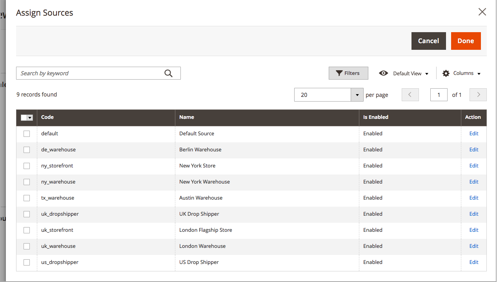

# Bronnen toewijzen per product

Voordat u de hoeveelheden en instellingen kunt wijzigen, moet u [bronnen](sources-manage.md) op de producten.

{{$include /help/_includes/unassign-source.md}}

## Bronnen aan een product toewijzen

1. Op de _Beheerder_ zijbalk, ga naar **[!UICONTROL Catalog]** > **[!UICONTROL Products]**.

1. Een product openen in _Bewerken_ -modus.

1. Uitbreiden  de **[!UICONTROL Sources]** sectie.

   In deze sectie kunt u de bron wijzigen, inventarishoeveelheden bijwerken en meer.

   >[!NOTE]
   >
   >Momenteel ondersteunen alleen eenvoudige, configureerbare, virtuele, downloadbare en gegroepeerde producten meerdere bronnen. Bundelproducten kunnen alleen worden gemaakt en beheerd met de standaardbron en -voorraad.

   {width="600" zoomable="yes"}

1. Klik op **[!UICONTROL Assign Sources]**.

1. Op de _[!UICONTROL Assign Sources]_selecteert u het selectievakje naast elke bron die u voor het product wilt toewijzen.

   {width="600" zoomable="yes"}

1. Klikken **[!UICONTROL Done]** om de bronnen toe te voegen.

1. Voer een van de volgende handelingen uit om op te slaan:

   - Klik op **[!UICONTROL Save]**.
   - Op de _[!UICONTROL Save]_ (), kiest u **[!UICONTROL Save & Close]**.

Nadat u bronnen hebt toegewezen, werkt u de [voorraadhoeveelheid](quantities-assign-per-product.md) voor elke productbron.
