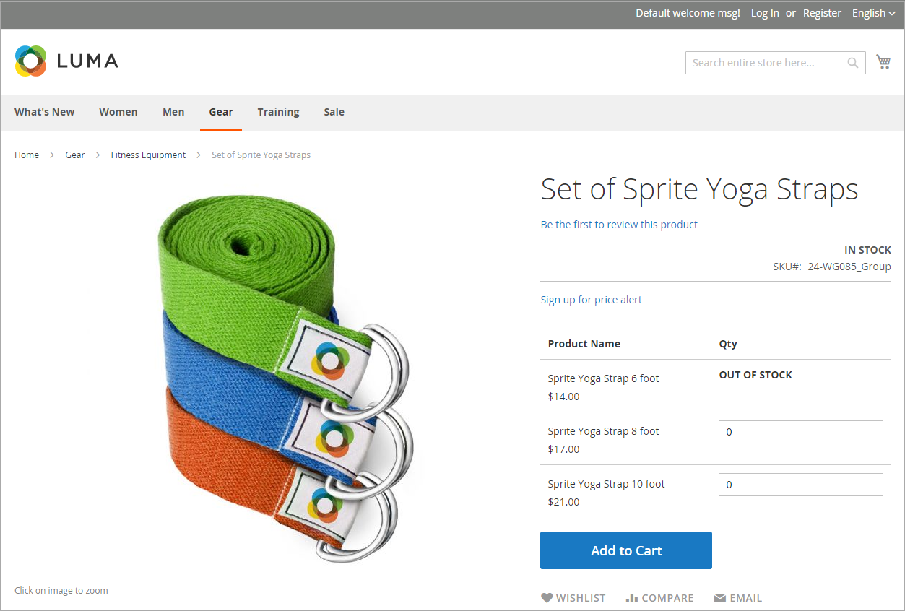

# Voorbeeldberichtscenario&#39;s

U kunt een combinatie van configuratie-instellingen gebruiken om berichten over de beschikbaarheid van voorraden op productpagina&#39;s en in lijsten met producten op cataloguspagina&#39;s te beheren.

{width="600" zoomable="yes"}

## Voorraadberichten voor productpagina&#39;s

Er zijn verschillende soorten berichten beschikbaar voor de productpagina, afhankelijk van de combinatie Manage Stock en de montages van de Beschikbaarheid van de Voorraad.

### Voorbeeld 1: beschikbaarheidsbericht tonen

#### Scenario 1

Deze combinatie van instellingen zorgt ervoor dat het beschikbaarheidsbericht wordt weergegeven op de productpagina, afhankelijk van de beschikbaarheid van de voorraad van elk product.

| Opties voor voorraad | Instelling | Bericht |
|--|--|--|
| [!UICONTROL Display product availability in stock in the frontend] | `Yes` | |
| [!UICONTROL Manage Stock] | `Yes` | |
| [!UICONTROL Stock Availability] | `In Stock` | _[!UICONTROL Availability: In Stock]_ |
| | `Out of Stock` | _[!UICONTROL Availability: Out of Stock]_ |

#### Scenario 2

Wanneer de voorraad niet voor een product wordt beheerd, kan deze combinatie montages worden gebruikt om het beschikbaarheidsbericht op de productpagina te tonen.

| Opties voor voorraad | Instelling | Bericht |
|--|--|--|
| [!UICONTROL Display product availability in stock in the frontend] | `Yes` |  |
| [!UICONTROL Manage Stock] | `No` | _[!UICONTROL Availability: In Stock]_ |

### Voorbeeld 2: beschikbaarheidsbericht verbergen

#### Scenario 1

Deze combinatie van configuratie en productmontages verhindert het beschikbaarheidsbericht op de productpagina te verschijnen.

| Opties voor voorraad | Instelling | Bericht |
|--|--|--|
| [!UICONTROL Display product availability in stock in the frontend] | `No` |  |
| [!UICONTROL Manage Stock] | `Yes` |  |
| [!UICONTROL Stock Availability] | `In Stock` | Geen |
|  | `Out of Stock` | Geen |

#### Scenario 2

Wanneer de voorraad niet voor een product wordt beheerd, verhindert deze combinatie configuratie en productmontages het beschikbaarheidsbericht op de productpagina te verschijnen.

| Opties voor voorraad | Instelling | Bericht |
|--|--|--|
| [!UICONTROL Display product availability in stock in the frontend] | `No` |  |
| [!UICONTROL Manage Stock] | `No` | Geen |

## Berichten uit de voorraad cataloguspagina

De volgende weergaveopties zijn mogelijk voor de lijst met categorieën en zoekresultaten, afhankelijk van de beschikbaarheid van het product en de configuratie-instellingen.

{width="600" zoomable="yes"}

### Voorbeeld 1: Bericht &quot;Uit voorraad&quot; weergeven voor product

Deze combinatie van configuratiemontages omvat uit voorraadproducten in de categorie en onderzoeksresultaten lijsten, en toont een &quot;uit voorraad&quot;bericht.

| Opties voor voorraad | Instelling | Bericht |
|--|--|--|
| [!UICONTROL Display Out of Stock Products] | `Yes` |  |
| [!UICONTROL Display product availability in stock in the frontend] | `Yes` | _[!UICONTROL Out of stock]_ |
| [!UICONTROL Display Out of Stock Products] | `Yes` |  |
| [!UICONTROL Display product availability in stock in the frontend] | `No` | Geen |

### Voorbeeld 2: product weergeven zonder bericht &quot;Uit voorraad&quot;

Deze combinatie van configuratiemontages omvat uit voorraadproducten in de categorie en onderzoeksresultatenlijsten, maar toont geen bericht.

| Opties voor voorraad | Instelling | Bericht |
|--|--|--|
| [!UICONTROL Display Out of Stock Products] | `Yes` | Geen |
| [!UICONTROL Display product availability in stock in the frontend] | `No` |  |

### Voorbeeld 3: Het product verbergen tot het weer in voorraad is

Bij deze configuratie-instelling worden alle producten uit de voorraad van de lijst met categorieën en zoekresultaten weggelaten, totdat ze weer in voorraad zijn.

| Opties voor voorraad | Instelling | Bericht |
|--|--|--|
| [!UICONTROL Display Out of Stock Products] | `No` | Geen |
