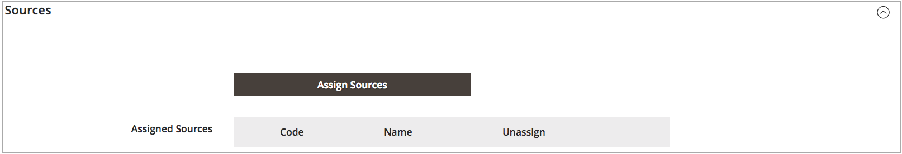

# Een voorraad toevoegen

De voorraden wijzen uw bronnen aan verkoopkanalen (of websites) toe, die een directe verbinding aan verkoopbare hoeveelheden en productinventarissen verstrekken.

Wanneer u een aangepaste voorraad maakt, wijst u websites en bronnen toe. De bronnen kunnen toegelaten en gehandicapte bronnen omvatten. U kunt bijvoorbeeld een opslagplaats aan uw voorraad toevoegen en de locatie voorbereiden voor het beheer van de voorraad en het voltooien van de verzendingen.

Nadat u bronnen hebt toegevoegd, moet u de volgorde voor de bronnen van boven (eerst) tot onder (laatst) als prioriteit instellen. Deze bestelling is van invloed op aanbevelingen tijdens de verzending van orders.

{width="600" zoomable="yes"}

## De voorraad toevoegen

1. Voor _Admin_ sidebar, ga **[!UICONTROL Stores]** > _[!UICONTROL Inventory]_>**[!UICONTROL Stock]**.

1. Klik op **[!UICONTROL Add New Stock]**.

1. Breid  de **[!UICONTROL General]** sectie uit en ga een unieke **[!UICONTROL Name]** in om de nieuwe voorraad te identificeren.

   {width="350" zoomable="yes"}

1. Breid  de **[!UICONTROL Sales Channels]** sectie uit en selecteer **[!UICONTROL Websites]** waar deze voorraad beschikbaar is.

   Houd voor een installatie op meerdere sites de Ctrl-toets (PC) of de Command-toets (Mac) ingedrukt en klik op elke website.

   >[!NOTE]
   >
   >Als u een website of verkoopkanaal selecteert dat aan een andere voorraad is toegewezen, wordt de toewijzing ongedaan gemaakt. Alle Sales Channel die niet aan een aangepaste voorraad zijn toegewezen, worden toegewezen aan de standaardvoorraad.

   {width="350" zoomable="yes"}

1. Breid  de **[!UICONTROL Sources]** sectie uit en doe het volgende voor om het even welke voorraad buiten het gebrek:

   - Klik op **[!UICONTROL Assign Sources]**.

   {width="350" zoomable="yes"}

   - Schakel selectievakjes in voor alle bronnen die u aan de voorraad wilt toewijzen.

   >[!IMPORTANT]
   >
   >Als u dezelfde bron aan meerdere voorraden toewijst, kan dit ertoe leiden dat de producten die aan die bron zijn toegewezen, worden oververkocht.

   - Klik op **[!UICONTROL Done]**.

     De toegevoegde bronnen tonen in Toegewezen Bronnen.

     {width="600" zoomable="yes"} toe

1. Het pictogram van de Soort van het gebruik  om de bronnen in een prioriteit van bovenkant (eerst) aan bodem (laatste) te slepen en te laten vallen.

   De bronvolgorde is belangrijk bij verzendopdrachten.

   {width="600" zoomable="yes"}

1. Voor _[!UICONTROL Save]_() menu, kies **[!UICONTROL Save & Close]**.

## Veldomschrijvingen

| Veld | Beschrijving |
|--|--|
| **[!UICONTROL General]** | |
| [!UICONTROL Name] | Naam van het bestand. Bijvoorbeeld: `UK Stock` , `US Stock` |
| **[!UICONTROL Sales Channels]** | |
| [!UICONTROL Websites] | Bepaalt het [&#x200B; werkingsgebied &#x200B;](../getting-started/websites-stores-views.md#scope-settings) van de voorraad door de voorraad aan specifieke websites als _verkoopkanalen_ toe te wijzen. Selecteer een of meer websites per bestand. Elke website kan slechts aan één bestand worden toegewezen. |
| **[!UICONTROL Sources]** | |
| [!UICONTROL Assign Sources] | Hiermee wijst u inventarisbronnen toe aan dit bestand. Aangepaste bronnen kunnen niet worden toegewezen aan standaardvoorraad. |
| [!UICONTROL Assigned Sources] | Lijst met toegewezen bronnen. De belemmering en laat vallen de bronnen gebruikend  in een prioritaire orde voor ordeverwezenlijking en het verschepen.  **[!UICONTROL Code]**- Unieke code-id voor de bron. **[!UICONTROL Name]** - Geef een naam op voor de bron. **[!UICONTROL Unassign]**- verwijder de toegewezen bron uit de voorraad gebruikend . |
