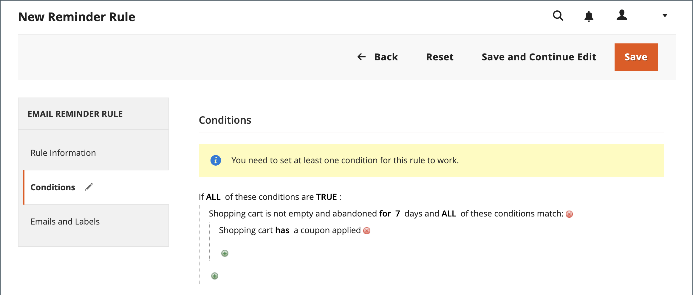

# E-mailherinneringen maken

Voordat u een regel voor e-mailherinneringen instelt, moet u eerst een regel voor de winkelprijs instellen om de aanbieding te definiëren. De voorwaarden van de regel die een e-mailherinnering teweegbrengen kunnen op karteleigenschappen, vorkvermelde eigenschappen, of allebei worden gebaseerd.

>[!NOTE]
>
>E-mailherinneringen kunnen een regel voor winkelprijzen promoten met of zonder coupon. Een kaartprijsregel die een automatisch gegenereerde coupon definieert, genereert een willekeurige couponcode voor elke klant.

1. Op de _Beheerder_ zijbalk, ga naar **[!UICONTROL Marketing]** > _[!UICONTROL Communications]_>**[!UICONTROL Email Reminder Rules]**.

1. Klik in de rechterbovenhoek op **[!UICONTROL Add New Rule]**.

1. Voltooi de _[!UICONTROL Rule Information]_, als volgt:

   {width="700" zoomable="yes"}

   - Voer een **[!UICONTROL Rule Name]** om de regel intern te identificeren.

   - Voer een korte beschrijving in **[!UICONTROL Description]** van de regel.

   - Als u de optie **[!UICONTROL Cart Price Rule]** als je wilt weten dat deze herinnering reclame moet maken, klik je op **[!UICONTROL Select Rule…]** en selecteert u de regel.

     {width="600" zoomable="yes"}

   - Als u wilt dat de regel onmiddellijk van kracht wordt, stelt u **[!UICONTROL Status]** tot `Active`.

   - Als u een datumbereik wilt instellen waarop de regel actief moet zijn, voert u de optie **[!UICONTROL From]** en **[!UICONTROL To]** datums.

     U kunt ook de datum kiezen in de kalender (  ).

   - Als u de herinnering meerdere keren wilt verzenden, voert u het aantal dagen voor de volgende e-mailexplosie in het dialoogvenster **[!UICONTROL Repeat Schedule]** veld.

1. Kies in het deelvenster aan de linkerkant de optie **[!UICONTROL Conditions]**.

   Voor de regel moet ten minste één voorwaarde worden gedefinieerd. Het proces is vergelijkbaar met het bouwen van een [regel catalogusprijs.](price-rules-catalog.md)

   {width="600" zoomable="yes"}

   Klikken _Toevoegen_ ( ) om de lijst met opties weer te geven en kies vervolgens een van de volgende voorwaarden:

   - Gewenste lijst
   - Winkelwagentje

   >[!NOTE]
   >
   >Als een klant meer dan één geëvenaard karretje, verlanglijst, of combinatie van beide heeft, wordt de e-mailherinnering slechts eenmaal geactiveerd voor die klant. Als u dezelfde e-mailherinnering opnieuw wilt activeren, gebruikt u de optie _[!UICONTROL Repeat Schedule]_om het aantal dagen tussen e-mails in te stellen.

   Voltooi de voorwaarde om het scenario te beschrijven dat de e-mailherinnering teweegbrengt.

   {width="600" zoomable="yes"}

1. Kies in het deelvenster aan de linkerkant de optie **[!UICONTROL Emails and Labels]**.

   {width="600" zoomable="yes"}

1. In de **[!UICONTROL Email Templates]** in, kiest u de e-mailsjabloon die u voor elke website wilt gebruiken en slaat u de weergave in uw [opslaghiërarchie](../getting-started/websites-stores-views.md).

   Als u de herinnering niet per e-mail wilt verzenden aan klanten van een winkelweergave, laat u de waarde `Not Selected`.

1. In de _Standaardtitels en -beschrijving_ Ga als volgt te werk:

   - Voer de **[!UICONTROL Rule Title for All Store Views]**.

     >[!NOTE]
     >
     >Deze waarde kan in e-mailmalplaatjes door worden opgenomen te gebruiken `promotion_name` variabele.

   - Voer de **[!UICONTROL Rule Description for All Store Views]**.

     {width="500" zoomable="yes"}

   - In de _[!UICONTROL Titles and Descriptions Per Store View]_in, voert u de **[!UICONTROL Rule Title]**en **[!UICONTROL Description]**voor de_ Standaardwinkelweergave _. Voer voor meerdere winkelweergaven de juiste titel en beschrijving voor elke weergave in.

     >[!NOTE]
     >
     >De beschrijving kan in e-mailmalplaatjes worden opgenomen door de bevordering_beschrijvingsvariabele te gebruiken.

     {width="500" zoomable="yes"}

1. Klik op **[!UICONTROL Save]**.

## Trigingvoorwaarden

| Bron | Trigger |
|--- |--- |
| [!UICONTROL Wish List] | [!UICONTROL Conditions Combination] [!UICONTROL Sharing] [!UICONTROL Number of Items] [!UICONTROL Items Sub selection] |
| [!UICONTROL Shopping Cart] | [!UICONTROL Conditions Combination] [!UICONTROL Coupon Code] [!UICONTROL Cart Line Items] [!UICONTROL Items Quantity] [!UICONTROL Virtual Only] [!UICONTROL Total Amount] [!UICONTROL Items Subselection] |

{style="table-layout:auto"}

## Veldomschrijvingen

| Veld | Beschrijving |
|--- |--- |
| [!UICONTROL Rule Name] | De naam van de geautomatiseerde herinneringsregel identificeert intern de regel. |
| [!UICONTROL Description] | Een beschrijving van de regel voor interne verwijzing. |
| [!UICONTROL Shopping Cart Price Rule] | De winkelwagentregel die aan deze e-mailherinnering is gekoppeld. E-mails met herinneringen kunnen een winkelprijregel met of zonder coupon promoten. Als een winkelwagenprijsregel een automatisch gegenereerde coupon bevat, genereert de herinneringsregel een willekeurige, unieke couponcode voor elke klant. |
| [!UICONTROL Assigned to Website] | De websites die op basis van deze regel automatische e-mail met herinneringen ontvangen. |
| [!UICONTROL Status] | Hiermee activeert u de regel. Als status inactief is, worden alle andere instellingen genegeerd en wordt de regel niet geactiveerd. Opties: `Active` / `Inactive` |
| [!UICONTROL From Date] | De begindatum voor deze regel voor automatische herinnering. Als geen datum wordt gespecificeerd, wordt de regel onmiddellijk actief. |
| [!UICONTROL To Date] | De einddatum voor deze automatische herinneringsregel. Als geen datum wordt gespecificeerd, wordt de regel voor onbepaalde tijd actief. |
| [!UICONTROL Repeat Schedule] | Het aantal dagen voordat de regel wordt geactiveerd en het e-mailbericht voor de herinnering wordt opnieuw verzonden, mits aan de voorwaarden is voldaan. Als u de regel meerdere keren wilt activeren, voert u het aantal dagen voor de volgende e-mailexplosie in, gescheiden door een komma. Voer bijvoorbeeld `7` om de regel zeven dagen later opnieuw in werking te stellen; ga binnen `7,14` om de regel in werking te laten treden binnen zeven dagen, en opnieuw 14 dagen later. |
| [!UICONTROL Email Templates] | Bepaalt de e-mailsjabloon die voor elke winkelweergave moet worden gebruikt. |
| [!UICONTROL Rule Title for All Store Views] | Bepaalt de titel van de regel voor elke archiefmening. |
| [!UICONTROL Rule Description for All Store Views] | Bepaalt de beschrijving van de regel voor elke archiefmening. |

{style="table-layout:auto"}
