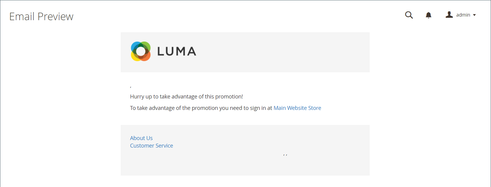

# E-mailherinneringen

{{ee-feature}}

Het doel van een e-mailherinnering is om mensen die je winkel hebben bezocht aan te moedigen om gebruik te maken van een speciale actie en een aankoop te doen. E-mailherinneringen kunnen automatisch naar klanten worden verzonden wanneer aan een bepaalde set voorwaarden wordt voldaan. U kunt bijvoorbeeld een herinnering sturen aan klanten die iets aan hun winkelwagentje of wenslijst hebben toegevoegd, maar nog geen aankoop hebben gedaan. U kunt e-mailherinneringen gebruiken om klanten aan te moedigen terug te keren naar uw winkel en een [couponcode](price-rules-cart-coupon.md) als stimulans. Couponcodes kunnen automatisch worden gegenereerd voor elke batch met e-mailherinneringen, zodat u de opties kunt bepalen die aan elke batch zijn gekoppeld.

E-mailherinneringen kunnen worden geactiveerd nadat een bepaald aantal dagen is verstreken sinds een winkelwagentje is verlaten of voor een andere voorwaarde die u wilt definiëren. Veelvoorkomende voorwaarden zijn de totale waarde van het winkelwagentje, de hoeveelheid, de artikelen in het winkelwagentje, enzovoort.

>[!NOTE]
>
>Als een klant meer dan één geëvenaard karretje, verlanglijst, of combinatie van beide heeft, wordt de e-mailherinnering slechts eenmaal geactiveerd voor die klant. Als u dezelfde e-mailherinnering opnieuw wilt activeren, gebruikt u de optie _[!UICONTROL Repeat Schedule]_om het aantal dagen tussen e-mails in te stellen.

{width="700" zoomable="yes"}

## E-mailherinneringen configureren

Regels voor e-mailherinneringen kunnen met regelmatige intervallen worden verzonden per minuut, uur of dag. De configuratie bepaalt hoeveel e-mails in een batch worden verzonden, en de opslagidentiteit die als verzender van het bericht wordt weergegeven.

1. Op de _Beheerder_ zijbalk, ga naar **[!UICONTROL Stores]** > _[!UICONTROL Settings]_>**[!UICONTROL Configuration]**.

1. Vouw in het linkerdeelvenster uit **[!UICONTROL Customers]** en kiest u **[!UICONTROL Promotions]**.

1. Uitbreiden  de **[!UICONTROL Automated Email Reminder Rules]** en voer de volgende handelingen uit:

   {width="600" zoomable="yes"}

   - Set **[!UICONTROL Enable Reminder Emails]** tot `Yes`.

   - Als u wilt bepalen hoe vaak controles moeten worden uitgevoerd voor nieuwe klanten die in aanmerking komen voor automatische e-mailherinneringen, stelt u **[!UICONTROL Frequency]** op een van de volgende wijzen:

      - `Minute Intervals`
      - `Hourly`
      - `Daily`

   - Stel de juiste **[!UICONTROL Interval]** op basis van de _[!UICONTROL Frequency]_instellen.

   - Set **[!UICONTROL Start Time]** naar het uur, de minuut en de seconde wordt de e-mail verzonden, gebaseerd op een klok van 24 uur.

   - Als u het aantal e-mailberichten dat in een batch kan worden verzonden wilt beperken, voert u het nummer in het dialoogvenster **[!UICONTROL Maximum Emails per One Run]** veld.

   - Als u wilt voorkomen dat er herhaaldelijk pogingen worden gedaan om een mislukte e-mail te verzenden, voert u het maximumaantal pogingen in het dialoogvenster **[!UICONTROL Email Send Failure Threshold]** veld.

   - Set **[!UICONTROL Reminder Email Sender]** aan de [contactpersoon voor winkel](../getting-started/store-details.md#store-email-addresses) die wordt weergegeven als de afzender van de herinneringse-mail.

   Voor een gedetailleerde lijst van deze opties, zie [Regels voor automatische e-mailherinnering](../configuration-reference/customers/promotions.md#automated-email-reminder-rules) in de _Configuratieverwijzing_.

1. Klik op **[!UICONTROL Save Config]**.

## E-mailherinneringssjablonen

De standaardsjabloon voor e-mailherinneringen kan worden aangepast en er kunnen aanvullende sjablonen worden gemaakt voor verschillende aanbiedingen. E-mailherinneringen bevatten een selectie van specifieke variabelen die in het bericht kunnen worden opgenomen. De informatie in deze variabelen wordt bepaald door de e-mailherinneringsregel die u hebt ingesteld en door de regel voor de winkelwagenprijs die aan de coupon is gekoppeld. Met de knop Variabele invoegen kunt u de opmaakcode met de variabele in de sjabloon invoegen. Zie voor meer informatie [E-mail](../systems/email-templates.md).

{width="600" zoomable="yes"}

### Een sjabloon voor een e-mailherinnering aanpassen

1. Op de _Beheerder_ zijbalk, ga naar **[!UICONTROL Marketing]** > _[!UICONTROL Communications]_>**[!UICONTROL Email Templates]**.

1. Klik op **[!UICONTROL Add New Template]**.

1. In de **[!UICONTROL Template]** lijst onder `Magento_Reminder`, kiest u de **[!UICONTROL Promotion Notification/Reminder]** sjabloon.

1. Klik op **[!UICONTROL Load Template]**.

Volg de standaard [instructies](../systems/email-template-custom.md) om de sjabloon aan te passen.

### E-mailherinneringsvariabelen

#### Couponcode

```
{{var coupon.getCode()|escape}}
```

#### Gebruikslimiet voor coupon

```
{{var coupon.usage_limit|escape}}
```

#### Coupongebruik per klant

```
{{var coupon.usage_per_customer|escape}}
```

#### URL van klantenaccount

```
{{var this.getUrl($store,'customer/account/',[_nosid:1])}}
```

#### Naam klant

```
{{var customer_data.name|escape}}
```

#### E-mailvoettekstsjabloon

```
{{template config_path="design/email/footer_template"}}
```

#### E-mailkopsjabloon

```
{{template config_path="design/email/header_template"}}
```

#### Afbeelding van e-maillogo Alt

```
{{var logo_alt}}
```

#### URL afbeelding e-maillogo

```
{{var logo_url}}
```

#### Beschrijving van aanbieding

```
{{var promotion_description|escape|nl2br}}
```

#### Aanbiedingsnaam

```
{{var promotion_name|escape}}
```

#### Winkelnaam

```
{{var store.frontend_name}}
```

#### URL van winkel

```
{{store url=""}}
```
