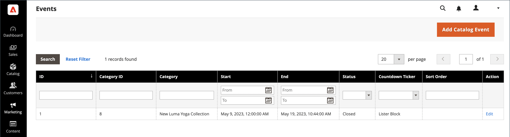
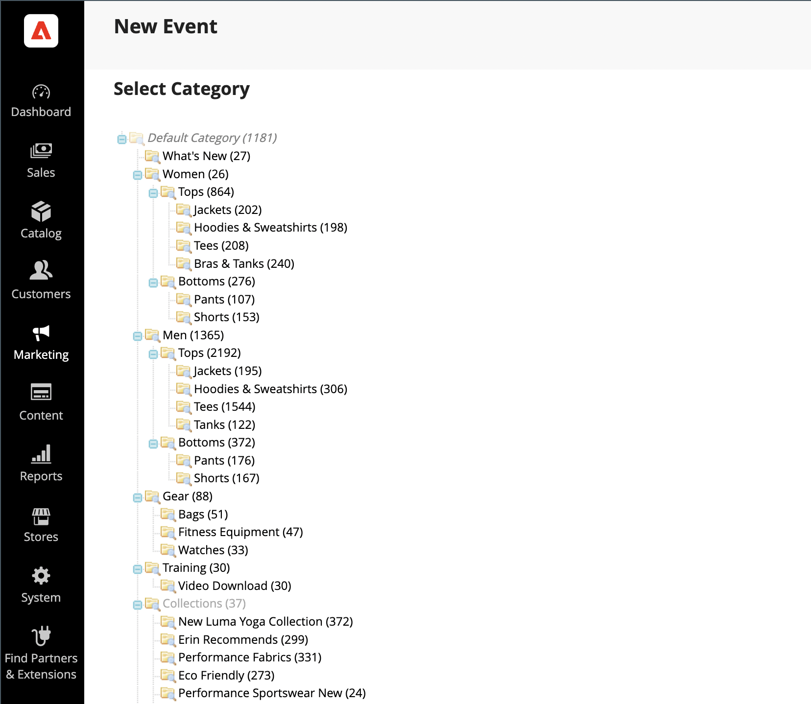

# Gebeurtenissen maken en bijwerken

{{ee-feature}}

Elke gebeurtenis is gekoppeld aan een categorie uit uw catalogus en er kan slechts één gebeurtenis aan een bepaalde categorie tegelijk worden gekoppeld. Om een lijst van aanstaande gebeurtenissen in uw opslag te tonen, moet u ook opstelling a [&#128279;](../content-design/widget-event-carousel.md) widget van de Gebeurtenissen Carousel van de Catalogus van de Gebeurtenissen van de a  &lbrace;.

{width="700" zoomable="yes"}

## Een gebeurtenis maken

1. Voor _Admin_ sidebar, ga **[!UICONTROL Marketing]** > _[!UICONTROL Private Sales]_>**[!UICONTROL Events]**.

1. Klik in de rechterbovenhoek op **[!UICONTROL Add Catalog Event]** .

1. Kies in de categoriestructuur de categorie die u aan de gebeurtenis wilt koppelen.

   Omdat elke categorie slechts één gebeurtenis tegelijk kan hebben, worden alle categorieën die al een gebeurtenis hebben, uitgeschakeld.

   {width="500" zoomable="yes"}

1. Definieer de **[!UICONTROL Catalog Event Information]** :

   {width="700" zoomable="yes"}

   - Voor **[!UICONTROL Start Date]** van de gebeurtenis, gebruik de kalender () om de datum te kiezen. Gebruik de schuifregelaars **[!UICONTROL Hour]** en **[!UICONTROL Minute]** om de tijd in te stellen waarop de gebeurtenis begint.

   - Voor **[!UICONTROL End Date]** van de gebeurtenis, gebruik de kalender () om de datum te kiezen. Gebruik de schuifregelaars **[!UICONTROL Hour]** en **[!UICONTROL Minute]** om de tijd in te stellen waarop de gebeurtenis eindigt.

   - Als u een **[!UICONTROL Image]** voor de gebeurteniswidget wilt uploaden, klikt u op **[!UICONTROL Choose File]** en selecteert u het afbeeldingsbestand in de map.

   - Voer in het veld **[!UICONTROL Sort Order]** een getal in om de volgorde aan te geven waarin deze gebeurtenis wordt weergegeven in een lijst met andere gebeurtenissen.

   - Schakel het selectievakje van elk paginatype in waar u de aftellerticker wilt weergeven.

1. Klik op **[!UICONTROL Save]** als de bewerking is voltooid.

## Gebeurtenissen bijwerken

Gebeurtenissen kunnen worden bewerkt vanaf de pagina Gebeurtenissen of vanuit de categorie die aan de gebeurtenis is gekoppeld. Wanneer een categorie een bijbehorende gebeurtenis heeft, wordt de knop Gebeurtenis bewerken in de rechterbovenhoek weergegeven.

### Methode 1: Een gebeurtenis bewerken vanaf de pagina Gebeurtenissen

1. Voor _Admin_ sidebar, ga **[!UICONTROL Marketing]** > _[!UICONTROL Private Sales]_>**[!UICONTROL Events]**.

1. Zoek de gebeurtenis in de lijst en open deze in de bewerkingsmodus.

1. Breng de benodigde wijzigingen aan in de gebeurtenis.

1. Klik op **[!UICONTROL Save]** als de bewerking is voltooid.

### Methode 2: Een gebeurtenis uit een categorie bewerken

1. Voor _Admin_ sidebar, ga **[!UICONTROL Catalog]** > **[!UICONTROL Categories]**.

1. Selecteer in de categoriestructuur aan de linkerkant de categorie die aan de gebeurtenis is gekoppeld.

1. In de hoger-juiste hoek, klik **[!UICONTROL Edit Even]t**.

1. Breng de benodigde wijzigingen aan in de gebeurtenis.

1. Klik op **[!UICONTROL Save]** als de bewerking is voltooid.

## Een gebeurtenis verwijderen

1. Voor _Admin_ sidebar, ga **[!UICONTROL Marketing]** > _[!UICONTROL Private Sales]_>**[!UICONTROL Events]**.

1. Zoek de gebeurtenis in de lijst en open deze in de bewerkingsmodus.

1. Klik in de rechterbovenhoek op **[!UICONTROL Delete]** .

1. Klik op **[!UICONTROL OK]** om de handeling te bevestigen.

## Veldomschrijvingen

| Veld | [ Reikwijdte ](../getting-started/websites-stores-views.md#scope-settings) | Beschrijving |
|--- |--- |--- |
| [!UICONTROL Category] | Algemeen | Wanneer u een gebeurtenis maakt, wordt dit veld weer gekoppeld aan de categoriestructuur. Wanneer u een gebeurtenis bewerkt, wordt deze gekoppeld aan de categoriepagina die betrekking heeft op de gebeurtenis. |
| [!UICONTROL Start Date] | Algemeen | De begindatum en -tijd van de gebeurtenis in `MMDDYYYY HH;MM` -indeling. Klik op het kalenderpictogram om de datum te selecteren. |
| [!DNL End Date] | Algemeen | De einddatum en -tijd van de gebeurtenis in `MMDDYYYY HH;MM` -indeling. Klik op het kalenderpictogram om de datum te selecteren. |
| [!UICONTROL Image] | Winkelweergave | Uploadt een beeld dat in de [ Van de Gebeurtenissen Carrousel van de Catalogus widget ](../content-design/widget-event-carousel.md) verschijnt. |
| [!UICONTROL Sort Order] | Algemeen | Hiermee bepaalt u de volgorde waarin deze gebeurtenis wordt weergegeven wanneer deze met andere gebeurtenissen wordt weergegeven. |
| [!UICONTROL Display Countdown Ticker On] | Algemeen | Geeft de tellerticker weer in de koptekst van elke opgegeven pagina. Opties: `Category Page` / `Product Page` |
| [!UICONTROL Status] | Algemeen | Geeft de status van de gebeurtenis aan op basis van de begindatum en het bereik van einddatum. Status is een alleen-lezen waarde. Waarden: `Open` / `Closed` / `Upcoming` |

{style="table-layout:auto"}

## Knopbalk

| Knop | Beschrijving |
|--- |--- |
| **[!UICONTROL Back]** | Hiermee gaat u terug naar de pagina Gebeurtenissen zonder de nieuwe gebeurtenis of wijzigingen in een bestaande gebeurtenis op te slaan. |
| **[!UICONTROL Delete]** | Verwijdert de gebeurtenis. |
| **[!UICONTROL Reset]** | Wist de vorm van niet-opgeslagen wijzigingen en herstelt de oorspronkelijke gebeurtenisinformatie. |
| **[!UICONTROL Save and Continue Edit]** | Hiermee slaat u alle wijzigingen op en opent u het formulier in de bewerkingsmodus. |
| **[!UICONTROL Save]** | Hiermee slaat u wijzigingen op, sluit u het formulier en keert u terug naar de pagina Gebeurtenissen. |

{style="table-layout:auto"}
