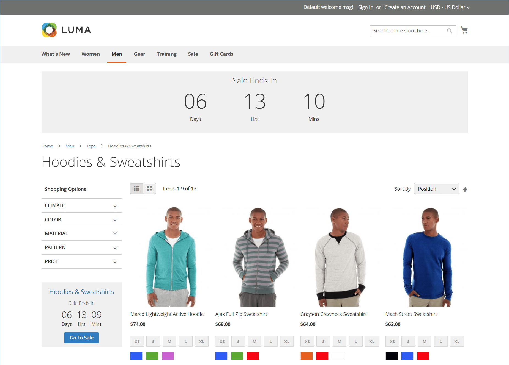

# Privéverkoop en evenementen

{{ee-feature}}

De privé verkoop en andere catalogusgebeurtenissen zijn een uitstekende manier om uw bestaande klantenbasis te gebruiken om bozz en nieuwe lood te produceren, of overtollige voorraad te offloaden. U kunt verkopen in beperkte tijd tot stand brengen, verkoop beperken aan specifieke leden, of een stand-alone privé verkooppagina tot stand brengen. U kunt ook uitnodigingen en gebeurtenisdetails definiëren. Verhoog de merkloyaliteit en produceer een buzz door uw beste klanten de behandeling van VIP te geven. Bied exclusieve toegang aan de verkoop of de particuliere verkoop van leden om merkloyaliteit te verhogen. U kunt deze verkopen ook gebruiken om overtollige goederen te liquideren. Klantengroepen zijn handig voor het instellen van alleen deze typen leden en de verkoop van VIP.

{width="700" zoomable="yes"}

## Gebeurtenisbeheercomponenten

- **Categorieën** - Elke gebeurtenis wordt geassocieerd met a [ categorie ](../catalog/category-create.md) van uw catalogus.

- **Gebeurtenissen** - de verkoop van de Gebeurtenis is is gebaseerd op een beginnende en beëindigende datum. U kunt a [ teller tikker ](#event-ticker) gebruiken om de resterende tijd te tonen.

- **de gebeurteniscarrousel van de Catalogus** - wanneer de [ Widget van de Gebeurtenis van de Catalogus ](../content-design/widget-event-carousel.md) in de configuratie wordt toegelaten, kan het op opslagpagina&#39;s als lijst van open en aanstaande gebeurtenissen worden geplaatst, die door einddatum worden gesorteerd. Als twee of meer gebeurtenissen dezelfde einddatum hebben, worden de gebeurtenissen gesorteerd op basis van de volgorde die in de configuratie is opgegeven.

- **[!UICONTROL Websites]** - de toestemmingen van de Categorie zijn hoofdzakelijk gebaseerd op [ klantengroepen ](../customers/customer-groups.md).

- {de toestemmingen van de Categorie van 0} **- [ toestemmingen van de Categorie ](../catalog/category-permissions.md) geeft u volledige controle over de specifieke activiteiten die in een bepaalde categorie kunnen plaatsvinden.**

- **de beperkingen van de Toegang** - verhindert openbare [ toegang ](event-configure.md#restrict-access) aan de plaats door aan een het landen pagina, login pagina, of registratiepagina opnieuw te richten.

- **Uitnodigingen** - De e-mailberichten worden verzonden met een verbinding om een rekening in de opslag tot stand te brengen. U kunt de capaciteit beperken om een rekening tot slechts die tot stand te brengen die een [ uitnodiging ](invitations.md) ontvangen.

- **Privé verkooprapporten** - de [ Privé Rapporten van de Verkoop ](../getting-started/private-sales-reports.md) verstrekken informatie over verzonden uitnodigingen, uitgenodigde klanten, en omzettingen.

## Gebeurtenismarkering

Het blok van de tikker toont een tellerteken voor open gebeurtenissen, met de begin en einddatum voor aanstaande gebeurtenissen. Als een gebeurtenis is gesloten, geeft de ticker de begin- en einddatum weer.

{width="700" zoomable="yes"}

Als de markering voor de categoriepagina is ingeschakeld voor een gebeurtenis, wordt het tickerblok boven aan de categorielijst weergegeven. Als de tikker van de productpagina wordt toegelaten, verschijnt het tikkerblok ook bij de bovenkant van de productpagina van om het even welk product dat met de categorie wordt geassocieerd.

De gebeurtenismarkering kan worden toegelaten wanneer u [ creërend gebeurtenissen ](event-create.md).

{width="700" zoomable="yes"}
