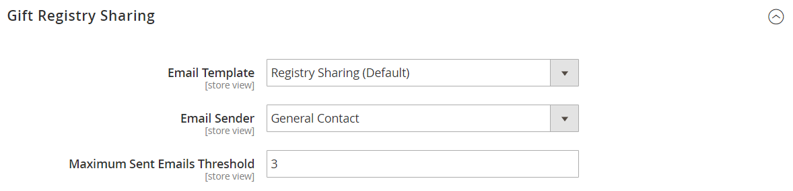

# Cadeauregisters configureren

{{ee-feature}}

Voordat u cadeauregisters aan uw klanten kunt aanbieden, moet u cadeauregisters inschakelen en de bijbehorende e-mailmeldingen configureren. Adobe Commerce verzendt de volgende e-mailmeldingen als reactie op gebeurtenissen in de workflow voor het register van cadeaus.

- Wanneer een nieuw cadeauregister wordt gemaakt, wordt een e-mail naar de eigenaar verzonden met een koppeling naar het register die kan worden gedeeld.
- Optioneel kan de winkel een melding met een koppeling naar het cadeauregister verzenden aan vrienden en familie van de eigenaar van het cadeauregister.
- De eigenaar wordt op de hoogte gesteld wanneer items worden aangeschaft in het cadeauregister, maar geeft de koper niet aan.

Adobe Commerce heeft vooraf gedefinieerde sjablonen voor elk van deze e-mailberichten die voor uw merk kunnen worden aangepast.

## Stap 1. Cadeauregisters inschakelen

1. Op de _Beheerder_ zijbalk, ga naar **[!UICONTROL Stores]** > _[!UICONTROL Settings]_>**[!UICONTROL Configuration]**.

1. Vouw in het linkerdeelvenster uit **[!UICONTROL Customers]** en kiest u **[!UICONTROL Gift Registry]**

1. Uitbreiden  de **[!UICONTROL General Options]** en voer de volgende handelingen uit:

   {width="600" zoomable="yes"}

   - De Register van het Cadeautje wordt toegelaten door gebrek. Indien nodig, instellen **[!UICONTROL Enable Gift Registry]** tot `Yes`.

   - Voor **[!UICONTROL Maximum Registrants]**, voert u het maximumaantal personen in dat kan worden uitgenodigd om deel te nemen aan een cadeauregistergebeurtenis.

## Stap 2. E-mailmeldingen configureren

1. Uitbreiden  de **[!UICONTROL Owner Notification]** en voer de volgende handelingen uit:

   {width="600" zoomable="yes"}

   - Kies de optie **[!UICONTROL Email Template]** die de eigenaars van cadeauregisters op de hoogte brengt wanneer hun registers worden gemaakt.

   - Kies de optie [contactpersoon voor winkel](../getting-started/store-details.md#store-email-addresses) die als **[!UICONTROL Email Sender]** van het bericht.

1. Uitbreiden  de **[!UICONTROL Gift Registry Sharing]** en voer de volgende handelingen uit:

   {width="600" zoomable="yes"}

   - Kies de optie **[!UICONTROL Email Template]** die de ontvangers van het cadeauregister op de hoogte brengt wanneer een register met hen wordt gedeeld.

   - Kies de opslaglocatie die wordt weergegeven als de **[!UICONTROL Email Sender]** van het bericht.

   - Voor **[!UICONTROL Maximum Sent Emails Threshold]**, voert u het maximum aantal e-mailberichten in dat tegelijk kan worden verzonden.

1. Uitbreiden  de **[!UICONTROL Gift Registry Update]** en voer de volgende handelingen uit:

   {width="600" zoomable="yes"}

   - Kies de optie **[!UICONTROL Email Template]** dat de eigenaars van cadeauregisters op de hoogte brengt van wijzigingen in het register.

   - Kies de opslaglocatie die wordt weergegeven als de **[!UICONTROL Email Sender]** van het bericht.

1. Klik op **[!UICONTROL Save Config]**.

1. Werk de cache bij wanneer hierom wordt gevraagd.

   Nadat het geheime voorgeheugen wordt verfrist, verschijnt de Registratie van het Cadeautje in het menu van Opslag onder Andere Montages en wordt beschikbaar in klantenrekeningen.
