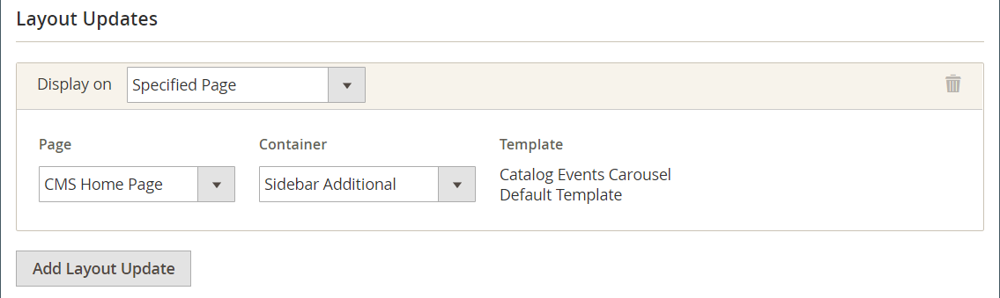

# Zoeken naar cadeauregister toevoegen

{{ee-feature}}

Het [&#x200B; hulpmiddel van Widget &#x200B;](../content-design/widgets.md) kan worden gebruikt om een vakje van de het onderzoeksdoos van de cadeauregistratie overal in uw opslag te plaatsen. U kunt de zoekopties opgeven die beschikbaar moeten zijn voor klanten, zoals naam, e-mailadres en registratie-id voor cadeautjes. Wanneer de klant op de knop Zoeken klikt, worden de resultaten weergegeven op de pagina Zoeken in register van cadeau. Als de zoekopdracht geen resultaten oplevert, kan de klant het opnieuw proberen met andere parameters.

{width="700" zoomable="yes"}

## Zoek in een cadeauregister configureren

1. Voor _Admin_ sidebar, ga **[!UICONTROL Content]** > _[!UICONTROL Elements]_>**[!UICONTROL Widgets]**.

1. Klik in de rechterbovenhoek op **[!UICONTROL Add Widget]** .

1. Kies het tabblad **[!UICONTROL Settings]** en voer de volgende handelingen uit:

   - Stel **[!UICONTROL Type]** in op `Gift Registry Search` .

   - Stel **[!UICONTROL Design Theme]** in op het thema dat door de winkel wordt gebruikt.

   - Klik op **[!UICONTROL Continue]**.

   {width="700" zoomable="yes"}

1. Ga als volgt te werk in de sectie _[!UICONTROL Storefront Properties]_:

   - Voer een **[!UICONTROL Widget Title]** in voor interne referentie.

   - Stel **[!UICONTROL Assign to Store Views]** in op de winkelweergaven waarop de zoekfunctie voor het register van cadeautjes beschikbaar moet zijn.

   - Stel **[!UICONTROL Sort Order]** in om de volgorde te bepalen waarin het zoekblok voor de Cadeauregistratie wordt weergegeven wanneer er andere blokken zijn toegewezen aan dezelfde locatie op de pagina.

   {width="700" zoomable="yes"}

1. Klik in de sectie **[!UICONTROL Layout Updates]** op **[!UICONTROL Add Layout Update]** .

1. Ga als volgt te werk om te bepalen waar de zoekopdracht in de Cadeauregistratie in de winkel wordt weergegeven:

   - Stel **[!UICONTROL Display On]** in op de pagina&#39;s in de winkel waar u het zoekblok voor de cadeauregistratie wilt weergeven.

   - Kies, indien van toepassing, de **[!UICONTROL Categories]** waar u deze wilt weergeven.

   - Stel **[!UICONTROL Container]** in op de locatie op de pagina waar u het zoekblok voor de cadeauregistratie wilt plaatsen.

   {width="500" zoomable="yes"}

1. Kies **[!UICONTROL Widget Options]** in het linkerdeelvenster.

1. Om te bepalen hoe bezoekers van uw site kunnen zoeken naar cadeauregisters, selecteert u zoveel van de volgende opties als van toepassing zijn:

   - [!UICONTROL All Forms]
   - [!UICONTROL Registrant Name Search]
   - [!UICONTROL Registrant Email Search]
   - [!UICONTROL Gift Registry ID Search]

   {width="700" zoomable="yes"}

1. Klik op **[!UICONTROL Save]** als de bewerking is voltooid.

1. Als u wordt gevraagd om de paginacache te vernieuwen, klikt u op de koppeling in het bericht boven aan de werkruimte en volgt u de instructies.

## Veldomschrijvingen

### [!UICONTROL Settings]

| Veld | Beschrijving |
|--- |--- |
| [!UICONTROL Type] | Identificeert `Gift Registry Search` als het type widget. |
| [!UICONTROL Design Theme] | Het thema dat wordt gebruikt door de winkel waar het Onderzoek van de Registratie van het Cadeautje moet verschijnen. |

{style="table-layout:auto"}

### [!UICONTROL Storefront Properties]

| Veld | Beschrijving |
|--- |--- |
| [!UICONTROL Widget Title] | Een naam voor interne referentie. |
| [!UICONTROL Assign to Store Views] | Identificeert de opslagmeningen waar het Onderzoek van de Registratie van het Cadeautje beschikbaar moet zijn. |
| [!UICONTROL Sort Order] | Hiermee wordt de volgorde aangegeven waarin het zoekblok voor de Cadeauregistratie wordt weergegeven als er andere blokken zijn toegewezen die op dezelfde locatie moeten worden weergegeven. |

{style="table-layout:auto"}

### [!UICONTROL Layout Updates]

| Veld | Beschrijving |
|--- |--- |
| [!UICONTROL Display On] | Geef de specifieke pagina&#39;s op of de typen pagina&#39;s waarop het zoekblok voor de cadeauregistratie wordt weergegeven. |
| [!UICONTROL Categories] | Geeft, indien van toepassing, de categoriepagina&#39;s aan waarop de zoekopdracht in het cadeauregister wordt weergegeven. |
| [!UICONTROL Container] | Geeft het paginalay-outblok aan waar de zoekfunctie voor de Cadeauregistratie is geplaatst. De opties variëren per sjabloon en thema. |

{style="table-layout:auto"}

### [!UICONTROL Widget Options]

| Veld | Beschrijving |
|--- |--- |
| [!UICONTROL Quick Search Form Types] | Bepaalt de soorten onderzoeken die met het Onderzoek van de Registratie van het Cadeautje kunnen worden uitgevoerd. Opties: `All Forms` / `Registrant Name Search` /` Registrant Email Search` / `Gift Registry ID Search` |

{style="table-layout:auto"}
