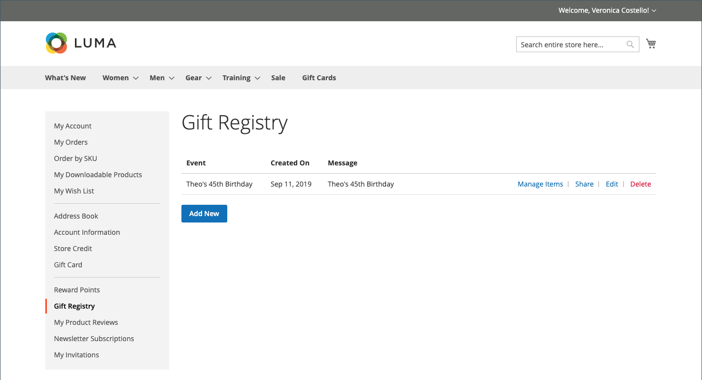
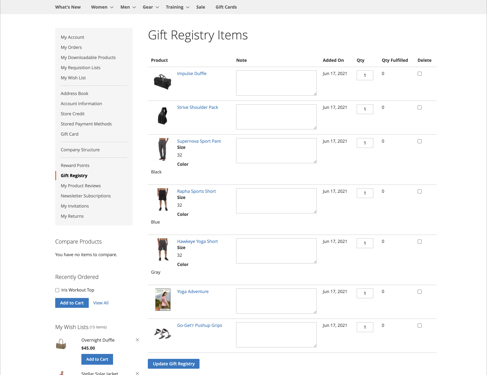

# Ervaring met opslag van cadeauregisters

{{ee-feature}}

Het [&#128279;](gift-registries.md) gedeelte van de Registratie van het Cadeautje  &lbrace;van de klantenrekening maakt een lijst van de huidige geschenkregisters van de klant en de bijbehorende gebeurtenis. Klanten kunnen de huidige registers beheren en nieuwe registers toevoegen.

{width="700" zoomable="yes"}

## Cadeauregistergegevens

Klanten kunnen cadeauregisters maken en beheren op basis van hun accounts. Alle informatie die aan elk type van registratie wordt geassocieerd is beschikbaar bij de rekening van de klant.

{width="700" zoomable="yes"}

| Sectie | Beschrijving |
|--- |--- |
| [!UICONTROL General Information] | Deze sectie bevat doorgaans de naam van de gebeurtenis, een bericht of beschrijving van de gebeurtenis, privacy-instellingen en de status van de gebeurtenis. |
| [!UICONTROL Event Information] | Deze sectie bevat de locatie en datum van de gebeurtenis. Voor een bruiloft, zou het ook het aantal gasten kunnen omvatten elke persoon kan brengen. |
| [!UICONTROL Gift Registry Details] | Dit kan aanvullende informatie omvatten die specifiek is voor de gelegenheid. |
| [!UICONTROL Registrant Information] | Deze sectie bevat de naam en contactgegevens van elke persoon die in kennis moet worden gesteld van het register. Voor een trouwregister kan het veld Rol worden opgenomen om de registrant te koppelen als een vriend van de bruid of groep. |
| [!UICONTROL Shipping Address] | Deze sectie toont waar de giften moeten worden verzonden, en omvat de informatie een drager het pakket moet leveren. |

{style="table-layout:auto"}

>[!NOTE]
>
>Wanneer een cadeauregister inactief is, werken zoeken en koppelen niet voor het register. Als het register later opnieuw wordt geactiveerd, blijven koppelingen verbroken.

## Een cadeauregister maken

1. De klant selecteert **[!UICONTROL Gift Registry]** in het dashboard van de account.

1. Voor de _pagina van de Registratie van het Cadeautje_, klikt **[!UICONTROL Add New]**.

1. Hiermee kiest u een **[!UICONTROL Gift Registry Type]** , zoals:

   - Geboortedatum

   - Babyregister

   - Bruiloft

1. Klik op **[!UICONTROL Next]** .

1. Voer de vereiste informatie in en klik op **[!UICONTROL Save]** .

## Een product toevoegen aan een register

1. De klant opent het product dat zij aan de gebeurtenis van de cadeauregistratie willen toevoegen.

1. Klik op **[!UICONTROL Add to Cart]** .

1. Klik op **[!UICONTROL View and Edit Cart]** op de minikaart.

1. Op de pagina Winkelwagentje selecteert u de gewenste gebeurtenis en klikt/tikt u op **[!UICONTROL Add All To Gift Registry]** .

   Items worden toegevoegd aan het cadeauregister van de geselecteerde gebeurtenis.

## Een cadeauregister delen

1. Vanaf het dashboard van de account gaat de klant naar **[!UICONTROL Gift Registry]** .

1. Vindt de registratiegebeurtenis die zij willen beheren en klikken **[!UICONTROL Share]**.

1. Voer de vereiste informatie in en klik op **[!UICONTROL Share Gift Registry]** .

## Een cadeauregister bewerken

1. Vanaf het dashboard van de account gaat de klant naar **[!UICONTROL Gift Registry]** .

1. Vindt de registratiegebeurtenis die zij willen beheren en klikken **[!UICONTROL Edit]**.

1. Hiermee wijzigt u zo nodig opties.

1. Hiermee bewerkt u de vereiste opties en klikt u op **[!UICONTROL Save]** .

## Registeritems voor cadeaus beheren

1. Vanaf het dashboard van de account gaat de klant naar **[!UICONTROL Gift Registry]** .

   {width="700" zoomable="yes"}

1. Vindt de registratiegebeurtenis, selecteert de punten die zij willen beheren, en klikt **[!DNL Manage Items]**.

1. Hiermee wijzigt u de vereiste opties, zoals **[!UICONTROL Note]** en **[!UICONTROL Qty]** .

1. Indien nodig, verwijdert u een item uit het cadeauregister door het selectievakje in te schakelen en op **[!UICONTROL Delete]** te klikken.

1. Klik **[!UICONTROL Update Gift Registry]** om de veranderingen te bewaren.

## Een cadeauregister verwijderen

1. Vanaf het dashboard van de account gaat de klant naar **[!UICONTROL Gift Registry]** .

1. Vindt de registratiegebeurtenis die zij willen beheren en klikken **[!UICONTROL Delete]**.

1. Klik op **[!UICONTROL OK]** om te bevestigen.
