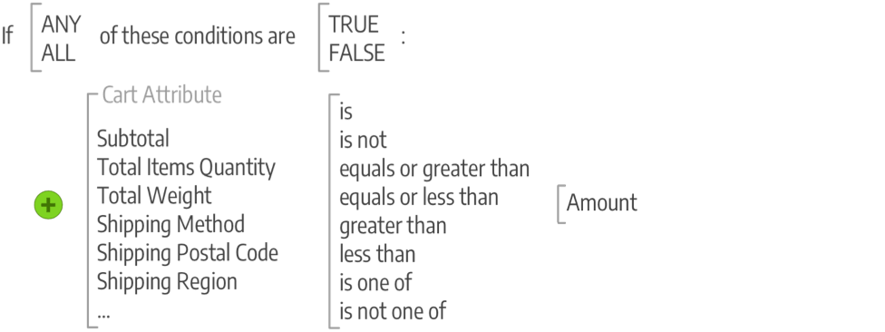

# Inleiding tot verkoop en promoties in Commerce

Houd promoties in de hand en creëer mogelijkheden voor betrokkenheid van klanten, en verander kopers in kopers. Beheer klantenrelaties door activiteiten na de aankoop te ondersteunen en klanten die terugkeren speciale kortingen te bieden. Leer beste praktijken en technieken om uw initiatieven te steunen SEO.

## Merchandising

_Merchandising_ is een term die in de detailhandel wordt gebruikt om de kunst en wetenschap van de ontwikkeling van vloerplannen en de presentatie van producten te beschrijven. Je zou kunnen denken aan de [categorienavigatie](../catalog/navigation-top.md) als het vloerplan van de winkel, en de dynamische presentatie van producten als de voorwaarden die u kunt toepassen op de vermelding van producten in de winkel. Ook, kunt u programma&#39;s uitvoeren die meer productverkoop drijven:

- [Visual Merchandiser](visual-merchandiser.md) - Een reeks geavanceerde gereedschappen waarmee u producten kunt positioneren en voorwaarden kunt toepassen die bepalen welke producten in de categorielijst worden weergegeven.

- [Cadeauregisters](gift-registries.md) - Geef uw klanten de mogelijkheid om cadeauregisters te maken voor speciale gelegenheden en hun vrienden en familie uit te nodigen om hun geschenken aan te schaffen bij het register van geschenken.

- [Beloning en loyaliteit](rewards-loyalty.md) - Gebruik een puntensysteem om unieke programma&#39;s uit te voeren die klantenbetrokkenheid drijven en klantenloyaliteit bevorderen. U kunt punten toewijzen voor een groot aantal transactie- en klantactiviteiten en de punttoewijzing, het saldo en de vervaldatum bepalen.

- [Privéverkoop en evenementen](events-private-sales.md) - Gebruik uw bestaande klantenbestand om zoemgeluid en nieuwe leads te genereren of om overtollige voorraad te offloaden via particuliere verkoop en andere catalogusgebeurtenissen.

>[!TIP]
>
>Als je meer wilt weten over Product Recommendations en hoe ze je het inzicht en de controle kunnen geven dat je nodig hebt om de beste ervaring voor je kopers te creëren, zie dan de [Recommendations-gebruikershandleiding voor product](https://experienceleague.adobe.com/docs/commerce-merchant-services/product-recommendations/guide-overview.html).

## Aanbiedingen

In Adobe Commerce gebruikt u de promotiefuncties om productrelaties in te stellen en prijsregels te gebruiken om kortingen te activeren op basis van verschillende voorwaarden. U kunt prijsregels gebruiken om klantenprikkels aan te bieden, zoals:

- Uw beste klanten een coupon sturen voor een korting op een bepaald product
- Gratis verzending aanbieden voor aankopen boven een bepaald bedrag
- Een speciale aanbieding voor een bepaalde periode plannen

Een regel is een verzameling voorwaarden (een of meer) die prijswijzigingen op producten toepassen wanneer aan een of alle voorwaarden wordt voldaan. Elke regel kan veelvoudige voorwaarden hebben, die wanneer allen of om het even welke (één of meerdere, maar niet allen) verklaringen waar of vals zijn.

### Voorwaarden

Voorwaarden zijn instructies die de lijst met producten en situaties voor het toepassen van de regel verfijnen. De kenmerken en opties voor voorwaarden verschillen per type beschikbare regels. Wanneer deze wordt uitgevoerd, wordt de actie voltooid, zoals kortingen, &#39;buy-one-get-one&#39; (BOGO) en andere opties. Regels kunnen zo eenvoudig of zo ingewikkeld zijn als nodig is om aan uw bedrijfsbehoeften, seizoenskortingen en promoties en kansen voor meerdere jaren te voldoen. U kunt bijvoorbeeld een paar extra opties voor de feestdagen toevoegen terwijl u het hele jaar door gratis verzending biedt wanneer de winkelwagentjes een hoog subtotaal hebben.

>[!NOTE]
>
>Als u een voorwaarde wilt bepalen die op een specifiek productattribuut wordt gebaseerd, **[!UICONTROL Use for Promo Rule Conditions]** moet worden ingesteld op `Yes` voor het kenmerk in uw [Eigenschappen van Storefront](../catalog/attribute-product-create.md).

### Prijsregels

Voor [catalogusprijsregels](price-rules-catalog.md)bouwt u voorwaarden op basis van [kenmerksets](../catalog/attribute-sets.md) in uw catalogus, vergelijkingsfuncties en geselecteerde kenmerken. U kunt voorwaarden zoals zinnen maken door een paar instructies te selecteren. U kunt bijvoorbeeld twee prijsregels maken om kortingen toe te passen op kinderkleding en kleding voor mannen en vrouwen op basis van de categorie.

{width="500"}

[Winkelprijsregel](price-rules-cart.md) de voorwaarden kunnen op om het even welke categorie worden gebaseerd die een kind van de opslag is [basis](../catalog/category-root.md). Prijsregels worden vooraf opgesteld en worden in werking gesteld wanneer aan de gestelde voorwaarden wordt voldaan. Deze regels gebruiken kenmerken, waaronder combinaties van productkenmerken zoals het afstemmen van een SKU in het winkelwagentje met productkenmerken. Deze regels kunnen ook de voorwaarden van de productselectie, voorwaardencombinaties voor gecompliceerde regels, en kartattributen zoals subtotal gebruiken.

{width="500"}

## Communicatie en SEO

Mastering [SEO (Search Engine Optimization)](seo-overview.md) is van cruciaal belang om potentiële kopers te betrekken. Leer over het optimaliseren van zoekprogramma&#39;s en het verfijnen van de inhoud en presentatie van uw site om de manier te verbeteren waarop de pagina&#39;s door zoekprogramma&#39;s worden geïndexeerd.

Één van de taken om te voltooien alvorens uw opslag te lanceren is de e-mailmalplaatjes te herzien die voor alle mededelingen worden gebruikt die van uw opslag worden verzonden om ervoor te zorgen dat zij op uw merk wijzen. Maar u zou dit een stap verder moeten nemen door andere mededelingen te ontwikkelen die uw merk en producten aan bestaande klanten bevorderen. U kunt de inhoud aanpassen met variabelen en opmaakcodes.

>[!NOTE]
>
>In de Adobe Commerce- en Magento Open Source-releases 2.4.0 tot en met 2.4.3 is de uitbreiding opgenomen die door de digitale leverancier is ontwikkeld en die wordt gebruikt om te integreren met de dotdigital Engagement Cloud. Vanaf de versie 2.4.4 wordt deze extensie niet meer gebundeld met de kernrelease en moet deze worden geïnstalleerd en bijgewerkt vanaf de Commerce Marketplace. De Marketplace biedt ook toegang tot de huidige documentatie die wordt geleverd door de ontwikkelaar van de extensie.
>  
>Als u de gebundelde toegelaten en gevormde uitbreiding hebt, moet u uw composer.json- dossier als deel van het 2.4.4 verbeteringsproces bijwerken en om extensie updates te beheren die door:gaan. Zie [Upgrademodules](https://experienceleague.adobe.com/docs/commerce-operations/upgrade-guide/modules/upgrade.html) in de _Upgradehandleiding_ voor meer informatie .

- [Nieuwsbrieven](newsletters.md) - Maak nieuwsbrieven, beheer uw lijst met abonnees, ontwikkel inhoud en aandrijf verkeer naar uw winkel.

- [RSS feeds](social-rss.md#rss-feeds) - Gebruik RSS-feeds om uw productinformatie te publiceren naar winkelverzamelplaatsen en deze zelfs op te nemen in uw nieuwsbrieven. Klanten kunnen zich abonneren op uw RSS-feeds om meer te leren over nieuwe producten en promoties.

- [Sociale netwerken](social-rss.md#social-networks) - Integreer uw winkel met uw sociale netwerken door een Marketplace-extensie te installeren of door een plug-in toe te voegen aan uw inhoudspagina&#39;s.

## Google-marketingtools

Uw winkelconfiguratie is geïntegreerd met de volgende Google-tools om uw inhoud te optimaliseren, uw verkeer te analyseren en uw catalogus aan te sluiten op winkelaggregators en marketinglocaties.

>[!NOTE]
>
>Vanaf de release 2.4.5 wordt de integratie met Google-services bijgewerkt om het gebruik van de GTag-API&#39;s te ondersteunen. GTag is een verenigd mechanisme voor integratie met de functionaliteit van Google voor webpagina&#39;s en ondersteunt de nieuwste mogelijkheden en mogelijkheden voor het bijhouden en beheren van inhoud via Google Services. Zie de klasse [Documentatie voor ontwikkelaars van Googles Analytics](https://developers.google.com/analytics/devguides/collection/gtagjs).

- [Googles Analytics](google-analytics.md) - Gebruik Google Universal Analytics om extra aangepaste afmetingen en maatstaven voor tracering te definiëren, met ondersteuning voor offline- en mobiele-toepassingsinteracties en toegang tot lopende updates.

- [Google-contentexperimenten](google-content-experiments.md) - Een A/B-test instellen voor producten, categorieën of inhoudspagina&#39;s met behulp van Inhoud van Googles Analytics

- [Google-tagbeheer](google-tag-manager.md) -  (Alleen Adobe Commerce) Gebruik Google Tag Manager om de vele tags te beheren die betrekking hebben op marketingcampagnegebeurtenissen.

- [Google AdWords](google-adwords.md) - Maak een Google AdWords-campagne en volg omzettingen voor je winkel.
