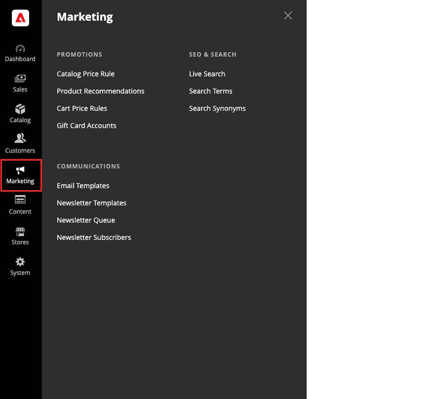

# [!UICONTROL Marketing] menu

Het menu [!UICONTROL Marketing] biedt toegangsfuncties voor het beheer van promoties, communicatie, SEO en door de gebruiker gegenereerde inhoud.

>[!BEGINTABS]

>[!TAB  Adobe Commerce ]

[!BADGE &#x200B; slechts PaaS &#x200B;]{type=Informative url="https://experienceleague.adobe.com/nl/docs/commerce/user-guides/product-solutions" tooltip="Is alleen van toepassing op Adobe Commerce op Cloud-projecten (door Adobe beheerde PaaS-infrastructuur) en op projecten in het veld."}

{width="600" zoomable="yes"}

>[!TAB  Adobe Commerce as a Cloud Service ]

[!BADGE &#x200B; slechts SaaS &#x200B;]{type=Positive url="https://experienceleague.adobe.com/nl/docs/commerce/user-guides/product-solutions" tooltip="Alleen van toepassing op Adobe Commerce as a Cloud Service- en Adobe Commerce Optimizer-projecten (door Adobe beheerde SaaS-infrastructuur)."}

{width="600" zoomable="yes"}

>[!ENDTABS]

## Het menu [!UICONTROL Marketing] weergeven

Voor _Admin_ sidebar, klik **[!UICONTROL Marketing]**.

## Hoofdsecties

### [!UICONTROL Promotions]

Creeer [&#x200B; catalogus &#x200B;](price-rules-catalog.md) en [&#x200B; kart &#x200B;](price-rules-cart.md) prijsregels die kortingen teweegbrengen die op diverse voorwaarden worden gebaseerd. Opstelling [&#x200B; bevorderingen &#x200B;](introduction.md#promotions) die in actie komen wanneer de vereiste voorwaarden worden voldaan aan.

 (Adobe Commerce slechts) creeert [&#x200B; verwante productregels &#x200B;](product-related-rules.md) en beheert [&#x200B; giftekaartrekeningen &#x200B;](../stores-purchase/product-gift-card-accounts.md).

### [!UICONTROL Private Sales]

[!BADGE &#x200B; slechts PaaS &#x200B;]{type=Informative url="https://experienceleague.adobe.com/nl/docs/commerce/user-guides/product-solutions" tooltip="Is alleen van toepassing op Adobe Commerce op Cloud-projecten (door Adobe beheerde PaaS-infrastructuur) en op projecten in het veld."}

{{ee-feature}}

De privé verkoop en andere catalogusgebeurtenissen zijn een grote manier om uw bestaande klantenbasis te gebruiken om gezoem en nieuwe lood met exclusieve toegang voor slechts leden, of door uitnodiging te produceren.

### [!UICONTROL Communications]

Pas alle meldingen aan die vanuit uw winkel worden verzonden. Creeer [&#x200B; nieuwsbrieven &#x200B;](newsletters.md) en publiceer [&#x200B; RSS &#x200B;](social-rss.md#rss-feeds) voer.

 (Adobe Commerce slechts) opstelling regels die [&#x200B; e-mailherinneringen &#x200B;](email-reminder-rules.md) naar klanten verzenden wanneer de voorwaarden worden voldaan aan.

### [!UICONTROL SEO & Search]

Analyseer [&#x200B; onderzoekstermijnen &#x200B;](../catalog/search-terms.md) en [&#x200B; synoniemen &#x200B;](../catalog/search-terms.md#search-synonyms) om klanten te helpen producten in de opslag vinden, [&#x200B; meta- gegevens &#x200B;](meta-data.md) beheren, en a [&#x200B; plaatskaart &#x200B;](sitemap-xml.md) creëren. Het gebruik [&#x200B; richt &#x200B;](url-rewrite.md) opnieuw om veranderingen te beheren URL en gebroken verbindingen te vermijden.

### [!UICONTROL User Content]

[!BADGE &#x200B; slechts PaaS &#x200B;]{type=Informative url="https://experienceleague.adobe.com/nl/docs/commerce/user-guides/product-solutions" tooltip="Is alleen van toepassing op Adobe Commerce op Cloud-projecten (door Adobe beheerde PaaS-infrastructuur) en op projecten in het veld."}

Neem user-generated [&#x200B; productrevisies &#x200B;](product-reviews.md) op om een gevoel van gemeenschap tot stand te brengen en verkoop te verhogen.
