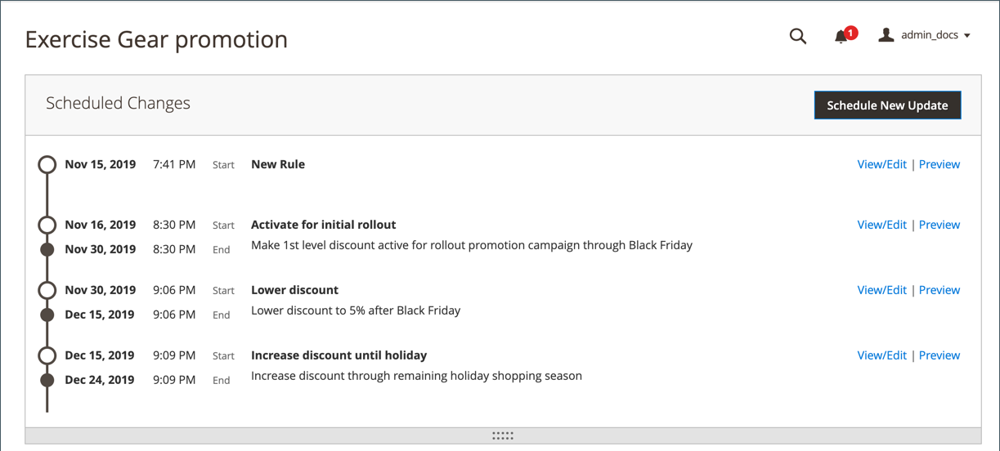
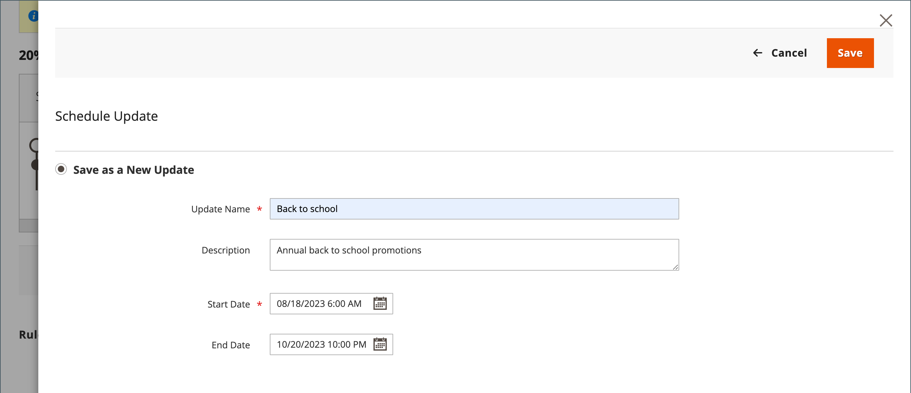

# Geplande wijzigingen voor prijsregels voor catalogi

{{ee-feature}}

Het vak Geplande wijzigingen wordt boven aan de pagina weergegeven wanneer een nieuwe prijsregel wordt opgeslagen of bijgewerkt. De catalogusprijsregels kunnen volgens schema worden toegepast als onderdeel van een campagne en worden gegroepeerd met andere inhoudswijzigingen. U kunt een campagne maken op basis van geplande wijzigingen in een prijsregel, of de wijzigingen toepassen op een bestaande campagne.

>[!NOTE]
>
>De [!UICONTROL From] en [!UICONTROL To] gebieden zijn verwijderd in  Adobe Commerce en kunnen niet direct op de regel van de catalogusprijs worden gewijzigd. U moet een geplande update maken voor deze activeringen.

>[!NOTE]
>
>Alle geplande updates worden achtereenvolgens toegepast. Dit betekent dat elke entiteit slechts één geplande update op één tijdstip kan hebben. Elke geplande update wordt toegepast op alle winkelweergaven binnen de opgegeven tijdsperiode. Dientengevolge, kan een entiteit verschillende geplande updates voor verschillende opslagmeningen niet tezelfdertijd hebben. Alle waarden van entiteitattributen binnen alle opslagmeningen, die niet door de huidige geplande update worden beïnvloed, worden genomen van de standaardwaarden, en niet van de vorige geplande update.

Als er meerdere prijsregels in dezelfde campagne worden uitgevoerd, bepaalt de instelling bij Prioriteit van de prijsregel welke regel voorrang krijgt. Meer leren, zie [ Inhoud het Opvoeren ](../content-design/content-staging.md).

>[!IMPORTANT]
>
>Als een campagne met een prijsregel in eerste instantie zonder einddatum wordt gemaakt, kan de campagne later niet worden bewerkt om een einddatum op te nemen. U wordt aangeraden een einddatum toe te voegen wanneer u de campagne maakt of een dubbele versie van de bestaande campagne te maken en de einddatum desgewenst aan het duplicaat toe te voegen.

{width="600" zoomable="yes"}

## Een update van een regel voor catalogusprijzen plannen

1. Op _Admin_ sidebar, ga **[!UICONTROL Marketing]** > _[!UICONTROL Promotions]_>**de Regel van de Prijs van de Catalogus**.

1. Open de regel in de bewerkingsmodus.

1. Klik in het vak **[!UICONTROL Scheduled Changes]** boven aan de pagina op **[!UICONTROL Schedule New Update]** .

1. Selecteer de optie **[!UICONTROL Save as a New Update]** en voer de volgende handelingen uit:

   - Voer bij **[!UICONTROL Update Name]** een naam in voor de update van de regel.

   - Voer een korte **[!UICONTROL Description]** in van de update, inclusief de manier waarop of waarom deze is toegepast.

   - Gebruik het _pictogram van de Kalender_ () om **[!DNL Start Date]** en **[!UICONTROL End Date]** voor de geplande verandering te kiezen om in werking te zijn. Laat de einddatum leeg als u een wijziging met een open einde wilt maken.

   {width="600" zoomable="yes"}

   >[!NOTE]
   >
   >De begin- en einddatum/tijd worden bepaald door de standaarddatum/tijd en tijdzone van het deelvenster Beheer, niet door de tijdzone van een bepaalde website. Neem de tijdzone van de website in overweging om de begin- en eindtijd correct te bepalen. Maak aparte regels voor websites in verschillende tijdzones die op specifieke lokale tijdstippen moeten starten en/of stoppen.

1. Blader omlaag naar de sectie **[!UICONTROL Rule Information]** en wijzig de regel naar wens.

   U kunt veranderingen voor om het even welke regelparameter, met inbegrip van de websites (werkingsgebied)/klantengroepen voor de regel, voorwaarden van de regel, en acties plannen die door de regel worden toegepast. Voor meer informatie, zie [ Creërend een Regel van de Prijs van de Catalogus ](price-rules-catalog-create.md).

   >[!NOTE]
   >
   >Als u de parameters voor regelinformatie wijzigt, moet u controleren of de eigenschap _[!UICONTROL Status]_op de juiste wijze is ingesteld. Als u de verandering in een actief toegepaste regel wilt resulteren, zou de status `Active` moeten zijn.

1. Klik op **[!UICONTROL Save]** als de bewerking is voltooid.

   De geplande wijziging wordt boven aan de pagina weergegeven met de begin- en einddatum van de campagne.

## Een geplande regelwijziging bewerken

1. Klik in het vak **[!UICONTROL Scheduled Changes]** boven aan de pagina op **[!UICONTROL View/Edit]** .

1. Breng de benodigde wijzigingen aan in de geplande update.

   >[!NOTE]
   >
   >Als een campagne met meer dan één regel van de catalogusprijs verbonden is, kan de campagne slechts van het [ Inhoud Staging Dashboard ](../content-design/content-staging-dashboard.md) worden uitgegeven.

1. Klik op **[!UICONTROL Save]**.

## Voorvertoning van geplande regelwijziging

1. Klik in het vak **[!UICONTROL Scheduled Changes]** boven aan de pagina op **[!UICONTROL Preview]** .

   In Voorvertoning wordt een nieuw browsertabblad geopend waarin uw winkelpatroon wordt geladen met de toegepaste geplande wijziging. Navigeer naar een product dat door de wijziging wordt beïnvloed.

   {width="600" zoomable="yes"}

1. Klik in de linkerbovenhoek van het voorvertoningsvenster op **[!UICONTROL Calendar]** .

   De kalenderdetails tonen andere campagnes die voor de zelfde dag gepland zijn. Elke record in de lijst is een afzonderlijke regelupdate.

   {width="600" zoomable="yes"}

1. Aan voorproef een verschillende dag of een tijd, klik het **[!UICONTROL Date & Time]** pictogram van de Kalender  en doe het volgende:

   - Kies een andere datum en/of tijd.

   - Klik op **[!UICONTROL Preview]**.

1. Als u wilt terugkeren naar de kalender, klikt u op **[!UICONTROL Calendar]** in de koptekst van de pagina Voorbeeld.

   Vanaf hier kunt u het volgende doen:

   **deel een Verbinding aan de Voorproef**

   Als u een koppeling naar de voorvertoning van de winkel wilt delen met uw collega&#39;s, klikt u op **[!UICONTROL Share]** . Kopieer de koppeling naar het klembord en plak deze in de hoofdtekst van een e-mailbericht.

   >[!NOTE]
   >
   >Een Admin-gebruikersaccount is vereist om een gedeelde voorvertoning te kunnen zien. Als uw [ rol toegang ](../systems/permissions-user-roles.md) heeft om een Admin gebruikersrekening tot stand te brengen, moet u de rekening voor een nieuwe gebruiker tot stand brengen alvorens te delen.

   **verander het Toepassingsgebied van de Voorproef**

   Als u de geplande wijzigingen voor de verschillende winkelweergaven wilt zien, klikt u op **[!UICONTROL Scope]** in de koptekst van de pagina Voorvertoning. Kies de website-, opslag- of opslagweergave die u wilt voorvertonen.

1. Ga zo nodig terug naar de kalender en klik op **[!UICONTROL View/Edit]** in de kolom _[!UICONTROL Action]_om een andere geplande update te openen.
