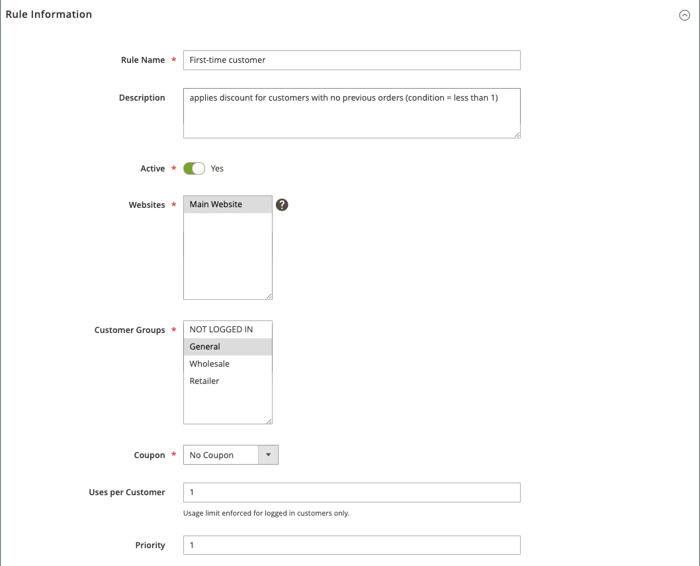

# Voorbeeld van de prijsregel voor winkelwagentjes - korting met eerste aankoop

{{ee-feature}}

Met de prijsregels voor winkelwagentjes kan automatisch een korting worden aangeboden aan klanten bij hun eerste aankoop, zonder dat er een coupon nodig is.

Om een korting aan te bieden die aan eerste klanten wordt gericht, kunt u:

- Creeer een klantensegment dat als _kopers zonder orden_ wordt bepaald, en dan
- Creeer een de prijsregel van de winkelwagentje die het nieuwe klantensegment richt.

>[!NOTE]
>
>Zorg ervoor dat de functie voor klantsegmenten is ingeschakeld. Verwijs naar [ creeer een klantensegment ](../customers/customer-segment-create.md).

## Stap 1. Een klantsegment maken

1. Voor _Admin_ sidebar, ga **[!UICONTROL Customers]** > **[!UICONTROL Segments]**.

1. Klik in de rechterbovenhoek op **[!UICONTROL Add Segment]** .

1. Definieer de **[!UICONTROL General Properties]** .

   - Ga a **[!UICONTROL Segment Name]** in om het klantensegment te identificeren (Voorbeeld: _Eerste-tijdklant_).

   - Selecteer bij **[!UICONTROL Assigned to Website]** de website waar het klantsegment kan worden gebruikt.

   - Selecteer `Active` bij **[!UICONTROL Status]** .

   - Selecteer `Visitors and Registered Customers` bij **[!UICONTROL Apply to]** .

   - Klik op **[!UICONTROL Save and Continue Edit]** als de bewerking is voltooid.

     Extra opties zijn beschikbaar in het deelvenster aan de linkerkant.

   {width="600" zoomable="yes"}

1. Definieer de **[!UICONTROL Conditions]** .

   Voor dit voorbeeld, richt de voorwaarde klanten voor wie _Totaal Aantal Orden minder is dan 1_ waar is.

   - Kies **[!UICONTROL Conditions]** in het deelvenster aan de linkerkant.

     De standaardvoorwaarde begint, &quot;als ALLE van deze voorwaarden WAAR zijn:&quot;

   - Klik _toevoegen_ ( toe) en selecteer `Number of Orders`.

   - Klik op **[!UICONTROL is]** en selecteer `less than` .

   - Klik op **...** en voer `1` in het veld in.

   - Klik het groene controleteken ( ) om voorwaarde te bewaren die plaatst.

   {width="600" zoomable="yes"}

1. Klik op **[!UICONTROL Save]**.

Het klantsegment wordt gemaakt en weergegeven in het _[!UICONTROL Customer Segments]_-raster.

>[!TIP]
>
>Noteer de segment-id. Met dit ID-nummer kunt u de regel voor de winkelprijs maken.

## Stap 2. De regel voor de winkelprijs maken

1. Voor _Admin_ sidebar, ga **[!UICONTROL Marketing]** > _[!UICONTROL Promotions]_>**[!UICONTROL Cart Price Rule]**.

1. Klik in de rechterbovenhoek op **[!UICONTROL Add New Rule]** .

   De sectie **[!UICONTROL Rule Information]** wordt standaard weergegeven met uitbreidbare secties voor **[!UICONTROL Conditions]** en **[!UICONTROL Conditions]** .

1. Definieer de **[!UICONTROL Rule Information]** .

   - Vul de velden **[!UICONTROL Rule Name]** en **[!UICONTROL Description]** in. Deze velden zijn alleen bedoeld voor uw interne referentie.

   - Selecteer voor **[!UICONTROL Websites]** de website waarop de regel beschikbaar moet zijn.

   - Selecteer voor **[!UICONTROL Customer Groups]** de klantengroep waarop deze regel van toepassing is.

     Als u meerdere groepen wilt selecteren, houdt u Ctrl (PC) of Command (Mac) ingedrukt en klikt u op elke optie.

     >[!NOTE]
     >
     >De opties in deze lijst zijn afhankelijk van de klantgroepen die u maakt en beheert in **[!UICONTROL Customers]** > **[!UICONTROL Customer Groups]** .

   - Selecteer `No Coupon` bij **[!UICONTROL Coupon]** .

   - Voer bij **[!UICONTROL Uses per Customer]** `1` in.

   - Voer voor **[!UICONTROL Priority]** een getal in om de prioriteit van deze regel ten opzichte van andere regels vast te stellen.

     >[!NOTE]
     >
     >De instelling Prioriteit is belangrijk wanneer hetzelfde catalogusproduct voldoet aan de voorwaarden die voor meer dan één prijsregel zijn ingesteld. De regel met de hoogste Prioriteit het plaatsen wordt actief voor de klant. De hoogste prioriteit is 1. In dit voorbeeld betekent het invoeren van `1` dat deze regel wordt toegepast vóór eventuele andere prijsregels. Deze waarde wordt gebruikt door de instelling **[!UICONTROL Discard Subsequent Rules]** in de sectie **[!UICONTROL Action]** .

   - Klik op **[!UICONTROL Save and Continue Edit]** als de bewerking is voltooid.

     Extra opties zijn beschikbaar in het deelvenster aan de linkerkant.

   {width="600" zoomable="yes"}

1. Definieer de **[!UICONTROL Conditions]** .

   - De rol neer en breidt  uit de **[!UICONTROL Conditions]** sectie.

     De standaardregel begint met &quot;Als ALLE van deze voorwaarden WAAR zijn:&quot;.

   - Klik _toevoegen_ ( toe) en selecteer `Customer Segment`.

     Het kwalificatieveld is standaard ingesteld op `matches` .

   - Klik **..** en ga segmentidentiteitskaart van het klantensegment in u wilt richten.

     In dit voorbeeld is de segment-id voor het nieuwe segment dat in Stap 1 wordt gemaakt, `2` .

     >[!NOTE]
     >
     >Als u segmentidentiteitskaart niet kent, klik het kiezerspictogram ( ) om de lijst van het Segment van de Klant te tonen. U kunt de id handmatig invoeren in het veld of het selectievakje voor het gewenste segment inschakelen om het veld automatisch in te vullen.

   - Klik het groene controleteken ( ) om voorwaarde te bewaren die plaatst.

   - Klik op **[!UICONTROL Save and Continue Edit]** als de bewerking is voltooid.

     Deze lijn van de regel is op alle klanten van toepassing die klant segmentidentiteitskaart 2 aanpassen.

   {width="400"}

1. De rol neer en breidt  uit de **[!UICONTROL Conditions]** sectie en bepaalt de acties voor de regel.

   In deze sectie definieert u het type korting en de waarde/het bedrag van de korting die u wilt toepassen op nieuwe klanten. In dit voorbeeld wordt een korting van 10% gedefinieerd voor alle klanten die aan de gedefinieerde voorwaarde voldoen. Voor informatie over andere beschikbare opties, zie [ Creërend een Regel van de Prijs van de Kar ](price-rules-cart-create.md).

   - Selecteer Percentage van korting op de productprijs bij **[!UICONTROL Apply]** .

   - Voer bij **[!UICONTROL Discount Amount]** `10` in.

   - Stel **[!UICONTROL Apply to Shipping Amount]** in op `No` als u deze prijsregel alleen op producthoeveelheden wilt toepassen.

   - Als u wilt voorkomen dat het systeem meerdere prijsregels op hetzelfde product toepast, stelt u **[!UICONTROL Discard Subsequent Rules]** in op `Yes` .

   - Klik op **[!UICONTROL Save]** als de bewerking is voltooid.

   {width="600" zoomable="yes"}

De nieuwe regel is normaal beschikbaar binnen het uur. Test de regel om er zeker van te zijn dat deze werkt zoals u deze hebt gedefinieerd.

## Stap 3: Sla de regel op en test deze

{{new-price-rule}}

1. Wanneer uw regel volledig is, klik **[!UICONTROL Save Rule]**.

1. Test de regel om er zeker van te zijn dat deze correct werkt.
