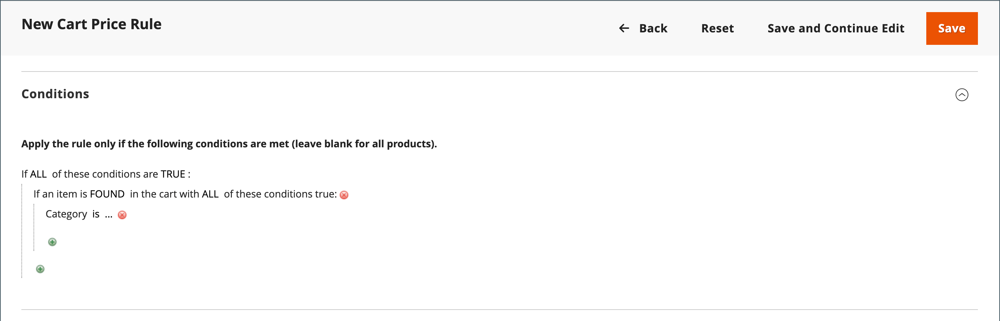

# Voorbeeld van de prijsregel voor winkelwagentjes - korting op de minimumprijs van het product

De prijsregels voor winkelwagentjes kunnen worden gebruikt om een korting op basis van een minimumprijs in het winkelwagentje aan te bieden. In het volgende voorbeeld wordt een korting van 10% toegepast op alle producten in het hele winkelwagentje wanneer ten minste één product met een prijs van meer dan € 30,00 uit een bepaalde categorie aan het winkelwagentje wordt toegevoegd. Het formaat van de korting is als volgt:

X% hele kar korting wanneer ten minste 1 product van de Y-categorie komt en de prijs ervan meer dan $Z dollar bedraagt.

## Stap 1. Een winkelwagentregel maken

Volg de basis [&#x200B; instructies &#x200B;](price-rules-cart.md) om een wortelregel tot stand te brengen.

## Stap 2. De voorwaarden definiëren

1. De rol neer en breidt  uit de **[!UICONTROL Conditions]** sectie.

1. Klik _toevoegen_ ( toe) en kies **[!UICONTROL Product Attribute Combination]**.

   {width="500" zoomable="yes"}

1. Klik _toevoegen_ ( toe) aan het begin van de volgende lijn en in de lijst onder **[!UICONTROL Product Attribute]**, kies **[!UICONTROL Category]**.

   - Klik (**..**) _meer_ verbinding om extra opties te tonen.

     {width="600" zoomable="yes"}

   - Klik het _pictogram van de Kiezer_ () om de beschikbare categorieën te zien. Schakel in de categoriestructuur het selectievakje in van elke categorie die u wilt opnemen. Klik op het controlepictogram om de rubriekselecties te accepteren.

     {width="600" zoomable="yes"}

1. Klik _toevoegen_ ( toe) aan het begin van de volgende lijn en doe het volgende:

   - Kies in de lijst onder **[!UICONTROL Cart Item Attribute]** de optie **[!UICONTROL Price in cart]** .

     {width="500"}

   - Klik **is** en kies `equals or greater than`.

   - Klik op **..** en voer het bedrag in dat de prijs in winkelwagentje moet hebben om aan de voorwaarde te voldoen. Voer bijvoorbeeld `30` in.

     {width="500"}

1. Klik op **[!UICONTROL Save and Continue Edit]**.

## Stap 3. De acties definiëren

1. Breid  de **[!UICONTROL Actions]** sectie uit en doe het volgende:

   {width="600" zoomable="yes"}

   - Stel **[!UICONTROL Apply]** in op `Percent of product price discount` .

   - Voer de **[!UICONTROL Discount Amount]** in. Voer bijvoorbeeld `10` in voor een korting van 10%.

   - Stel **[!UICONTROL Discard subsequent rules]** in op `Yes` als u wilt voorkomen dat extra promoties op de aankoop worden toegepast.

1. Klik op **[!UICONTROL Save and Continue Edit]** en voer de gewenste regel in.

## Stap 4. De labels voltooien

Voltooi [&#x200B; Stap 4 &#x200B;](price-rules-cart.md) van de de regelinstructies van de kartprijs om het even welke etiketten in te gaan die tijdens controle verschijnen.

## Stap 5: Sla de regel op en test deze

{{new-price-rule}}

1. Wanneer uw regel volledig is, klik **[!UICONTROL Save Rule]**.
1. Test de regel om er zeker van te zijn dat deze correct werkt.
