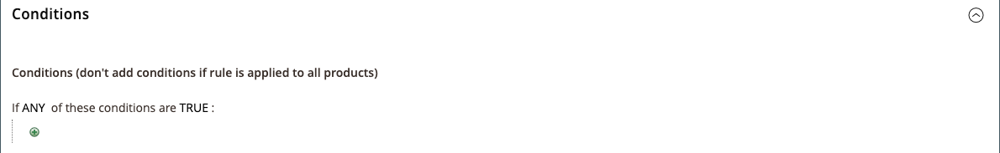

# Catalogusprijsregel met meerdere SKU&#39;s

Er kan één regel voor catalogusprijzen worden toegepast op meerdere SKU&#39;s, waardoor het mogelijk is verschillende promoties te maken op basis van een product, merk of categorie. Wanneer het creëren van deze regel, wilt u voorwaarden plaatsen die geselecteerde SKUs aanpassen. Wanneer het bouwen van de regel, kunt u gemakkelijk doorbladeren en SKUs van het net selecteren.

## Stap 1. Eigenschappen van het productkenmerk verifiëren voor winkel

Voordat u begint, moet u ervoor zorgen dat [Eigenschappen van Storefront](../catalog/attribute-product-create.md#step-4-describe-the-storefront-properties) van de `sku` kenmerk ingesteld op `Use in Promo Rules`.

1. Op de _Beheerder_ zijbalk, ga naar **[!UICONTROL Stores]** > _[!UICONTROL Attributes]_>**[!UICONTROL Product]**.

1. In het zoekfilter boven aan het dialoogvenster _[!UICONTROL Attribute Code]_kolom, Enter `sku` en klik op **[!UICONTROL Search]**.

1. Klik om het dialoogvenster `sku` kenmerk in bewerkingsmodus.

1. Klik in het linkerdeelvenster op **[!UICONTROL Storefront Properties]** en ervoor zorgen dat **[!UICONTROL Use for Promo Rule Conditions]** is ingesteld op `Yes`.

1. Als u de waarde van de eigenschap hebt gewijzigd, klikt u op **[!UICONTROL Save Attribute]**.

## Stap 2. Prijsregel toepassen op meerdere SKU&#39;s

1. Op de _Beheerder_ zijbalk, ga naar **[!UICONTROL Marketing]** > _[!UICONTROL Promotions]_>**[!UICONTROL Catalog Price Rules]**.

1. Voer een van de volgende handelingen uit:

   - Volg de instructies om een [catalogusprijsregel](price-rules-catalog.md).
   - Open een bestaande regel voor catalogusprijzen.

1. Uitbreiden  de **[!UICONTROL Conditions]** en voer de volgende handelingen uit:

   - Stel in de eerste regel de eerste parameter in op `ANY`.

     {width="600" zoomable="yes"}

   - Klikken _Toevoegen_ () aan het begin van de volgende regel en in de lijst onder **[!UICONTROL Product Attribute]**, klikt u op `SKU`.

     {width="600" zoomable="yes"}

   - Voor de vergelijking hebt u opties. Als u minstens één van een lijst van SKUs wilt de plaats bepalen, `select is one of`. Als u een groep SKU&#39;s wilt zoeken die allemaal moeten worden toegepast, selecteert u `is`. We raden u aan `is one of`.

     {width="600" zoomable="yes"}

   - Als u de voorwaarde wilt voltooien, klikt u op meer (**...**) en klik op de knop _Kiezer_ () voor de lijst met beschikbare producten.

     {width="600" zoomable="yes"}

   - Blader, filter of zoek naar de SKU&#39;s die u wilt toevoegen. Selecteer in de lijst het selectievakje van elk product dat u wilt opnemen.

   - Klikken **[!UICONTROL Save and Apply]** om SKUs aan de voorwaarde toe te voegen.

     {width="600" zoomable="yes"}

1. Voltooi de regel, inclusief alle [Handelingen](price-rules-catalog.md) te nemen wanneer aan de voorwaarden is voldaan.

1. Wanneer uw regel volledig is, klik **[!UICONTROL Save]**.

{{new-price-rule}}
