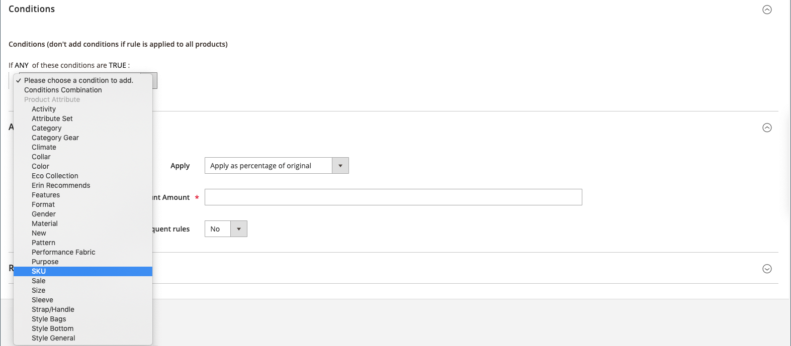

# Catalogusprijsregel met meerdere SKU&#39;s

Er kan één regel voor catalogusprijzen worden toegepast op meerdere SKU&#39;s, waardoor het mogelijk is verschillende promoties te maken op basis van een product, merk of categorie. Wanneer het creëren van deze regel, wilt u voorwaarden plaatsen die geselecteerde SKUs aanpassen. Wanneer het bouwen van de regel, kunt u gemakkelijk doorbladeren en SKUs van het net selecteren.

## Stap 1. Eigenschappen van het productkenmerk verifiëren voor winkel

Alvorens u begint, zorg ervoor dat de [&#x200B; Eigenschappen Storefront &#x200B;](../catalog/attribute-product-create.md#step-4-describe-the-storefront-properties) van het `sku` attribuut aan `Use in Promo Rules` wordt geplaatst.

1. Voor _Admin_ sidebar, ga **[!UICONTROL Stores]** > _[!UICONTROL Attributes]_>**[!UICONTROL Product]**.

1. Typ `sku` in het zoekfilter boven aan de kolom _[!UICONTROL Attribute Code]_&#x200B;en klik op **[!UICONTROL Search]**.

1. Klik om het kenmerk `sku` te openen in de bewerkingsmodus.

1. Klik in het linkerdeelvenster op **[!UICONTROL Storefront Properties]** en controleer of **[!UICONTROL Use for Promo Rule Conditions]** is ingesteld op `Yes` .

1. Als u de waarde van de eigenschap hebt gewijzigd, klikt u op **[!UICONTROL Save Attribute]** .

## Stap 2. Prijsregel toepassen op meerdere SKU&#39;s

1. Voor _Admin_ sidebar, ga **[!UICONTROL Marketing]** > _[!UICONTROL Promotions]_>**[!UICONTROL Catalog Price Rules]**.

1. Voer een van de volgende handelingen uit:

   - Volg de instructies om de regel van de a [&#x200B; catalogusprijs &#x200B;](price-rules-catalog.md) tot stand te brengen.
   - Open een bestaande regel voor catalogusprijzen.

1. Breid  de **[!UICONTROL Conditions]** sectie uit, en doe het volgende:

   - Stel in de eerste regel de eerste parameter in op `ANY` .

     {width="600" zoomable="yes"}

   - Klik _toevoegen_ () aan het begin van de volgende lijn en in de lijst onder **[!UICONTROL Product Attribute]**, klik `SKU`.

     {width="600" zoomable="yes"}

   - Voor de vergelijking hebt u opties. Als u minstens één van een lijst van SKUs wilt de plaats bepalen, `select is one of`. Selecteer `is` als u een groep SKU&#39;s wilt zoeken die allemaal moeten worden toegepast. We raden u aan `is one of` te selecteren.

     {width="600" zoomable="yes"}

   - Om de voorwaarde te voltooien, klik meer (**..**) verbinding en klik _Kiezer_ () voor de lijst van beschikbare producten.

     {width="600" zoomable="yes"}

   - Blader, filter of zoek naar de SKU&#39;s die u wilt toevoegen. Selecteer in de lijst het selectievakje van elk product dat u wilt opnemen.

   - Klik **[!UICONTROL Save and Apply]** om SKUs aan de voorwaarde toe te voegen.

     {width="600" zoomable="yes"}

1. Voltooi de regel, met inbegrip van om het even welke [&#x200B; Acties &#x200B;](price-rules-catalog.md) die moeten worden genomen wanneer de voorwaarden worden voldaan aan.

1. Wanneer uw regel volledig is, klik **[!UICONTROL Save]**.

{{new-price-rule}}
