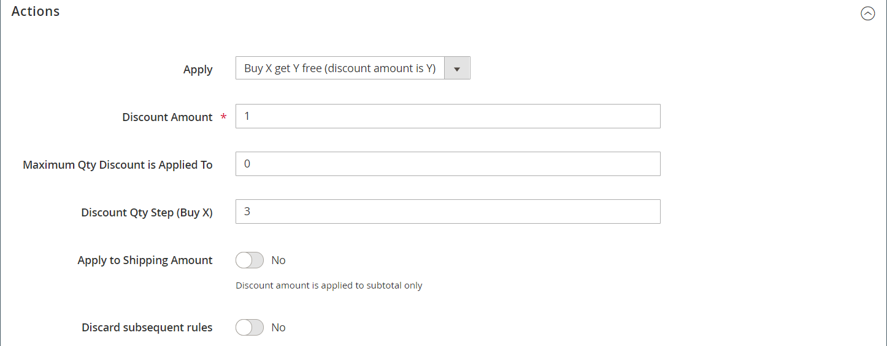

# Voorbeeld van de prijsregel voor winkelwagentjes - koop dit object

Dit voorbeeld toont hoe te opstelling de regel van de a [&#x200B; kartprijs &#x200B;](price-rules-cart.md) voor a _dit kopen, die vrije_ bevordering krijgt. Het formaat van de korting is als volgt:

_koop X hoeveelheid product, krijg Y hoeveelheid voor Gratis_

## Stap 1. Een regel voor een winkelwagenprijs maken

Voltooi [&#x200B; Stap 1 &#x200B;](price-rules-cart.md) van de instructies van de de regelregel van de wortelprijs om de regelinformatie te voltooien.

## Stap 2. De voorwaarden definiëren

Voltooi [&#x200B; Stap 2 &#x200B;](price-rules-cart.md) van de wortelinstructies om de voorwaarden voor de prijsregel te bepalen. Dit is de eerste van twee voorwaarden die aan de regel kunnen worden toegevoegd, en bepaalt wanneer de regel wordt teweeggebracht. Het kan gebaseerd zijn op een combinatie van het volgende:

- Productkenmerken
- Producten
- Kenmerken van winkelwagentje
-  (slechts Adobe Commerce) de segmenten van de Klant

Als deze optie leeg blijft, wordt de regel geactiveerd voor elk winkelwagentje.

{width="600" zoomable="yes"}

## Stap 3. De acties definiëren

1. Breid  de **[!UICONTROL Actions]** sectie uit en doe het volgende:

   - Stel **[!UICONTROL Apply]** in op `Buy X get Y free (_[!UICONTROL _[!UICONTROL Discount Amount]_]_ is Y)` .

   - Stel **[!UICONTROL Discount Amount]** in op `1` . Dit is het aantal dat de klant gratis ontvangt.

   - Als u het aantal kortingen wilt beperken dat kan worden toegepast wanneer aan de voorwaarde wordt voldaan, voert u het getal in het veld **[!UICONTROL Maximum Qty Discount is Applied To]** in. Dit wordt berekend gebruikend deze [&#x200B; formule &#x200B;](#maximum-quantity-discount).

   - Voer bij **[!UICONTROL Discount Qty Step (Buy X)]** het aantal in dat de klant moet kopen om in aanmerking te komen voor de korting. In dit voorbeeld moet de klant er drie kopen.

   - Stel **[!UICONTROL Discard subsequent rules]** in op `Yes` als u wilt voorkomen dat andere kortingen op de aankoop worden toegepast.

   {width="600" zoomable="yes"}

1. Als u de regel alleen wilt toepassen op specifieke artikelen in de winkelwagentje, vult u de voorwaarde in om de winkelwagentjes en/of productkenmerken te beschrijven die vereist zijn voor de promotie.

   Het volgende voorbeeld gebruikt SKU om de regel op alle bijbehorende variaties van een configureerbaar product toe te passen.

   {width="600" zoomable="yes"}

1. Kies `For matching items only` als u **[!UICONTROL Free Shipping]** wilt opnemen.

1. Klik op **[!UICONTROL Save and Continue Edit]** en voer de rest van de regel naar wens in.

## Stap 4. Het label invullen

Voltooi [&#x200B; Stap 4 &#x200B;](price-rules-cart.md) van de de regelinstructies van de kartprijs om het etiket in te gaan dat tijdens controle verschijnt.

## Stap 5: Sla de regel op en test deze

{{new-price-rule}}

1. Wanneer uw regel volledig is, klik **[!UICONTROL Save Rule]**.

1. Test de regel om er zeker van te zijn dat deze correct werkt.

## Variaties

Koop X krijgt Vrij Y wordt verwerkt als één enkele actie, met a _totaal van de rij_ gebiedsdeel. Alle objecten moeten van dezelfde SKU afkomstig zijn om in aanmerking te komen voor de speciale actie. Bijvoorbeeld:

Koop X-hoeveelheid product van categorie A en ontvang gratis Y-hoeveelheid van hetzelfde product.

Als u het vrije product wilt beperken tot de categorieën A, B en C, stelt u de actie als volgt in:

Als ALLE van deze voorwaarden WAAR zijn:
Categorie is één van A, B, C

Als u de gratis items van een categorie (A, B of C) wilt beperken en Y van SKU&#39;s (D123, E123 of F123) wilt ontvangen, stelt u de actie als volgt in:

Als ALLE van deze voorwaarden WAAR zijn:
SKU is een van D123, E123, F123

## Maximale korting op hoeveelheid

Gebruik de volgende formule om de correcte waarde voor de Maximale Korting van de Aantal te bepalen:

Formule = `(X+Y) * (M/Y)`
Wanneer
`X` = aantal gekochte items
`Y` = aantal gratis items
`M` = Maximaal aantal gratis items toegestaan

Bijvoorbeeld:

Koop vijf en krijg twee gratis objecten met maximaal vier gratis objecten toegestaan.

     waar 
     X = 5 
     Y = 2 
     M = 4 
     Maximale Korting van het Aantal = (5+2)*(4/2)=(7)*(2)=14 

Koop vijf en krijg drie gratis objecten met maximaal negen gratis objecten toegestaan.

     waar 
     X = 5 
     Y = 3 
     M = 9 
     Maximale Korting van het Aantal = (5+3)*(9/3)=24 

Koop 20 en ontvang twee gratis objecten met maximaal 20 gratis objecten toegestaan.

     waar 
     X = 20 
     Y = 2 
     M = 20 
     Maximale Korting van de Aantal = (20+2)*(20/2)= (22)*(10)=220 
