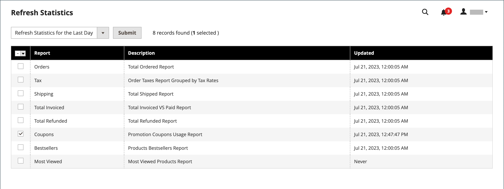

# Couponcodes

De codes van coupons worden gebruikt met [&#x200B; de regels van de kartprijs &#x200B;](price-rules-cart.md) om een korting toe te passen wanneer een reeks voorwaarden wordt voldaan. U kunt bijvoorbeeld een couponcode maken voor een specifieke klantengroep of voor iedereen die een aankoop voor een bepaald bedrag doet. Om de coupon op een aankoop toe te passen, kan de klant de couponcode in het karretje, of misschien bij het kasregister van uw _baksteen en mortar_ opslag ingaan. Hier volgen enkele manieren waarop je coupons kunt gebruiken in je winkel:

- E-mailcoupons naar klanten
- Afgedrukte coupons maken
- In-store coupons maken voor mobiele gebruikers

Couponcodes kunnen via e-mail worden verzonden of worden opgenomen in nieuwsbrieven, catalogi en advertenties. De lijst met couponcodes kan worden geëxporteerd en naar een commerciële drukker worden verzonden. U kunt ook in-store coupons maken met een snelle antwoordcode die kopers kunnen scannen met hun smartphones. De QR-code kan worden gekoppeld aan een pagina op uw site met meer informatie over de aanbieding.

Vanaf Commerce 2.4.7 kunnen kopers meerdere coupons toepassen op een winkelwagentje. Handelaren kunnen ook meerdere coupons toepassen met behulp van winkelhulp.

>[!NOTE]
>
>Prijsregels voor winkelwagentjes met dezelfde prioriteit resulteren niet in een gecombineerde korting. Elke regel (coupon) wordt toegepast op matchende producten afzonderlijk, één voor één, volgens de regel-ID van de kartonprijs in de database. Om de volgorde te bepalen waarin kortingen worden toegepast, raadt Adobe aan een andere prioriteit vast te stellen voor elke regel van de toegevoegde winkelprijs.

## couponcodes configureren

>[!BEGINSHADEBOX]

Commerce biedt standaard ondersteuning voor twee methoden voor het maken van couponcodes:

1. Eén specifieke couponcode maken
1. Het produceren van veelvoudige _willekeurige_ couponcodes

Als u reeds een lijst van couponcodes hebt die u en met een regel van de kartprijs wilt invoeren associëren, zou u het gebruiken van een uitbreiding van [&#x200B; Commerce Marketplace &#x200B;](https://marketplace.magento.com/) moeten overwegen.

>[!ENDSHADEBOX]

De lengte en opmaak van automatisch gegenereerde couponcodes worden bepaald door de configuratie. De tekens kunnen op alle getallen, alle letters of een combinatie worden ingesteld. U kunt een streepje invoegen met ingestelde intervallen, zodat u het gemakkelijk kunt lezen, en een voor- en achtervoegsel toevoegen om de code aan een specifieke campagne of een bepaald initiatief te koppelen.

1. Voor _Admin_ sidebar, ga **[!UICONTROL Stores]** > _[!UICONTROL Settings]_>**[!UICONTROL Configuration]**.

1. Vouw in het linkerdeelvenster **[!UICONTROL Customers]** uit en kies **[!UICONTROL Promotions]** .

   {width="600" zoomable="yes"}

1. Vouw de sectie **[!UICONTROL Auto Generated Specific Coupon Codes]** uit.

   {width="600" zoomable="yes"}

1. Voer de **[!UICONTROL Code Length]** in, inclusief voor-, achtervoegsel en scheidingstekens.

1. Stel de **[!UICONTROL Code Format]** in op een van de volgende opties:

   - `Alphanumeric`
   - `Alphabetical`
   - `Numeric`

1. Voer bij **[!UICONTROL Code Prefix]** de waarde in die u aan het begin van alle couponcodes wilt weergeven.

1. Voer bij **[!UICONTROL Code Suffix]** de waarde in die u aan het einde van alle couponcodes wilt weergeven.

1. Voer bij **[!UICONTROL Dash Every X Characters]** het aantal tekens tussen elk streepje in.

   Couponcodes met verschillende streepjespatronen worden als verschillende codes beschouwd, zelfs als de getallen gelijk zijn.

1. Klik op **[!UICONTROL Save Config]** als de bewerking is voltooid.

## coupons maken

>[!NOTE]
>
>[!BADGE &#x200B; slechts PaaS &#x200B;]{type=Informative url="https://experienceleague.adobe.com/nl/docs/commerce/user-guides/product-solutions" tooltip="Is alleen van toepassing op Adobe Commerce op Cloud-projecten (door Adobe beheerde PaaS-infrastructuur) en op projecten in het veld."} alvorens u coupons creeert, gebruik het `bin/magento cron:run` bevel om te verifiëren dat de kroon loopt. Zie [&#x200B; Bron van de Looppas van de bevellijn &#x200B;](https://experienceleague.adobe.com/docs/commerce-operations/configuration-guide/cli/configure-cron-jobs.html?lang=nl-NL#run-cron-from-the-command-line) in de _Gids van de Configuratie_ voor meer informatie.

### Methode 1: Een specifieke coupon maken

1. Volg de instructies om de regel van de a [&#x200B; kartprijs &#x200B;](price-rules-cart.md) tot stand te brengen.

1. Stel **[!UICONTROL Rule Information]** in op **[!UICONTROL Coupon]** in de sectie `Specific Coupon` .

1. Voer een **[!UICONTROL Coupon Code]** in die voor de promotie moet worden gebruikt.

   Het formaat van de code (numeriek, alfanumeriek, of alfabetisch) wordt bepaald door de [&#x200B; configuratie &#x200B;](#configure-coupon-codes).

1. Ga als volgt te werk om het aantal keren dat de coupon kan worden gebruikt te beperken:

   - Voer het getal **[!UICONTROL Uses per Coupon]** in.
   - Voer het getal **[!UICONTROL Uses per Customer]** in.

   Voor onbeperkt gebruik, verlaat deze gebieden leeg.

   {width="600" zoomable="yes"}

   >[!NOTE]
   >
   >Als meerdere klanten tegelijkertijd dezelfde coupon gebruiken, is het mogelijk dat de vastgestelde gebruikslimiet wordt overschreden als gevolg van vertraagde couponverwerking.

1. Ga als volgt te werk om de coupon geldig te maken voor een tijdsperiode:

   -  (Magento Open Source slechts) voltooi **van** en **aan** data. Om de datum te selecteren, klik het **pictogram van de Kalender** () naast elk gebied. Als u het datumbereik leeg laat, verloopt de regel niet.

   -  (Adobe Commerce slechts) doe één van het volgende:

     **Optie 1:** Plan een nieuwe update

      - Klik op **[!UICONTROL Schedule New Update]** rechtsboven op de pagina.

        {width="600" zoomable="yes"}

      - Voer de **[!UICONTROL Update Name]** en **[!UICONTROL Description]** in.

      - Kies de **Datum van het Begin** en **[!UICONTROL End Date]** van de Kalender ( ). Als u het datumbereik leeg laat, verloopt de regel niet.

      - Klik op **[!UICONTROL Save]** als de bewerking is voltooid.

        {width="600" zoomable="yes"}

     **Optie 2:** wijs aan een bestaande update toe:

      - Selecteer **[!UICONTROL Assign to Another Update]** .

      - Zoek de update in de lijst en klik op **[!UICONTROL Select]** .

1. Voltooi de [&#x200B; regel van de kartprijs &#x200B;](price-rules-cart.md) zoals nodig.

### Methode 2: Een batch coupons genereren

Het genereren van kortingscoupons is een asynchrone bewerking die op de achtergrond wordt uitgevoerd, zodat u in de beheerder kunt blijven werken zonder te wachten tot de bewerking is voltooid. Het systeem geeft een bericht weer wanneer de taak is voltooid.

1. Volg de instructies om de regel van de a [&#x200B; kartprijs &#x200B;](price-rules-cart.md) tot stand te brengen.

1. Selecteer onder **[!UICONTROL Coupon Code]** het selectievakje **[!UICONTROL Use Auto Generation]** .

1. Als u het aantal keren wilt beperken dat elke klant de coupon kan gebruiken, voert u het aantal **[!UICONTROL Uses per Customer]** in.

   {width="600" zoomable="yes"}

   >[!NOTE]
   >
   >Als meerdere klanten tegelijkertijd dezelfde coupon gebruiken, is het mogelijk dat de vastgestelde gebruikslimiet wordt overschreden als gevolg van vertraagde couponverwerking.

1. De rol neer en breidt  uit de **[!UICONTROL Manage Coupon Codes]** sectie en doet het volgende:

   {width="600" zoomable="yes"}

   - Voer bij **[!UICONTROL Coupons Qty]** het aantal coupons in dat u wilt genereren.

   - Voer de **[!UICONTROL Code Length]** in, exclusief het voorvoegsel, het achtervoegsel of de scheidingstekens.

   - Stel de **[!UICONTROL Code Format]** in op een van de volgende opties:

      - `Alphanumeric`
      - `Alphabetical`
      - `Numeric`

   - (Optioneel) Voer een **[!UICONTROL Code Prefix]** in die aan het begin van de code moet worden toegevoegd.

   - (Optioneel) Voer een **[!UICONTROL Code Suffix]** in die aan het einde van de code moet worden toegevoegd.

   - (Optioneel) Voer bij **[!UICONTROL Dash Every X Characters]** het aantal tekens tussen de streepjes in. Als de code bijvoorbeeld 12 tekens lang is en er om de vier tekens een streepje staat, ziet het er als volgt uit: `xxxx-xxxx-xxxx` . Met streepjes kunt u codes beter lezen en invoeren.

1. Klik op **[!UICONTROL Generate]** als de bewerking is voltooid.

   Het systeem geeft `Message is added to queue, wait to get your coupons soon` weer.

   Nadat de uitsnijdtaak is voltooid, wordt de lijst met gegenereerde codes weergegeven.

   | Veld | Beschrijving |
   |-------------|-------------|
   | [!UICONTROL Coupon Code] | Een unieke couponcode die is gemaakt en kan worden gebruikt voor het ontvangen van speciale voorwaarden. |
   | [!UICONTROL Created] | De datum waarop de couponcode is gemaakt. |
   | [!UICONTROL Used] | Geeft aan of de coupon is gebruikt. |
   | [!UICONTROL Times Used] | Geeft aan hoe vaak de couponcode is gebruikt. |

   {style="table-layout:auto"}

U kunt couponcodes exporteren naar een CSV- of Excel XML-bestand door de bestandsindeling te selecteren en op **[!UICONTROL Export]** te klikken.

Als u couponcodes wilt verwijderen, selecteert u een of meer codes in de lijst. Selecteer `Delete` in de **[!UICONTROL Actions]** kiezer en klik op **[!UICONTROL Submit]** .

## Coupons-rapport

Het _rapport van Coupons_ aggregeert gegevens van elke coupon die tijdens een specifieke datumwaaier wordt gebruikt. Omdat de coupons van het winkelwagentje worden toegepast, omvat het rapport gegevens van alle ingewisselde coupons, ongeacht [&#x200B; ordestatus &#x200B;](../stores-purchase/order-status.md). Bijgevolg kan het verslag zowel de geraamde als de werkelijke totalen bevatten. Het rapport kan voor een specifieke opslagmening, tijdspanne, ordestatus, en de kartprijsregel worden gefiltreerd.

In het volgende voorbeeld werd de couponcode &quot;H20&quot; door twee klanten gebruikt. Één van de orden wordt gefactureerd, maar andere is nog _hangend_. In de kolommen Subtotaal voor verkoop, Verkoop en Totaal voor verkoop worden de geaggregeerde bedragen van beide bestellingen weergegeven, maar in de kolommen Subtotaal, Korting en Totaal wordt alleen de werkelijk gefactureerde volgorde weergegeven. Elke rij in het rapport vertegenwoordigt één enkele couponbevordering.

{width="600" zoomable="yes"}

### Het rapport uitvoeren

1. Voor _Admin_ sidebar, ga **[!UICONTROL Reports]** > _[!UICONTROL Sales]_>**[!UICONTROL Coupons]**.

1. Als u veelvoudige opslagmeningen hebt, plaats **[!DNL Store View]** in de upper-left hoek om het werkingsgebied van het rapport te vestigen.

1. Om de verkoop [&#x200B; statistieken &#x200B;](../getting-started/sales-reports.md#refresh-statistics) voor de dag te verfrissen, klik het _Laatste bijgewerkte_ bericht bij de bovenkant van de werkruimte.

   Klik vervolgens om het selectievakje **[!UICONTROL Coupons]** te selecteren en klik op **[!UICONTROL Refresh]** .

   {width="600" zoomable="yes"}

1. Ga als volgt te werk om de gegevens te filteren:

   {width="600" zoomable="yes"}

   - Stel **[!UICONTROL Date Used]** in op een van de volgende opties:

      - `Order Created`
      - `Order Updated`

     Het _orde bijgewerkte_ rapport wordt gecreeerd in echt - tijd en vereist niet verfrist zich.

   - Als u de periode wilt definiëren die door het rapport wordt bestreken, stelt u **[!UICONTROL Period]** in op een van de volgende opties:

      - `Day`
      - `Month`
      - `Year`

   - Om de datumwaaier van het rapport te bepalen, ga **van** en **in** data in formaat M/D/YY.

   - Om een rapport voor een specifieke [&#x200B; ordestatus &#x200B;](../stores-purchase/order-status.md) te drukken, plaats **[!UICONTROL Order Status]** aan `Specified` en kies de ordestatus van de lijst.

   - Als u rijen zonder gegevens uit het rapport wilt weglaten, stelt u **[!UICONTROL Empty Rows]** in op `No` .

   - Voer een van de volgende handelingen uit om de couponactiviteit in het rapport te definiëren:

      - Als u alle couponactiviteiten van alle prijsregels wilt opnemen, stelt u **[!UICONTROL Cart Price Rule]** in op `Any` .
      - Als u alleen activiteiten wilt opnemen die betrekking hebben op een specifieke prijsregel, stelt u **[!UICONTROL Cart Price Rule]** in op `Specified` en selecteert u de regel voor de winkelwagenprijs in de lijst.

1. Klik op **[!UICONTROL Show Report]** wanneer u klaar bent om het rapport uit te voeren.

   Het rapport wordt onder aan de pagina weergegeven.

### Filteropties

| Veld | Beschrijving |
|--- |--- |
| [!UICONTROL Date Used] | Identificeert het datumgebied dat als basis van het rapport wordt gebruikt. Opties: **[!UICONTROL Order Created]**: Produceert het rapport dat op de datum wordt gebaseerd dat de orde door de klant werd geplaatst. Om ervoor te zorgen dat de huidigste gegevens worden omvat, klik de verbinding in het bericht om statistieken te verfrissen. **[!UICONTROL Order Updated]**: genereert het rapport op basis van de datumbestellingen die voor het laatst zijn bijgewerkt. Dit rapport gebruikt gegevens in real time en vereist geen statistieken om worden vernieuwd. |
| [!UICONTROL Period] | Bepaalt het type van datumwaaier die voor het rapport wordt gebruikt. Opties: `Day` / `Month` / `Year` |
| [!UICONTROL From] | Geeft de eerste datum in het bereik van ordergegevens aan die in het rapport is opgenomen. |
| [!UICONTROL To] | Geeft de laatste datum in het bereik van ordergegevens aan die in het rapport is opgenomen. |
| [!UICONTROL Order Status] | Filtert het rapport op ordestatus. Het rapport kan voor alle orders worden gegenereerd of worden beperkt tot een specifieke orderstatus. Opties:  **[!UICONTROL Any]**: omvat alle bestellingen, ongeacht de status. **[!UICONTROL Specified]**: omvat alleen orders met de opgegeven status. Geannuleerde orders worden niet in het rapport opgenomen. |
| [!UICONTROL Empty Rows] | Hiermee bepaalt u of het rapport rijen lege gegevens bevat die kunnen worden opgehaald. Opties: `Yes` / `No` |
| [!UICONTROL Cart Price Rules] | Hiermee bepaalt u welke couponpromoties worden opgenomen in het rapport. Opties: **[!UICONTROL Any]**: bevat orderinformatie voor elke couponbevordering die is gebruikt tijdens het opgegeven datumbereik. **[!UICONTROL Specified]**: bevat alleen ordergegevens voor de geselecteerde couponbevordering tijdens het opgegeven datumbereik. |

{style="table-layout:auto"}

### Kolommen rapporteren

| Kolom | Beschrijving |
|--- |--- |
| [!UICONTROL Interval] | Geeft het datumbereik van het gebruik van coupons aan dat in het rapport moet worden opgenomen. Het interval kan een specifieke dag, maand, of jaar, of waaier van data zijn. De intervaldatum wordt geformatteerd zoals in de volgende voorbeelden, volgens de waarde die in **[!UICONTROL Period]** het plaatsen wordt geplaatst: `Day`: 6/21/19  `Month`: 6/2019  `Year`: 2019 |
| [!UICONTROL Coupon Code] | De code van de Korting die door klanten in het winkelwagentje wordt ingegaan om de korting te ontvangen. |
| [!UICONTROL Price Rule] | De naam van de prijsregel die aan de coupon is gekoppeld. |
| [!UICONTROL Uses] | Het aantal keren dat de coupon is gebruikt gedurende het datumbereik dat voor het rapport is opgegeven. |
| [!UICONTROL Sales Subtotal] | Het geprojecteerde Subtotaal van alle orders die met de coupon zijn geplaatst.   Subtotaal van de Verkoop vertegenwoordigt geaggregeerde Subtotaal van alle kwalificerende orden en omvat `Pending` verkooporden die nog niet worden gefactureerd. |
| [!UICONTROL Sales Discount] | Het geprojecteerde kortingsbedrag van alle orders die met de coupon zijn geplaatst.   de Korting vertegenwoordigt het geaggregeerde discontobedrag van alle kwalificerende orden en omvat `Pending` verkooporden die nog niet worden gefactureerd. |
| [!UICONTROL Sales Total] | Het geprojecteerde Grand Total van alle orders die met de coupon zijn geplaatst. Het verkooptotaal bevat verzendkosten, verminderd met het bedrag van de korting.   het Totaal van de Verkoop vertegenwoordigt het geaggregeerde Grote Totale bedrag van alle kwalificerende orden en omvat `Pending` verkooporden die nog niet worden gefactureerd. De waarde omvat het subtotaal plus verzendkosten, minus de korting plus btw.   Berekend door: `((Subtotal + Shipping & Handling) - Discount) + Tax` |
| [!UICONTROL Subtotal] | Het geaggregeerde subtotaal van alle gefactureerde orders die van de coupon gebruikten. |
| [!UICONTROL Discount] | De geaggregeerde korting van alle gefactureerde orders die de coupon hebben gebruikt. |
| [!UICONTROL Total] | Het geaggregeerde ordertotaal van alle gefactureerde orders die de coupon hebben gebruikt. |

{style="table-layout:auto"}
