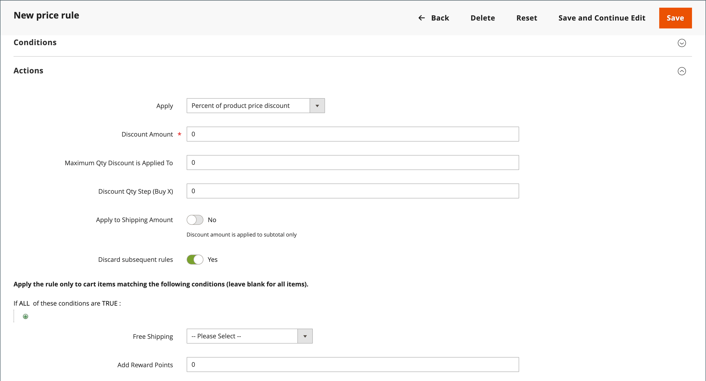

# Een regel voor een winkelwagenprijs maken

Voer de volgende stappen uit om een regel toe te voegen, beschrijf de voorwaarden en definieer de handelingen. Voltooi ook de labels en test de regel. De voorwaarden van de prijsregel kunnen op karretje of [ productattributen ](../catalog/product-attributes.md) of [ het publiek van Real-Time CDP ](#use-real-time-cdp-audiences-to-set-a-condition), maar niet op [ klantgerichte opties ](../catalog/settings-advanced-custom-options.md) worden gebaseerd.

## Stap 1: Een regel toevoegen

1. Voor _Admin_ sidebar, ga **[!UICONTROL Marketing]** > _[!UICONTROL Promotions]_>**[!UICONTROL Cart Price Rules]**.

1. Klik op **[!UICONTROL Add New Rule]** en voer de volgende handelingen uit:

   - Voer onder _[!UICONTROL Rule Information]_&#x200B;de handelingen **[!UICONTROL Rule Name]**&#x200B;en **[!UICONTROL Description]**&#x200B;in.

   - Als u niet wilt dat de regel onmiddellijk van kracht wordt, stelt u **[!UICONTROL Active]** in op `No` .

   {width="600" zoomable="yes"}

1. Om het [ werkingsgebied ](../getting-started/websites-stores-views.md#scope-settings) van de regel te vestigen, doe het volgende:

   - Selecteer de locatie **[!UICONTROL Websites]** waar de speciale actie beschikbaar moet zijn.

   - Selecteer de **[!UICONTROL Customer Groups]** waarop de promotie van toepassing is.

     Als u de bevordering slechts aan geregistreerde klanten beschikbaar wilt zijn, **__** kiest niet de `NOT LOGGED IN` optie.

1. Plaats de regel om met of zonder a [ coupon ](price-rules-cart-coupon.md) als volgt toe te passen:

   - Als u de regel voor het winkelwagentje wilt toepassen zonder gebruik te maken van een couponcode, stelt u **[!UICONTROL Coupon]** in op `No Coupon` en gaat u verder met stap 5.

   - Als u een coupon wilt koppelen aan een prijsregel, stelt u **[!UICONTROL Coupon]** in op `Specific Coupon` en voert u de volgende handelingen uit:

      - Voer een tekst zonder opmaak **[!UICONTROL Coupon Code]** in die de klant moet invoeren om de korting te ontvangen.

      - Als u een limiet wilt instellen voor het aantal keren dat de coupon kan worden gebruikt, voert u de volgende opties in:

     | Optie | Beschrijving |
     |------|-----------|
     | `Uses per Coupon` | Hiermee bepaalt u hoe vaak de couponcode kan worden gebruikt. Laat het veld leeg als er geen limiet is. |
     | `Uses per Customer` | Hiermee bepaalt u hoe vaak de regel van de winkelwagenprijs kan worden gebruikt door dezelfde geregistreerde klant die tot een van de geselecteerde klantengroepen behoort. De instelling is niet van toepassing op gastgebruikers die lid zijn van de NOT LOGGED IN-klantengroep, of op klanten die winkelen zonder zich aan te melden bij hun accounts. Laat het veld leeg als er geen limiet is. |

     {style="table-layout:auto"}

     Meer leren, zie [ Codes van de Coupon ](price-rules-cart-coupon.md).

     {width="600" zoomable="yes"}

   -  (Magento Open Source slechts) Gebruik _Kalender_ () om **[!UICONTROL From]** en **[!UICONTROL To]** datumwaaier voor de bevordering te kiezen.

1. Voer een getal in om de **[!UICONTROL Priority]** van deze prijsregel te definiëren ten opzichte van de handelingsinstellingen van andere prijsregels die tegelijkertijd actief zijn.

   Wanneer op hetzelfde product meerdere regels of coupons van toepassing zijn, wordt eerst de regel met de hoogste prioriteit (laagste getal) toegepast. Regels met dezelfde prioriteit worden niet gecombineerd; ze worden afzonderlijk toegepast op basis van regel-id. Om de orde te controleren waarin de kortingen worden toegepast, wijs unieke prioriteiten toe, en denk na gebruikend [ de Verdere Regels van de Prijs ](#step-3-define-the-actions) in de stap van Acties verwerpen om discontering te verhinderen stapelend.

1. Om de regel op gepubliceerde [ voer RSS ](social-rss.md#rss-feeds) toe te passen, plaats **Openbaar in RSS voer** aan `Yes`.

1. Klik op **[!UICONTROL Save and Continue Edit]**.

   -  (Magento Open Source slechts) Nadat de regel wordt bewaard, verschijnt de naam van de regel van de kartprijs bij de bovenkant van de pagina.

   -  (Adobe Commerce slechts) nadat de regel wordt bewaard, verschijnt de naam van de de kartonprijsregel en [ Geplande Veranderingen ](price-rule-cart-scheduled-changes.md) doos bij de bovenkant van de pagina.

     {width="600" zoomable="yes"}

## Stap 2: Beschrijf de voorwaarden

>[!NOTE]
>
>Als u publiek van Real-Time CDP gebruikt, sla aan [ deze sectie ](#use-real-time-cdp-audiences-to-set-a-condition) over.

In deze stap worden de voorwaarden beschreven waaraan moet zijn voldaan om voor de bevordering in aanmerking te komen. De voorwaarden zijn op de volgende manieren van invloed op de regels voor de kartprijs:

- De regel van de kartprijs wordt toegepast op **_elk_** product in het winkelwagentje wanneer de reeks voorwaarden in het _[!UICONTROL Conditions]_&#x200B;lusje wordt voldaan. Als u het aantal producten waarop de regel voor de winkelwagenprijs van toepassing is, wilt beperken, voegt u voorwaarden toe op het tabblad&#x200B;_[!UICONTROL Actions]_ om het aantal producten waarop de regel voor de winkelwagenprijs van toepassing is, te beperken.

- Als ten minste één voorwaardelijk productkenmerk een lege waarde heeft, wordt de regel van de winkelwagenprijs niet op het product toegepast.

1. Selecteer **[!UICONTROL Conditions]** in het linkerdeelvenster.

   {width="600" zoomable="yes"}

   De eerste voorwaarde wordt standaard weergegeven en de volgende statussen:

   `If **ALL** of these conditions are **TRUE**:`

   De instructie heeft twee vette koppelingen waarop u kunt klikken om de opties voor dat gedeelte van de instructie weer te geven. U kunt verschillende voorwaarden maken door de combinatie van deze waarden te wijzigen. Voer een van de volgende handelingen uit:

   - Klik op **[!UICONTROL ALL]** en selecteer `ALL` of `ANY` .
   - Klik op **[!UICONTROL TRUE]** en selecteer `TRUE` of `FALSE` .
   - Laat de voorwaarde ongewijzigd om de regel op alle producten toe te passen.

1. Klik _toevoegen_ () aan het begin van de volgende lijn toe en selecteer een optie voor de voorwaarde, zoals wortelattribuut, productsubselection, of combinatie.

   Voer in dit voorbeeld het volgende deel van de voorwaarde als volgt in:

   - Kies `Products Subselection` wanneer dit wordt gevraagd aan **[!UICONTROL Choose the condition to add]** .

     {width="600" zoomable="yes"}

   - Klik in de instructie condition op **[!UICONTROL total quantity]** en selecteer `total quantity` of `total amount` .

   >[!IMPORTANT]
   >
   >[!UICONTROL Total amount] is een totaal van een rij. Belastingen worden dus niet opgenomen in de `total amount` for the [!UICONTROL Products Subselection] line voorwaarde van de winkelprijsregel. Gebruik de voorwaarde [!UICONTROL Subtotal (Incl. Tax)] om belastingen op te nemen.

   - Klik in de instructie condition op **[!UICONTROL is]** en selecteer `greater than` .

1. Wanneer het volgende gedeelte van de voorwaarde wordt weergegeven, klikt u op de elementen van de instructie, zodat u kunt zien waar elke koppeling met variabelewaarden zich bevindt.

1. Klik op de koppeling Meer (...) en voer `100` in.

   Voor deze voorwaarde moet de totale hoeveelheid karretje `101` of groter zijn.

   {width="600" zoomable="yes"}

1. Klik **toevoegen** () aan het begin van de volgende lijn, en voeg dan een voorwaarde toe die op **Categorie** gebaseerd is.

   {width="600" zoomable="yes"}

1. In het volgende deel van de voorwaarde, klik _meer_ (**..**) verbinding om het inputgebied te tonen, en open dan de _Kiezer_ () om de categorieboom te tonen.

1. Selecteer checkbox van de categorie die u als voorwaarde voor de prijsregel wilt gebruiken en  pictogram toe om de categorieselecties goed te keuren.

   De voorwaarde kan op om het even welke categorie worden gebaseerd die een kind van de 0&rbrace; wortelcategorie van de opslag [&#128279;](../catalog/category-root.md) is.

   {width="600" zoomable="yes"}

1. Om meer voorwaarden toe te voegen, klik __ toevoegen ( toe) en bepalen een andere voorwaarde.

   U kunt het proces zo vaak herhalen als nodig is om de voorwaarden te beschrijven waaraan voor de prijsregel moet worden voldaan. Hier volgen enkele voorbeelden:

   **Voorbeeld 1:** Regionale Prijsregel

   Als u een regionale prijsregel wilt maken, gebruikt u een van de volgende tekenkenmerken:

   - `Shipping Postcode`
   - `Shipping Region`
   - `Shipping State/Province`
   - `Shipping Country`

   **Voorbeeld 2:** het Shopping de Totalen van de Kaart

   Gebruik een van de volgende kenmerken om de voorwaarde te baseren op winkelwagenttotalen:

   - `Subtotal`
   - `Total Items Quantity`
   - `Total Weight`

>[!NOTE]
>
>In een geval van veelvoudige parallelle bevorderingen, wordt de _Subtotal_ voorwaarde toegepast op het _basis_ winkelwagentsubtotaal **_vóór_** om het even welke kortingen.

>[!IMPORTANT]
>
>**slechts voor kooporders**: Wanneer een de prijsregel van de winkelwagentje op één of meerdere specifieke betalingsmethodes wordt gebaseerd, wordt de korting toegepast op het totaal wanneer een kooporder wordt gecreeerd. Nadat de kooporder is aangemaakt, blijft de korting van toepassing op het totaal als de betalingsmethode wordt gewijzigd in een methode die niet onder de regel van de winkelprijs valt.

### Een productkenmerk toevoegen aan de regels voor winkelprijzen

1. Ga naar **[!UICONTROL Stores]** > _[!UICONTROL Attributes]_>**[!UICONTROL Product]**&#x200B;en open het kenmerk product.

1. Selecteer **[!UICONTROL Storefront Properties]** in het linkerdeelvenster.

1. Stel **[!UICONTROL Use for Promo Rule Conditions]** in op `Yes` .

1. Klik op **[!UICONTROL Save Attribute]**.

1. Ga naar **[!UICONTROL Marketing]** > **[!UICONTROL Cart Price Rules]** en open de vereiste regel voor de winkelwagenprijs.

1. Breid  de **[!UICONTROL Condition]** sectie uit en selecteer **[!UICONTROL Product attribute combination]**.

1. Stel deze voorwaarde in op een van de volgende waarden:

   - Klik op **[!UICONTROL FOUND]** en selecteer `FOUND` of `NOT FOUND` .

   - Klik op **[!UICONTROL ALL]** en selecteer `ALL` of `ANY` .

1. Klik _toevoegen_ ( toe) pictogram en selecteer **[!UICONTROL Product Attribute]** dat u opstelling voor promotionele regelvoorwaarden.

1. Klik op **[!UICONTROL Save]**.

>[!NOTE]
>
>Wanneer het gebruiken van de `is not one of` voorwaarde met a _SKU_ productattributen en configureerbaar product, zowel de ouder als kindproduct SKUs moet worden geselecteerd. Als u wilt voorkomen dat alle onderliggende SKU&#39;s in de regel worden vermeld, kunt u de voorwaarde `does not contain` gebruiken met algemene SKU-onderdelen van een configureerbaar product en de onderliggende producten ervan.

### Real-Time CDP-publiek gebruiken om een voorwaarde in te stellen

U kunt een voorwaarde voor een regel plaatsen van de wortelprijs die op een Real-Time CDP [ publiek ](../customers/audience-activation.md) wordt gebaseerd.

1. Vouw **[!UICONTROL Conditions]** uit, klik op het pictogram &quot;+&quot; en selecteer **[!UICONTROL Real-Time CDP Audience]** in de lijst.

   {width="300"}

1. Selecteer _Meer_ (**..**) pictogram, klik **[!UICONTROL Open Chooser]**, en bekijk alle beschikbare publiek van Real-Time CDP.

   {width="600" zoomable="yes"}

1. Selecteer het Real-Time CDP-publiek dat u wilt gebruiken voor de regel van de winkelwagenprijs.

   | Optie | Beschrijving |
   |------|-----------|
   | `ID` | Een interne id van het publiek dat wordt gebruikt binnen de beheerder |
   | `Real-Time CDP Audience ID` | Unieke id van het publiek toen het in Experience Platform werd gecreeerd |
   | `Name` | Naam van het publiek, zoals `Orders over $50` |
   | `Description` | Beschrijving van het publiek, zoals `People who placed an order over $50 in the last month.` . |
   | `Source` | Geeft aan waar het publiek vandaan kwam, zoals `Experience Platform` . |
   | `Website` | Geeft aan welke website u hebt gekoppeld aan de gegevensstroom die het publiek bevat. U creeert deze verbinding wanneer u uw instantie van Commerce met de Experience Platform door de [[!DNL Data Connection] ](https://experienceleague.adobe.com/docs/commerce/data-connection/fundamentals/connect-data.html) uitbreiding verbindt. |

   {style="table-layout:auto"}

In de volgende stap definieert u de actie die moet worden uitgevoerd wanneer aan de voorwaarde wordt voldaan.

## Stap 3: De acties definiëren

De maatregelen voor de prijsregel voor winkelwagentjes beschrijven hoe de prijzen worden bijgewerkt wanneer aan de voorwaarden wordt voldaan.

1. De rol neer aan **[!UICONTROL Actions]**, en breidt  de sectie uit.

   {width="600" zoomable="yes"}

1. Stel **[!UICONTROL Apply]** in op een van de volgende kortingsopties:

   | Optie | Beschrijving |
   |------|-----------|
   | `Percent of product price discount` | Hiermee wordt het object gekort door een percentage van de oorspronkelijke prijs af te trekken. De korting is van toepassing op elk in aanmerking komend item in het winkelwagentje. Voer bijvoorbeeld `10` in [!UICONTROL Discount Amount] in voor een bijgewerkte prijs die 10% lager is dan de oorspronkelijke prijs. |
   | `Fixed amount discount` | Hiermee wordt een object gekort door een vast bedrag af te trekken van de oorspronkelijke prijs van elk kwalificerend object in de winkelwagen. Voer bijvoorbeeld `10` in [!UICONTROL Discount Amount] in voor een bijgewerkte prijs die $10 lager is dan de oorspronkelijke prijs. |
   | Korting op een vast bedrag voor een hele winkelwagen | Hiermee wordt de hele winkelwagen gekort door een vast bedrag af te trekken van het totaal van de winkelwagentjes. Bijvoorbeeld: voer 10 in [!UICONTROL Discount Amount] in om $10 van het totaal van de winkelwagentjes af te trekken. Standaard geldt de korting alleen voor het cartsubtotaal. Als u de korting op het subtotaal en de verzendkosten afzonderlijk wilt toepassen, gebruikt u de optie _[!UICONTROL Apply to Shipping Amount]_. |
   | `Buy X get Y free` | Bepaalt een hoeveelheid X die de klant moet kopen om een hoeveelheid Y **van het zelfde product/de variatie** gratis te ontvangen. (De [!UICONTROL Discount Amount] is Y.) Een totale hoeveelheid van X+Y van hetzelfde item moet in het winkelwagentje aanwezig zijn of aan het winkelwagentje worden toegevoegd om de korting toe te passen. |

   {style="table-layout:auto"}

   - Als u kortingen voor vaste bedragen consistent wilt toepassen op verschillende websites met verschillende valuta&#39;s (zonder deze om te zetten in de algemene basisvaluta), stelt u de optie **[!UICONTROL Catalog Price Scope]** in op `Website` en definieert u voor elke site een basisvaluta.

   - Voer de **[!UICONTROL Discount Amount]** in als een getal, zonder symbolen. Afhankelijk van de geselecteerde kortingsoptie kan het getal 10 bijvoorbeeld een percentage, een vast bedrag of een aantal objecten aangeven.

   - Voor a _koop X krijgt de Gratis_ korting van Y, ga de hoeveelheid op het **[!UICONTROL Discount Qty Step (Buy X)]** gebied van één enkel product/SKU/lijnpunt in dat de klant moet kopen om de korting op het aantal van Y te ontvangen. Zowel X als Y verwijzen naar hoeveelheden van dezelfde SKU en dat de specifieke hoeveelheid (variaties van een configureerbaar product worden afzonderlijk geteld) van het artikel handmatig aan het winkelwagentje moet worden toegevoegd.

   - Voer in het veld **[!UICONTROL Maximum Qty Discount is Applied To]** de maximumhoeveelheid in van hetzelfde product dat in aanmerking komt voor de korting bij dezelfde aankoop.

   - Plaats **[!UICONTROL Apply to Shipping Amount]** () als volgt:

     | Optie | Beschrijving |
     |------|-----------|
     | `Yes` | Hiermee past u het kortingsbedrag afzonderlijk toe op het subtotaal en de verzendbedragen. |
     | `No` | Hiermee past u het kortingsbedrag alleen toe op het subtotaal. |

     {style="table-layout:auto"}

   - Ophouden verwerkend andere regels nadat deze regel wordt toegepast, plaats **[!UICONTROL Discard Subsequent Rules]** () aan `Yes`. Met deze instelling voorkomt u dat meerdere kortingen op hetzelfde product worden toegepast.

     | Optie | Beschrijving |
     |------|-----------|
     | `Yes` | Voorkomt dat andere prijsregels die op een product van toepassing kunnen zijn, worden toegepast. Wanneer meerdere prijsregels op hetzelfde product van toepassing zijn, wordt alleen de prijsregel met de hoogste gedefinieerde prioriteit (in een regel [!UICONTROL Priority] veld) toegepast op het in aanmerking komende product. Hierdoor wordt voorkomen dat meerdere prijsregels worden gestapeld en onbedoelde extra kortingen bieden. |
     | `No` | Hiermee kunnen meerdere prijsregels op hetzelfde product worden toegepast. Dit kan ertoe leiden dat er meerdere kortingen op je aanbiedingsprijs worden toegepast. |

     {style="table-layout:auto"}

     >[!IMPORTANT]
     >
     >Om verdere regels te verwerpen, moet een prijsregel de bepaalde prioriteiten gebruiken die op het Prioritaire gebied van elke regel worden geplaatst, en de veelvoudige regels zouden niet de zelfde bepaalde prioriteit moeten hebben. Zie **[!UICONTROL Priority]** in _een Nieuwe stap van de Regel_ toevoegen.

1. Om de **_nauwkeurige_** producten in het winkelwagentje te bepalen die door de regel van de kartprijs worden beïnvloed, voeg de **_extra_** voorwaarden toe die voor de actie nodig zijn.

   Als u wilt bepalen of gratis verzending wordt toegepast op bestellingen die aan de voorwaarden voldoen, stelt u **[!UICONTROL Free Shipping]** in op een van de volgende opties:

   | Optie | Beschrijving |
   |------|-----------|
   | `No` | Gratis verzending is niet beschikbaar. |
   | `For matching items only` | Gratis verzending is alleen beschikbaar voor objecten die voldoen aan de voorwaarden van de regel. |
   | `For shipment with matching items` | Gratis verzending is beschikbaar voor alle verzendingen die overeenkomende objecten bevatten. De [ Vrij Verschepende ](../stores-purchase/shipping-free.md) leveringsmethode moet worden toegelaten om deze optie te gebruiken. |

   {style="table-layout:auto"}

1.  (Adobe Commerce slechts) voor **[!UICONTROL Add Rewards Points]**, ga het vaste aantal punten in de klant **_eens_** per orde ontvangt wanneer de regel van de kartprijs wordt toegepast.

   Laat dit veld leeg als beloningspunten niet zijn ingeschakeld.

1. Klik op **[!UICONTROL Save and Continue Edit]** als de bewerking is voltooid.

## Stap 4: De labels invullen

Het label wordt weergegeven in het gedeelte met totalen van de volgorde waarin u de korting wilt identificeren. De labeltekst staat tussen haakjes achter het woord `Discount` . U kunt een standaardlabel voor alle winkelweergaven invoeren of een ander label voor elke weergave invoeren.

{width="600"}

1. De rol neer aan **[!UICONTROL Labels]**, en breidt  de sectie uit.

1. Voer de tekst in die u als **[!UICONTROL Default Rule Label for All Store Views]** wilt gebruiken.

   {width="600" zoomable="yes"}

1. Als uw winkel meerdere weergaven heeft of meerdere websites met meerdere weergaven, voert u voor elke weergave de juiste labeltekst in.

   Als elke winkelweergave bijvoorbeeld in een andere taal is gesteld, voert u de vertaling van het label voor elke weergave in.

   {width="600" zoomable="yes"}

## Stap 5: Verwante dynamische blokken toevoegen (optioneel)

{{ee-feature}}

[ Dynamische Blokken ](../content-design/dynamic-blocks.md) die met de regel worden geassocieerd verschijnen in de storefront wanneer de voorwaarden worden voldaan aan.

1. Breid  de **[!UICONTROL Related Dynamic Blocks]** sectie uit.

1. Gebruik de [ onderzoeksfilters ](../getting-started/admin-workspace.md) om van de blokken de plaats te bepalen die u met de regel wilt associëren.

1. Schakel het selectievakje in de eerste kolom in om het blok aan de regel te koppelen.

   Meer leren, zie [ Dynamische Blokken in de Regels van de Prijs ](../content-design/dynamic-blocks-price-rules.md).

## Stap 6: Sla de regel op en test deze

1. Klik op **[!UICONTROL Save Rule]** als de bewerking is voltooid.

1. Test de regel om er zeker van te zijn dat deze correct werkt.

   Prijsregels worden elke avond automatisch met andere systeemregels verwerkt. Wanneer u een prijsregel maakt, moet u voldoende tijd toestaan om deze in het systeem te krijgen. Test ook de regel om er zeker van te zijn dat deze correct werkt. Aangezien nieuwe regels worden toegevoegd, herberekent Commerce de prijzen en de prioriteiten dienovereenkomstig.

## Demo van winkelprijsegel

Bekijk deze video voor meer informatie over het maken van regels voor winkelwagenprijzen:

>[!VIDEO](https://video.tv.adobe.com/v/343835?quality=12&learn=on)

## Veldomschrijvingen

### [!UICONTROL Rule Information]

| Veld | Beschrijving |
|--- |--- |
| [!UICONTROL Rule Name] | (Vereist) De naam van de regel is voor interne verwijzing. |
| [!UICONTROL Description] | Een beschrijving van de regel moet het doel van de regel omvatten, en verklaren hoe het wordt gebruikt. |
| [!UICONTROL Active] | (Vereist) bepaalt als de regel in de opslag actief is. Opties: `Yes` / `No` |
| [!UICONTROL Websites] | (Vereist) Hiermee worden de websites geïdentificeerd waarop de regel kan worden gebruikt. |
| [!UICONTROL Customer Groups] | (Vereist) Identificeert de klantengroepen waarop de regel van toepassing is. |
| [!UICONTROL Coupon] | (Vereist) Geeft aan of een coupon aan de regel is gekoppeld. Opties:  **[!UICONTROL No Coupon]**- er is geen coupon aan de regel gekoppeld. **[!UICONTROL Specific Coupon]** - Een specifieke coupon is gekoppeld aan de regel.  **[!UICONTROL Coupon Code]**- Voer desgevraagd de Coupon-code in die de klant moet invoeren om te kunnen profiteren van de speciale actie. **[!UICONTROL Use Auto Generation]** - Schakel het selectievakje in om automatisch meerdere couponcodes te genereren die kunnen worden gebruikt voor de speciale actie.  **[!UICONTROL Auto]**- Geeft de sectie _[!UICONTROL Manage Coupon Codes]_&#x200B;weer om de indeling van de te genereren couponcodes te definiëren. |
| [!UICONTROL Uses per Coupon] | Hiermee bepaalt u hoe vaak de couponcode kan worden gebruikt. Laat het veld leeg als er geen limiet is. |
| [!UICONTROL Uses per Customer] | Hiermee bepaalt u hoe vaak de regel van de winkelwagenprijs kan worden gebruikt door dezelfde geregistreerde klant die tot een geselecteerde klantengroep behoort. Is niet van toepassing op gastkopers die lid zijn van NIET IN klantengroep LOGGED, of op klanten die zonder het programma openen aan hun rekeningen winkelen. Voor geen limiet, laat leeg. |
| [!UICONTROL Priority] | Een getal dat de prioriteit van deze regel ten opzichte van andere regels aangeeft. Prioriteiten van het hoogste naar het laagste niveau zijn `0,1,2,3...` |
| [!UICONTROL Public in RSS Feed] | Hiermee bepaalt u of de aanbieding wordt opgenomen in de openbare RSS-feed van uw winkel. Opties:  `Yes` / `No` |
| [!UICONTROL From] |  (Magento Open Source slechts) de eerste datum de coupon kan worden gebruikt. |
| [!UICONTROL To] |  (Magento Open Source slechts) de laatste datum de coupon kan worden gebruikt. |

{style="table-layout:auto"}

### [!UICONTROL Conditions]

Hiermee geeft u de voorwaarden op waaraan moet worden voldaan voordat de regel van de winkelwagenprijs in werking treedt. Indien leeg gelaten, geldt de regel voor alle producten in de winkelwagentje. De voorwaarden kunnen gebaseerd zijn op elke combinatie van karretjes en productkenmerken. Nochtans, [ aanpasbare opties ](../catalog/settings-advanced-custom-options.md) kunnen niet in de voorwaarden van de kartprijs worden van verwijzingen voorzien.

| Veld | Beschrijving |
|--- |--- |
| [!UICONTROL **Attribuut van het Punt van de Kar**] |  |
| [!UICONTROL Price in cart] | Productprijs. De regel is van toepassing als de productprijs in de kartonnen staat. |
| [!UICONTROL Quantity in cart] | Aantal producten. De regel is van toepassing als aan de voorwaarde voor het karretje is voldaan. |
| [!UICONTROL Row total in cart] | Totaal productrij. De regel is van toepassing als aan het totaal van de productrij in de voorwaarde van de kar wordt voldaan. |
| [!UICONTROL **Attribuut van het Product**] |  |
| [!UICONTROL Attribute Set] | Productkenmerkset. De regel is van toepassing als het product aan de voorwaarde van het productattribuut voldoet. |
| [!UICONTROL Category/Other attribute] | Productcategorie/ander kenmerk. De regel is van toepassing als het product zelf of de kinderen aan de categorie/andere kenmerkvoorwaarde voldoen. Voor het kenmerk moet [!UICONTROL Use for Promo Rule Conditions] zijn ingesteld op `Yes` . |
| [!UICONTROL Category/Other attribute (Children Only)] | Onderliggende productcategorie/ander kenmerk. De regel is van toepassing als alleen de onderliggende producten voldoen aan de voorwaarde voor categorie/ander kenmerk (het product zelf wordt hier niet gecontroleerd). Het kenmerk moet [!UICONTROL Use for Promo Rule Conditions] tot `Yes` hebben. |
| [!UICONTROL Category/Other attribute (Parent Only)] | Bovenliggende productcategorie/ander kenmerk. De regel is van toepassing als alleen het product zelf voldoet aan de voorwaarde voor categorie/ander kenmerk (onderliggende producten worden hier niet gecontroleerd). Voor het kenmerk moet [!UICONTROL Use for Promo Rule Conditions] zijn ingesteld op `Yes` . |
| [!UICONTROL **Kenmerk van de Kar**] |  |
| [!UICONTROL Subtotal (Excl. Tax)] | Subtotaal van winkelwagentjes (exclusief belastingen). De regel is van toepassing als het winkelwagentje voldoet aan de subtotaal (exclusief belasting) voorwaarde. |
| [!UICONTROL Subtotal (Incl. Tax)] | Subtotaal van winkelwagentjes (inclusief belasting). De regel is van toepassing als het winkelwagentje voldoet aan de subtotaal (inclusief belasting) voorwaarde. |
| [!UICONTROL Subtotal] | Subtotaal winkelwagentje. De regel geldt als het winkelwagentje voldoet aan een subtotale voorwaarde. Met Controle wordt belasting opgenomen of uitgesloten volgens de huidige belastinginstellingen. |
| [!UICONTROL Total Items Quantity] | Totale hoeveelheid van alle producten in het winkelwagentje. De regel is van toepassing als het winkelwagentje voldoet aan een voorwaarde voor het totale aantal artikelen. |
| [!UICONTROL Total Weight] | Het totale gewicht van alle producten in het winkelwagentje. De regel is van toepassing als het winkelwagentje voldoet aan de totale gewichtsvoorwaarde. |
| [!UICONTROL Payment Method] | Betalingsmethode geselecteerd bij afhandeling. De regel is van toepassing als aan de betalingsmethode is voldaan. |
| [!UICONTROL Shipping Method] | Verzendmethode geselecteerd bij afhandeling. De regel geldt als aan de voorwaarde voor de verzendmethode is voldaan. |
| [!UICONTROL Shipping Postcode] | Postcode verzendadres. De regel is van toepassing als het verzendadres voldoet aan de postcodevoorwaarde. |
| [!UICONTROL Shipping Region] | Gebied met verzendadres. De regel is van toepassing als het verzendadres voldoet aan de regiovoorwaarde. |
| [!UICONTROL Shipping State/Province] | Verzendadres: provincie. De regel is van toepassing als het verzendadres voldoet aan de voorwaarde voor de provincie. |
| [!UICONTROL Shipping Country] | Land van verzendadres. De regel is van toepassing als het verzendadres voldoet aan de landvoorwaarde. |
| [!UICONTROL Customer Segment] | De regel is van toepassing als een geregistreerde of gastklant aan de voorwaarde van het klantensegment voldoet. |

### [!UICONTROL Actions]

| Veld | Beschrijving |
|--- |--- |
| [!UICONTROL Apply] | Bepaalt het type berekening dat op de aankoop wordt toegepast. Opties:  **[!UICONTROL Percent of product price discount]**- hiermee wordt het item gekort door een percentage van de oorspronkelijke prijs af te trekken. Voer bijvoorbeeld `10` in _[!UICONTROL Discount Amount]_&#x200B;in voor een bijgewerkte prijs die 10% lager is dan de oorspronkelijke prijs. **[!UICONTROL Fixed amount discount]**- Hiermee wordt het object in mindering gebracht door een vast bedrag af te trekken van de oorspronkelijke prijs van elk kwalificerend object in de winkelwagen. Voer bijvoorbeeld `10` in&#x200B;_[!UICONTROL Discount Amount]_ in voor een bijgewerkte prijs die $10 lager is dan de oorspronkelijke prijs.  **[!UICONTROL Fixed amount discount for whole cart]**- Kort de hele winkelwagen af door een vast bedrag af te trekken van het subtotaal van de winkelwagentjes. Bijvoorbeeld: voer `10` in _[!UICONTROL Discount Amount]_&#x200B;in om $10 van het subtotaal van het winkelwagentje af te trekken. Standaard geldt de korting alleen voor het cartsubtotaal. Om de korting op subtotal en afzonderlijk het verschepen toe te passen, zie_ op het Verschepende Bedrag _van toepassing zijn. **[!UICONTROL Buy X Get Y Free (discount amount is Y)]**- Hiermee definieert u een hoeveelheid die de klant moet kopen om een hoeveelheid gratis te ontvangen. (De&#x200B;_[!UICONTROL Discount Amount]_ is Y.) |
| [!UICONTROL Discount Amount] | (Vereist) Het bedrag van korting dat wordt aangeboden. |
| [!UICONTROL Maximum Qty Discount is Applied To] | Hiermee stelt u het maximum aantal producten in waarop de korting kan worden toegepast in dezelfde aankoop. |
| [!UICONTROL Discount Qty Step (Buy X)] | Hiermee stelt u het aantal producten in dat `X` in een `Buy X Get Y Free` -promotie vertegenwoordigt. Definieert ook hoeveel producten in batches aan het winkelwagentje moeten worden toegevoegd om `Fixed amount discount` - en `Percent of product price discount` -promoties toe te passen. |
| [!UICONTROL Apply to Shipping Amount] | Hiermee wordt bepaald of de korting afzonderlijk wordt toegepast op het subtotaal en de verzendbedragen. Anders wordt deze alleen op het subtotaal toegepast. Opties: `Yes` / `No` |
| [!UICONTROL Discard Subsequent Rules] | Hiermee wordt bepaald of regels met lagere prioriteit (1 heeft de hoogste prioriteit) op het product kunnen worden toegepast wanneer deze regel voor de winkelwagenprijs een overeenkomst is. Schakel deze optie in om te voorkomen dat meerdere kortingen op hetzelfde product worden toegepast. Opties: `Yes` / `No` |
| [!UICONTROL Free Shipping] | Hiermee bepaalt u of gratis verzending in de speciale actie wordt opgenomen en, zo ja, voor welke objecten. Opties:  **[!UICONTROL No]**- Voor de huidige regel is geen gratis verzending beschikbaar. **[!UICONTROL For matching items only]** - Gratis verzending is alleen beschikbaar voor specifieke objecten in de winkelwagen die aan de regel voldoen.  **[!UICONTROL For shipment with matching items]**- Gratis verzending is beschikbaar voor alle objecten in de winkelwagentje. De [ Vrij Verschepende ](../stores-purchase/shipping-free.md) leveringsmethode moet worden toegelaten om deze optie te gebruiken. |
| [!UICONTROL Add Reward Points] |  (Adobe Commerce slechts) specificeert het aantal [ beloningspunten ](rewards-loyalty.md) die door de klant worden verdiend wanneer de prijsregel wordt toegepast. |

{style="table-layout:auto"}

### [!UICONTROL Labels]

| Veld | Beschrijving |
|--- |--- |
| [!UICONTROL Default Rule Label for All Store Views] | Een standaardlabel dat de korting identificeert en voor alle opslagmeningen kan worden gebruikt. |
| [!UICONTROL Store View Specific Labels] | Geeft, indien van toepassing, een ander label om de korting voor elke winkelweergave te identificeren. |

{style="table-layout:auto"}

### [!UICONTROL Related Dynamic Blocks]

{{ee-feature}}

Identificeert om het even welke [ dynamische blokken ](../content-design/dynamic-blocks.md) die met de regel worden geassocieerd.
