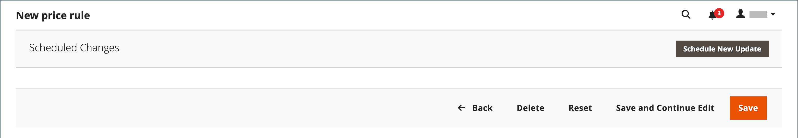

# Een regel voor een winkelwagenprijs maken

Voer de volgende stappen uit om een regel toe te voegen, beschrijf de voorwaarden en definieer de handelingen. Voltooi ook de labels en test de regel. Prijsregelvoorwaarden kunnen gebaseerd zijn op winkelwagentje of [productkenmerken](../catalog/product-attributes.md) of [Real-Time CDP-publiek](#use-real-time-cdp-audiences-to-set-a-condition), maar niet [aanpasbare opties](../catalog/settings-advanced-custom-options.md).

## Stap 1: Een regel toevoegen

1. Op de _Beheerder_ zijbalk, ga naar **[!UICONTROL Marketing]** > _[!UICONTROL Promotions]_>**[!UICONTROL Cart Price Rules]**.

1. Klikken **[!UICONTROL Add New Rule]** en voer de volgende handelingen uit:

   - Onder _[!UICONTROL Rule Information]_, moet u de **[!UICONTROL Rule Name]**en **[!UICONTROL Description]**.

   - Als u niet wilt dat de regel onmiddellijk van kracht wordt, stelt u **[!UICONTROL Active]** tot `No`.

   {width="600" zoomable="yes"}

1. Om de [bereik](../getting-started/websites-stores-views.md#scope-settings) van de regel, doe het volgende:

   - Selecteer de **[!UICONTROL Websites]** wanneer de afzetbevordering beschikbaar moet zijn.

   - Selecteer de **[!UICONTROL Customer Groups]** waarop de afzetbevordering van toepassing is.

     Als je wilt dat de speciale actie alleen beschikbaar is voor geregistreerde klanten, **_niet_** kies de `NOT LOGGED IN` -optie.

1. Stel de regel in die u wilt toepassen met of zonder een [coupon](price-rules-cart-coupon.md) als volgt:

   - Als u de regel voor het winkelwagentje wilt toepassen zonder gebruik te maken van een couponcode, stelt u **[!UICONTROL Coupon]** tot `No Coupon` en ga verder met stap 5.

   - Als u een coupon wilt koppelen aan een prijsregel, stelt u **[!UICONTROL Coupon]** tot `Specific Coupon` en voer de volgende handelingen uit:

      - Vrije tekst invoeren **[!UICONTROL Coupon Code]** dat de klant moet ingaan om de korting te ontvangen.

      - Als u een limiet wilt instellen voor het aantal keren dat de coupon kan worden gebruikt, voert u de volgende opties in:

     | Optie | Beschrijving |
     |------|-----------|
     | `Uses per Coupon` | Hiermee bepaalt u hoe vaak de couponcode kan worden gebruikt. Laat het veld leeg als er geen limiet is. |
     | `Uses per Customer` | Hiermee bepaalt u hoe vaak de regel van de winkelwagenprijs kan worden gebruikt door dezelfde geregistreerde klant die tot een van de geselecteerde klantengroepen behoort. De instelling is niet van toepassing op gastgebruikers die lid zijn van de NOT LOGGED IN-klantengroep, of op klanten die winkelen zonder zich aan te melden bij hun accounts. Laat het veld leeg als er geen limiet is. |

     {style="table-layout:auto"}

     Zie voor meer informatie [Couponcodes](price-rules-cart-coupon.md).

     {width="600" zoomable="yes"}

   -  (Alleen Magento Open Source) Gebruik de optie _Kalender_ () om de **[!UICONTROL From]** en **[!UICONTROL To]** datumbereik voor de promotie.

1. Voer een getal in om het **[!UICONTROL Priority]** van deze prijsregel met betrekking tot de handelingsinstellingen van andere prijsregels die tegelijkertijd actief zijn.

   >[!NOTE]
   >
   >De instelling Prioriteit is belangrijk wanneer twee regels/couponcodes tegelijkertijd geldig zijn voor hetzelfde product. De regel met de instelling voor de hoogste prioriteit (`1` als hoogste) controleert de actie van het karretje. Zie _Volgende prijsregels negeren_ in de _De handelingen definiëren_ stap.

   >[!NOTE]
   >
   >Prijsregels voor winkelwagentjes met dezelfde prioriteit resulteren niet in een gecombineerde korting. Elke regel wordt toegepast op producten die afzonderlijk overeenkomen, één voor één.

1. De regel toepassen op gepubliceerde [RSS-feeds](social-rss.md#rss-feeds), set **Openbaar in RSS-feed** tot `Yes`.

1. Klik op **[!UICONTROL Save and Continue Edit]**.

   -  (Alleen Magento Open Source) Nadat de regel is opgeslagen, wordt de naam van de regel voor de winkelwagenprijs boven aan de pagina weergegeven.

   -  (Alleen Adobe Commerce) Nadat de regel is opgeslagen, worden de naam van de winkelprijsegel en de [Geplande wijzigingen](price-rule-cart-scheduled-changes.md) wordt boven aan de pagina weergegeven.

     {width="600" zoomable="yes"}

## Stap 2: Beschrijf de voorwaarden

In deze stap worden de voorwaarden beschreven waaraan moet zijn voldaan om voor de bevordering in aanmerking te komen. De regel gaat in actie wanneer aan de reeks voorwaarden wordt voldaan.

Als u publiek uit Real-Time CDP gebruikt, gaat u verder met [deze sectie](#use-real-time-cdp-audiences-to-set-a-condition).

>[!NOTE]
>
>De regel van de kartonprijs wordt toegepast op **_elk_** in het winkelwagentje als de omstandigheden in het winkelwagentje _[!UICONTROL Conditions]_is voldaan. Voorwaarden toevoegen in het dialoogvenster_[!UICONTROL Actions]_ om het aantal producten waarop de regel betreffende de kartonprijs van toepassing is, te beperken.

>[!NOTE]
>
>Als ten minste één voorwaardelijk productkenmerk een lege waarde heeft, wordt de regel van de winkelwagenprijs niet op het product toegepast.

1. Selecteer in het linkerdeelvenster de optie **[!UICONTROL Conditions]**.

   {width="600" zoomable="yes"}

   De eerste voorwaarde wordt standaard weergegeven en de volgende statussen:

   `If **ALL** of these conditions are **TRUE**:`

   De instructie heeft twee vette koppelingen waarop u kunt klikken om de opties voor dat gedeelte van de instructie weer te geven. U kunt verschillende voorwaarden maken door de combinatie van deze waarden te wijzigen. Voer een van de volgende handelingen uit:

   - Klikken **[!UICONTROL ALL]** en selecteert u `ALL` of `ANY`.
   - Klikken **[!UICONTROL TRUE]** en selecteert u `TRUE` of `FALSE`.
   - Laat de voorwaarde ongewijzigd om de regel op alle producten toe te passen.

1. Klikken _Toevoegen_ () aan het begin van de volgende regel en selecteer een optie voor de voorwaarde, zoals het kenmerk van het winkelwagentje, de subselectie van het product of de combinatie.

   Voer in dit voorbeeld het volgende deel van de voorwaarde als volgt in:

   - Wanneer wordt gevraagd naar **[!UICONTROL Choose the condition to add]**, kiest u `Products Subselection`.

     {width="600" zoomable="yes"}

   - Klik in de instructie condition op **[!UICONTROL total quantity]** en selecteert u `total quantity` of `total amount`.

   >[!IMPORTANT]
   >
   >[!UICONTROL Total amount] is een rijtotaal, dus belastingen worden niet in de `total amount` voor de [!UICONTROL Products Subselection] voorwaarde van de kartprijs. Gebruik de [!UICONTROL Subtotal (Incl. Tax)] voorwaarde om belastingen op te nemen.

   - Klik in de instructie condition op **[!UICONTROL is]** en selecteert u `greater than`.

1. Wanneer het volgende gedeelte van de voorwaarde wordt weergegeven, klikt u op de elementen van de instructie, zodat u kunt zien waar elke koppeling met variabelewaarden zich bevindt.

1. Klik op de koppeling Meer (...) en voer `100`.

   Deze voorwaarde vereist dat de totale hoeveelheid karretje `101` of hoger.

   {width="600" zoomable="yes"}

1. Klikken **Toevoegen** () aan het begin van de volgende regel en voeg vervolgens een voorwaarde toe die is gebaseerd op **Categorie**.

   {width="600" zoomable="yes"}

1. Klik in het volgende gedeelte van de voorwaarde op de knop _meer_ (**...**) om het invoerveld weer te geven en open vervolgens de _Kiezer_ () om de categoriestructuur weer te geven.

1. Schakel het selectievakje in van de categorie die u als voorwaarde voor de prijsregel wilt gebruiken en klik op de knop  pictogram om de rubriekselecties te accepteren.

   De voorwaarde kan op om het even welke categorie worden gebaseerd die een kind van de opslag is [hoofdcategorie](../catalog/category-root.md).

   {width="600" zoomable="yes"}

1. Klik op _Toevoegen_ () en een andere voorwaarde definiëren.

   U kunt het proces zo vaak herhalen als nodig is om de voorwaarden te beschrijven waaraan voor de prijsregel moet worden voldaan. Hier volgen enkele voorbeelden:

   **Voorbeeld 1:** Regionale prijsregel

   Als u een regionale prijsregel wilt maken, gebruikt u een van de volgende tekenkenmerken:

   - `Shipping Postcode`
   - `Shipping Region`
   - `Shipping State/Province`
   - `Shipping Country`

   **Voorbeeld 2:** Totalen winkelwagentjes

   Gebruik een van de volgende kenmerken om de voorwaarde te baseren op winkelwagenttotalen:

   - `Subtotal`
   - `Total Items Quantity`
   - `Total Weight`

>[!NOTE]
>
>In het geval van meerdere parallelle promoties _Subtotaal_ voorwaarde wordt toegepast op de _basis_ winkelwagentje subtotaal **_voor_** eventuele kortingen.

>[!IMPORTANT]
>
>**Alleen voor inkooporders**: Wanneer een regel voor de winkelwagenprijs wordt vastgesteld op basis van een of meer specifieke betalingsmethoden, wordt de korting toegepast op het totaal wanneer een kooporder wordt gemaakt. Nadat de kooporder is aangemaakt, blijft de korting van toepassing op het totaal als de betalingsmethode wordt gewijzigd in een methode die niet onder de regel van de winkelprijs valt.

### Een productkenmerk toevoegen aan de regels voor winkelprijzen

1. Ga naar **[!UICONTROL Stores]** > _[!UICONTROL Attributes]_>**[!UICONTROL Product]**en opent u het kenmerk product.

1. Selecteer in het linkerdeelvenster de optie **[!UICONTROL Storefront Properties]**.

1. Set **[!UICONTROL Use for Promo Rule Conditions]** tot `Yes`.

1. Klik op **[!UICONTROL Save Attribute]**.

1. Ga naar **[!UICONTROL Marketing]** > **[!UICONTROL Cart Price Rules]** en open de vereiste kartprijsregel.

1. Uitbreiden  de **[!UICONTROL Condition]** en selecteert u **[!UICONTROL Product attribute combination]**.

1. Stel deze voorwaarde in op een van de volgende waarden:

   - Klikken **[!UICONTROL FOUND]** en selecteert u `FOUND` of `NOT FOUND`.

   - Klikken **[!UICONTROL ALL]** en selecteert u `ALL` of `ANY`.

1. Klik op de knop _Toevoegen_ () en selecteert u de **[!UICONTROL Product Attribute]** die u hebt ingesteld voor voorwaarden voor promotieregels.

1. Klik op **[!UICONTROL Save]**.

>[!NOTE]
>
>Wanneer u de opdracht `is not one of` voorwaarde met een _SKU_ productkenmerk en configureerbaar product, zowel de SKU&#39;s van het bovenliggende product als het onderliggende product moeten worden geselecteerd. Als u wilt voorkomen dat alle onderliggende SKU&#39;s in de regel worden vermeld, kunt u de opdracht `does not contain` voorwaarde met gemeenschappelijke delen van SKU van een configureerbaar product en zijn kindproducten.

### Real-Time CDP-publiek gebruiken om een voorwaarde in te stellen

U kunt een voorwaarde instellen voor een regel voor de winkelprijs op basis van een Real-Time CDP [publiek](../customers/audience-activation.md).

1. Uitbreiden **[!UICONTROL Conditions]**, klikt u op het pictogram &quot;+&quot; en selecteert u **[!UICONTROL Real-Time CDP Audience]** in de lijst.

   {width="300"}

1. Selecteer de _Meer_ (**...**), klikt u op **[!UICONTROL Open Chooser]** en bekijk alle beschikbare Real-Time CDP-doelgroepen.

   {width="600" zoomable="yes"}

1. Selecteer het Real-Time CDP-publiek dat u wilt gebruiken voor de regel van de winkelwagenprijs.

   | Optie | Beschrijving |
   |------|-----------|
   | `ID` | Een interne id van het publiek dat wordt gebruikt binnen de beheerder |
   | `Real-Time CDP Audience ID` | Unieke id van het publiek toen het in Experience Platform werd gecreeerd |
   | `Name` | Naam van het publiek, zoals `Orders over $50` |
   | `Description` | Beschrijving van het publiek, zoals `People who placed an order over $50 in the last month.`. |
   | `Source` | Geeft aan waar het publiek vandaan komt, zoals `Experience Platform`. |
   | `Website` | Geeft aan welke website u hebt gekoppeld aan de gegevensstroom die het publiek bevat. U creeert deze verbinding wanneer u uw instantie van de Handel met het Experience Platform door [[!DNL Data Connection]](https://experienceleague.adobe.com/docs/commerce-merchant-services/data-connection/fundamentals/connect-data.html) extensie. |

   {style="table-layout:auto"}

In de volgende stap definieert u de actie die moet worden uitgevoerd wanneer aan de voorwaarde wordt voldaan.

## Stap 3: De acties definiëren

De maatregelen voor de prijsregel voor winkelwagentjes beschrijven hoe de prijzen worden bijgewerkt wanneer aan de voorwaarden wordt voldaan.

1. Omlaag schuiven naar **[!UICONTROL Actions]**, en uitbreiden  de sectie.

   {width="600" zoomable="yes"}

1. Set **[!UICONTROL Apply]** naar een van de volgende kortingsopties:

   | Optie | Beschrijving |
   |------|-----------|
   | `Percent of product price discount` | Hiermee wordt het object gekort door een percentage van de oorspronkelijke prijs af te trekken. De korting is van toepassing op elk in aanmerking komend item in het winkelwagentje. Bijvoorbeeld: Enter `10` in [!UICONTROL Discount Amount] voor een bijgewerkte prijs die 10 % lager is dan de oorspronkelijke prijs. |
   | `Fixed amount discount` | Hiermee wordt een object gekort door een vast bedrag af te trekken van de oorspronkelijke prijs van elk kwalificerend object in de winkelwagen. Bijvoorbeeld: Enter `10` in [!UICONTROL Discount Amount] voor een bijgewerkte prijs die 10 dollar lager is dan de oorspronkelijke prijs. |
   | Korting op een vast bedrag voor een hele winkelwagen | Hiermee wordt de hele winkelwagen gekort door een vast bedrag af te trekken van het totaal van de winkelwagentjes. Bijvoorbeeld: voer 10 in [!UICONTROL Discount Amount] om $10 af te trekken van het totaal van de winkelwagentjes. Standaard geldt de korting alleen voor het cartsubtotaal. Als u de korting afzonderlijk op het subtotaal en de verzendkosten wilt toepassen, gebruikt u de optie _[!UICONTROL Apply to Shipping Amount]_-optie. |
   | `Buy X get Y free` | Definieert een hoeveelheid X die de klant moet kopen om een hoeveelheid Y te ontvangen **van hetzelfde product/variatie** gratis. (De [!UICONTROL Discount Amount] is Y.) Een totale hoeveelheid van X+Y van hetzelfde artikel moet in het winkelwagentje aanwezig zijn of aan het winkelwagentje worden toegevoegd om de korting toe te passen. |

   {style="table-layout:auto"}

   - Voer de **[!UICONTROL Discount Amount]** als een getal, zonder symbolen. Afhankelijk van de geselecteerde kortingsoptie kan het getal 10 bijvoorbeeld een percentage, een vast bedrag of een aantal objecten aangeven.

   - Voor een _Koop X krijg Y gratis_ korting, geef de hoeveelheid op in de **[!UICONTROL Discount Qty Step (Buy X)]** veld van één product/SKU/lijnitem dat de klant moet kopen om de korting op de Y-hoeveelheid te ontvangen. Zowel X als Y verwijzen naar hoeveelheden van dezelfde SKU en dat de specifieke hoeveelheid (variaties van een configureerbaar product worden afzonderlijk geteld) van het artikel handmatig aan het winkelwagentje moet worden toegevoegd.

   - In de **[!UICONTROL Maximum Qty Discount is Applied To]** vermeld in het veld de maximumhoeveelheid van hetzelfde product die in aanmerking komt voor de korting bij dezelfde aankoop.

   - Set **[!UICONTROL Apply to Shipping Amount]** () als volgt:

     | Optie | Beschrijving |
     |------|-----------|
     | `Yes` | Hiermee past u het kortingsbedrag afzonderlijk toe op het subtotaal en de verzendbedragen. |
     | `No` | Hiermee past u het kortingsbedrag alleen toe op het subtotaal. |

     {style="table-layout:auto"}

   - Als u de verwerking van andere regels wilt stoppen nadat deze regel is toegepast, stelt u **[!UICONTROL Discard Subsequent Rules]** () naar `Yes`. Met deze instelling voorkomt u dat meerdere kortingen op hetzelfde product worden toegepast.

     | Optie | Beschrijving |
     |------|-----------|
     | `Yes` | Voorkomt dat andere prijsregels die op een product van toepassing kunnen zijn, worden toegepast. Wanneer de veelvoudige prijsstellingsregels op het zelfde product van toepassing zijn, slechts de prijsregel met de hoogste bepaalde prioriteit (in een regel [!UICONTROL Priority] wordt toegepast op het in aanmerking komende product. Hierdoor wordt voorkomen dat meerdere prijsregels worden gestapeld en onbedoelde extra kortingen bieden. |
     | `No` | Hiermee kunnen meerdere prijsregels op hetzelfde product worden toegepast. Dit kan ertoe leiden dat er meerdere kortingen op je aanbiedingsprijs worden toegepast. |

     {style="table-layout:auto"}

     >[!IMPORTANT]
     >
     >Om verdere regels te verwerpen, moet een prijsregel de bepaalde prioriteiten gebruiken die op het Prioritaire gebied van elke regel worden geplaatst, en de veelvoudige regels zouden niet de zelfde bepaalde prioriteit moeten hebben. Zie **[!UICONTROL Priority]** in de _Een nieuwe regel toevoegen_ stap.

1. Als u het dialoogvenster **_exact_** producten in het winkelwagentje waarop de regels voor de kartprijs van toepassing zijn , voegt u **_extra_** de voorwaarden die nodig zijn voor de actie.

   Om te bepalen of gratis verzending wordt toegepast op bestellingen die aan de voorwaarden voldoen, stelt u **[!UICONTROL Free Shipping]** op een van de volgende wijzen:

   | Optie | Beschrijving |
   |------|-----------|
   | `No` | Gratis verzending is niet beschikbaar. |
   | `For matching items only` | Gratis verzending is alleen beschikbaar voor objecten die voldoen aan de voorwaarden van de regel. |
   | `For shipment with matching items` | Gratis verzending is beschikbaar voor alle verzendingen die overeenkomende objecten bevatten. De [Gratis verzending](../stores-purchase/shipping-free.md) Deze optie kan alleen worden gebruikt als de leveringsmethode is ingeschakeld. |

   {style="table-layout:auto"}

1.  (alleen Adobe Commerce) Voor **[!UICONTROL Add Rewards Points]**, voert u het vaste aantal punten in dat de klant verdient **_eenmaal_** per bestelling wanneer de regel van de kartonprijs wordt toegepast.

   Laat dit veld leeg als beloningspunten niet zijn ingeschakeld.

1. Klik op **[!UICONTROL Save and Continue Edit]**.

## Stap 4: De labels invullen

Het label wordt weergegeven in het gedeelte met totalen van de volgorde waarin u de korting wilt identificeren. De labeltekst staat tussen haakjes achter het woord `Discount`. U kunt een standaardlabel voor alle winkelweergaven invoeren of een ander label voor elke weergave invoeren.

{width="600"}

1. Omlaag schuiven naar **[!UICONTROL Labels]**, en uitbreiden de sectie.

1. Voer de tekst in die u als de **[!UICONTROL Default Rule Label for All Store Views]**.

   {width="600" zoomable="yes"}

1. Als uw winkel meerdere weergaven heeft of meerdere websites met meerdere weergaven, voert u voor elke weergave de juiste labeltekst in.

   Als elke winkelweergave bijvoorbeeld in een andere taal is gesteld, voert u de vertaling van het label voor elke weergave in.

   {width="600" zoomable="yes"}

## Stap 5: Verwante dynamische blokken toevoegen (optioneel)

{{ee-feature}}

[Dynamische blokken](../content-design/dynamic-blocks.md) die aan de regel zijn gekoppeld, worden in de winkel weergegeven wanneer aan de voorwaarden wordt voldaan.

1. Uitbreiden  de **[!UICONTROL Related Dynamic Blocks]** sectie.

1. Gebruik de [zoekfilters](../getting-started/admin-workspace.md) om van de blokken de plaats te bepalen die u met de regel wilt associëren.

1. Schakel het selectievakje in de eerste kolom in om het blok aan de regel te koppelen.

   Zie voor meer informatie [Dynamische blokken in prijsregels](../content-design/dynamic-blocks-price-rules.md).

## Stap 6: Sla de regel op en test deze

1. Klik op **[!UICONTROL Save Rule]**.

1. Test de regel om er zeker van te zijn dat deze correct werkt.

   Prijsregels worden elke avond automatisch met andere systeemregels verwerkt. Wanneer u een prijsregel maakt, moet u voldoende tijd toestaan om deze in het systeem te krijgen. Test ook de regel om er zeker van te zijn dat deze correct werkt. Aangezien nieuwe regels worden toegevoegd, herberekent de Handel de prijzen en de prioriteiten dienovereenkomstig.

## Demo van winkelprijsegel

Bekijk deze video voor meer informatie over het maken van regels voor winkelwagenprijzen:

>[!VIDEO](https://video.tv.adobe.com/v/343835?quality=12)

## Veldomschrijvingen

### [!UICONTROL Rule Information]

| Veld | Beschrijving |
|--- |--- |
| [!UICONTROL Rule Name] | (Vereist) De naam van de regel is voor interne verwijzing. |
| [!UICONTROL Description] | Een beschrijving van de regel moet het doel van de regel omvatten, en verklaren hoe het wordt gebruikt. |
| [!UICONTROL Active] | (Vereist) bepaalt als de regel in de opslag actief is. Opties: `Yes` / `No` |
| [!UICONTROL Websites] | (Vereist) Hiermee worden de websites geïdentificeerd waarop de regel kan worden gebruikt. |
| [!UICONTROL Customer Groups] | (Vereist) Identificeert de klantengroepen waarop de regel van toepassing is. |
| [!UICONTROL Coupon] | (Vereist) Geeft aan of een coupon aan de regel is gekoppeld. Opties:  **[!UICONTROL No Coupon]**- Er is geen coupon aan de regel gekoppeld. **[!UICONTROL Specific Coupon]** - Aan de regel is een specifieke coupon gekoppeld.  **[!UICONTROL Coupon Code]**- Wanneer ertoe aangezet, ga de Code van de Coupon in die de klant moet ingaan om uit de bevordering voordeel te halen. **[!UICONTROL Use Auto Generation]** - Schakel het selectievakje in om automatisch meerdere couponcodes te genereren die kunnen worden gebruikt voor de speciale actie.  **[!UICONTROL Auto]**- Geeft de _[!UICONTROL Manage Coupon Codes]_de vorm van de te genereren couponcodes. |
| [!UICONTROL Uses per Coupon] | Hiermee bepaalt u hoe vaak de couponcode kan worden gebruikt. Laat het veld leeg als er geen limiet is. |
| [!UICONTROL Uses per Customer] | Hiermee bepaalt u hoe vaak de regel van de winkelwagenprijs kan worden gebruikt door dezelfde geregistreerde klant die tot een geselecteerde klantengroep behoort. Is niet van toepassing op gastkopers die lid zijn van NIET IN klantengroep LOGGED, of op klanten die zonder het programma openen aan hun rekeningen winkelen. Voor geen limiet, laat leeg. |
| [!UICONTROL Priority] | Een getal dat de prioriteit van deze regel ten opzichte van andere regels aangeeft. De hoogste prioriteit is nummer `1`. |
| [!UICONTROL Public in RSS Feed] | Hiermee bepaalt u of de aanbieding wordt opgenomen in de openbare RSS-feed van uw winkel. Opties:  `Yes` / `No` |
| [!UICONTROL From] |  (Alleen Magento Open Source) De eerste datum waarop de coupon kan worden gebruikt. |
| [!UICONTROL To] |  (Alleen Magento Open Source) De laatste datum waarop de coupon kan worden gebruikt. |

{style="table-layout:auto"}

### [!UICONTROL Conditions]

Hiermee geeft u de voorwaarden op waaraan moet worden voldaan voordat de regel van de winkelwagenprijs in werking treedt. Indien leeg gelaten, geldt de regel voor alle producten in de winkelwagentje. De voorwaarden kunnen gebaseerd zijn op elke combinatie van karretjes en productkenmerken. Maar [aanpasbare opties](../catalog/settings-advanced-custom-options.md) kan niet worden verwezen in de voorwaarden van de kartprijsregel.

### [!UICONTROL Actions]

| Veld | Beschrijving |
|--- |--- |
| [!UICONTROL Apply] | Bepaalt het type berekening dat op de aankoop wordt toegepast. Opties:  **[!UICONTROL Percent of product price discount]**- Hiermee wordt het object gekort door een percentage van de oorspronkelijke prijs af te trekken. Bijvoorbeeld: Enter `10` in _[!UICONTROL Discount Amount]_voor een bijgewerkte prijs die 10 % lager is dan de oorspronkelijke prijs. **[!UICONTROL Fixed amount discount]**- Kortingen op object door een vast bedrag af te trekken van de oorspronkelijke prijs van elk kwalificerend object in de winkelwagen. Bijvoorbeeld: Enter `10` in_[!UICONTROL Discount Amount]_ voor een bijgewerkte prijs die 10 dollar lager is dan de oorspronkelijke prijs.  **[!UICONTROL Fixed amount discount for whole cart]**- Kort het hele winkelwagentje in door een vast bedrag af te trekken van het kartsubtotaal. Bijvoorbeeld: Enter `10` in _[!UICONTROL Discount Amount]_om $10 van het karretsubtotaal af te trekken. Standaard geldt de korting alleen voor het cartsubtotaal. Als u de korting op het subtotaal en de verzendkosten afzonderlijk wilt toepassen, raadpleegt u_Toepassen op verzendbedrag _. **[!UICONTROL Buy X Get Y Free (discount amount is Y)]**- Definieert een hoeveelheid die de klant moet kopen om een hoeveelheid gratis te ontvangen. (De_[!UICONTROL Discount Amount]_ is Y.) |
| [!UICONTROL Discount Amount] | (Vereist) Het bedrag van korting dat wordt aangeboden. |
| [!UICONTROL Maximum Qty Discount is Applied To] | Hiermee stelt u het maximum aantal producten in waarop de korting kan worden toegepast in dezelfde aankoop. |
| [!UICONTROL Discount Qty Step (Buy X)] | Hiermee stelt u het aantal producten in dat wordt vertegenwoordigd door `X` in een `Buy X Get Y Free` bevordering. |
| [!UICONTROL Apply to Shipping Amount] | Hiermee wordt bepaald of de korting afzonderlijk wordt toegepast op het subtotaal en de verzendbedragen. Anders wordt deze alleen op het subtotaal toegepast. Opties: `Yes` / `No` |
| [!UICONTROL Discard Subsequent Rules] | Hiermee wordt bepaald of regels met lagere prioriteit (1 heeft de hoogste prioriteit) op het product kunnen worden toegepast wanneer deze regel voor de winkelwagenprijs een overeenkomst is. Schakel deze optie in om te voorkomen dat meerdere kortingen op hetzelfde product worden toegepast. Opties: `Yes` / `No` |
| [!UICONTROL Free Shipping] | Hiermee bepaalt u of gratis verzending in de speciale actie wordt opgenomen en, zo ja, voor welke objecten. Opties:  **[!UICONTROL No]**- Gratis verzending is niet beschikbaar voor de huidige regel. **[!UICONTROL For matching items only]** - Gratis verzending is alleen beschikbaar voor specifieke objecten in de winkelwagen die aan de regel voldoen.  **[!UICONTROL For shipment with matching items]**- Gratis verzending is beschikbaar voor alle objecten in de winkelwagentje. De [Gratis verzending](../stores-purchase/shipping-free.md) Deze optie kan alleen worden gebruikt als de leveringsmethode is ingeschakeld. |
| [!UICONTROL Add Reward Points] |  (Alleen Adobe Commerce) Geeft het aantal van [beloningspunten](rewards-loyalty.md) die door de klant worden verdiend wanneer de prijsregel wordt toegepast. |

{style="table-layout:auto"}

### [!UICONTROL Labels]

| Veld | Beschrijving |
|--- |--- |
| [!UICONTROL Default Rule Label for All Store Views] | Een standaardlabel dat de korting identificeert en voor alle opslagmeningen kan worden gebruikt. |
| [!UICONTROL Store View Specific Labels] | Geeft, indien van toepassing, een ander label om de korting voor elke winkelweergave te identificeren. |

{style="table-layout:auto"}

### [!UICONTROL Related Dynamic Blocks]

{{ee-feature}}

Identificeert alle [dynamische blokken](../content-design/dynamic-blocks.md) die aan de regel worden geassocieerd.
