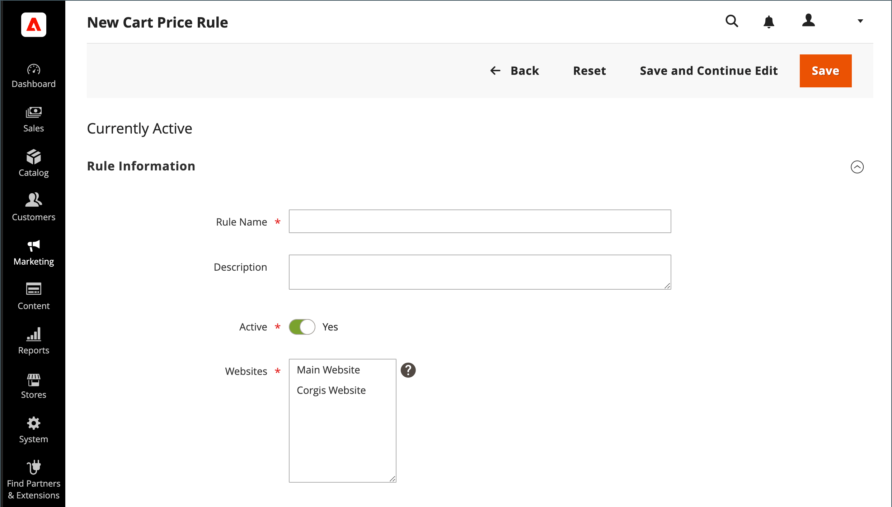
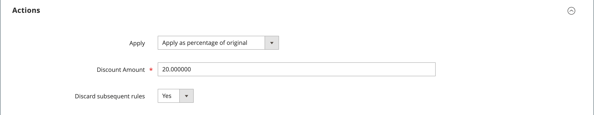

# Een regel voor catalogusprijzen maken

Volg deze instructies om een korting op specifieke producten toe te passen wanneer aan een reeks voorwaarden wordt voldaan. Kortingen op catalogusprijzen worden van kracht voordat het product in het winkelwagentje wordt geplaatst.

## Stap 1: Een regel toevoegen

1. Voor _Admin_ sidebar, ga **[!UICONTROL Marketing]** > _[!UICONTROL Promotions]_>**[!UICONTROL Catalog Price Rule]**.

1. Klik in de rechterbovenhoek op **[!UICONTROL Add New Rule]** .

   De sectie _[!UICONTROL Rule Information]_bevat uitbreidbare secties voor **[!UICONTROL Conditions]**en **[!UICONTROL Actions]**.

   {width="700" zoomable="yes"}

1. Vul de velden **[!UICONTROL Rule Name]** en **[!UICONTROL Description]** in.

   Deze velden zijn alleen bedoeld voor uw interne referentie.

1. Stel de **[!UICONTROL Status]** van de prijsregel naar wens in.

   Standaard is de status `Inactive` .

   >[!NOTE]
   >
   >Nadat de regel is gemaakt, kan de status worden bijgewerkt door de status in `Active` of `Inactive` te wijzigen.

1. Selecteer **[!UICONTROL Websites]** waar de regel beschikbaar moet zijn.

1. Selecteer de **[!UICONTROL Customer Groups]** waarop deze regel van toepassing is.

   Als u meerdere groepen wilt kiezen, houdt u Ctrl (PC) of Command (Mac) ingedrukt en klikt u op elke optie.

   >[!NOTE]
   >
   >De opties in deze lijst hangen van de klantengroepen af die in _worden gecreeerd en worden geleid Klanten_ > _Groepen van de Klant_.

1.  (Magento Open Source slechts) ga **[!UICONTROL From]** en **[!UICONTROL To]** data in om te bepalen wanneer de prijsregel in feite is.

   U kunt de data ingaan of **[!UICONTROL Calendar]** gebruiken () om de data te kiezen. Als u de datums leeg laat, wordt de regel ingeschakeld wanneer de prijsregel wordt opgeslagen.

1. Voer een getal in om de **[!UICONTROL Priority]** van deze regel ten opzichte van andere regels vast te stellen.

   >[!NOTE]
   >
   >De instelling _[!UICONTROL Priority]_is belangrijk wanneer hetzelfde catalogusproduct voldoet aan de voorwaarden die voor meerdere prijsregels zijn ingesteld. De regel met de hoogste prioriteit (prioriteiten van het hoogste tot het laagste zijn 0,1,2,3...) wordt actief voor het product.

## Stap 2: De voorwaarden definiëren

De meeste beschikbare voorwaarden zijn gebaseerd op bestaande kenmerkwaarden. Laat de voorwaarden leeg als u de regel op alle producten wilt toepassen.

>[!NOTE]
>
>Als ten minste één voorwaardelijk productkenmerk een lege waarde heeft, wordt de regel voor catalogusprijzen niet op het product toegepast.

>[!NOTE]
>
>Om een `Category` voorwaarde van het productattribuut op om het even welke [ bundel ](../catalog/product-create-bundle.md) of [ gegroepeerd ](../catalog/product-create-grouped.md) product toe te passen, moeten alle kindproducten aan de zelfde categorie voor de regel worden toegewezen om correct toe te passen. Als niet, kunt u de bevordering van de Regel van de Prijs van de a [ Kar ](price-rules-cart-create.md) in plaats daarvan gebruiken.

1. De rol neer en breidt  uit de **[!UICONTROL Conditions]** sectie.

   De eerste voorwaarde wordt standaard weergegeven en de volgende statussen:

   `If **ALL** of these conditions are **TRUE**:`

   {width="400"}

   De instructie heeft twee vette koppelingen waarop u kunt klikken om de opties voor dat gedeelte van de instructie weer te geven. U kunt verschillende voorwaarden maken door de combinatie van deze waarden te wijzigen.

1. Wijzig de instructie op een van de volgende manieren:

   - Klik op **[!UICONTROL ALL]** en selecteer `ALL` of `ANY` .
   - Klik op **[!UICONTROL TRUE]** en selecteer `TRUE` of `FALSE` .
   - Laat de voorwaarde ongewijzigd om de regel op alle producten toe te passen.

   U kunt verschillende voorwaarden maken door de combinatie van deze waarden te wijzigen. In dit voorbeeld wordt de standaardvoorwaarde gebruikt.

1. Klik _toevoegen_ () pictogram aan het begin van de volgende lijn toe en selecteer een optie voor de voorwaarde, zoals een productattribuut of een combinatie.

1. Kies in de lijst onder **[!UICONTROL Product Attribute]** het kenmerk dat u als basis voor de voorwaarde wilt gebruiken.

   In dit voorbeeld is de voorwaarde `Attribute Set` .

   {width="400"}

   >[!NOTE]
   >
   >Voor een attribuut om in de lijst te verschijnen, moet het voor gebruik in promotionele regelvoorwaarden worden gevormd. Meer leren, zie {de Attributen van het 0} Product ](../catalog/product-attributes.md).[

   >[!NOTE]
   >
   >Wanneer het gebruiken van de `is not one of` voorwaarde met a _SKU_ productattributen en configureerbaar product, zowel de ouder als kindproduct SKUs moet worden geselecteerd. Als u wilt voorkomen dat alle onderliggende SKU&#39;s in de regel worden vermeld, kunt u de voorwaarde `does not contain` gebruiken met algemene SKU-onderdelen van een configureerbaar product en de onderliggende producten ervan.

   De geselecteerde voorwaarde wordt weergegeven in de instructie, gevolgd door nog twee vette koppelingen. Welke opties beschikbaar zijn, is afhankelijk van het kenmerk condition dat u selecteert. In de verklaring staat nu:

   `If **ALL** of these conditions are **TRUE**:  Attribute Set **is** …`

1. Klik op **[!UICONTROL is]** en kies de vergelijkingsoperator die de voorwaarde beschrijft waaraan moet worden voldaan.

   Deze opties kunnen een optie voor verschillende vergelijkingen omvatten. In dit voorbeeld zijn de opties `is` en `is not` .

1. Selecteer of typ waarden voor de voorwaarde.

   Afhankelijk van de voorwaarde, kunt u producten van een net of een lijst selecteren, een numerieke waarde ingaan, etc.

   {width="400"}

   Het geselecteerde item wordt weergegeven in de instructie om de voorwaarde te voltooien.

   `If **ALL** of these conditions are **TRUE**:   Attribute Set **is Default**`

1. Om een andere voorwaardenlijn aan de verklaring toe te voegen, __ klikken () pictogram toe en kies één van het volgende:

   - `Conditions Combination`
   - `Product Attribute`

   Herhaal het proces totdat alle gewenste voorwaarden zijn voltooid.

   Als u op elk ogenblik een deel van de voorwaardenverklaring wilt schrappen, klik **[!UICONTROL Delete]** ( pictogram aan het eind van de lijn.

## Stap 3: De acties definiëren

1. Breid  de **[!UICONTROL Actions]** sectie uit en doe het volgende:

   {width="600" zoomable="yes"}

1. Stel onder **[!UICONTROL Pricing Structure Rules]** **[!UICONTROL Apply]** in op een van de volgende opties:

   - `Apply as percentage of original` - Hiermee wordt het item gekort door een percentage van de normale prijs af te trekken. Bijvoorbeeld: geef 10 op in het kortingsbedrag voor een uiteindelijke prijs die 10% lager is dan de normale prijs.
   - `Apply as fixed amount` - Hiermee wordt het object gekort door een vast bedrag af te trekken van de normale prijs. Bijvoorbeeld: voer 10 in Korting Bedrag in voor een definitieve prijs die $10 minder dan de normale prijs is.
   - `Adjust final price to this percentage` - Past de definitieve prijs met een percentage van de regelmatige prijs aan. Bijvoorbeeld: Voer 25 in Korting Bedrag in voor een uiteindelijke prijs die 75% lager is dan de normale prijs.
   - `Adjust final price to discount value` - Hiermee stelt u de uiteindelijke prijs in op een vast, gedisconteerd bedrag. Bijvoorbeeld: voer 20 in het bedrag voor korting in voor een uiteindelijke prijs van $20,00.

   >[!NOTE]
   >
   >_Regelmatige prijs_ verwijst naar de prijs van het basisproduct zonder om het even welke geavanceerde tarifering (special/tier/groep) of promotionele kortingen. _Definitieve prijs_ verwijst naar de verdisconteerde prijs die in het winkelwagentje verschijnt.   de **_definitieve_** productprijs wordt berekend als **_minimum_** relevante prijs, gebruikend de volgende formule:  `Final Price=Min(Regular(Base) Price, Group(Tier) Price, Special Price, Catalog Price Rule) + Sum(Min Price per each required custom option)`

   >[!NOTE]
   >
   >_**product Aanpasbare Opties van de Prijs van de Vaste Prijs**_ {worden _niet_ beïnvloed door de Prijs van de Groep, de Prijs van de Rij, de Speciale Prijs, of de regels van de Prijs van de Catalogus.

1. Voer de **[!UICONTROL Discount Amount]** in.

1. Als u de verwerking van andere regels wilt stoppen nadat deze regel is toegepast, stelt u **[!UICONTROL Discard Subsequent Rules]** in op `Yes` .

   >[!NOTE]
   >
   >Als u dit instelt op `Yes` , voorkomt u dat het systeem meerdere kortingen (regels) toepast op hetzelfde product.

## Stap 4: verwante dynamische blokken toevoegen

{{ee-feature}}

[ Dynamische blokken ](../content-design/dynamic-blocks.md) die met een regel van de catalogusprijs worden geassocieerd verschijnen in de storefront wanneer de voorwaarden worden voldaan aan. Dit is een optionele stap.

1. Breid  uit de **[!UICONTROL Related Dynamic Blocks]** sectie.

1. Gebruik de [ onderzoeksfilters ](../getting-started/admin-workspace.md) om van de dynamische blokken de plaats te bepalen die u met de regel wilt associëren.

1. Schakel het selectievakje in de eerste kolom in om het dynamische blok aan de regel te koppelen.

   {width="600" zoomable="yes"}

1. Klik op **[!UICONTROL Save and Continue Edit]**.

## Stap 5: Plan de regel

{{ee-feature}}

>[!NOTE]
>
>Het plaatsen van de regel aan actief moet als geplande update worden toegevoegd. Meer leren, zie [ Geplande Veranderingen ](price-rule-catalog-scheduled-changes.md).

1. In de _Geplande Veranderingen_ doos, klik **[!UICONTROL Schedule New Update]** bij de bovenkant van de doos).

   Als de regel een bestaande geplande update heeft, kunt u op **[!UICONTROL View/Edit]** rechts van de vermelde wijziging klikken.

   U kunt de bestaande update bewerken of de regel voor catalogusprijzen toewijzen aan een andere campagne. De **geeft Bestaande optie van de Update** uit wordt geselecteerd door gebrek.

1. Als u de regel wilt inplannen, voert u de waarden **[!UICONTROL Start Date]** en **[!UICONTROL End Date]** in dat de prijsregel actief moet zijn.

   U kunt of de data ingaan of de data van de _Kalender_ kiezen ().

   {width="600" zoomable="yes"}

1. Klik op **[!UICONTROL Save]**.

1. In de _sectie van de Informatie van de Regel_, plaats **[!UICONTROL Status]** aan `active`.

## Stap 6: Sla de regel op en test deze

1. Sla de regel op wanneer deze is voltooid.

   -  (Magento Open Source slechts) klikt **[!UICONTROL Save and Apply]**.

   -  (Adobe Commerce slechts) klikt **[!UICONTROL Save]**.

     De pagina van de Informatie van de Regel toont een bijgewerkte chronologie in de Geplande Veranderingen voor de regel.

     {width="600" zoomable="yes"}

1. Eigenschappen voor een regel bijwerken:

   -  (Adobe Commerce slechts) klik **[!UICONTROL Edit]** om de _[!UICONTROL Rule Information]_pagina te tonen.

   -  (Magento Open Source slechts) klik de regel in de lijst om de _[!UICONTROL Rule Information]_pagina te tonen.

1. Test de regel om er zeker van te zijn dat deze correct werkt.

   Prijsregels worden elke avond automatisch met andere systeemregels verwerkt. Wanneer u een prijsregel creeert, laat genoeg tijd voor het in het systeem alvorens u de regel test om ervoor te zorgen dat het correct werkt. Aangezien nieuwe regels worden toegevoegd, herberekent Commerce de prijzen en de prioriteiten dienovereenkomstig.

## Demo van catalogusprijsregel

Bekijk deze video voor meer informatie over het maken van prijsregels voor catalogi:

>[!VIDEO](https://video.tv.adobe.com/v/343834?quality=12&learn=on)

## Veldomschrijvingen

### [!UICONTROL Rule Information]

| Veld | Beschrijving |
|-----|-----------|
| [!UICONTROL Rule name] | (Vereist) De naam van de regel is voor interne verwijzing. |
| [!UICONTROL Description] | Een beschrijving van de regel moet het doel van de regel bevatten en uitleggen hoe deze wordt gebruikt. |
| [!UICONTROL Websites] | (Vereist) Hiermee worden de websites geïdentificeerd waarop de regel kan worden gebruikt. |
| [!UICONTROL Customer Groups] | (Vereist) Identificeert de klantengroepen waarop de regel van toepassing is. |
| [!UICONTROL Priority] | Een getal dat de prioriteit van deze regel ten opzichte van andere regels aangeeft. Prioriteiten van het hoogste naar het laagste niveau zijn `0,1,2,3...` |
| [!UICONTROL Status] |  (Magento Open Source slechts) bepaalt als de regel in de opslag actief is. Opties: `Yes` / `No` |
| [!UICONTROL From] |  (Magento Open Source slechts) specificeert de eerste dag dat de prijsregel in feite is. Als deze optie leeg blijft, wordt de prijsregel toegepast wanneer deze wordt opgeslagen. |
| [!UICONTROL To] |  (Magento Open Source slechts) specificeert de laatste dag dat de prijsregel in feite is. Als je niets invult, gaat de prijsregel eindeloos door. |

{style="table-layout:auto"}

### [!UICONTROL Conditions]

Hiermee geeft u de voorwaarden op waaraan moet worden voldaan voordat de regel voor catalogusprijzen in werking treedt. Als deze optie niet wordt opgegeven, geldt de regel voor alle producten.

### [!UICONTROL Actions]

| Veld | Beschrijving |
|-----|-----------|
| [!UICONTROL Apply] | Bepaalt het type berekening dat op de aankoop wordt toegepast. Opties:  **[!UICONTROL Apply as percentage of original]**- hiermee wordt het item in mindering gebracht op een percentage van de normale prijs. **[!UICONTROL Apply as fixed amount]** - Hiermee wordt het object gekort door een vast bedrag af te trekken van de normale prijs.  **[!UICONTROL Adjust final price to this percentage]**- Past de definitieve prijs met een percentage van de regelmatige prijs aan. **[!UICONTROL Adjust final price to discount value]** - Hiermee stelt u de uiteindelijke prijs in op een vast, gedisconteerd bedrag.   **_Nota:_**Regelmatige prijs verwijst naar de prijs van het basisproduct zonder enige geavanceerde tarifering (special/tier/groep) of promotionele kortingen. De uiteindelijke prijs heeft betrekking op de verlaagde prijs die in het winkelwagentje wordt weergegeven.   de**_definitieve _**productprijs wordt berekend als**_minimum _**relevante prijs, gebruikend de volgende formule:  `Final Price=Min(Regular(Base) Price, Group(Tier) Price, Special Price, Catalog Price Rule) + Sum(Min Price per each required custom option)` |
| [!UICONTROL Discount Amount] | (Vereist) Het bedrag van korting dat wordt aangeboden. |
| [!UICONTROL Discard Subsequent Rules] | Hiermee bepaalt u of er aanvullende regels kunnen worden toegepast op deze aankoop. Selecteer `Yes` om te voorkomen dat meerdere kortingen op dezelfde aankoop worden toegepast. Opties: `Yes` / `No` |

{style="table-layout:auto"}

### [!UICONTROL Related Dynamic Blocks]

{{ee-feature}}

Identificeert om het even welke [ dynamische blokken ](../content-design/dynamic-blocks.md) die met de regel worden geassocieerd.
