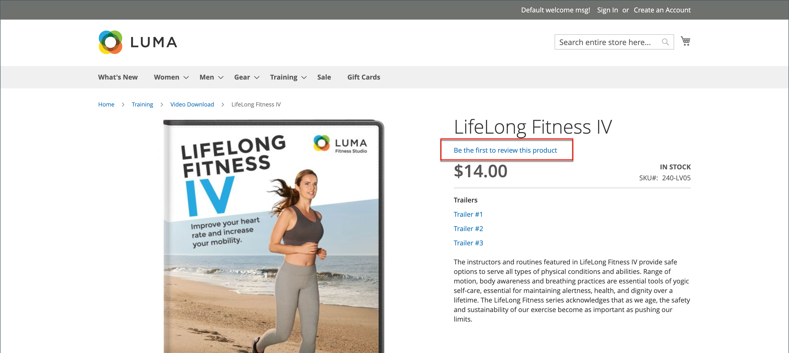
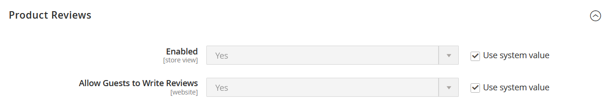
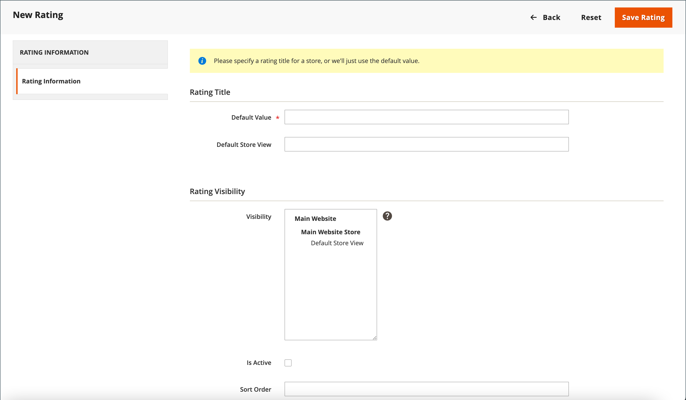

# Productbeoordelingen

Productbeoordelingen helpen een gemeenschapsgevoel op te bouwen en worden als geloofwaardiger beschouwd dan reclamegeld kan kopen. Sommige zoekmachines geven sites met productoverzichten een hogere positie dan sites zonder recensies. Voor degenen die uw site vinden door naar een specifiek product te zoeken, is een productoverzicht in feite de openingspagina van uw winkel. Met productreeksen kunnen mensen je winkel vinden, erbij betrokken blijven en vaak verkopen.

De handel omvat een inheemse capaciteit van productrevisies die u van Admin kunt beheren. U kunt ook een extensie gebruiken van het [Commerce Marketplace](../getting-started/commerce-marketplace.md) om een gehoste revisiebeheersysteem te gebruiken.

>[!NOTE]
>
>Adobe Commerce en Magento Open Source versie 2.4.0 tot en met 2.4.3 bevatten de door de Yotpo-leverancier ontwikkelde uitbreiding. Vanaf de versie 2.4.4 wordt deze extensie niet meer gebundeld met de kernrelease en moet deze worden geïnstalleerd en bijgewerkt vanaf de Commerce Marketplace. De Marketplace biedt ook toegang tot de huidige documentatie die wordt geleverd door de ontwikkelaar van de extensie.
>  
>Als u de gebundelde toegelaten en gevormde uitbreiding hebt, moet u uw composer.json- dossier als deel van het 2.4.4 verbeteringsproces bijwerken en om extensie updates te beheren die door:gaan. Zie [Upgrademodules](https://experienceleague.adobe.com/docs/commerce-operations/upgrade-guide/modules/upgrade.html) in de _Upgradehandleiding_ voor meer informatie .

## Productoverzichten op de winkel

Wanneer de functie Systeemeigen productrelevaluaties is ingeschakeld, kunnen klanten voor elk product in uw catalogus revisies schrijven. Revisies kunnen vanaf de productpagina worden geschreven door op:

- **Revisie toevoegen** voor producten met bestaande beoordelingen.

- **Wees de eerste om dit product te beoordelen** voor producten zonder bestaande beoordelingen.

De [!UICONTROL Reviews] bevat alle huidige revisies en het formulier waarmee een revisie is verzonden.

Uw configuratie bepaalt of klanten een account bij uw winkel moeten openen voordat ze productrevisies schrijven of beoordelingen als gasten kunnen verzenden. Als revisoren een account moeten openen, wordt anonieme inzendingen voorkomen en wordt de kwaliteit van de beoordelingen verbeterd.

{width="700" zoomable="yes"}

Het aantal sterren geeft de tevredenheid van het product aan. Bezoekers kunnen op de koppeling klikken om de revisies te lezen en hun eigen revisies te schrijven. Als stimulans kunnen klanten beloningspunten ontvangen voor het indienen van een nieuw onderzoek. Wanneer een revisie wordt ingediend, wordt deze ter moderatie naar de Admin gestuurd. Als de revisie is goedgekeurd, wordt deze gepubliceerd in uw winkel.

{width="700" zoomable="yes"}

### [!UICONTROL My Product Reviews]

De _[!UICONTROL My Product Reviews]_in het gedeelte van het dashboard voor de klantenaccount worden alle revisies weergegeven die door de klant zijn ingediend en die voor publicatie zijn goedgekeurd. Elke samenvatting van het controleoverzicht bevat de datum waarop het nieuwe onderzoek is ingediend, koppelingen naar de productpagina en de revisiegegevens.

{width="700" zoomable="yes"}

1. In de zijbalk van hun account kiest de klant **[!UICONTROL My Product Reviews]**.

1. Klik op **[!UICONTROL See Details]**.

   {width="700" zoomable="yes"}

## Functies voor productoverzicht inschakelen

De functie Recensies van het Product van de Handel wordt toegelaten door gebrek.

>[!NOTE]
>
>Deze velden instellen op `No` en maak Recensies van het Product van de Handel onbruikbaar, moet u de **Systeemwaarde gebruiken** selectievakjes.

1. Op de _Beheerder_ zijbalk, ga naar **[!UICONTROL Stores]** > _[!UICONTROL Settings]_>**[!UICONTROL Configuration]**.

1. Vouw in het linkerdeelvenster uit **[!UICONTROL Catalog]** en selecteert u **[!UICONTROL Catalog]** onder.

1. Uitbreiden  de **[!UICONTROL Product Reviews]** sectie.

   {width="600" zoomable="yes"}

1. Set **[!UICONTROL Enabled]** tot `Yes`.

   Dit is de standaardinstelling die productrevisies mogelijk maakt.

1. Set **[!UICONTROL Allow Guests to Write Reviews]** tot `Yes`.

   Dit is de standaardinstelling die bepaalt of klanten een account bij uw winkel moeten openen om productrevisies te kunnen schrijven.

1. Klik op **[!UICONTROL Save Config]**.

## Aangepaste ratings maken

Met de Recensies van het Product van de Handel, kunnen de klanten ratings toewijzen wanneer zij een productoverzicht voorleggen. De standaardclassificaties zijn kwaliteit, prijs en waarde. Daarnaast kunt u uw eigen aangepaste beoordelingen toevoegen. De vijfsterrenwaarderingen die op cataloguspagina&#39;s worden weergegeven, worden gemiddeld voor elk product.

{width="700" zoomable="yes"}

1. Op de _Beheerder_ zijbalk, ga naar **[!UICONTROL Stores]** > _[!UICONTROL Attributes]_>**[!UICONTROL Rating]**.

1. Klik in de rechterbovenhoek op **[!UICONTROL Add New Rating]**.

   {width="700" zoomable="yes"}

1. In de _[!UICONTROL Rating Title]_in, voert u de **[!UICONTROL Default Value]**voor de nieuwe rating.

   Voer, indien van toepassing, ook de vertaling in voor elke winkelweergave.

   {width="600" zoomable="yes"}

1. In de _Zichtbaarheid beoordeling_ sectie, set **[!UICONTROL Visibility In]** naar de winkelweergave waar de classificatie moet worden gebruikt.

   Als u meerdere winkelweergaven wilt selecteren, houdt u Ctrl (PC) of Command (Mac) ingedrukt en klikt u op elk item.

   >[!NOTE]
   >
   >Classificaties zijn alleen zichtbaar als deze zijn toegewezen aan een winkelweergave.

1. Voor **[!UICONTROL Sort Order]** Voer een getal in om de volgorde van deze classificatie te bepalen wanneer deze bij anderen wordt vermeld.

1. Als u de score wilt weergeven op de winkel, selecteert u de optie **[!UICONTROL Is Active]** selectievakje.

   {width="600" zoomable="yes"}

1. Klik op **[!UICONTROL Save Rating]**.

   De gemiddelde score voor alle revisies wordt weergegeven voor elk product op de pagina voor het raster van het catalogusproduct.

   {width="700" zoomable="yes"}
