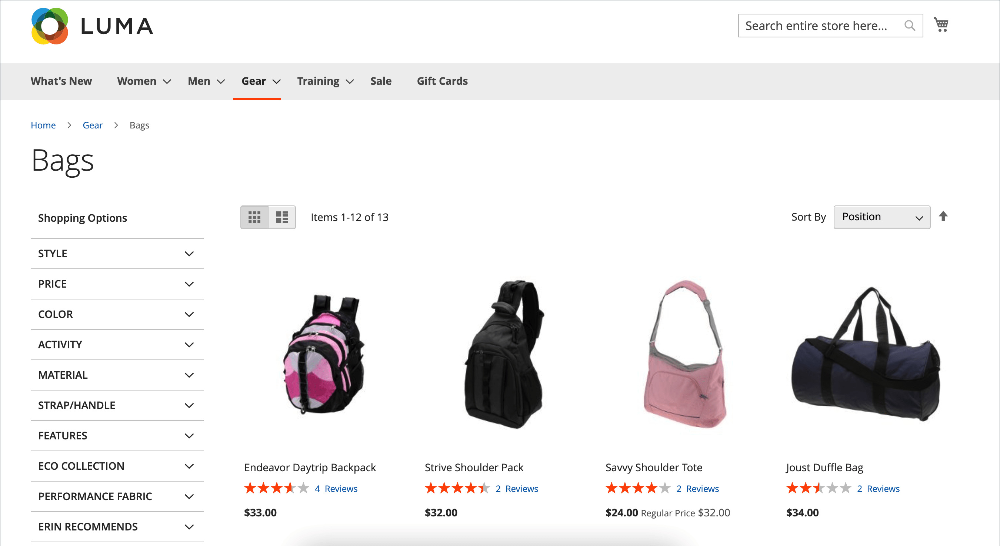

# Productbeoordelingen

Productbeoordelingen helpen een gemeenschapsgevoel op te bouwen en worden als geloofwaardiger beschouwd dan reclamegeld kan kopen. Sommige zoekmachines geven sites met productoverzichten een hogere positie dan sites zonder recensies. Voor degenen die uw site vinden door naar een specifiek product te zoeken, is een productoverzicht in feite de openingspagina van uw winkel. Met productreeksen kunnen mensen je winkel vinden, erbij betrokken blijven en vaak verkopen.

Commerce beschikt over een native mogelijkheid voor productreeksen die u kunt beheren via de beheerfunctie. U kunt een uitbreiding van de [ Commerce Marketplace ](../getting-started/commerce-marketplace.md) ook gebruiken om een ontvangen systeem van het overzichtsbeheer te gebruiken.

>[!NOTE]
>
>Adobe Commerce en Magento Open Source versie 2.4.0 tot en met 2.4.3 bevatten de door de Yotpo-leverancier ontwikkelde uitbreiding. Vanaf de versie 2.4.4 wordt deze extensie niet meer gebundeld met de kernrelease en moet deze worden geïnstalleerd en bijgewerkt vanaf de Commerce Marketplace. De Marketplace biedt ook toegang tot de huidige documentatie die wordt geleverd door de ontwikkelaar van de extensie.
>  
>Als u de gebundelde toegelaten en gevormde uitbreiding hebt, moet u uw composer.json- dossier als deel van het 2.4.4 verbeteringsproces bijwerken en om extensie updates te beheren die door:gaan. Zie [ modules van de Verbetering ](https://experienceleague.adobe.com/docs/commerce-operations/upgrade-guide/modules/upgrade.html) in de _Gids van de Verbetering_ voor meer informatie.

## Productoverzichten op de winkel

Wanneer de functie Systeemeigen productrelevaluaties is ingeschakeld, kunnen klanten voor elk product in uw catalogus revisies schrijven. Revisies kunnen vanaf de productpagina worden geschreven door op:

- **voeg Uw Overzicht** voor producten met bestaande overzichten toe.

- **ben de eerste om dit product** voor producten zonder bestaande overzichten te herzien.

Het tabblad [!UICONTROL Reviews] bevat een lijst met alle huidige revisies en het formulier waarmee een revisie is verzonden.

Uw configuratie bepaalt of klanten een account bij uw winkel moeten openen voordat ze productrevisies schrijven of beoordelingen als gasten kunnen verzenden. Als revisoren een account moeten openen, wordt anonieme inzendingen voorkomen en wordt de kwaliteit van de beoordelingen verbeterd.

{width="700" zoomable="yes"} toe

Het aantal sterren geeft de tevredenheid van het product aan. Bezoekers kunnen op de koppeling klikken om de revisies te lezen en hun eigen revisies te schrijven. Als stimulans kunnen klanten beloningspunten ontvangen voor het indienen van een nieuw onderzoek. Wanneer een revisie wordt ingediend, wordt deze ter moderatie naar de Admin gestuurd. Als de revisie is goedgekeurd, wordt deze gepubliceerd in uw winkel.

{width="700" zoomable="yes"}

### [!UICONTROL My Product Reviews]

In het gedeelte _[!UICONTROL My Product Reviews]_van het dashboard voor de klantenaccount worden alle revisies weergegeven die door de klant zijn ingediend en die zijn goedgekeurd voor publicatie. Elke samenvatting van het controleoverzicht bevat de datum waarop het nieuwe onderzoek is ingediend, koppelingen naar de productpagina en de revisiegegevens.

{width="700" zoomable="yes"}

1. In de zijbalk van hun account kiest de klant **[!UICONTROL My Product Reviews]** .

1. Klik op **[!UICONTROL See Details]** om de volledige revisie weer te geven.

   {width="700" zoomable="yes"}

## Functies voor productoverzicht inschakelen

De functie Commerce Product Reviews is standaard ingeschakeld.

>[!NOTE]
>
>Om deze gebieden aan `No` te plaatsen en de Revisies van het Product van Commerce onbruikbaar te maken, moet u de **checkboxes van de systeemwaarde van het Gebruik** ontruimen.

1. Voor _Admin_ sidebar, ga **[!UICONTROL Stores]** > _[!UICONTROL Settings]_>**[!UICONTROL Configuration]**.

1. Vouw in het linkerdeelvenster **[!UICONTROL Catalog]** uit en selecteer **[!UICONTROL Catalog]** eronder.

1. Breid  de **[!UICONTROL Product Reviews]** sectie uit.

   {width="600" zoomable="yes"}

1. Stel **[!UICONTROL Enabled]** in op `Yes` .

   Dit is de standaardinstelling die productrevisies mogelijk maakt.

1. Stel **[!UICONTROL Allow Guests to Write Reviews]** in op `Yes` .

   Dit is de standaardinstelling die bepaalt of klanten een account bij uw winkel moeten openen om productrevisies te kunnen schrijven.

1. Klik op **[!UICONTROL Save Config]** als de bewerking is voltooid.

## Aangepaste ratings maken

Met de Commerce Product Reviews kunnen klanten beoordelingen toewijzen wanneer ze een productoverzicht indienen. De standaardclassificaties zijn kwaliteit, prijs en waarde. Daarnaast kunt u uw eigen aangepaste beoordelingen toevoegen. De vijfsterrenwaarderingen die op cataloguspagina&#39;s worden weergegeven, worden gemiddeld voor elk product.

{width="700" zoomable="yes"}

1. Voor _Admin_ sidebar, ga **[!UICONTROL Stores]** > _[!UICONTROL Attributes]_>**[!UICONTROL Rating]**.

1. Klik in de rechterbovenhoek op **[!UICONTROL Add New Rating]** .

   {width="700" zoomable="yes"}

1. Voer in de sectie _[!UICONTROL Rating Title]_de **[!UICONTROL Default Value]**in voor de nieuwe classificatie.

   Voer, indien van toepassing, ook de vertaling in voor elke winkelweergave.

   {width="600" zoomable="yes"}

1. In de _sectie van het Zichtbaarheid van de Classificatie_, plaats **[!UICONTROL Visibility In]** aan de opslagmening waar de classificatie moet worden gebruikt.

   Als u meerdere winkelweergaven wilt selecteren, houdt u Ctrl (PC) of Command (Mac) ingedrukt en klikt u op elk item.

   >[!NOTE]
   >
   >Classificaties zijn alleen zichtbaar als deze zijn toegewezen aan een winkelweergave.

1. Voer bij **[!UICONTROL Sort Order]** een getal in om de volgorde van deze classificatie te bepalen wanneer deze bij anderen wordt vermeld.

1. Schakel het selectievakje **[!UICONTROL Is Active]** in als u uw waardering wilt weergeven op de winkel.

   {width="600" zoomable="yes"}

1. Klik op **[!UICONTROL Save Rating]** als de bewerking is voltooid.

   De gemiddelde score voor alle revisies wordt weergegeven voor elk product op de pagina voor het raster van het catalogusproduct.

   {width="700" zoomable="yes"}
