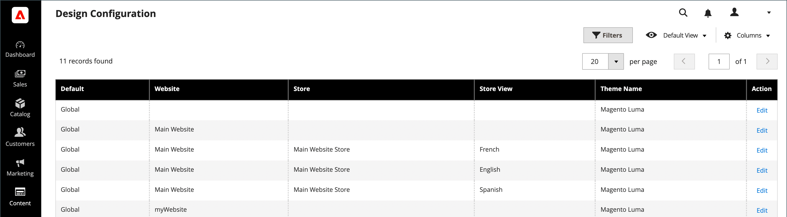

# Overzicht van SEO

_Zoekmachine optimaliseren_ (SEO) is de praktijk om de inhoud en presentatie van een site te verfijnen om de manier waarop de pagina&#39;s door zoekmachines worden geïndexeerd te verbeteren. De handel omvat diverse eigenschappen om uw aan de gang zijnde SEO inspanning te steunen.

## Metagegevens

Meer informatie over het toevoegen en verbeteren van trefwoordrijk [metagegevens](meta-data.md) voor uw site en winkel.

## Een sitemap gebruiken

A [site-overzicht](sitemap-xml.md) verbetert de manier waarop uw winkel door zoekmachines wordt geïndexeerd en is ontworpen om pagina&#39;s te zoeken die door webcrawlers over het hoofd kunnen worden gezien. U kunt een site-overzicht configureren om alle pagina&#39;s en afbeeldingen te indexeren.

## URL herschrijft

De [URL herschrijven](url-rewrite.md) kunt u elke URL wijzigen die is gekoppeld aan een product, categorie of CMS-pagina.

## Zoekmachine-robots

De configuratie van de Handel omvat montages om instructies voor Webkruiplers en bots te produceren en te beheren die uw plaats indexeren. Indien de aanvraag `robots.txt` bereikt Handel (eerder dan een fysiek dossier), wordt het dynamisch verpletterd aan het robots controlemechanisme. De instructies zijn richtlijnen die door de meeste zoekmachines worden erkend en gevolgd.

Standaard bevat het bestand robots.txt dat wordt gegenereerd door Handel instructies voor webcrawler om te voorkomen dat bepaalde delen van de site worden geïndexeerd die bestanden bevatten die intern door het systeem worden gebruikt. U kunt de standaardinstellingen gebruiken of uw eigen aangepaste instructies definiëren voor iedereen of voor specifieke zoekprogramma&#39;s. Er zijn veel online artikelen die het onderwerp in detail onderzoeken.

### Voorbeeld van aangepaste instructies

**Volledige toegang toestaan**

    Gebruikersagent:*
    Niet toestaan:

**Hiermee wordt de toegang tot alle mappen uitgeschakeld**

    Gebruikersagent:*
    Niet toestaan: /

**Standaardinstructies**

    Gebruikersagent: *
    Niet toestaan: /index.php/
    Niet toestaan: /*?
    Niet toestaan: /checkout/
    Niet toestaan: /app/
    Niet toestaan: /lib/
    Niet toestaan: /*.php$
    Niet toestaan: /pkginfo/
    Niet toestaan: /report/
    Niet toestaan: /var/
    Niet toestaan: /catalog/
    Niet toestaan: /customer/
    Niet toestaan: /sendvriend/
    Niet toestaan: /review/
    Niet toestaan: /*SID=

### Configureren `robots.txt`

1. Op de _Beheerder_ zijbalk, ga naar **[!UICONTROL Content]** > _[!UICONTROL Design]_>**[!UICONTROL Configuration]**.

1. Zoek de **[!UICONTROL Global]** configuratie in de eerste rij van het raster en klik op **[!UICONTROL Edit]**.

   {width="700" zoomable="yes"}

1. Omlaag schuiven en uitbreiden  de **[!UICONTROL Search Engine Robots]** en voer de volgende handelingen uit:

   {width="600" zoomable="yes"}

   - Set **[!UICONTROL Default Robots]** op een van de volgende wijzen:

     | Optie | Beschrijving |
     |------|------------|
     | `INDEX, FOLLOW` | Instrueert webcrawlers de site te indexeren en later te controleren op wijzigingen. |
     | `NOINDEX, FOLLOW` | Hiermee geeft u webcrawlers de opdracht om de site niet te indexeren, maar om later te controleren op wijzigingen. |
     | `INDEX, NOFOLLOW` | Geeft webcrawlers de opdracht de site één keer te indexeren, maar later niet te controleren op wijzigingen. |
     | `NOINDEX, NOFOLLOW` | Geeft webcrawlers de opdracht te voorkomen dat de site wordt geïndexeerd en later niet opnieuw te controleren op wijzigingen. |

     {style="table-layout:auto"}

   - Voer zo nodig aangepaste instructies in het dialoogvenster **[!UICONTROL Edit Custom instruction of robots.txt file]** doos. Als een site bijvoorbeeld in ontwikkeling is, wilt u mogelijk de toegang tot alle mappen weigeren.

   - Klik op **[!UICONTROL Reset to Default]**.

1. Klik op **[!UICONTROL Save Configuration]**.
