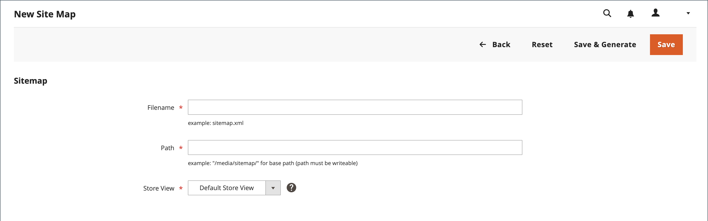

# Site-maps

Een site-overzicht verbetert de manier waarop uw winkel wordt geïndexeerd door zoekprogramma&#39;s en is ontworpen om pagina&#39;s te zoeken die mogelijk door webcrawlers worden genegeerd. U kunt een site-overzicht configureren om alle pagina&#39;s en afbeeldingen te indexeren.

Wanneer toegelaten, leidt de Handel tot een geroepen dossier `sitemap.xml` die naar de installatie wordt opgeslagen op de locatie die u opgeeft. De configuratie geeft u de capaciteit om de frequentie van de updates, en de prioriteit voor elk type van inhoud te plaatsen. Uw site-overzicht moet zo vaak worden bijgewerkt als de inhoud op uw site verandert, mogelijk dagelijks, wekelijks of maandelijks.

Terwijl uw site in ontwikkeling is, kunt u instructies opnemen in het dialoogvenster `robots.txt` bestand voor webcrawlers om indexering van de site te voorkomen. Vervolgens kunt u de instructies wijzigen zodat de site kan worden geïndexeerd.

Voor technische informatie, zie [sitemap en robots.txt toevoegen][1] in de _Handleiding voor handel in Cloud-infrastructuur_.

{width="700" zoomable="yes"}

## Stap 1. Het site-overzicht configureren

Voltooi de [XML Sitemap-configuratie](#site-map-configuration) om te bepalen wat er wordt opgenomen en hoe vaak het site-overzicht wordt bijgewerkt.

## Stap 2. Site-overzicht genereren

1. Op de _Beheerder_ menu, ga naar **[!UICONTROL Marketing]** > _[!UICONTROL SEO & Search]_>**[!UICONTROL Site Map]**.

1. Klik op **[!UICONTROL Add Site Map]**.

   {width="700" zoomable="yes"}

1. Het site-overzicht invoeren **[!UICONTROL Filename]**. Bijvoorbeeld: `sitemap.xml`

1. Voer de **[!UICONTROL Path]** om te bepalen waar het site-kaartbestand zich op de server bevindt. Zorg ervoor dat het pad schrijfbaar is.

   - `/sitemap/` - Plaatst het bestand met het site-overzicht in een map met de naam _sitemap_.

   - `/` - Plaatst het bestand met het site-overzicht op het basispad of de hoofdmap van de installatie van Commerce.

   {width="600" zoomable="yes"}

1. Klik op **[!UICONTROL Save & Generate]**.

   Het kan enkele minuten duren voordat het site-overzicht in het raster wordt weergegeven.

## Stap 3. Robots.txt configureren en inschakelen (optioneel)

Voltooi de [robots van zoekmachines](seo-overview.md#search-engine-robots) configuratie met instructies die directe zoekprogramma&#39;s helpen door te kruipen in de delen van uw site die u wilt indexeren.

## Stap 4. Uw site-overzicht verzenden naar zoekprogramma&#39;s

U kunt uw site-overzicht naar verschillende zoekprogramma&#39;s verzenden door ze de koppeling naar de `sitemap.xml` in uw installatie van de Handel. Ga als volgt te werk om de koppeling te kopiëren:

1. In de _Site-overzicht_ lijst, klik URL in met de rechtermuisknop aan **[!UICONTROL Link for Google]** kolom.

1. Kies in het menu **[!UICONTROL Copy Link Address]**.

Zie de instructies voor de specifieke zoekfunctie voor meer informatie. Hier volgt een koppeling naar de instructies voor twee zoekprogramma&#39;s bovenaan:

- [Google][2]
- [Microsoft® Bing][3]

## Stap 5: vorige instructies voor robot herstellen (optioneel)

U kunt nu de oorspronkelijke (standaard)beperkingen herstellen.

## Sitemaps en robots.txt beheren voor meerdere websites

Als u meerdere websites hebt, kunt u het maken en verzenden van sitemaps vereenvoudigen. Eenvoudig [maken](#site-map-configuration) een of meer sitemaps die URL&#39;s bevatten voor al uw geverifieerde winkels en de sitemaps opslaan op één locatie. Alle sites moeten worden gecontroleerd in [Google-zoekconsole](https://support.google.com/webmasters/answer/7451001).

Ga als volgt te werk om sitemaps voor een instantie van meerdere winkels te maken:

1. Een map maken met de naam `sitemaps` in de hoofdmap van uw website en maakt vervolgens submappen voor elk domein:

       /sitemaps/domain_1/
       /sitemaps/domain_2/
   
1. Op de _Beheerder_ zijbalk, ga naar **[!UICONTROL Marketing]** > _[!UICONTROL SEO & Search]_>**[!UICONTROL Site Map]**.

1. Maak of bewerk de sitemapaanbiedingen voor elke winkel en stel de **[!UICONTROL Path]** aan die u voor de opslag creeerde:

   `/sitemaps/domain_1/`
   `/sitemaps/domain_2/`

1. Werk indien nodig het bestand robots.txt bij.

   Als u er zeker van wilt zijn dat de spinnen van de zoekmachine correct naar de nieuwe sitemaps worden geleid, kunt u het bestand robots.txt bijwerken of maken. Voeg de volgende regels bovenaan toe.

       Websitesitemap
       Sitemap: https://www.domain_1.com/sitemaps/domain_1/sitemap.xml
       Sitemap: https://www.domain_2.com/sitemaps/domain_2/sitemap.xml
   
>[!NOTE]
>
>Als op uw site de optie [Apache](https://experienceleague.adobe.com/docs/commerce-operations/installation-guide/prerequisites/web-server/apache.html) de motor van de Webserver, zou u moeten bijwerken [`.htaccess`](https://httpd.apache.org/docs/current/howto/htaccess.html) bestand in de hoofdmap van uw website om andere sitemapverzoeken naar de juiste plaats te sturen.

## Kolombeschrijvingen

| Kolom | Beschrijving |
|------|-----------|
| [!UICONTROL ID] | Het opeenvolgende recordnummer van het huidige site-overzicht. |
| [!UICONTROL Filename] | De bestandsnaam van het site-overzicht. |
| [!UICONTROL Path] | De locatie waar het site-overzicht zich op de server bevindt. Bijvoorbeeld:  `/sitemap/` - Plaatst het bestand met het site-overzicht in een map met de naam _sitemap_, één niveau onder de basis van de installatie van de Handel.  `/` - Plaatst het bestand met het site-overzicht op het basispad of de hoofdmap van de installatie van Commerce. |
| [!UICONTROL Link for Google] | De URL van het site-overzicht dat moet worden verzonden naar Google en andere zoekprogramma&#39;s. |
| [!UICONTROL Last Generated] | Geeft de datum en tijd aan waarop het site-overzicht voor het laatst is gegenereerd. |
| [!UICONTROL Store View] | De archiefweergave waarop het site-overzicht van toepassing is. |
| [!UICONTROL Generate] | Hiermee herstelt u het site-overzicht. |

{style="table-layout:auto"}

## Configuratie van site-overzicht

Uw site-overzicht moet zo vaak worden bijgewerkt als de inhoud op uw site verandert, mogelijk dagelijks, wekelijks of maandelijks. Met de configuratie kunt u de frequentie en de prioriteit voor elk type inhoud instellen.

### Stap 1. De frequentie en prioriteit van inhoudsupdates instellen

1. Op de _Beheerder_ zijbalk, ga naar **[!UICONTROL Stores]** > _[!UICONTROL Settings]_>**[!UICONTROL Configuration]**.

1. Vouw in het linkerdeelvenster uit **[!UICONTROL Catalog]** en kiest u **[!UICONTROL XML Sitemap]**.

1. Uitbreiden  de **[!UICONTROL Categories Options]** en voer de volgende handelingen uit:

   >[!NOTE]
   >
   >Wis indien nodig de **[!UICONTROL Use system value]** Schakel het selectievakje in om deze instellingen te wijzigen.

   - Set **[!UICONTROL Frequency]** op een van de volgende wijzen:

      - `Always`
      - `Hourly`
      - `Daily`
      - `Weekly`
      - `Monthly`
      - `Yearly`
      - `Never`

   - Voor **[!UICONTROL Priority]** Voer een waarde in tussen `0.0` en `1.0`. Nul heeft de laagste prioriteit.

   {width="600" zoomable="yes"}

   Voor een gedetailleerde lijst van deze opties, zie [Categorieopties](../configuration-reference/catalog/xml-sitemap.md#categories-options) in de _Configuratieverwijzing_.

1. Uitbreiden  de **[!UICONTROL Products Options]** en de **[!UICONTROL Frequency]** en **[!UICONTROL Priority]** instellingen.

   Voor een gedetailleerde lijst van deze opties, zie [Productopties](../configuration-reference/catalog/xml-sitemap.md#products-options) in de _Configuratieverwijzing_.

1. Als u wilt bepalen in welke mate afbeeldingen in de sitemap worden opgenomen, stelt u **[!UICONTROL Add Images into Sitemap]** op een van de volgende wijzen:

   - `None`
   - `Base Only`
   - `All`

   {width="600" zoomable="yes"}

1. Uitbreiden  de **[!UICONTROL CMS Pages Options]** en de **[!UICONTROL Frequency]** en **[!UICONTROL Priority]** instellingen.

   {width="600" zoomable="yes"}

   Voor een gedetailleerde lijst van deze opties, zie [Opties voor CMS-pagina&#39;s](../configuration-reference/catalog/xml-sitemap.md#cms-pages-options) in de _Configuratieverwijzing_.

1. Uitbreiden  de **[!UICONTROL Store Url Options]** en de **[!UICONTROL Frequency]** en **[!UICONTROL Priority]** instellingen.

   {width="600" zoomable="yes"}

   Voor een gedetailleerde lijst van deze opties, zie [URL-opties opslaan](../configuration-reference/catalog/xml-sitemap.md#store-url-options) in de _Configuratieverwijzing_.

1. Klik op **[!UICONTROL Save Config]**.

### Stap 2. De instellingen voor genereren voltooien

1. Uitbreiden  de **[!UICONTROL Generation Settings]** sectie.

   Wis indien nodig de **Systeemwaarde gebruiken** Schakel het selectievakje in om deze instellingen te wijzigen.

   {width="600" zoomable="yes"}

   Voor een gedetailleerde lijst van deze opties, zie [Generatie-instellingen](../configuration-reference/catalog/xml-sitemap.md#generation-settings) in de _Configuratieverwijzing_.

1. Als u een sitemap wilt genereren, stelt u **[!UICONTROL Enabled]** tot `Yes` en voer de volgende handelingen uit:

   - Set **[!UICONTROL Start Time]** tot het uur, de minuut, en de seconde dat u de sitemap wilt worden bijgewerkt.

   - Set **[!UICONTROL Frequency]** op een van de volgende wijzen:

      - `Daily`
      - `Weekly`
      - `Monthly`

   - Voor **[!UICONTROL Error Email Recipient]**, voert u het e-mailadres in van de persoon die de melding moet ontvangen als er een fout optreedt tijdens een sitemap-update.

   - Set **[!UICONTROL Error Email Sender]** aan het opslagcontact dat als afzender van de foutenmelding verschijnt.

   - Set **[!UICONTROL Error Email Template]** naar de sjabloon die wordt gebruikt voor de foutmelding.

### Stap 3. Limieten instellen voor bestanden in het site-overzicht

1. Uitbreiden  de **[!UICONTROL Sitemap File Limits]** sectie.

   {width="600" zoomable="yes"}

   Voor een gedetailleerde lijst van deze opties, zie [Limieten voor Sitemap-bestanden](../configuration-reference/catalog/xml-sitemap.md#sitemap-file-limits) in de _Configuratieverwijzing_.

1. Voor **[!UICONTROL Maximum No of URLs per File]**, voert u het maximum aantal URL&#39;s in dat in de sitemap kan worden opgenomen.

   De standaardwaarde is 50.000.

1. Voor **[!UICONTROL Maximum File Size]** Voer de grootste grootte in bytes in die voor de sitemap is toegewezen.

   De standaardgrootte is 10.485.760 bytes.

### Stap 4. De verzendinstellingen voor de zoekmachine instellen

1. Uitbreiden  de **[!UICONTROL Search Engine Submission Settings]** sectie.

   {width="600" zoomable="yes"}

1. Als u een `robots.txt` bestand voor instructies aan zoekprogramma&#39;s die door uw site kruipen, instellen **[!UICONTROL Enable Submission to Robots.txt]** tot `Yes`.

1. Klik op **[!UICONTROL Save Config]**.

[1]: https://experienceleague.adobe.com/docs/commerce-cloud-service/user-guide/configure-store/robots-sitemap.html
[2]: https://support.google.com/webmasters/answer/183669?hl=en
[3]: https://www.bing.com/webmasters/help/Sitemaps-3b5cf6ed
