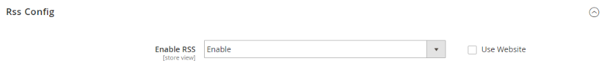

# Sociale media en RSS-feeds

Veel handelaren gebruiken sociale media en andere digitale hulpmiddelen om merk- en productbewustzijn te creëren. U kunt uw winkel integreren met uw sociale netwerken door een Marketplace-extensie te installeren of door een plug-in toe te voegen aan de pagina&#39;s met inhoud. Gebruik RSS-feeds om uw productinformatie te publiceren naar winkelverzamelingssites en deze zelfs op te nemen in uw nieuwsbrieven. Klanten kunnen zich abonneren op uw RSS-feeds om meer te leren over nieuwe producten en promoties.

## Sociale netwerken

Uw opslag kan met sociale netwerken worden verbonden door de uitbreiding van de a [ Marketplace ](../getting-started/commerce-marketplace.md) te installeren. Bovendien kunt u sociale stoppen zoals _gemakkelijk toevoegen als_ knoop aan blokken CMS die in pagina&#39;s door uw opslag kunnen worden opgenomen.

De sociale voorzien van een netwerkplaatsen hebben talrijke stop-ins die gemakkelijk aan uw opslag kunnen worden toegevoegd. Daarnaast bevat de Commerce Marketplace veel extensies die u kunt gebruiken om uw winkel te integreren met sociale media. Het volgende voorbeeld toont hoe te om een Facebook _als_ knoop aan uw opslag toe te voegen.

>[!NOTE]
>
>Adobe Commerce heeft de inheemse _integratie van Facebook van het Magento Sociale_ verwijderd en steunt niet meer de uitbreiding. Ga naar de [ Commerce Marketplace ](https://marketplace.magento.com/catalogsearch/result/?q=Facebook) {:target= &quot;_blank&quot;} om van alternatieve uitbreidingen voor de integratie van Facebook de plaats te bepalen.

### Stap 1. De knopcode ophalen

1. Voor de website van de ontwikkelaars van Meta, ga naar de [ pagina van de knoopopstelling ](https://developers.facebook.com/docs/plugins/like-button).

1. Voor **[!UICONTROL URL to Like]**, ga URL van de pagina in uw opslag in die u mensen _als_ wilt houden.

   U kunt bijvoorbeeld de URL van de homepage van uw winkel invoeren.

1. Kies de **[!UICONTROL Layout]** voor de knop.

1. Voer de **[!UICONTROL Width]** in pixels in die op uw site beschikbaar is voor de knop en het bijbehorende tekstbericht.

1. Stel **[!UICONTROL Action Type]** in op een van de volgende opties:

   - `Like`
   - `Recommend`

1. Klik op **[!UICONTROL Get Code]** om de gegenereerde code naar het klembord te kopiëren.

### Stap 2. Een inhoudsblok maken

1. Ga terug naar de beheerder van uw winkel.

1. Voor _Admin_ sidebar, ga **[!UICONTROL Content]** > _[!UICONTROL Elements]_>**[!UICONTROL Blocks]**.

1. Klik in de rechterbovenhoek op **[!UICONTROL Add New Block]** .

1. Voer een beschrijving **[!UICONTROL Block Title]** in voor interne referentie.

   Bijvoorbeeld: `Facebook Like Button` .

1. Wijs een uniek **[!UICONTROL Identifier]** aan het blok toe, waarbij u alle kleine letters gebruikt en onderstrepingstekens in plaats van spaties.

   Bijvoorbeeld: `facebook_like_button` .

1. Als uw Commerce-instantie meerdere winkelweergaven heeft, kiest u elke **[!UICONTROL Store View]** waar het blok beschikbaar moet zijn.

1. Voeg het codefragment toe aan de blokinhoud, afhankelijk van het gereedschap Inhoud:

   - Wanneer het gebruiken van [!DNL Page Builder], voeg een [ HTML codeblok ](../page-builder/html-code.md) aan het stadium toe en kleef het fragment van code die u van de plaats van Facebook kopieerde. Anders plakt u het codefragment in het vak **[!UICONTROL Content]** .

   - Plak met de editor het codefragment dat u van de Facebook-site hebt gekopieerd naar het vak **[!UICONTROL Content]** .

1. Als het blok niet klaar is om live te gaan, stelt u **[!UICONTROL Enable Block]** in op `No` .

1. Klik op **[!UICONTROL Save Block]** als de bewerking is voltooid.

### Stap 3. Plaats het blok

1. Voeg het blok toe, afhankelijk van het inhoudsgereedschap:

   - Wanneer het gebruiken van [!UICONTROL Page Builder], volg de instructies aan [ voeg het blok ](../page-builder/block.md) aan het stadium toe.

   - Voor _Admin_ sidebar, ga **[!UICONTROL Content]** > _[!UICONTROL Elements]_>**[!UICONTROL Widgets]**.

1. Klik in de rechterbovenhoek op **[!UICONTROL Add Widget]** en voer de volgende handelingen uit:

   -  (Beschikbaar met Adobe Commerce B2B slechts) in de _sectie van Montages_, plaats **[!UICONTROL Type]** aan `CMS Static Block` en klik **[!UICONTROL Continue]**.

   - Controleer of **[!UICONTROL Design Theme]** is ingesteld op het huidige thema.

   - Klik op **[!UICONTROL Continue]**.

1. Ga als volgt te werk in de sectie **[!UICONTROL Storefront Properties]** :

   - Voer bij **[!UICONTROL Widget Title]** een titel in voor interne referentie.

   - Stel **[!UICONTROL Assign to Store Views]** in op `All Store Views` of op de weergave waar de app beschikbaar moet zijn. Als u meerdere weergaven wilt selecteren, houdt u Ctrl (PC) of Command (Mac) ingedrukt en klikt u op elke optie.

   - Voer in het veld **[!UICONTROL Sort Order]** een getal in om de volgorde van het blok te bepalen als het blok op dezelfde locatie op de pagina moet verschijnen als andere inhoudselementen. De bovenste positie is nul.

1. Klik in de sectie _[!UICONTROL Layout Updates]_op **[!UICONTROL Add Layout Update]**en stel **[!UICONTROL Display On]**in op de categorie, het product of de pagina waar u het blok wilt weergeven.

   Als u bijvoorbeeld `All Pages` kiest en het blok in de kop- of voettekst plaatst, wordt het blok op elke pagina van de winkel op dezelfde plaats weergegeven.

   Ga als volgt te werk om het blok op een specifieke pagina te plaatsen:

   - Stel **[!UICONTROL Display On]** in op `Specified Page` en selecteer **[!UICONTROL Page]** waar u het blok wilt weergeven.

   - Kies **[!UICONTROL Block Reference]** om de plaats op de pagina te identificeren waar het blok moet worden geplaatst.

   - Accepteer de standaardinstelling voor **[!UICONTROL Template]** , die is ingesteld op `CMS Static Block Default Template` .

   - Klik op **[!UICONTROL Save and Continue Edit]**.

1. Kies **[!UICONTROL Widget Options]** in het deelvenster aan de linkerkant.

1. Klik op **[!UICONTROL Select Block…]** en kies het blok dat u wilt plaatsen.

1. Klik op **[!UICONTROL Save]** als de bewerking is voltooid.

1. Volg desgevraagd de instructies boven aan de werkruimte om de index en de paginacache bij te werken.

   De widget wordt nu weergegeven in de lijst van _[!UICONTROL Widgets]_.

### Stap 4. De locatie in de winkel controleren

Ga terug naar de winkel om te controleren of het blok zich op de juiste locatie bevindt. Als u het blok wilt verplaatsen, kunt u de widget opnieuw openen en een andere pagina of blokverwijzing proberen.

## RSS-feeds

RSS (Echt Eenvoudige Syndicatie) is een op XML-Gebaseerd gegevensformaat dat wordt gebruikt om informatie online te verspreiden. Uw klanten kunnen op uw voer van RSS intekenen om over nieuwe producten en promoties te leren. RSS-feeds kunnen ook worden gebruikt om uw productinformatie te publiceren naar winkelverzamelplaatsen en kunnen worden opgenomen in nieuwsbrieven.

Wanneer RSS-feeds zijn ingeschakeld, worden eventuele toevoegingen aan producten, specials, categorieën en coupons automatisch naar de abonnees van elke feed verzonden. Een koppeling naar alle RSS-feeds die u publiceert, staat in de voettekst van uw winkel.

{width="100"} 

De software die nodig is om een RSS-feed te lezen, wordt een feed-lezer genoemd en stelt mensen in staat zich te abonneren op koppen, blogs, podcasts en nog veel meer. Google Reader is een van de vele feed-lezers die gratis online beschikbaar zijn.

{width="700" zoomable="yes"}

### Voordelen van het opzetten van een RSS-feed

- Download de nieuwste update van uw winkel of blog
- Lichtadvertenties
- Gewone aandelen
- SEO verhogen
- Verhoog de verkoop

### Typen RSS-feeds

| RSS Feed | Beschrijving |
|--- |--- |
| [!UICONTROL Wish List] | Als deze optie is ingeschakeld, wordt boven aan de pagina&#39;s met verlanglijsten voor klanten een koppeling naar de RSS-feed weergegeven. Bovendien bevat de pagina voor het delen van wensenlijsten een selectievakje waarmee u een koppeling naar de feed kunt opnemen vanuit lijsten met gedeelde wensen. |
| [!UICONTROL New Products] | Hiermee publiceert u een melding van nieuwe producten die aan de catalogus zijn toegevoegd. |
| [!UICONTROL Special Products] | Publiceert kennisgeving van producten met speciale prijzen. |
| [!UICONTROL Coupons / Discounts] | Hiermee wordt melding gepubliceerd van speciale coupons of kortingen die beschikbaar zijn in de winkel. |
| [!UICONTROL Top Level Category] | Hiermee publiceert u een melding van elke wijziging in de categoriestructuur op hoofdniveau van uw catalogus. Deze wijziging wordt weerspiegeld in het hoofdmenu. |
| [!UICONTROL Customer Order Status] | Biedt klanten de mogelijkheid hun orderstatus te volgen met RSS-feed. Als deze optie is ingeschakeld, wordt een koppeling naar de RSS-feed in de volgorde weergegeven. |

{style="table-layout:auto"}

### RSS-feeds instellen voor uw winkel

1. Voor _Admin_ sidebar, ga **[!UICONTROL Stores]** > _[!UICONTROL Settings]_>**[!UICONTROL Configuration]**.

1. Stel in de rechterbovenhoek **[!UICONTROL Store View]** in op de weergaven waar de feeds beschikbaar moeten zijn.

   Klik op **[!UICONTROL OK]** als u wordt gevraagd te bevestigen.

1. Vouw in het linkerdeelvenster **[!UICONTROL Catalog]** uit en kies **[!UICONTROL RSS Feeds]** .

1. Breid  de **[!UICONTROL Rss Config]** sectie uit en reeks **[!UICONTROL Enable RSS]** aan `Enable`.

   {width="600" zoomable="yes"}

   Schakel indien nodig het selectievakje **[!UICONTROL Use Default]** uit om de standaardwaarde te wijzigen.

1. Breid  de **[!UICONTROL Wish List]** sectie uit en reeks **[!UICONTROL Enable RSS]** aan `Enable`.

1. Breid  de **[!UICONTROL Catalog]** sectie uit en plaats andere voer aan `Enable` zoals nodig.

   - **[!UICONTROL New Products]**
   - **[!UICONTROL Special Products]**
   - **[!UICONTROL Coupons/Discounts]**
   - **[!UICONTROL Top Level Category]**

   {width="600" zoomable="yes"}

1. Breid  de **[!UICONTROL Order]** sectie uit en reeks **[!UICONTROL Customer Order Status Notification]** aan `Enable`.

1. Klik op **[!UICONTROL Save Config]** als de bewerking is voltooid.

1. Zie het resultaat op de winkel met `/rss` aan het einde van de pagina-URL.

