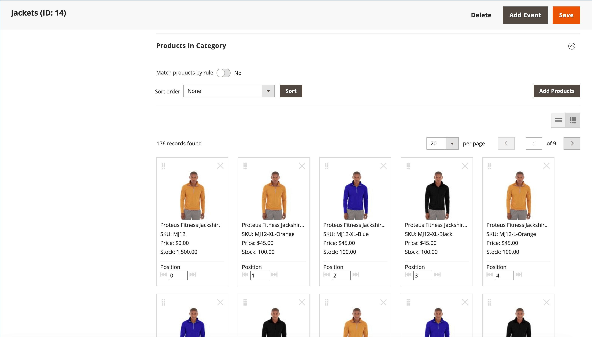

# Visual Merchandiser

{{ee-feature}}

De _Visual Merchandiser_ Dit is een reeks geavanceerde gereedschappen waarmee u producten kunt positioneren en voorwaarden kunt toepassen die bepalen welke producten in de categorielijst worden weergegeven. Het resultaat kan een dynamische selectie van producten zijn die zich aan veranderingen in de catalogus aanpassen. U kunt werken in _visuele modus_, waarin elk product als een tegel op een raster wordt weergegeven, of om te werken vanuit een lijst met producten in de categorie. In elke modus zijn dezelfde gereedschappen beschikbaar en u kunt de knoppen in de rechterbovenhoek gebruiken om te schakelen tussen elk weergavetype.

{width="600" zoomable="yes"}

## Heb toegang tot Visuele Merchandiser

1. Op de _Beheerder_ zijbalk, ga naar **[!UICONTROL Catalog]** > **[!UICONTROL Categories]**.

1. Blader omlaag door de categoriestructuur en klik op de categorie die u wilt bewerken.

1. Omlaag schuiven en uitbreiden  de **[!UICONTROL Products in Category]** sectie.

1. Klik op de knop _Weergeven als tegels_ (  ) om de producten als een raster weer te geven.

1. Klik op **[!UICONTROL Save Category]**.

## De positie van een product wijzigen

1. Gebruik de [sorteervolgorde](../catalog/navigation-product-listings.md) om het product te bekijken dat u wilt bewegen.

   - **Methode 1: Slepen en neerzetten**

     Pak de _Slepen_ () in de rechterbovenhoek van de tegel van het product en zet het product op zijn plaats. Het aantal van elk product wordt aangepast aan de nieuwe positie.

   - **Methode 2: positiewaarde instellen**

     In de _Positie_ controller () op de tegel van het product het nummer invoeren waar het product moet worden weergegeven. Enter `0` om het product boven aan de lijst te plaatsen.

1. Klik op **[!UICONTROL Save Category]**.

>[!NOTE]
>
>In een schone installatie behoudt Adobe Commerce de categorie-id `2` voor de hoofdcatalogus van de standaardwinkel. Visual Merchandiser kan slechts categorieën met een aantal van identiteitskaart gebruiken `3` of hoger.

## Besturingselementen werkruimte

| Besturing | Beschrijving |
|--- |--- |
|  | Weergeven als lijst |
|  | Weergeven als tegels |
|  | Overeenkomst op regel - nee |
|  | Op regel afstemmen - Ja |
|  | Slepen |
|  | Positie |
|  | Verwijderen uit categorie |
|  | Weergeven per pagina |
|  | Naar volgende/vorige |

{style="table-layout:auto"}
