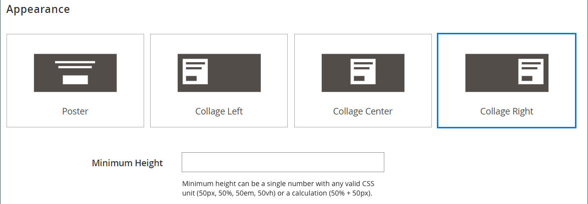

# [!DNL Page Builder] Doorlopen, deel 1: eenvoudige pagina

Volg deze driedelige oefening om met de [!DNL Page Builder] werkruimte vertrouwd te worden door een eenvoudige pagina te creëren die toont hoe gemakkelijk het is om inhoud-rijke pagina&#39;s van uw eigen ontwerp tot stand te brengen.

{width="700" zoomable="yes"}

>[!NOTE]
>
>Deze doorlopende oefeningen worden bijgewerkt om recente wijzigingen in de [!DNL Page Builder] -werkruimte in de release 2.4.1 te weerspiegelen. Als u een vroegere versie van Adobe Commerce gebruikt, gebruik [!DNL Page Builder] walkthrough oefeningen inbegrepen in de [[!DNL Commerce]  2.3 Gids van de Gebruiker ](https://docs.magento.com/user-guide/v2.3/cms/page-builder-learn.html).

## Voordat u begint

Alvorens deze oefening te beginnen, adviseert men dat u het [ Levenslang van de Zitting Admin ](../systems/security-admin.md) verhoogt om de zitting te verhinderen uit timing terwijl u werkt.

Controleer de vereiste configuratie-instellingen voor inhoudsbeheer:

- De Redacteur WYSIWYG wordt toegelaten in de [ configuratie van de Opties WYSIWYG ](../content-design/editor.md#configure-the-editor).

- [!DNL Page Builder] wordt toegelaten in de [ Geavanceerde 2} configuratie van Hulpmiddelen van de Inhoud {.](setup.md)

### De doorlopende afbeeldingselementen downloaden

1. Download het [`simple-page-assets`](./assets/simple-page-assets.zip) -bestand en sla het bestand op uw lokale systeem op.

1. Navigeer naar het gedownloade bestand en extraheer de gecomprimeerde bestanden.

   Klik op een Windows-systeem met de rechtermuisknop en kies **[!UICONTROL Extract All]** bestanden. Kies vervolgens de doelmap en klik op **[!UICONTROL Extract]** .

   Op een Mac-systeem kunt u gewoon dubbelklikken op het ZIP-bestand en de geëxtraheerde bestanden verplaatsen naar de doelmap.

   De map bevat de volgende afbeeldingsbestanden:

   ![[!DNL Page Builder] doorloopt bestanden - eenvoudige pagina-elementen ](./assets/pb-tutorial-simple-page-assets.png){width="500"}

Volg de drie delen van deze analyse in orde.

## Deel 1: Rij met volledig afloopgebied met banner

In dit gedeelte van de oefening Eenvoudige Pagina, creeert u een pagina die een volledig-aflooprij en een banner heeft. De rij heeft verschillende achtergrondafbeeldingen voor desktops en mobiele apparaten.

![[!DNL Page Builder] volledige aflooprij met banner ](./assets/pb-tutorial1-full-bleed-with-banner.png){width="700" zoomable="yes"}

### Stap 1: Een pagina maken

1. Voor _Admin_ sidebar, ga **[!UICONTROL Content]** > _[!UICONTROL Elements]_>**[!UICONTROL Pages]**.

1. Klik in de rechterbovenhoek op **[!UICONTROL Add New Page]** en voer de volgende handelingen uit:

   - Stel **[!UICONTROL Enable Page]** in op `No` om te voorkomen dat deze pagina in uw winkel wordt gepubliceerd.

   - Voer bij **[!UICONTROL Page Title]** `Simple Page` in.

   {width="600" zoomable="yes"}

1. Breid  de **[!UICONTROL Design]** sectie uit.

   **[!UICONTROL Layout]** is standaard ingesteld op `Page -- Full Width` . Naast de vijf standaard [ lay-out ](../content-design/page-layout.md) opties, [!DNL Page Builder] voegt lay-outs van volledige breedte voor pagina&#39;s, categorieën, en producten toe.

1. Als de voorbeeldgegevens beschikbaar zijn, stelt u **[!UICONTROL New Theme]** in op `Magento Luma` . Anders kunt u een ander beschikbaar thema kiezen of dit leeg laten om het standaardthema te gebruiken.

   Met de instelling _[!UICONTROL New Theme]_kunt u het standaardthema overschrijven en een ander thema op de pagina toepassen.

   >[!NOTE]
   >
   >De Volledige lay-out van de Breedte kan slechts met een compatibel [ thema ](../content-design/themes.md) worden gebruikt.

   {width="600" zoomable="yes"}

1. Klik in de rechterbovenhoek op **[!UICONTROL Save]** .

   Wanneer de pagina wordt bewaard, verschijnt de naam _Eenvoudige Pagina_ in de upper-left hoek van de pagina.

### Stap 2: De rij opmaken

1. Breid  de **[!UICONTROL Content]** sectie uit.

   Met deze actie wordt de voorvertoning van [!DNL Page Builder] weergegeven met een lege rij.

   >[!NOTE]
   >
   >Het [ gebied van de Kop van de Inhoud ](workspace.md) is facultatief. De notatie wordt standaard ingesteld op kopniveau 1 (H1), afhankelijk van het thema. Voor deze oefening, wordt de _Kop van de Inhoud_ verlaten leeg.

   {width="600" zoomable="yes"}

1. Klik op **[!UICONTROL Edit with Page Builder]** of in het voorvertoningsgebied van de inhoud.

   In de uitgebreide [!DNL Page Builder] [ werkruimte ](workspace.md), verstrekt het paneel op de linkerzijde de inhoudshulpmiddelen u kunt gebruiken om uw inhoud in het stadium te bouwen.

1. Houd de muisaanwijzer boven de lege rij om de gereedschapset weer te geven.

   Elke inhoudscontainer heeft een gereedschapset met vergelijkbare opties.

   ![[!DNL Page Builder] rijgereedschapset ](./assets/pb-layout-page-add-content-row-tools.png){width="600" zoomable="yes"}

1. In toolbox van de Rij, kies het _pictogram van Montages_ ({width="20"}.

1. Onder _[!UICONTROL Appearance]_, kies **Volledig afloopgebied**.

   Met de weergave Volledig afloopgebied worden de linker- en rechterranden van het inhoudsgebied van de rij en de achtergrond uitgebreid tot de volledige breedte van de pagina.

   {width="600" zoomable="yes"}

1. Blader omlaag naar de sectie _[!UICONTROL Advanced]_en stel alle **[!UICONTROL Margins and Padding]**-instellingen in op `0` .

   Deze instelling zorgt ervoor dat de banner de volledige breedte van de rij uitbreidt.

   {width="600" zoomable="yes"}

1. Als u de instellingen wilt opslaan en wilt terugkeren naar de werkruimte van [!DNL Page Builder] , schuift u omhoog naar de bovenkant van de pagina en klikt u op **[!UICONTROL Save]** in de rechterbovenhoek.

### Stap 3: Een banner toevoegen

>[!NOTE]
>
>[!DNL Page Builder] heeft een nieuw inhoudstype genoemd _Banner_, dat in deze stap wordt kenmerkt. Wat eerder de _optie van de Banner_ in het menu van de Inhoud was, is nu a _Dynamisch Blok_.

1. In het [!DNL Page Builder] paneel, breid **[!UICONTROL Media]** uit en sleep placeholder van de a **Banner** aan het stadium.

   {width="600" zoomable="yes"}
1. Houd de cursor boven de bannercontainer om de gereedschapset weer te geven.

   >[!NOTE]
   >
   >Het werkgebied heeft nu twee inhoudscontainers, elk met een aparte gereedschapset. Omdat de banner in de rij is genest, moet u controleren of u in de juiste gereedschapset werkt.

   Naast toolbox, uploadt _Beeld_ en _Uitgezocht van de knopen van de Galerij_ zijn inbegrepen zodat kunt u snelle veranderingen in de banner direct van het stadium aanbrengen.

   {width="600" zoomable="yes"}

1. In de toolbox van de Banner, kies het _pictogram van Montages_ ( {width="20"}).

1. Kies onder _[!UICONTROL Appearance]_de optie **[!UICONTROL Collage Right]**.

   Met de instelling Kollage rechts plaatst u de inhoud aan de rechterkant van de banner.

   {width="600" zoomable="yes"}

1. Schuif omlaag naar de sectie _[!UICONTROL Background]_en stel de achtergrondafbeelding voor de banner in:

   - Voor **[!UICONTROL Background Image]**, klik **uploaden**.

     {width="600" zoomable="yes"}

     Navigeer naar de map waarin u de geëxtraheerde elementen voor eenvoudige pagina&#39;s hebt opgeslagen en kies het bestand `wide-banner-background.jpg` .

     De afbeelding wordt geüpload en er wordt een miniatuur van de geüploade afbeelding weergegeven. De bestandsnaam, de afmetingen van de afbeelding en de bestandsgrootte worden hieronder vermeld.

     {width="600" zoomable="yes"}

   - Voor **[!UICONTROL Background Mobile Image]**, klik **uploaden**.

     Kies het bestand `wide-banner-background-mobile.jpg` in dezelfde bestandsmap.

     De mobiele achtergrondafbeelding wordt gebruikt voor mobiele apparaten en ook wanneer het formaat van een browservenster wordt aangepast aan de breedte van een mobiel apparaat.

     {width="600" zoomable="yes"}

   - Blader terug naar de bovenkant van de pagina en klik op **[!UICONTROL Save]** om de instellingen op te slaan en terug te keren naar de werkruimte van [!DNL Page Builder] .

     De achtergrond wordt in het werkgebied weergegeven en breidt de volledige breedte van de rij uit.

     {width="600" zoomable="yes"}

   U ziet de plaatsaanduidingstekst die rechts van de rij wordt weergegeven. De positie van deze tekst wijst op het _Recht van de Collage_ verschijning plaatsen.

1. Klik op de tekst van de tijdelijke aanduiding en voer het volgende bericht in als twee regels:

   `Get fit and look fab in new seasonal styles.`

   `New LUMA yoga collection`

   De editor-werkbalk wordt boven het tekstvak weergegeven. De tekst kan of direct van het stadium worden ingegaan en worden geformatteerd, of door _Montages_ in bannertoolbox te kiezen.

   {width="600" zoomable="yes"}

1. Opmaak toepassen op de tekst:

   - Selecteer de eerste tekstregel. Dan, op de redacteurstoolbar onder **Formaten**, kies `Heading 2`.

     {width="600" zoomable="yes"}

   - Selecteer de tweede tekstregel. Dan, op de redacteurstoolbar onder **Formaten**, kies `Paragraph`.

   Met de indelingsinstellingen worden de stijlen toegepast van het stijlblad dat aan het huidige thema is gekoppeld.

   {width="600" zoomable="yes"}
__

1. Hover om toolbox van de Banner te tonen, verkies opnieuw het _pictogram van Montages_ ( {width="20"}), dan rol aan de _[!UICONTROL Content]_sectie.

   Bericht dat uw tekst in het _vakje van de Tekst van het Bericht_ wordt getoond. U kunt tekst invoeren en bewerken vanuit het werkgebied of vanuit het gedeelte _[!UICONTROL Content]_van de bannerinstellingen.

   {width="600" zoomable="yes"}

1. Stel in de sectie _[!UICONTROL Content]_de bannerkoppeling en -knop in:

   - Plaats **Verbinding** aan `Category`, en klik dan **[!UICONTROL Select]** om de categorieboom te tonen.

   - Kies `What's New` als de gekoppelde categorie.

     {width="600" zoomable="yes"}

   - Stel **[!UICONTROL Show Button]** in op `Always` .

   - Voer bij **[!UICONTROL Button Text]** `Shop Now` in als de tekst die op de knop wordt weergegeven.

   - Accepteer de standaardwaarde `Primary` voor **[!UICONTROL Button Type]** .

     De knopstijl van het huidige thema bepaalt de knopindeling.

1. Stel de bannerbedekking in:

   Met een bedekking kunt u een achtergrondkleur toepassen op het actieve inhoudsgebied dat wordt gedefinieerd door de instelling Weergave. De bannerachtergrondafbeelding blijft zichtbaar voor de volledige breedte van de banner.

   - Stel **[!UICONTROL Show Overlay]** in op `Always` .

   - Voer bij **[!UICONTROL Overlay Color]** een van de volgende handelingen uit:

      - Klik op het gekleurde vierkant en kies het witte staal.
      - Klik in _Geen de tekstvakje van de Kleur_ en ga `White` of de hexadecimale waarde `#ffffff` in.

     Klik vervolgens op **[!UICONTROL Apply]** .

     {width="600" zoomable="yes"}

   - Blader terug naar de bovenkant van de pagina en klik op **[!UICONTROL Save]** om de instellingen op te slaan en terug te keren naar de werkruimte van [!DNL Page Builder] .

     De knop wordt onder het bannerbericht in het werkgebied weergegeven.

     {width="600" zoomable="yes"}

1. In de hoger-juiste hoek van het stadium, klik het _Dichte Volledige Scherm_ () pictogram.

   Wanneer u op dit pictogram klikt, keert u terug naar de sectie _[!UICONTROL Content]_voor de pagina waarop de voorvertoning wordt weergegeven.

   U kunt op elk gewenst moment schakelen tussen de twee werkruimtemodi.

1. Klik in de rechterbovenhoek op de pijl **[!UICONTROL Save]** en kies **[!UICONTROL Save & Close]** .

1. Indien ertoe aangezet, klik de [ verbinding van het Beheer van het Geheime voorgeheugen ](../systems/cache-management.md) in het bericht bij de bovenkant van de pagina en vernieuw om het even welk ongeldig geheime voorgeheugen.

## Deel 2: Bevat rij met twee gelijke kolommen

In dit gedeelte van de oefening, voegt u een rij aan de pagina toe, en verdeelt de rij in twee gelijke kolommen. Vervolgens voegt u een gekoppelde afbeelding toe aan elke kolom. In de instructies wordt elke nieuwe rij vóór de eerste rij toegevoegd, zodat het deelvenster [!DNL Page Builder] wordt uitgelijnd met het werkgebied. Aan het einde van de oefening wijzigt u de rangschikking van de rijen zodat deze overeenkomen met het voorbeeld Eenvoudige pagina.

{width="600" zoomable="yes"}

### Stap 1: Een rij toevoegen

1. In het net van Pagina&#39;s, vind de _Eenvoudige Pagina_ die u in het eerste deel van deze oefening creeerde en **[!UICONTROL Edit]** in de _[!UICONTROL Action]_kolom selecteert.

1. Breid  de **[!UICONTROL Content]** sectie uit.

1. Klik op **[!UICONTROL Edit with Page Builder]** of in het voorvertoningsgebied van de inhoud.

1. Sleep in het deelvenster [!DNL Page Builder] onder _[!UICONTROL Layout]_een tijdelijke aanduiding voor **[!UICONTROL Row]**naar het werkgebied en plaats deze boven de banner.

   De rode hulplijn markeert de grens tussen de twee rijen.

   {width="600" zoomable="yes"}

1. Beweeg over de nieuwe rij om toolbox te tonen en de _pictogram van Montages_ te kiezen ( {width="20"}).

   {width="600" zoomable="yes"}

1. Onder _[!UICONTROL Appearance]_, keur het **Bebevatte**gebrek het plaatsen goed.

   Met deze instelling beperkt u het inhoudsgebied van de rij tot de breedte van de pagina zoals gedefinieerd door het thema.

   {width="600" zoomable="yes"}

1. Klik in de rechterbovenhoek op **[!UICONTROL Save]** om de instellingen op te slaan en terug te keren naar de werkruimte van [!DNL Page Builder] .

### Stap 2: Een kolom toevoegen

1. Sleep in het deelvenster [!DNL Page Builder] onder _[!UICONTROL Layout]_een tijdelijke aanduiding voor **[!UICONTROL Column]**naar de nieuwe rij.

   {width="600" zoomable="yes"}

   De rij is nu verdeeld in twee kolommen van gelijke breedte. Elke kolom is een aparte container voor inhoud met eigen specifieke gereedschapset met opties.

   {width="600" zoomable="yes"}

1. In de upper-left hoek van de eerste kolom, klik de cirkelvormige _controle van het Net_ () om de netrichtlijnen te tonen.

   Het raster zorgt ervoor dat de inhoud consistent wordt uitgelijnd en correct wordt weergegeven op zowel mobiele als desktopapparaten. Voor informatie over het vormen van de netgrootte, zie [  [!DNL Page Builder]](setup.md#configure-page-builder) sectie in het [!DNL Page Builder] onderwerp van de Opstelling vormen.

   De getallen tussen haakjes (6/12) op de bovenrand van elke kolomcontainer geven het aantal rasterdivisies in elke kolom aan en het totale aantal divisies in de rij.

   {width="600" zoomable="yes"}

### Stap 3: Afbeeldingen toevoegen met koppelingen

In deze stap leert u hoe u een afbeelding uploadt naar de banner.

1. Vouw in het deelvenster [!DNL Page Builder] de sectie **[!UICONTROL Media]** uit en sleep een tijdelijke aanduiding **[!UICONTROL Image]** naar de eerste kolom.

   {width="600" zoomable="yes"}

1. Voeg de voorbeeldafbeelding in de plaatsaanduiding.

   {width="600" zoomable="yes"}

   Voor een afbeelding die zich op uw systeem bevindt, kunt u een van de volgende methoden kiezen:

   - **upload het beelddossier**: In de eerste kolom, klik **[!UICONTROL Upload Image]**. Navigeer vervolgens naar de map waarin u de geëxtraheerde eenvoudige pagina-elementen hebt opgeslagen en kies het `small-banner-1.jpg` -bestand.

     {width="600" zoomable="yes"} wordt toegevoegd

     Herhaal deze handeling om het `small-banner-2.jpg` -bestand toe te voegen aan de tweede kolom.

   - **Belemmering het beelddossier**: Op uw Desktop, open de eenvoudige omslag van paginamiddelen en plaats het naast het browser venster Admin waar u met het [!DNL Page Builder] stadium werkt. Vervolgens sleept u het bestand `small-banner-1.jpg` uit de map met eenvoudige pagina-elementen en zet u het neer in de eerste kolom.

     {width="600" zoomable="yes"}

     Herhaal deze handeling om het `small-banner-2.jpg` -bestand toe te voegen aan de tweede kolom.

1. Bepaal welke pagina in de catalogus u aan elke afbeelding wilt koppelen.

1. Beweeg over het beeld in de eerste kolom om toolbox te tonen en de _Montages_ te kiezen ( {width="20"}).

   {width="600" zoomable="yes"}

1. De afbeelding aan een categorie koppelen:

   - De rol neer en plaatst **Verbinding** aan `Category`.

   - Blader in de categoriestructuur omlaag en kies de categorie `Men's Hoodies & Sweatshirt` .

   - Klik in de rechterbovenhoek op **[!UICONTROL Save]** de instellingen en ga terug naar de werkruimte van [!DNL Page Builder] .

1. Herhaal de vorige stap om het beeld in de tweede kolom aan de _categorie van het Gear_ te verbinden.

1. In de hoger-juiste hoek van het stadium, klik het _Dichte Volledige Scherm_ () pictogram.

   Wanneer u op dit pictogram klikt, keert u terug naar de sectie _[!UICONTROL Content]_voor de pagina waarop de voorvertoning wordt weergegeven.

1. Klik in de rechterbovenhoek op de pijl **[!UICONTROL Save]** en kies **[!UICONTROL Save & Close]** .

1. Wanneer ertoe aangezet, klik de [ verbinding van het Beheer van het Geheime voorgeheugen ](../systems/cache-management.md) in het bericht bij de bovenkant van de pagina en vernieuw om het even welk ongeldig geheime voorgeheugen.

## Deel 3: Rij met volledige breedte en ongelijke kolommen

De laatste rij op deze pagina bevat de inhoud van een productrevisie. U voegt een rij met volledige breedte toe en verdeelt deze in twee kolommen met verschillende breedten. Er wordt een achtergrondafbeelding aan de eerste kolom toegevoegd, met een overeenkomende achtergrondkleur die op de rij wordt toegepast voor een verenigd effect.

{width="500"}

### Stap 1: Een rij toevoegen

1. In het net van Pagina&#39;s, vind de _Eenvoudige Pagina_ die u in het eerste deel van deze oefening creeerde en **[!UICONTROL Edit]** in de _[!UICONTROL Action]_kolom selecteert.

1. Breid  de **[!UICONTROL Content]** sectie uit.

1. Klik op **[!UICONTROL Edit with Page Builder]** of in het voorvertoningsgebied van de inhoud.

1. Sleep in het deelvenster [!DNL Page Builder] onder _[!UICONTROL Layout]_een tijdelijke aanduiding voor **[!UICONTROL Row]**naar het werkgebied en plaats deze boven de rij die in het tweede deel van deze bewerking is gemaakt.

   Een rode hulplijn markeert de grens tussen de twee rijen.

   {width="600" zoomable="yes"}

1. Beweeg over de nieuwe rij om toolbox te tonen en de _Montages_ te kiezen ({width="20"}) pictogram.

   {width="600" zoomable="yes"}

1. Kies **[!UICONTROL Full Width]** op de pagina Rij bewerken onder _[!UICONTROL Appearance]_.

   Met deze instelling beperkt u het inhoudsgebied tot de maximale paginabreedte die door het thema wordt gedefinieerd. De achtergrondkleur en/of -afbeelding zijn niet beperkt en breiden de volledige breedte van de rij uit.

   {width="600" zoomable="yes"}

1. Typ `#f1f1f1` als **[!UICONTROL Background Color]** in de sectie _[!UICONTROL Background]_.

   {width="600" zoomable="yes"}

1. De rol neer aan de _[!UICONTROL Advanced]_sectie en plaatst alle **Marges &amp; het Opvullen**waarden aan `0`.

   {width="600" zoomable="yes"}

1. Blader terug naar de bovenkant van de pagina en klik op **[!UICONTROL Save]** om de instellingen op te slaan en terug te keren naar de werkruimte van [!DNL Page Builder] .

   De achtergrondkleur van de rij is nu lichtbeige.

   {width="600" zoomable="yes"}

### Stap 2: kolommen van verschillende breedten toevoegen

1. Sleep in het deelvenster [!DNL Page Builder] onder _[!UICONTROL Layout]_een tijdelijke aanduiding voor **[!UICONTROL Column]**naar de bovenste rij in het werkgebied.

   {width="600" zoomable="yes"}

1. Sleep de rechterrand van de eerste kolom naar de vier van de 12 (`4/12`) positie op het raster.

   De grootte van de tweede kolom wordt aangepast aan acht van 12 (`8/12`).

   {width="600" zoomable="yes"}

1. Beweeg over de eerste kolomcontainer om toolbox te tonen en de _pictogram van Montages_ te kiezen ( {width="20"}).

1. De rol neer aan de _[!UICONTROL Advanced]_sectie en plaatst alle **Marges &amp; het Opvullen**waarden aan `0`.

   {width="600" zoomable="yes"}

1. Blader terug naar de bovenkant van de pagina en klik op **[!UICONTROL Save]** om de instellingen op te slaan en terug te keren naar de werkruimte van [!DNL Page Builder] .

### Stap 3: Een afbeelding toevoegen aan de eerste kolom

1. Vouw in het deelvenster [!DNL Page Builder] **[!UICONTROL Media]** uit en sleep een inhoudstype **[!UICONTROL Image]** naar de eerste kolom.

   {width="600" zoomable="yes"}

1. Klik op **[!UICONTROL Upload Image]** in de voorlopige afbeelding.

   {width="600" zoomable="yes"}

1. Navigeer naar de map waarin u de geëxtraheerde elementen voor eenvoudige pagina&#39;s hebt opgeslagen en kies het bestand `review-image.jpg` .

   De geüploade afbeelding wordt weergegeven in de eerste kolom en vloeit naadloos over met de achtergrondkleur van de rij.

   {width="600" zoomable="yes"} wordt toegevoegd

### Stap 4: Inhoud van revisie toevoegen aan de tweede kolom

De tweede kolom van de rij moet inhoud bevatten van een revisie van de klant, inclusief de classificatieafbeelding met vijf sterren en het opgemaakte tekstbericht.

1. Vouw in het deelvenster [!DNL Page Builder] de sectie **[!UICONTROL Elements]** uit en sleep het inhoudstype **[!UICONTROL Text]** naar de tweede kolom.

   {width="600" zoomable="yes"}

1. Klik in het tekstelement om de editor-werkbalk weer te geven.

1. In de toolbar, klik het _Beeld van het Tussenvoegsel_ () pictogram en doe het volgende:

   {width="600" zoomable="yes"}

   - In de _[!UICONTROL Insert/edit image]_dialoog, klik het_ Vondst _( ) pictogram naast het_[!UICONTROL Source]_ gebied.

     {width="600" zoomable="yes"}

   - Klik op de pagina _[!UICONTROL Select Images]_op **[!UICONTROL Choose Files]**.

   - Kies `rating.png` in de map waarin u de elementen van de eenvoudige pagina hebt opgeslagen.

   - Dubbelklik op de pagina weer op de afbeeldingstegel om deze te selecteren en voeg de URL ervan in het Source-veld in.

     {width="600" zoomable="yes"}

   - Voer bij **[!UICONTROL Image Description]** `5-Star Rating` in en klik **[!UICONTROL OK]** om de afbeelding in de kolom in te voegen.

   - In de redacteurstoolbar, klik **centreert** () om het beeld in de kolom te centreren.

     {width="600" zoomable="yes"}

1. Plaats de invoegpositie net na de afbeelding met vijf sterren, druk op Enter/Return om een nieuwe regel te beginnen en voer de volgende tekst in:

   `Awesome Tank!`

   `I'm a long distance runner and it keeps me pretty comfortable, although these companies always act like their shirts are magical and really it's just pretty basic stuff. Still it's a great shirt, and I would recommend it.`

   `Antonia Racer Tank – Reviewed by Allyson`

   De tekst wordt gecentreerd terwijl u typt.

   {width="600" zoomable="yes"} wordt gecentreerd

1. Maak de tekst op:

   - Klik overal in de eerste lijn van tekst en op de redacteurstoolbar onder **Formaten**, kies `Heading 2`.

   - Selecteer de resterende tekst en op de redacteurstoolbar onder **Formaten**, kies `Paragraph`.

   De tekst wordt opgemaakt op basis van de stijlpagina die aan het thema is gekoppeld.

1. Haal de afmetingen van de afbeelding op, zodat u de inhoud verticaal in de kolom kunt centreren:

   - Beweeg over het beeld in de eerste kolom om toolbox te tonen en de _Montages_ te kiezen ({width="20"}).

   - Houd rekening met de afmetingen van de afbeelding onder de miniatuur van de afbeelding.

     {width="600" zoomable="yes"} worden getoond

   - In de hoger-juiste hoek, klik **dicht**.

1. De inhoud verticaal centreren in de tweede kolom:

   - Beweeg over de tweede kolom om toolbox te tonen en de _Montages_ te kiezen ({width="20"}) pictogram.

   >[!NOTE]
   >
   >Selecteer de kolomcontainer in plaats van de tekstcontainer om de juiste gereedschapset weer te geven.

   - Voer bij **[!UICONTROL Minimum Height]** `450` in als de hoogte in pixels voor de afbeelding in de eerste kolom.

   - Stel **[!UICONTROL Vertical Alignment]** in op `Center` .

   {width="600" zoomable="yes"}

1. Schuif omlaag naar de sectie _[!UICONTROL Advanced]_en stel alle **[!UICONTROL Margins and Padding]**-waarden in op nul ( `0` ).

   {width="600" zoomable="yes"}

1. Blader terug naar de bovenkant van de pagina en in de rechterbovenhoek en klik op **[!UICONTROL Save]** om de instellingen op te slaan en terug te keren naar de werkruimte van [!DNL Page Builder] .

   {width="600" zoomable="yes"}

### Stap 5: Een koppeling voor een catalogusproduct invoegen

1. Selecteer de `Antonia Racer Tank` tekst en klik het _Verbinding van het Tussenvoegsel_ () pictogram in de redacteurstoolbar.

1. In de _verbinding van het Tussenvoegsel_ dialoog, specificeer de verbinding aan het catalogusproduct:

   - Voer het product **[!UICONTROL URL]** in.

     U kunt een relatieve of volledig gekwalificeerde URL invoeren. De volgende relatieve koppeling wordt ingevoerd voor dit voorbeeld:

     `../antonia-racer-tank.html`

   - (Optioneel) Voer voor **Titel** de productnaam in.

     Het kenmerk Title link wordt door sommige browsers gebruikt als knopinfo.

     {width="600" zoomable="yes"}

   - Klik wanneer u klaar bent op **[!UICONTROL OK]** om de koppeling op te slaan.

     De gekoppelde tekst wordt nu gemarkeerd in de banner.

     {width="600" zoomable="yes"}

1. In de hoger-juiste hoek van het stadium, klik het _Dichte Volledige Scherm_ () pictogram.

   Wanneer u op dit pictogram klikt, keert u terug naar de sectie _[!UICONTROL Content]_voor de pagina waarop de voorvertoning wordt weergegeven.

1. Klik in de rechterbovenhoek op **[!UICONTROL Save]** .

### Stap 6: De rijen opnieuw rangschikken

Met alle drie rijen volledig, moet de definitieve stap de rijen opnieuw rangschikken om het originele _Eenvoudige Pagina_ voorbeeld aan te passen. Voor het oorspronkelijke voorbeeld moet de eerste rij naar de onderkant worden verplaatst en de laatste rij naar de bovenkant.

1. Indien noodzakelijk, breid  de **[!UICONTROL Content]** sectie uit.

1. Klik op **[!UICONTROL Edit with Page Builder]** of in het voorvertoningsgebied van de inhoud.

1. Beweeg over de eerste rij op het stadium om toolbox te tonen en de _Beweging_ te kiezen ( ) pictogram.

   {width="600" zoomable="yes"}

1. Houd de muisknop ingedrukt terwijl u controleert of alle inhoud van de rij is geselecteerd en sleep de rij naar de positie onder de rode hulplijn onder aan de pagina.

   >[!NOTE]
   >
   >Als u per ongeluk slechts een deel van de inhoud verplaatst, zoals de afbeelding, verplaatst u de inhoud gewoon terug waar deze hoort en probeert u het opnieuw.

   {width="600" zoomable="yes"}

1. Herhaal dit proces om de eerste rij naar de tweede positie te verplaatsen.

   De volgorde van de rijen op de pagina komt nu overeen met het voorbeeld Eenvoudige pagina.

1. In de hoger-juiste hoek van het stadium, klik het _Dichte Volledige Scherm_ () pictogram.

   Wanneer u op dit pictogram klikt, keert u terug naar de sectie _[!UICONTROL Content]_voor de pagina waarop de voorvertoning wordt weergegeven.

1. Klik in de rechterbovenhoek op de pijl **[!UICONTROL Save]** en kies **[!UICONTROL Save & Close]** .

1. Indien ertoe aangezet, klik de [ verbinding van het Beheer van het Geheime voorgeheugen ](../systems/cache-management.md) in het bericht bij de bovenkant van de pagina en vernieuw om het even welk ongeldig geheime voorgeheugen.

U hebt de oefening Eenvoudige Pagina voltooid. Behoud het werk dat u hebt gemaakt, zodat u er later naar kunt verwijzen.

Wanneer u klaar bent, ga aan [ Deel 2 te werk: Blokken ](2-blocks.md).
