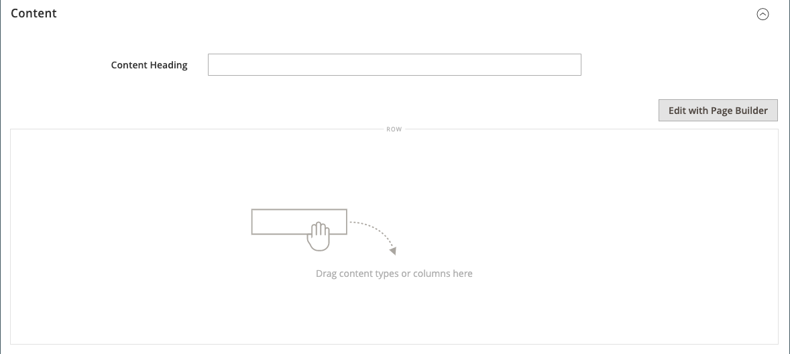
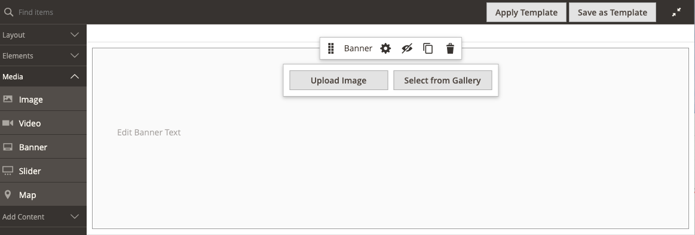
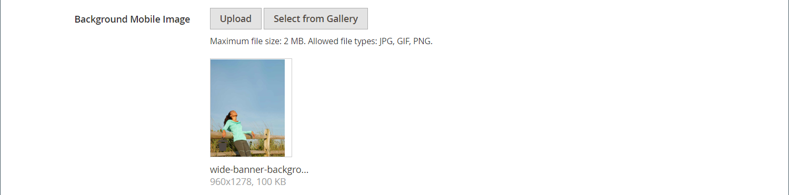

# [!DNL Page Builder] Doorlopen, deel 1: eenvoudige pagina

Volg deze driedelige oefening om vertrouwd te raken met [!DNL Page Builder] door een eenvoudige pagina te maken die laat zien hoe eenvoudig het is om inhoudrijke pagina&#39;s van uw eigen ontwerp te maken.

{width="700" zoomable="yes"}

>[!NOTE]
>
>Deze doorlichtingsoefeningen worden bijgewerkt om rekening te houden met recente wijzigingen in de [!DNL Page Builder] in de release 2.4.1. Als u een eerdere Adobe Commerce-versie gebruikt, gebruikt u de [!DNL Page Builder] de in de [[!DNL Commerce] 2.3 Handboek](https://docs.magento.com/user-guide/v2.3/cms/page-builder-learn.html).

## Voordat u begint

Voordat u met deze oefening begint, wordt u aangeraden de dosis [Levensduur beheersessie](../systems/security-admin.md) om te voorkomen dat de sessietime-out optreedt terwijl u werkt.

Controleer de vereiste configuratie-instellingen voor inhoudsbeheer:

- WYSIWYG Editor is ingeschakeld in het dialoogvenster [WYSIWYG-opties](../content-design/editor.md#configure-the-editor) configuratie.

- [!DNL Page Builder] is ingeschakeld in het dialoogvenster [Geavanceerde gereedschappen voor inhoud](setup.md) configuratie.

### De doorlopende afbeeldingselementen downloaden

1. Download de [`simple-page-assets`](./assets/simple-page-assets.zip) en sla het bestand op uw lokale systeem op.

1. Navigeer naar het gedownloade bestand en extraheer de gecomprimeerde bestanden.

   Klik in een Windows-systeem met de rechtermuisknop en kies **[!UICONTROL Extract All]** bestanden. Kies vervolgens de doelmap en klik op **[!UICONTROL Extract]**.

   Op een Mac-systeem kunt u gewoon dubbelklikken op het ZIP-bestand en de geëxtraheerde bestanden verplaatsen naar de doelmap.

   De map bevat de volgende afbeeldingsbestanden:

   ![[!DNL Page Builder] doorlopende bestanden - eenvoudige pagina-elementen](./assets/pb-tutorial-simple-page-assets.png){width="500"}

Volg de drie delen van deze analyse in orde.

## Deel 1: Rij met volledig afloopgebied met banner

In dit gedeelte van de oefening Eenvoudige Pagina, creeert u een pagina die een volledig-aflooprij en een banner heeft. De rij heeft verschillende achtergrondafbeeldingen voor desktops en mobiele apparaten.

![[!DNL Page Builder] volledige aflooprij met banner](./assets/pb-tutorial1-full-bleed-with-banner.png){width="700" zoomable="yes"}

### Stap 1: Een pagina maken

1. Op de _Beheerder_ zijbalk, ga naar **[!UICONTROL Content]** > _[!UICONTROL Elements]_>**[!UICONTROL Pages]**.

1. Klik in de rechterbovenhoek op **[!UICONTROL Add New Page]** en voer de volgende handelingen uit:

   - Als u wilt voorkomen dat deze pagina in uw winkel wordt gepubliceerd, stelt u **[!UICONTROL Enable Page]** tot `No`.

   - Voor **[!UICONTROL Page Title]**, enter `Simple Page`.

   {width="600" zoomable="yes"}

1. Uitbreiden  de **[!UICONTROL Design]** sectie.

   Let op: **[!UICONTROL Layout]** is ingesteld op `Page -- Full Width` standaard. Naast de norm van vijf [layout](../content-design/page-layout.md) opties, [!DNL Page Builder] Hiermee voegt u lay-outs van volledige breedte toe voor pagina&#39;s, categorieën en producten.

1. Als de voorbeeldgegevens beschikbaar zijn, stelt u **[!UICONTROL New Theme]** tot `Magento Luma`. Anders kunt u een ander beschikbaar thema kiezen of dit leeg laten om het standaardthema te gebruiken.

   De _[!UICONTROL New Theme]_Met deze instelling kunt u het standaardthema overschrijven en een ander thema op de pagina toepassen.

   >[!NOTE]
   >
   >De lay-out Volledige breedte kan alleen worden gebruikt met een compatibele [thema](../content-design/themes.md).

   {width="600" zoomable="yes"}

1. Klik in de rechterbovenhoek op **[!UICONTROL Save]**.

   Wanneer de pagina wordt opgeslagen, wordt de naam _Eenvoudige pagina_ wordt in de linkerbovenhoek van de pagina weergegeven.

### Stap 2: De rij opmaken

1. Uitbreiden  de **[!UICONTROL Content]** sectie.

   Met deze actie wordt het dialoogvenster [!DNL Page Builder] met een lege rij.

   >[!NOTE]
   >
   >De [Inhoudskop](workspace.md) veld is optioneel. De notatie wordt standaard ingesteld op kopniveau 1 (H1), afhankelijk van het thema. Voor deze oefening _Inhoudskop_ is leeg.

   {width="600" zoomable="yes"}

1. Klikken **[!UICONTROL Edit with Page Builder]** of in het voorvertoningsgebied van de inhoud.

   In het uitgebreide [!DNL Page Builder] [werkruimte](workspace.md)In het linkerdeelvenster vindt u bovendien de gereedschappen voor de inhoud die u kunt gebruiken om de inhoud van het werkgebied samen te stellen.

1. Houd de muisaanwijzer boven de lege rij om de gereedschapset weer te geven.

   Elke inhoudscontainer heeft een gereedschapset met vergelijkbare opties.

   ![[!DNL Page Builder] rijgereedschappen](./assets/pb-layout-page-add-content-row-tools.png){width="600" zoomable="yes"}

1. Kies in de gereedschapset Rij de optie _Instellingen_ ({width="20"} pictogram.

1. Onder _[!UICONTROL Appearance]_, kiest u **Volledig afloopgebied**.

   Met de weergave Volledig afloopgebied worden de linker- en rechterranden van het inhoudsgebied van de rij en de achtergrond uitgebreid tot de volledige breedte van de pagina.

   {width="600" zoomable="yes"}

1. Omlaag schuiven naar de _[!UICONTROL Advanced]_sectie en alles instellen **[!UICONTROL Margins and Padding]**instellingen voor `0`.

   Deze instelling zorgt ervoor dat de banner de volledige breedte van de rij uitbreidt.

   {width="600" zoomable="yes"}

1. De instellingen opslaan en terugkeren naar de [!DNL Page Builder] de werkruimte, scrol omhoog aan de bovenkant van de pagina en klik **[!UICONTROL Save]** in de rechterbovenhoek.

### Stap 3: Een banner toevoegen

>[!NOTE]
>
>[!DNL Page Builder] heeft een nieuw inhoudstype genaamd _Banner_, die in deze stap wordt weergegeven. Wat voorheen _Banner_ in het menu Inhoud is nu een _Dynamisch blok_.

1. In de [!DNL Page Builder] deelvenster, uitvouwen **[!UICONTROL Media]** en sleep een **Banner** tijdelijke aanduiding naar het werkgebied.

   {width="600" zoomable="yes"}
1. Houd de cursor boven de bannercontainer om de gereedschapset weer te geven.

   >[!NOTE]
   >
   >Het werkgebied heeft nu twee inhoudscontainers, elk met een aparte gereedschapset. Omdat de banner in de rij is genest, moet u controleren of u in de juiste gereedschapset werkt.

   Naast de gereedschapset, _Afbeelding uploaden_ en _Selecteren in galerie_ De knoppen zijn opgenomen zodat u de banner direct vanuit het werkgebied snel kunt wijzigen.

   {width="600" zoomable="yes"}

1. Kies in de gereedschapset Banner de optie _Instellingen_ ( {width="20"} ).

1. Onder _[!UICONTROL Appearance]_, kiest u **[!UICONTROL Collage Right]**.

   Met de instelling Kollage rechts plaatst u de inhoud aan de rechterkant van de banner.

   {width="600" zoomable="yes"}

1. Omlaag schuiven naar de _[!UICONTROL Background]_en stel de achtergrondafbeelding voor de banner in:

   - Voor **[!UICONTROL Background Image]**, klikt u op **Uploaden**.

     {width="600" zoomable="yes"}

     Navigeer naar de map waarin u de geëxtraheerde elementen voor eenvoudige pagina&#39;s hebt opgeslagen en kies de optie `wide-banner-background.jpg` bestand.

     De afbeelding wordt geüpload en er wordt een miniatuur van de geüploade afbeelding weergegeven. De bestandsnaam, de afmetingen van de afbeelding en de bestandsgrootte worden hieronder vermeld.

     {width="600" zoomable="yes"}

   - Voor **[!UICONTROL Background Mobile Image]**, klikt u op **Uploaden**.

     Kies in dezelfde bestandsmap de optie `wide-banner-background-mobile.jpg` bestand.

     De mobiele achtergrondafbeelding wordt gebruikt voor mobiele apparaten en ook wanneer het formaat van een browservenster wordt aangepast aan de breedte van een mobiel apparaat.

     {width="600" zoomable="yes"}

   - Ga terug naar de bovenkant van de pagina en klik op **[!UICONTROL Save]** om de instellingen op te slaan en terug te keren naar de [!DNL Page Builder] werkruimte.

     De achtergrond wordt in het werkgebied weergegeven en breidt de volledige breedte van de rij uit.

     {width="600" zoomable="yes"}

   U ziet de plaatsaanduidingstekst die rechts van de rij wordt weergegeven. De positie van deze tekst weerspiegelt de _Collage rechts_ weergave-instelling.

1. Klik op de tekst van de tijdelijke aanduiding en voer het volgende bericht in als twee regels:

   `Get fit and look fab in new seasonal styles.`

   `New LUMA yoga collection`

   De editor-werkbalk wordt boven het tekstvak weergegeven. Tekst kan rechtstreeks vanuit het werkgebied worden ingevoerd en opgemaakt, of door _Instellingen_ in de bannergereedschapset.

   {width="600" zoomable="yes"}

1. Opmaak toepassen op de tekst:

   - Selecteer de eerste tekstregel. Dan, op de redacteurstoolbar onder **Indelingen**, kiest u `Heading 2`.

     {width="600" zoomable="yes"}

   - Selecteer de tweede tekstregel. Dan, op de redacteurstoolbar onder **Indelingen**, kiest u `Paragraph`.

   Met de indelingsinstellingen worden de stijlen toegepast van het stijlblad dat aan het huidige thema is gekoppeld.

   {width="600" zoomable="yes"}
__

1. Als u de gereedschapset Banner wilt weergeven, kiest u de optie _Instellingen_ ( {width="20"} ) opnieuw, en scrol dan aan _[!UICONTROL Content]_sectie.

   De tekst wordt weergegeven in het dialoogvenster _Berichttekst_ doos. Tekst kan vanuit het werkgebied of vanuit het _[!UICONTROL Content]_van de bannerinstellingen.

   {width="600" zoomable="yes"}

1. Het voortzetten in _[!UICONTROL Content]_de bannerkoppeling en -knop instellen:

   - Set **Koppeling** tot `Category`en klik vervolgens op **[!UICONTROL Select]** om de categoriestructuur weer te geven.

   - Kies `What's New` als de gekoppelde categorie.

     {width="600" zoomable="yes"}

   - Set **[!UICONTROL Show Button]** tot `Always`.

   - Voor **[!UICONTROL Button Text]**, enter `Shop Now` als de tekst die op de knop wordt weergegeven.

   - Voor **[!UICONTROL Button Type]**, de `Primary` standaard.

     De knopstijl van het huidige thema bepaalt de knopindeling.

1. Stel de bannerbedekking in:

   Met een bedekking kunt u een achtergrondkleur toepassen op het actieve inhoudsgebied dat wordt gedefinieerd door de instelling Weergave. De bannerachtergrondafbeelding blijft zichtbaar voor de volledige breedte van de banner.

   - Set **[!UICONTROL Show Overlay]** tot `Always`.

   - Voor **[!UICONTROL Overlay Color]** Voer een van de volgende handelingen uit:

      - Klik op het gekleurde vierkant en kies het witte staal.
      - Klik in het dialoogvenster _Geen kleur_ tekstvak en typ `White` of de hexadecimale waarde `#ffffff`.

     Klik vervolgens op **[!UICONTROL Apply]**.

     {width="600" zoomable="yes"}

   - Ga terug naar de bovenkant van de pagina en klik op **[!UICONTROL Save]** om de instellingen op te slaan en terug te keren naar de [!DNL Page Builder] werkruimte.

     De knop wordt onder het bannerbericht in het werkgebied weergegeven.

     {width="600" zoomable="yes"}

1. Klik in de rechterbovenhoek van het werkgebied op de knop _Volledig scherm sluiten_ ().

   Als u op dit pictogram klikt, keert u terug naar het dialoogvenster _[!UICONTROL Content]_de pagina waarop de voorvertoning wordt weergegeven.

   U kunt op elk gewenst moment schakelen tussen de twee werkruimtemodi.

1. Klik in de rechterbovenhoek op de knop **[!UICONTROL Save]** en kiest u **[!UICONTROL Save & Close]**.

1. Klik op de knop [Cachebeheer](../systems/cache-management.md) in het bericht boven aan de pagina en vernieuw een ongeldige cache.

## Deel 2: Bevat rij met twee gelijke kolommen

In dit gedeelte van de oefening, voegt u een rij aan de pagina toe, en verdeelt de rij in twee gelijke kolommen. Vervolgens voegt u een gekoppelde afbeelding toe aan elke kolom. In de instructies wordt elke nieuwe rij vóór de eerste rij toegevoegd om de [!DNL Page Builder] wordt uitgelijnd met het werkgebied. Aan het einde van de oefening wijzigt u de rangschikking van de rijen zodat deze overeenkomen met het voorbeeld Eenvoudige pagina.

{width="600" zoomable="yes"}

### Stap 1: Een rij toevoegen

1. Zoek in het raster Pagina&#39;s de _Eenvoudige pagina_ die u in het eerste deel van deze oefening creeerde en uitgezocht **[!UICONTROL Edit]** in de _[!UICONTROL Action]_kolom.

1. Uitbreiden  de **[!UICONTROL Content]** sectie.

1. Klikken **[!UICONTROL Edit with Page Builder]** of in het voorvertoningsgebied van de inhoud.

1. In de [!DNL Page Builder] paneel onder _[!UICONTROL Layout]_, sleept u **[!UICONTROL Row]**plaatsaanduiding in het werkgebied en plaats deze boven de banner.

   De rode hulplijn markeert de grens tussen de twee rijen.

   {width="600" zoomable="yes"}

1. Houd de muisaanwijzer boven de nieuwe rij om de gereedschapset weer te geven en kies de optie _Instellingen_ ( {width="20"} ).

   {width="600" zoomable="yes"}

1. Onder _[!UICONTROL Appearance]_, de **Bevat**standaardinstelling.

   Met deze instelling beperkt u het inhoudsgebied van de rij tot de breedte van de pagina zoals gedefinieerd door het thema.

   {width="600" zoomable="yes"}

1. Klik in de rechterbovenhoek op **[!UICONTROL Save]** om de instellingen op te slaan en terug te keren naar de [!DNL Page Builder] werkruimte.

### Stap 2: Een kolom toevoegen

1. In de [!DNL Page Builder] paneel onder _[!UICONTROL Layout]_, sleept u **[!UICONTROL Column]**tijdelijke aanduiding voor de nieuwe rij.

   {width="600" zoomable="yes"}

   De rij is nu verdeeld in twee kolommen van gelijke breedte. Elke kolom is een aparte container voor inhoud met eigen specifieke gereedschapset met opties.

   {width="600" zoomable="yes"}

1. Klik in de linkerbovenhoek van de eerste kolom op de cirkel _Raster_ besturingselement () om de rasterrichtlijnen weer te geven.

   Het raster zorgt ervoor dat de inhoud consistent wordt uitgelijnd en correct wordt weergegeven op zowel mobiele als desktopapparaten. Voor informatie over het vormen van de netgrootte, zie [Configureren [!DNL Page Builder]](setup.md#configure-page-builder) in de [!DNL Page Builder] Installatieonderwerp.

   De getallen tussen haakjes (6/12) op de bovenrand van elke kolomcontainer geven het aantal rasterdivisies in elke kolom aan en het totale aantal divisies in de rij.

   {width="600" zoomable="yes"}

### Stap 3: Afbeeldingen toevoegen met koppelingen

In deze stap leert u hoe u een afbeelding uploadt naar de banner.

1. In de [!DNL Page Builder] deelvenster, vouwt u de **[!UICONTROL Media]** en sleep een **[!UICONTROL Image]** tijdelijke aanduiding voor de eerste kolom.

   {width="600" zoomable="yes"}

1. Voeg de voorbeeldafbeelding in de plaatsaanduiding.

   {width="600" zoomable="yes"}

   Voor een afbeelding die zich op uw systeem bevindt, kunt u een van de volgende methoden kiezen:

   - **Het afbeeldingsbestand uploaden**: Klik in de eerste kolom op **[!UICONTROL Upload Image]**. Navigeer vervolgens naar de map waarin u de geëxtraheerde eenvoudige pagina-elementen hebt opgeslagen en kies de map `small-banner-1.jpg` bestand.

     {width="600" zoomable="yes"}

     Herhaal deze handeling om de `small-banner-2.jpg` naar de tweede kolom.

   - **Sleep het afbeeldingsbestand**: Open op uw bureaublad de map met eenvoudige pagina-elementen en plaats deze naast het browservenster Beheer waar u met het [!DNL Page Builder] in het werkgebied. Sleep vervolgens het bestand `small-banner-1.jpg` in de map met eenvoudige pagina-elementen en zet deze neer in de eerste kolom.

     {width="600" zoomable="yes"}

     Herhaal deze handeling om de `small-banner-2.jpg` naar de tweede kolom.

1. Bepaal welke pagina in de catalogus u aan elke afbeelding wilt koppelen.

1. Houd de muisaanwijzer boven de afbeelding in de eerste kolom om de gereedschapset weer te geven en kies de optie _Instellingen_ ( {width="20"} ).

   {width="600" zoomable="yes"}

1. De afbeelding aan een categorie koppelen:

   - Omlaag schuiven en instellen **Koppeling** tot `Category`.

   - Blader in de categoriestructuur omlaag en kies de optie `Men's Hoodies & Sweatshirt` categorie.

   - In de rechterbovenhoek: **[!UICONTROL Save]** de instellingen en ga terug naar de [!DNL Page Builder] werkruimte.

1. Herhaal de vorige stap om de afbeelding in de tweede kolom te koppelen aan de _Tandwiel_ categorie.

1. Klik in de rechterbovenhoek van het werkgebied op de knop _Volledig scherm sluiten_ ().

   Als u op dit pictogram klikt, keert u terug naar het dialoogvenster _[!UICONTROL Content]_de pagina waarop de voorvertoning wordt weergegeven.

1. Klik in de rechterbovenhoek op de knop **[!UICONTROL Save]** en kiest u **[!UICONTROL Save & Close]**.

1. Klik op de knop [Cachebeheer](../systems/cache-management.md) in het bericht boven aan de pagina en vernieuw een ongeldige cache.

## Deel 3: Rij met volledige breedte en ongelijke kolommen

De laatste rij op deze pagina bevat de inhoud van een productrevisie. U voegt een rij met volledige breedte toe en verdeelt deze in twee kolommen met verschillende breedten. Er wordt een achtergrondafbeelding aan de eerste kolom toegevoegd, met een overeenkomende achtergrondkleur die op de rij wordt toegepast voor een verenigd effect.

{width="500"}

### Stap 1: Een rij toevoegen

1. Zoek in het raster Pagina&#39;s de _Eenvoudige pagina_ die u in het eerste deel van deze oefening creeerde en uitgezocht **[!UICONTROL Edit]** in de _[!UICONTROL Action]_kolom.

1. Uitbreiden  de **[!UICONTROL Content]** sectie.

1. Klikken **[!UICONTROL Edit with Page Builder]** of in het voorvertoningsgebied van de inhoud.

1. In de [!DNL Page Builder] paneel onder _[!UICONTROL Layout]_, sleept u **[!UICONTROL Row]**tijdelijke aanduiding naar het werkgebied en plaats deze boven de rij die is gemaakt in het tweede deel van deze bewerking.

   Een rode hulplijn markeert de grens tussen de twee rijen.

   {width="600" zoomable="yes"}

1. Houd de muisaanwijzer boven de nieuwe rij om de gereedschapset weer te geven en kies de optie _Instellingen_ ({width="20"} ).

   {width="600" zoomable="yes"}

1. Op de pagina Rij bewerken onder _[!UICONTROL Appearance]_, kiest u **[!UICONTROL Full Width]**.

   Met deze instelling beperkt u het inhoudsgebied tot de maximale paginabreedte die door het thema wordt gedefinieerd. De achtergrondkleur en/of -afbeelding zijn niet beperkt en breiden de volledige breedte van de rij uit.

   {width="600" zoomable="yes"}

1. In de _[!UICONTROL Background]_sectie, enter `#f1f1f1` als de **[!UICONTROL Background Color]**.

   {width="600" zoomable="yes"}

1. Omlaag schuiven naar de _[!UICONTROL Advanced]_sectie en alles instellen **Marges en opvulling**waarden voor `0`.

   {width="600" zoomable="yes"}

1. Ga terug naar de bovenkant van de pagina en klik op **[!UICONTROL Save]** om de instellingen op te slaan en terug te keren naar de [!DNL Page Builder] werkruimte.

   De achtergrondkleur van de rij is nu lichtbeige.

   {width="600" zoomable="yes"}

### Stap 2: kolommen van verschillende breedten toevoegen

1. In de [!DNL Page Builder] paneel onder _[!UICONTROL Layout]_, sleept u **[!UICONTROL Column]**tijdelijke aanduiding voor de bovenste rij in het werkgebied.

   {width="600" zoomable="yes"}

1. Sleep de rechterrand van de eerste kolom naar de vier van de twaalf (`4/12`) op het raster.

   De grootte van de tweede kolom wordt aangepast aan acht van 12 (`8/12`).

   {width="600" zoomable="yes"}

1. Houd de muisaanwijzer boven de eerste kolomcontainer om de gereedschapset weer te geven en kies de optie _Instellingen_ ( {width="20"} ).

1. Omlaag schuiven naar de _[!UICONTROL Advanced]_sectie en alles instellen **Marges en opvulling**waarden voor `0`.

   {width="600" zoomable="yes"}

1. Ga terug naar de bovenkant van de pagina en klik op **[!UICONTROL Save]** om de instellingen op te slaan en terug te keren naar de [!DNL Page Builder] werkruimte.

### Stap 3: Een afbeelding toevoegen aan de eerste kolom

1. In de [!DNL Page Builder] deelvenster, uitvouwen **[!UICONTROL Media]** en sleep een **[!UICONTROL Image]** inhoudstype aan de eerste kolom.

   {width="600" zoomable="yes"}

1. Klik in de voorlopige afbeelding op **[!UICONTROL Upload Image]**.

   {width="600" zoomable="yes"}

1. Navigeer naar de map waarin u de geëxtraheerde elementen voor eenvoudige pagina&#39;s hebt opgeslagen en kies de optie `review-image.jpg` bestand.

   De geüploade afbeelding wordt weergegeven in de eerste kolom en vloeit naadloos over met de achtergrondkleur van de rij.

   {width="600" zoomable="yes"}

### Stap 4: Inhoud van revisie toevoegen aan de tweede kolom

De tweede kolom van de rij moet inhoud bevatten van een revisie van de klant, inclusief de classificatieafbeelding met vijf sterren en het opgemaakte tekstbericht.

1. In de [!DNL Page Builder] deelvenster, vouwt u de **[!UICONTROL Elements]** en sleep de **[!UICONTROL Text]** inhoudstype aan de tweede kolom.

   {width="600" zoomable="yes"}

1. Klik in het tekstelement om de editor-werkbalk weer te geven.

1. Klik op de werkbalk op de knop _Afbeelding invoegen_ () en voer de volgende handelingen uit:

   {width="600" zoomable="yes"}

   - In de _[!UICONTROL Insert/edit image]_klikt u op de knop_ Zoeken _(  ) naast het pictogram_[!UICONTROL Source]_ veld.

     {width="600" zoomable="yes"}

   - Op de _[!UICONTROL Select Images]_pagina, klikt u **[!UICONTROL Choose Files]**.

   - Kies in de map waarin u de elementen van de eenvoudige pagina hebt opgeslagen de optie `rating.png`.

   - Dubbelklik op de pagina weer op de afbeeldingstabel om deze te selecteren en voeg de URL van de tegel in het veld Bron in.

     {width="600" zoomable="yes"}

   - Voor **[!UICONTROL Image Description]**, enter `5-Star Rating` en klik op **[!UICONTROL OK]** om de afbeelding in te voegen in de kolom.

   - Klik in de editor-werkbalk op **Centreren** () om de afbeelding in de kolom te centreren.

     {width="600" zoomable="yes"}

1. Plaats de invoegpositie net na de afbeelding met vijf sterren, druk op Enter/Return om een nieuwe regel te beginnen en voer de volgende tekst in:

   `Awesome Tank!`

   `I'm a long distance runner and it keeps me pretty comfortable, although these companies always act like their shirts are magical and really it's just pretty basic stuff. Still it's a great shirt, and I would recommend it.`

   `Antonia Racer Tank – Reviewed by Allyson`

   De tekst wordt gecentreerd terwijl u typt.

   {width="600" zoomable="yes"}

1. Maak de tekst op:

   - Klik ergens in de eerste tekstregel en op de editor-werkbalk onder **Indelingen**, kiest u `Heading 2`.

   - Selecteer de resterende tekst en klik op de editor-werkbalk onder **Indelingen**, kiest u `Paragraph`.

   De tekst wordt opgemaakt op basis van de stijlpagina die aan het thema is gekoppeld.

1. Haal de afmetingen van de afbeelding op, zodat u de inhoud verticaal in de kolom kunt centreren:

   - Houd de muisaanwijzer boven de afbeelding in de eerste kolom om de gereedschapset weer te geven en kies de optie _Instellingen_ ({width="20"} ).

   - Houd rekening met de afmetingen van de afbeelding onder de miniatuur van de afbeelding.

     {width="600" zoomable="yes"}

   - Klik in de rechterbovenhoek op **Sluiten**.

1. De inhoud verticaal centreren in de tweede kolom:

   - Houd de muisaanwijzer boven de tweede kolom om de gereedschapset weer te geven en kies de optie _Instellingen_ ({width="20"} ).

   >[!NOTE]
   >
   >Selecteer de kolomcontainer in plaats van de tekstcontainer om de juiste gereedschapset weer te geven.

   - Voor **[!UICONTROL Minimum Height]**, enter `450` als de hoogte in pixels voor de afbeelding in de eerste kolom.

   - Set **[!UICONTROL Vertical Alignment]** tot `Center`.

   {width="600" zoomable="yes"}

1. Omlaag schuiven naar de _[!UICONTROL Advanced]_sectie en alles instellen **[!UICONTROL Margins and Padding]**waarden naar nul ( `0` ).

   {width="600" zoomable="yes"}

1. Ga terug naar de bovenkant van de pagina en klik in de rechterbovenhoek op **[!UICONTROL Save]** om de instellingen op te slaan en terug te keren naar de [!DNL Page Builder] werkruimte.

   {width="600" zoomable="yes"}

### Stap 5: Een koppeling voor een catalogusproduct invoegen

1. Selecteer de `Antonia Racer Tank` tekst en klik op _Koppeling invoegen_ () op de werkbalk van de editor.

1. In de _Koppeling invoegen_ , geeft u de koppeling naar het catalogusproduct op:

   - Voer het product in **[!UICONTROL URL]**.

     U kunt een relatieve of volledig gekwalificeerde URL invoeren. De volgende relatieve koppeling wordt ingevoerd voor dit voorbeeld:

     `../antonia-racer-tank.html`

   - (Optioneel) Voor **Titel**, voert u de productnaam in.

     Het kenmerk Title link wordt door sommige browsers gebruikt als knopinfo.

     {width="600" zoomable="yes"}

   - Klik op **[!UICONTROL OK]** om de koppeling op te slaan.

     De gekoppelde tekst wordt nu gemarkeerd in de banner.

     {width="600" zoomable="yes"}

1. Klik in de rechterbovenhoek van het werkgebied op de knop _Volledig scherm sluiten_ ().

   Als u op dit pictogram klikt, keert u terug naar het dialoogvenster _[!UICONTROL Content]_de pagina waarop de voorvertoning wordt weergegeven.

1. Klik in de rechterbovenhoek op **[!UICONTROL Save]**.

### Stap 6: De rijen opnieuw rangschikken

Wanneer alle drie de rijen zijn voltooid, bestaat de laatste stap uit het opnieuw rangschikken van de rijen zodat deze overeenkomen met het origineel _Eenvoudige pagina_ voorbeeld. Voor het oorspronkelijke voorbeeld moet de eerste rij naar de onderkant worden verplaatst en de laatste rij naar de bovenkant.

1. Indien nodig uitbreiden  de **[!UICONTROL Content]** sectie.

1. Klikken **[!UICONTROL Edit with Page Builder]** of in het voorvertoningsgebied van de inhoud.

1. Houd de muisaanwijzer boven de eerste rij in het werkgebied om de gereedschapset weer te geven en kies de optie _Verplaatsen_ ( ).

   {width="600" zoomable="yes"}

1. Houd de muisknop ingedrukt terwijl u controleert of alle inhoud van de rij is geselecteerd en sleep de rij naar de positie onder de rode hulplijn onder aan de pagina.

   >[!NOTE]
   >
   >Als u per ongeluk slechts een deel van de inhoud verplaatst, zoals de afbeelding, verplaatst u de inhoud gewoon terug waar deze hoort en probeert u het opnieuw.

   {width="600" zoomable="yes"}

1. Herhaal dit proces om de eerste rij naar de tweede positie te verplaatsen.

   De volgorde van de rijen op de pagina komt nu overeen met het voorbeeld Eenvoudige pagina.

1. Klik in de rechterbovenhoek van het werkgebied op de knop _Volledig scherm sluiten_ ().

   Als u op dit pictogram klikt, keert u terug naar het dialoogvenster _[!UICONTROL Content]_de pagina waarop de voorvertoning wordt weergegeven.

1. Klik in de rechterbovenhoek op de knop **[!UICONTROL Save]** en kiest u **[!UICONTROL Save & Close]**.

1. Klik op de knop [Cachebeheer](../systems/cache-management.md) in het bericht boven aan de pagina en vernieuw een ongeldige cache.

U hebt de oefening Eenvoudige Pagina voltooid. Behoud het werk dat u hebt gemaakt, zodat u er later naar kunt verwijzen.

Als u klaar bent, gaat u verder naar [Deel 2: Blokken](2-blocks.md).
