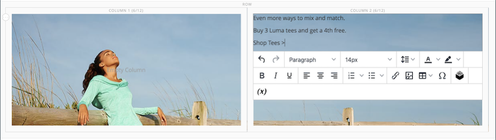
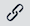

# [!DNL Page Builder] Doorlopen, deel 2: blokken

De volgende oefening illustreert het verschil tussen [eenvoudige blokken](../content-design/blocks.md) en [dynamische blokken](dynamic-block.md)en hoe [!DNL Page Builder] om elk type blok te maken.

>[!NOTE]
>
>[!DNL Page Builder] heeft een nieuw inhoudstype genaamd _Banner_, die in de eerste doorlichting wordt getoond en niet met de vorige bannerfunctionaliteit verwant is. Wat was voorheen de optie Banner in het dialoogvenster [Het menu Inhoud](../content-design/content-menu.md), is nu _Dynamisch blok_.

{width="700" zoomable="yes"}

Deze oefening veronderstelt dat u hebt voltooid [Deel 1: Eenvoudige pagina](1-simple-page.md), met inbegrip van de voorwaarden en [gedownloade voorbeeldbestanden](./assets/simple-page-assets.zip). Volg de onderdelen van deze doorloopoefening in orde.

>[!NOTE]
>
>Deze doorlichtingsoefeningen worden bijgewerkt om rekening te houden met recente wijzigingen in de [!DNL Page Builder] in de release 2.4.1. Als u een eerdere Adobe Commerce-versie gebruikt, gebruikt u de [!DNL Page Builder] oefeningen die zijn opgenomen in de [[!DNL Commerce] 2.3 Handboek](https://docs.magento.com/user-guide/v2.3/cms/page-builder-learn.html).

## Deel 1: Een eenvoudig blok maken

In deze analyse oefening, creeert u een eenvoudig blok met inhoud van [!DNL Google Maps]. Eenvoudige blokken worden soms ook wel _CMS-blokken_ of _statische blokken_, omdat de inhoud niet verandert. Een eenvoudig blok is ideaal voor inhoud die u wellicht opnieuw wilt gebruiken.

### Stap 1: Een blok maken

1. Op de _Beheerder_ zijbalk, ga naar **[!UICONTROL Content]** > _[!UICONTROL Elements]_>**[!UICONTROL Blocks]**.

1. Klik in de rechterbovenhoek op **[!UICONTROL Add New Block]**.

1. Voor **[!UICONTROL Block Title]**, enter `Google Map`.

1. Voor **[!UICONTROL Identifier]**, enter `google-map`.

1. Kies de optie **[!UICONTROL Store View]** wanneer het blok beschikbaar moet zijn.

   {width="600" zoomable="yes"}

1. Klik in de rechterbovenhoek op **[!UICONTROL Save]**.

### Stap 2: Voeg een [!DNL Google Map]

1. Omlaag schuiven naar de [!DNL Page Builder] inhoudsvoorbeeld (momenteel leeg) en klik op **[!UICONTROL Edit with Page Builder]**.

1. In de [!DNL Page Builder] deelvenster, uitvouwen **[!UICONTROL Media]** en sleep een **[!UICONTROL Map]** tijdelijke aanduiding naar het werkgebied.

   {width="600" zoomable="yes"}

   Er verschijnt een kaart naar uw winkellocatie als [!DNL Google Maps] is geconfigureerd voor uw winkel.

   {width="600" zoomable="yes"}

   Er verschijnt een tijdelijke kaart als [!DNL Google Maps] is nog niet geconfigureerd voor uw winkel.

   ![[!DNL Google Maps] plaatsaanduiding](./assets/pb-tutorial2-media-map-not-configured.png){width="600" zoomable="yes"}

1. Klik in de rechterbovenhoek van het werkgebied op de knop _Volledig scherm sluiten_ ().

   Als u op dit pictogram klikt, keert u terug naar het dialoogvenster _[!UICONTROL Content]_voor het blok met de voorvertoning weergegeven.

1. Klik in de rechterbovenhoek op de knop **[!UICONTROL Save]** en kiest u **[!UICONTROL Save & Close]**.

### Stap 3: configureren [!DNL Google Maps]

Indien [!DNL Google Maps] is reeds gevormd voor uw opslag, kunt u deze stap overslaan en aan volgende te werk gaan.

1. Ga naar de [Google Cloud Platform Console](https://console.cloud.google.com/google/maps-apis/overview).

1. Klik het project drop-down en selecteer of creeer het project waarvoor u een API sleutel wilt toevoegen.

1. Om uw API geloofsbrieven te vormen, volg [instructies][1] in de [!DNL Google Maps] documentatie.

1. Kopieer de API-sleutel naar het klembord.

1. Terugkeren naar de [!DNL Commerce] Beheerder en ga naar **[!UICONTROL Stores]** > _[!UICONTROL Settings]_>**[!UICONTROL Configuration]**.

1. In het linkerdeelvenster onder _[!UICONTROL General]_, kiest u **[!UICONTROL Content Management]**.

1. Uitbreiden  **[!UICONTROL Advanced Content Tools]**.

   {width="600" zoomable="yes"}

   Voor meer informatie over de [!UICONTROL Content Management Advanced Tools] configuratieopties, zie [_Referentiehandleiding voor configuratie_](../configuration-reference/general/content-management.md).

1. Voor **[!UICONTROL Google Maps API Key]** plakken, plakt u de gekopieerde sleutel.

1. Klik op **[!UICONTROL Test Key]**.

   Als er een probleem is met uw sleutel, keert u terug naar de [!DNL Google Maps] Platformsite om het probleem op te lossen. Probeer het vervolgens opnieuw.

1. Klik op **[!UICONTROL Save Config]**.

### Stap 4: Het blok toevoegen aan een pagina

1. Op de _Beheerder_ zijbalk, ga naar **[!UICONTROL Content]** > _[!UICONTROL Elements]_>**[!UICONTROL Pages]**.

1. Zoek in het raster de _[!UICONTROL Simple Page]_die u in de eerste zelfstudie hebt gemaakt en **[!UICONTROL Edit]**in de_[!UICONTROL Action]_ kolom.

1. Uitbreiden  de **[!UICONTROL Content]** sectie en klik op **[!UICONTROL Edit with Page Builder]** of in het voorvertoningsgebied van de inhoud.

1. In de [!DNL Page Builder] paneel onder _[!UICONTROL Layout]_, sleept u **[!UICONTROL Row]**aan de bovenkant van het werkgebied.

   {width="600" zoomable="yes"}

1. In de [!DNL Page Builder] deelvenster, uitvouwen **[!UICONTROL Add Content]** en sleep een **[!UICONTROL Block]** tijdelijke aanduiding voor de nieuwe rij.

1. Houd de muisaanwijzer boven de lege blokcontainer om de gereedschapset weer te geven en kies de optie _Instellingen_ ({width="20"} ).

   {width="600" zoomable="yes"}

1. Klik op de pagina Blok bewerken op **[!UICONTROL Select Block]**.

   {width="600" zoomable="yes"}

1. Voer in het zoekvak `map` en druk op Enter/Return om het blok te zoeken dat u hebt gemaakt.

   {width="600" zoomable="yes"}

1. Klik in het raster op **[!UICONTROL Select]** om de [!DNL Google Maps] blokkeren.

1. Klik in de rechterbovenhoek op **[!UICONTROL Save]** om de instellingen op te slaan en terug te keren naar de [!DNL Page Builder] werkruimte.

1. Klik in de rechterbovenhoek van het werkgebied op de knop _Volledig scherm sluiten_ ().

   Als u op dit pictogram klikt, keert u terug naar het dialoogvenster _[!UICONTROL Content]_de pagina waarop de voorvertoning wordt weergegeven.

1. Klik in de rechterbovenhoek op de knop **[!UICONTROL Save]** en kiest u **[!UICONTROL Save & Close]**.

**Gefeliciteerd!** U hebt het eerste deel van de blokexercitie voltooid. Zorg ervoor dat u uw werk ter referentie bijhoudt.

## Deel 2: Een dynamisch blok maken

Een dynamisch blok omvat logica die bepaalt waar, wanneer, en aan wie het verschijnt. In deze analyse oefening, creeert u een dynamisch blok voor een bevordering die wordt teweeggebracht wanneer de voorwaarden van de prijsregel worden voldaan, en dat slechts aan een specifiek klantensegment lijkt. Het resultaat van dit voorbeeld is vergelijkbaar met de banner die tijdens de eerste oefening is gemaakt, maar met de logica die bepaalt wanneer deze in de storefront wordt weergegeven.

{width="600" zoomable="yes"}

### Stap 1: Een nieuw dynamisch blok maken

1. Op de _Beheerder_ zijbalk, ga naar **[!UICONTROL Content]** > _[!UICONTROL Elements]_>**[!UICONTROL Dynamic Blocks]**.

   {width="700" zoomable="yes"}

1. Klik in de rechterbovenhoek op **[!UICONTROL Add Dynamic Block]**.

   {width="600" zoomable="yes"}

1. Voltooi de basisinstellingen voor het nieuwe dynamische blok:

   - Set **[!UICONTROL Enable Dynamic Block]** tot `Yes`.

   - Voor **[!UICONTROL Dynamic Block Name]**, enter `Tee Shirt Promo`.

   - Set **[!UICONTROL Dynamic Block Type]** tot `Content Area` en klik op **[!UICONTROL Done]**.

     Het dynamische Type van Blok bepaalt waar in [pagina-indeling](../content-design/page-layout.md) dat het blok is geplaatst. Houd bij het instellen van een dynamisch blok voor uw winkel rekening met zowel de pagina-indeling als de [thema](../content-design/themes.md), zodat u de beschikbare ruimte goed kunt gebruiken. In sommige winkels is het actieve inhoudsgebied beperkt tot een vaste breedte, terwijl in andere winkels de volledige breedte van het scherm wordt uitgebreid.

     {width="600" zoomable="yes"}

   - Voor **[!UICONTROL Customer Segment]** schakelt u het selectievakje in van elk segment dat u wilt toepassen op het dynamische blok en klikt u op **Gereed** om de lijst met segmenten op te slaan.

     In het volgende voorbeeld zijn er twee [klantsegmenten](../customers/customer-segments.md) die geregistreerde klanten naar geslacht identificeren. Dit dynamische blok lijkt slechts aan geregistreerde vrouwelijke klanten die aan hun rekeningen worden aangemeld terwijl zij in uw opslag winkelen.

     {width="600" zoomable="yes"}

### Stap 2: De instellingen voltooien

Omlaag schuiven naar de _[!UICONTROL Content]_sectie, waarin een lege [!DNL Page Builder] inhoudsvoorbeeld, en klik **[!UICONTROL Edit with Page Builder]**. Voer vervolgens de volgende taken uit:

**Taak 1:** Een achtergrondafbeelding toevoegen

1. Houd de muisaanwijzer boven de rijcontainer om de gereedschapset weer te geven en kies de optie _Instellingen_ ({width="20"} ).

1. Onder _[!UICONTROL Appearance]_, kiest u **[!UICONTROL Full Bleed]**.

1. Voor **[!UICONTROL Minimum Height]**, enter `400px`.

1. Naar de _[!UICONTROL Background]_en stelt de **[!UICONTROL Background Image]**door te klikken **[!UICONTROL Select from Gallery]**en kiest u de `wide-banner-background.png` afbeelding geüpload in de eerste zelfstudie.

1. Klik in de rechterbovenhoek op **[!UICONTROL Save]** om de instellingen toe te passen en terug te keren naar de [!DNL Page Builder] werkruimte.

   {width="600" zoomable="yes"}

**Taak 2:** Kolommen toevoegen

In de [!DNL Page Builder] paneel onder _[!UICONTROL Layout]_, sleept u **[!UICONTROL Column]**plaatsaanduiding op de rij.

{width="600" zoomable="yes"}

De rij is nu verdeeld in twee kolommen van gelijke breedte.

**Taak 3:** Tekst toevoegen

1. In de [!DNL Page Builder] deelvenster, uitvouwen **[!UICONTROL Elements]** en sleep een **Tekst** tijdelijke aanduiding voor de tweede kolom.

   {width="600" zoomable="yes"}

1. Voer de volgende drie tekstregels in de editor in:

   `Even more ways to mix and match.`

   `Buy 3 Luma tees and get a 4th free.`

   `Shop Tees >`

   {width="600" zoomable="yes"}

1. Selecteer alle drie de tekstregels en gebruik de werkbalk om de **Lijnhoogte** tot `40px`.

   {width="600" zoomable="yes"}

1. Stel de **[!UICONTROL Font Size]** voor elke regel:

   | Lijn | Fontgrootte |
   |-----| ---------- |
   | Regel 1: | `28px` |
   | Regel 2: | `24px` |
   | Regel 3: | `18px` |

   Omdat dit blok overal op de pagina kan worden geplaatst, gebruikt u de standaardalineastijl in plaats van de kopniveaus. Ook, maak niet ongerust dat de tekst nog niet correct in de kolom verpakt.  

   {width="600" zoomable="yes"}

**Taak 4:** Een koppeling toevoegen

In de eerste oefening leerde u hoe te om te gebruiken [Knop](buttons.md) inhoudstype om een koppeling te maken. In dit voorbeeld ziet u hoe u een koppeling invoegt op de werkbalk van de editor.

1. Open de storefront op een ander browsertabblad en navigeer naar de pagina die het doeldoel voor de koppeling moet zijn.

   U kunt de volledig gekwalificeerde URL of een relatieve URL gebruiken die de verwijzing naar uw archiefdomein weglaat.

   Volledige URL: `https://mystore.com/women/tops-women/tees-women.html`

   Relatieve URL: `../women/tops-women/tees-women.html`

1. Terugkeren naar de [!DNL Page Builder] werkruimte en teksteditor selecteert u de optie `Shop Tees >` tekst op de derde regel en kies **Vet** () in de editor-werkbalk.

1. Met de `Shop Tees >` tekst in de derde regel die nog steeds is geselecteerd, kiest u **Koppeling invoegen/bewerken** () in de editor-werkbalk.

   {width="600" zoomable="yes"}

1. Voor **[!UICONTROL URL]**, voert u de relatieve koppeling in die u hebt voorbereid.

1. Set **[!UICONTROL Target]** tot `None`.

   Met deze instelling wordt de pagina in hetzelfde browservenster geopend in plaats van een nieuw tabblad te openen.

1. Voor **[!UICONTROL Title]**, enter `Shop Tees`.

   Het kenmerk Title link wordt door sommige browsers gebruikt als knopinfo.

1. De koppeling opslaan en terugkeren naar de [!DNL Page Builder] werkruimte, klikken **[!UICONTROL OK]**.

   {width="600" zoomable="yes"}

1. Klik in de rechterbovenhoek van het werkgebied op de knop _Volledig scherm sluiten_ ().

   Als u op dit pictogram klikt, keert u terug naar het dialoogvenster _[!UICONTROL Content]_voor het dynamische blok met de voorvertoning weergegeven.

1. Klik in de rechterbovenhoek op **[!UICONTROL Save]**.

### Stap 3: Een prijsregel toevoegen

1. Open de _Tee Shirt Promo_ Dynamisch blok in bewerkingsmodus opnieuw.

1. Uitbreiden  de **[!UICONTROL Related Promotions]** sectie en klik op **[!UICONTROL Add Cart Price Rules]**.

   {width="600" zoomable="yes"}

1. Op de _Regels voor verbonden winkelprijzen toevoegen_ pagina, selecteert u het selectievakje voor de _Koop drie T-shirts en ontvang de vierde gratis_ prijsregel en klik op **[!UICONTROL Add Selected]**.

   {width="600" zoomable="yes"}

   De prijsregel wordt weergegeven in het dialoogvenster _Verwante aanbiedingen_ sectie, onder _Regel voor verwante winkelprijzen_. U kunt meerdere prijsregels koppelen aan een dynamisch blok. In dit eenvoudige voorbeeld wordt echter slechts één voorbeeld gebruikt.

   {width="600" zoomable="yes"}

1. Klik in de rechterbovenhoek op **[!UICONTROL Save]**.

### Stap 4: Voeg het dynamische blok toe aan een pagina

1. In de _Beheerder_ zijbalk, ga naar **[!UICONTROL Content]** > _[!UICONTROL Elements]_>**[!UICONTROL Pages]**

1. Zoek de _Eenvoudige pagina_ die u hebt gemaakt in het dialoogvenster [eerste analyse](1-simple-page.md) en opent u deze in de bewerkingsmodus.

1. Uitbreiden  de **[!UICONTROL Content]** sectie en klik op **[!UICONTROL Edit with Page Builder]**.

1. Houd de cursor boven de bovenste rij met dezelfde afbeelding als het dynamische blok om de gereedschapset en de _Verwijderen_ ( {width="20"} ).

   Om te bevestigen dat de rij van de pagina wordt verwijderd, klikt u op  **[!UICONTROL OK]** .

1. In de [!DNL Page Builder] paneel onder _[!UICONTROL Layout]_, sleept u een nieuwe **[!UICONTROL Row]**aan de bovenkant van het werkgebied.

1. In de [!DNL Page Builder] deelvenster, uitvouwen **[!UICONTROL Add Content]** en sleep een **[!UICONTROL Dynamic Block]** tijdelijke aanduiding voor de nieuwe rij.

   {width="600" zoomable="yes"}

1. Houd de muisaanwijzer boven de dynamische blokcontainer om de gereedschapset weer te geven en kies de optie _Instellingen_ ( {width="20"} ).

   {width="600" zoomable="yes"}

1. Op de _[!UICONTROL Edit Dynamic Block]_pagina, klikt u **[!UICONTROL Select Dynamic Block]**.

   {width="600" zoomable="yes"}

1. Zoek de _[!DNL Tee Shirt Promo]_het dynamische blok dat u creeerde en klikt **[!UICONTROL Select]**.

   Hieronder wordt een samenvatting van de dynamische blokinformatie weergegeven.

   {width="600" zoomable="yes"}

1. De standaardinstelling accepteren **[!UICONTROL Template]**, `Dynamic Block Block Template`.

1. Klik op **[!UICONTROL Save]** om de instellingen op te slaan en terug te keren naar de [!DNL Page Builder] werkruimte.

   {width="600" zoomable="yes"}

1. Klik in de rechterbovenhoek van het werkgebied op de knop _Volledig scherm sluiten_ ().

   Als u op dit pictogram klikt, keert u terug naar het dialoogvenster _[!UICONTROL Content]_de pagina waarop de voorvertoning wordt weergegeven.

1. Klik in de rechterbovenhoek op de knop **[!UICONTROL Save]** en kiest u **[!UICONTROL Save & Close]**.

U hebt het tweede deel van de blokexercitie voltooid. Zorg ervoor dat u uw werk ter referentie bijhoudt.

## Deel 3: Dynamisch blok bijwerken

In dit laatste deel van de oefening, geeft u een dynamisch blok uit terwijl de pagina in uw opslag levend is. Dan, login aan de opslag als lid van het klantensegment om het blok te maken verschijnen.

{width="600" zoomable="yes"}

### Stap 1: Bewerk het dynamische blok

1. In de _Beheerder_ zijbalk, ga naar **[!UICONTROL Content]** > _[!UICONTROL Elements]_>**[!UICONTROL Dynamic Blocks]**.

1. Zoek uw _[!DNL Tee Shirt Promo]_dynamisch blok in het raster en open het in de bewerkingsmodus.

1. Uitbreiden  de **[!UICONTROL Content]** sectie en klik op **[!UICONTROL Edit with Page Builder]**.

1. De kolombreedte wijzigen:

   - Houd de cursor boven de rand tussen de twee kolommen.

   - Houd de muisknop ingedrukt en sleep de rand twee verdelingen naar links.

     {width="600" zoomable="yes"}

     De eerste kolom is nu vier van 12 (4/12) rasterdivisies breed en de tweede kolom is acht van 12 (8/12) divisies breed.

     {width="600" zoomable="yes"}

1. Wijzig de tekstkleur:

   - Selecteer de eerste twee tekstregels.

   - Kies in de editor-werkbalk de optie **[!UICONTROL Text Color]** en klik op de knop **[!UICONTROL White]** staal.

   {width="600" zoomable="yes"}

1. Klik in de rechterbovenhoek van het werkgebied op de knop _Volledig scherm sluiten_ ().

   Als u op dit pictogram klikt, keert u terug naar het dialoogvenster _[!UICONTROL Content]_voor het dynamische blok met de voorvertoning weergegeven.

1. Klik in de rechterbovenhoek op **[!UICONTROL Save]**.

### Stap 2: Het dynamische blok weergeven

Omdat dit dynamische blok slechts aan leden van een specifiek klantensegment zichtbaar is, moet u login als klant die een lid van het klantensegment is om de bevordering te zien. In dit voorbeeld wordt het blok alleen weergegeven voor vrouwelijke klanten.

1. Open een browservenster naar de winkel.

1. Als u de voorbeeldpagina wilt weergeven, wijzigt u de URL in de adresbalk als volgt:

   mystore.com/sample-page

   Als uw opslag wordt gevormd om het html achtervoegsel te omvatten, omvat het achtervoegsel als volgt:

   mystore.com/sample-page.html

1. Aanmelden als vrouwelijke klant:

   - Klik in de rechterbovenhoek van de startpagina op **[!UICONTROL Sign In]**.

   - Als de Luminagegegevens van het voorbeeld op uw systeem zijn geïnstalleerd, gebruikt u de volgende referenties:

     **[!UICONTROL Email]** - `roni_cost@example.com`

     **[!UICONTROL Password]** -  `roni_cost3@example.com`

   - Klik op **[!UICONTROL Sign In]**.

   - Keer terug naar de steekproefpagina om het dynamische blok te zien dat u met de Steenschitterende Promo creeerde.

   {width="700" zoomable="yes"}

U hebt de blokoefening voltooid. Zorg ervoor dat u uw werk ter referentie bijhoudt.

Als u klaar bent, gaat u verder naar [Deel 3: Catalogusinhoud](3-catalog-content.md)

[1]: https://developers.google.com/maps/documentation/javascript/get-api-key
