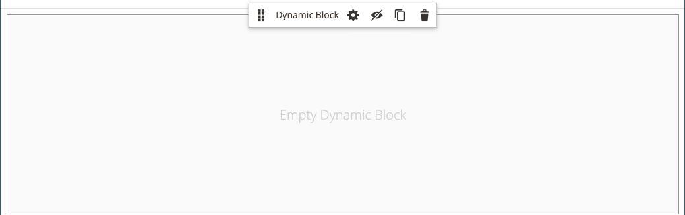

# [!DNL Page Builder] Doorlopen, deel 2: blokken

De volgende oefening illustreert het verschil tussen [ eenvoudige blokken ](../content-design/blocks.md) en [ dynamische blokken ](dynamic-block.md), en hoe te om [!DNL Page Builder] te gebruiken om elk type van blok tot stand te brengen.

>[!NOTE]
>
>[!DNL Page Builder] heeft een nieuw inhoudstype genoemd _Banner_, dat in de eerste doorloopoefening wordt vermeld en niet met de vorige bannerfunctionaliteit verwant is. Wat eerder de optie van de Banner in het [ menu van de Inhoud ](../content-design/content-menu.md) was, is nu _Dynamisch Blok_.

{width="700" zoomable="yes"}

Deze oefening veronderstelt dat u [ Deel 1 hebt voltooid: Eenvoudige Pagina ](1-simple-page.md), met inbegrip van de eerste vereisten en [ gedownloade steekproefdossiers ](./assets/simple-page-assets.zip). Volg de onderdelen van deze doorloopoefening in orde.

>[!NOTE]
>
>Deze doorlopende oefeningen worden bijgewerkt om recente wijzigingen in de [!DNL Page Builder] -werkruimte in de release 2.4.1 te weerspiegelen.

## Deel 1: Een eenvoudig blok maken

In deze doorlichtingsoefening, creeert u een eenvoudig blok met inhoud van [!DNL Google Maps]. De eenvoudige blokken worden soms genoemd _blokken van CMS_ of _statische blokken_, omdat de inhoud niet verandert. Een eenvoudig blok is ideaal voor inhoud die u wellicht opnieuw wilt gebruiken.

### Stap 1: Een blok maken

1. Voor _Admin_ sidebar, ga **[!UICONTROL Content]** > _[!UICONTROL Elements]_>**[!UICONTROL Blocks]**.

1. Klik in de rechterbovenhoek op **[!UICONTROL Add New Block]** .

1. Voer bij **[!UICONTROL Block Title]** `Google Map` in.

1. Voer bij **[!UICONTROL Identifier]** `google-map` in.

1. Kies de locatie **[!UICONTROL Store View]** waar het blok beschikbaar moet zijn.

   {width="600" zoomable="yes"}

1. Klik in de rechterbovenhoek op **[!UICONTROL Save]** .

### Stap 2: Een [!DNL Google Map] toevoegen

1. Schuif omlaag naar de voorvertoning van de [!DNL Page Builder] -inhoud (momenteel leeg) en klik op **[!UICONTROL Edit with Page Builder]** .

1. Vouw **[!UICONTROL Media]** uit in het deelvenster [!DNL Page Builder] en sleep een tijdelijke aanduiding **[!UICONTROL Map]** naar het werkgebied.

   {width="600" zoomable="yes"}

   Er wordt een kaart naar de locatie van uw winkel weergegeven als [!DNL Google Maps] is geconfigureerd voor uw winkel.

   {width="600" zoomable="yes"}

   Er wordt een plaatsaanduidingskaart weergegeven als [!DNL Google Maps] nog niet is geconfigureerd voor uw winkel.

   ![[!DNL Google Maps] placeholder ](./assets/pb-tutorial2-media-map-not-configured.png){width="600" zoomable="yes"}

1. In de hoger-juiste hoek van het stadium, klik het _Dichte Volledige Scherm_ () pictogram.

   Wanneer u op dit pictogram klikt, keert u terug naar de sectie _[!UICONTROL Content]_&#x200B;voor het blok met de voorvertoning weergegeven.

1. Klik in de rechterbovenhoek op de pijl **[!UICONTROL Save]** en kies **[!UICONTROL Save & Close]** .

### Stap 3: configureren [!DNL Google Maps]

Als [!DNL Google Maps] al voor uw opslag wordt gevormd, kunt u deze stap overslaan en aan volgende te werk gaan.

1. Ga naar de [ Console van het Platform van Google Cloud ](https://console.cloud.google.com/google/maps-apis/overview).

1. Klik het project drop-down en selecteer of creeer het project waarvoor u een API sleutel wilt toevoegen.

1. Om uw API geloofsbrieven te vormen, volg de [ instructies ][1] in de [!DNL Google Maps] documentatie.

1. Kopieer de API-sleutel naar het klembord.

1. Ga terug naar [!DNL Commerce] Admin en ga naar **[!UICONTROL Stores]** > _[!UICONTROL Settings]_>**[!UICONTROL Configuration]**.

1. Kies in het linkerdeelvenster onder _[!UICONTROL General]_&#x200B;de optie **[!UICONTROL Content Management]**.

1. Breid  **[!UICONTROL Advanced Content Tools]** uit.

   {width="600" zoomable="yes"}

   Voor meer informatie over de [!UICONTROL Content Management Advanced Tools] configuratieopties, zie de [_Gids van de Verwijzing van de Configuratie_](../configuration-reference/general/content-management.md).

1. Plak voor **[!UICONTROL Google Maps API Key]** de gekopieerde sleutel.

1. Klik op **[!UICONTROL Test Key]**.

   Als er een probleem is met uw sleutel, gaat u terug naar de [!DNL Google Maps] Platform-site om het probleem op te lossen. Probeer het vervolgens opnieuw.

1. Klik op **[!UICONTROL Save Config]** nadat de toets is geverifieerd.

### Stap 4: Het blok toevoegen aan een pagina

1. Voor _Admin_ sidebar, ga **[!UICONTROL Content]** > _[!UICONTROL Elements]_>**[!UICONTROL Pages]**.

1. Zoek in het raster de _[!UICONTROL Simple Page]_&#x200B;die u in de eerste zelfstudie hebt gemaakt en selecteer **[!UICONTROL Edit]**&#x200B;in de kolom&#x200B;_[!UICONTROL Action]_ .

1. Breid  de **[!UICONTROL Content]** sectie uit en klik **[!UICONTROL Edit with Page Builder]** of binnen het gebied van de inhoudsvoorproef.

1. Sleep in het deelvenster [!DNL Page Builder] onder _[!UICONTROL Layout]_&#x200B;een tijdelijke aanduiding voor **[!UICONTROL Row]**&#x200B;naar de bovenkant van het werkgebied.

   {width="600" zoomable="yes"}

1. Vouw **[!UICONTROL Add Content]** uit in het deelvenster [!DNL Page Builder] en sleep een tijdelijke aanduiding **[!UICONTROL Block]** naar de nieuwe rij.

1. Beweeg over de lege blokcontainer om toolbox te tonen en de _Montages_ te kiezen ({width="20"}).

   {width="600" zoomable="yes"}

1. Klik op de pagina Blok bewerken op **[!UICONTROL Select Block]** .

   {width="600" zoomable="yes"}

1. Typ `map` in het zoekvak en druk op Enter/Return om het blok te zoeken dat u hebt gemaakt.

   {width="600" zoomable="yes"}

1. Klik in het raster op **[!UICONTROL Select]** om het [!DNL Google Maps] -blok te kiezen.

1. Klik in de rechterbovenhoek op **[!UICONTROL Save]** om de instellingen op te slaan en terug te keren naar de werkruimte van [!DNL Page Builder] .

1. In de hoger-juiste hoek van het stadium, klik het _Dichte Volledige Scherm_ () pictogram.

   Wanneer u op dit pictogram klikt, keert u terug naar de sectie _[!UICONTROL Content]_&#x200B;voor de pagina waarop de voorvertoning wordt weergegeven.

1. Klik in de rechterbovenhoek op de pijl **[!UICONTROL Save]** en kies **[!UICONTROL Save & Close]** .

**Gefeliciteerd!** U hebt het eerste deel van de blokexercitie voltooid. Zorg ervoor dat u uw werk ter referentie bijhoudt.

## Deel 2: Een dynamisch blok maken

Een dynamisch blok omvat logica die bepaalt waar, wanneer, en aan wie het verschijnt. In deze analyse oefening, creeert u een dynamisch blok voor een bevordering die wordt teweeggebracht wanneer de voorwaarden van de prijsregel worden voldaan, en dat slechts aan een specifiek klantensegment lijkt. Het resultaat van dit voorbeeld is vergelijkbaar met de banner die tijdens de eerste oefening is gemaakt, maar met de logica die bepaalt wanneer deze in de storefront wordt weergegeven.

{width="600" zoomable="yes"}

### Stap 1: Een nieuw dynamisch blok maken

1. Voor _Admin_ sidebar, ga **[!UICONTROL Content]** > _[!UICONTROL Elements]_>**[!UICONTROL Dynamic Blocks]**.

   {width="700" zoomable="yes"}

1. Klik in de rechterbovenhoek op **[!UICONTROL Add Dynamic Block]** .

   {width="600" zoomable="yes"}

1. Voltooi de basisinstellingen voor het nieuwe dynamische blok:

   - Stel **[!UICONTROL Enable Dynamic Block]** in op `Yes` .

   - Voer bij **[!UICONTROL Dynamic Block Name]** `Tee Shirt Promo` in.

   - Stel **[!UICONTROL Dynamic Block Type]** in op `Content Area` en klik op **[!UICONTROL Done]** .

     Het Dynamische Type van Blok bepaalt waar in de [ paginalay-out ](../content-design/page-layout.md) dat het blok wordt geplaatst. Wanneer vestiging een dynamisch blok voor uw opslag, zowel de paginalay-out als het [ thema ](../content-design/themes.md) overweegt, zodat kunt u de beschikbare ruimte aan goed gebruik zetten. In sommige winkels is het actieve inhoudsgebied beperkt tot een vaste breedte, terwijl in andere winkels de volledige breedte van het scherm wordt uitgebreid.

     {width="600" zoomable="yes"} plaatst

   - Voor **[!UICONTROL Customer Segment]**, selecteer checkbox van elk segment dat u op het dynamische blok wilt toepassen en **Gedaan** klikken om de lijst van segmenten te bewaren.

     Voor het volgende voorbeeld, zijn er twee [ klantensegmenten ](../customers/customer-segments.md) die geregistreerde klanten door geslacht identificeren. Dit dynamische blok lijkt slechts aan geregistreerde vrouwelijke klanten die aan hun rekeningen worden aangemeld terwijl zij in uw opslag winkelen.

     {width="600" zoomable="yes"}

### Stap 2: De instellingen voltooien

Schuif omlaag naar de sectie _[!UICONTROL Content]_, waarin een lege voorvertoning van de [!DNL Page Builder] -inhoud wordt weergegeven en klik op **[!UICONTROL Edit with Page Builder]**. Voer vervolgens de volgende taken uit:

**Taak 1:** voeg een achtergrondbeeld toe

1. Beweeg over de rijcontainer om toolbox te tonen en de _Montages_ te kiezen ({width="20"}) pictogram.

1. Kies onder _[!UICONTROL Appearance]_&#x200B;de optie **[!UICONTROL Full Bleed]**.

1. Voer bij **[!UICONTROL Minimum Height]** `400px` in.

1. Blader naar de sectie _[!UICONTROL Background]_&#x200B;en stel de **[!UICONTROL Background Image]**&#x200B;afbeelding in door op **[!UICONTROL Select from Gallery]**&#x200B;te klikken en de `wide-banner-background.png` afbeelding te kiezen die in de eerste zelfstudie is geüpload.

1. Klik in de rechterbovenhoek op **[!UICONTROL Save]** om de instellingen toe te passen en terug te keren naar de werkruimte van [!DNL Page Builder] .

   {width="600" zoomable="yes"}

**Taak 2:** voeg kolommen toe

Sleep in het deelvenster [!DNL Page Builder] onder _[!UICONTROL Layout]_&#x200B;een tijdelijke aanduiding **[!UICONTROL Column]**&#x200B;naar de rij.

{width="600" zoomable="yes"}

De rij is nu verdeeld in twee kolommen van gelijke breedte.

**Taak 3:** voeg tekst toe

1. In het [!DNL Page Builder] paneel, breid **[!UICONTROL Elements]** uit en sleep placeholder van de a **Tekst** aan de tweede kolom.

   {width="600" zoomable="yes"}

1. Voer de volgende drie tekstregels in de editor in:

   `Even more ways to mix and match.`

   `Buy 3 Luma tees and get a 4th free.`

   `Shop Tees >`

   {width="600" zoomable="yes"}

1. Selecteer alle drie lijnen van tekst en gebruik de toolbar om de **Hoogte van de Lijn** aan `40px` te plaatsen.

   {width="600" zoomable="yes"}

1. Stel de **[!UICONTROL Font Size]** voor elke regel als volgt in:

   | Lijn | Fontgrootte |
   |-----| ---------- |
   | Regel 1: | `28px` |
   | Regel 2: | `24px` |
   | Regel 3: | `18px` |

   Omdat dit blok overal op de pagina kan worden geplaatst, gebruikt u de standaardalineastijl in plaats van de kopniveaus. Ook, maak niet ongerust dat de tekst nog niet correct in de kolom verpakt.  

   {width="600" zoomable="yes"}

**Taak 4:** voeg een Verbinding toe

In de eerste oefening, leerde u hoe te om het [ 1&rbrace; inhoudstype van de Knoop &lbrace;te gebruiken om een verbinding tot stand te brengen. ](buttons.md) In dit voorbeeld ziet u hoe u een koppeling invoegt op de werkbalk van de editor.

1. Open de storefront op een ander browsertabblad en navigeer naar de pagina die het doeldoel voor de koppeling moet zijn.

   U kunt de volledig gekwalificeerde URL of een relatieve URL gebruiken die de verwijzing naar uw archiefdomein weglaat.

   Volledige URL
: `https://mystore.com/women/tops-women/tees-women.html`

   Relatieve URL
: `../women/tops-women/tees-women.html`

1. Terugkeer aan het [!DNL Page Builder] werkruimtekentabblad en de tekstredacteur, selecteer de `Shop Tees >` tekst in de derde lijn, en kies **Vet** () in de redacteurstoolbar.

1. Met de `Shop Tees >` tekst in de derde nog geselecteerde lijn, kies **Tussenvoegsel/geef verbinding** uit () in de redacteurstoolbar.

   {width="600" zoomable="yes"}

1. Voer bij **[!UICONTROL URL]** de relatieve koppeling in die u hebt voorbereid.

1. Stel **[!UICONTROL Target]** in op `None` .

   Met deze instelling wordt de pagina in hetzelfde browservenster geopend in plaats van een nieuw tabblad te openen.

1. Voer bij **[!UICONTROL Title]** `Shop Tees` in.

   Het kenmerk Title link wordt door sommige browsers gebruikt als knopinfo.

1. Klik op **[!UICONTROL OK]** om de koppeling op te slaan en terug te keren naar de werkruimte van [!DNL Page Builder] .

   {width="600" zoomable="yes"}

1. In de hoger-juiste hoek van het stadium, klik het _Dichte Volledige Scherm_ () pictogram.

   Wanneer u op dit pictogram klikt, keert u terug naar de sectie _[!UICONTROL Content]_&#x200B;voor het dynamische blok met de voorvertoning.

1. Klik in de rechterbovenhoek op **[!UICONTROL Save]** .

### Stap 3: Een prijsregel toevoegen

1. Open opnieuw het _Grondige Promo van de Bevestiging_ dynamische blok op geef wijze uit.

1. Breid  de **[!UICONTROL Related Promotions]** sectie uit en klik **[!UICONTROL Add Cart Price Rules]**.

   {width="600" zoomable="yes"}

1. Op _voeg de Verwante pagina van de Prijsregels van de Kar toe_, selecteer checkbox voor _3 T shirts kopen en krijgen de vierde vrije_ prijsregel en klik **[!UICONTROL Add Selected]**.

   {width="600" zoomable="yes"}

   De prijsregel verschijnt in de _Verwante Bevorderingen_ sectie, onder _Verwante Regel van de Prijs van de Kar_. U kunt meerdere prijsregels koppelen aan een dynamisch blok. In dit eenvoudige voorbeeld wordt echter slechts één voorbeeld gebruikt.

   {width="600" zoomable="yes"}

1. Klik in de rechterbovenhoek op **[!UICONTROL Save]** .

### Stap 4: Voeg het dynamische blok toe aan een pagina

1. In _Admin_ sidebar, ga **[!UICONTROL Content]** > _[!UICONTROL Elements]_>**[!UICONTROL Pages]**

1. Vind de _Eenvoudige Pagina_ die u in de [ eerste walkthrough oefening ](1-simple-page.md) creeerde en het opent op geef wijze uit.

1. Breid  de **[!UICONTROL Content]** sectie uit en klik **[!UICONTROL Edit with Page Builder]**.

1. Beweeg over de hoogste rij met het zelfde beeld zoals het dynamische blok om toolbox en _te tonen verwijder_ ( {width="20"} ).

   Klik op **[!UICONTROL OK]** om te bevestigen dat de rij van de pagina is verwijderd.

1. Sleep in het deelvenster [!DNL Page Builder] onder _[!UICONTROL Layout]_&#x200B;een nieuwe tijdelijke aanduiding voor **[!UICONTROL Row]**&#x200B;naar de bovenkant van het werkgebied.

1. Vouw **[!UICONTROL Add Content]** uit in het deelvenster [!DNL Page Builder] en sleep een tijdelijke aanduiding **[!UICONTROL Dynamic Block]** naar de nieuwe rij.

   {width="600" zoomable="yes"}

1. Beweeg over de dynamische blokcontainer om toolbox te tonen en de _pictogram van Montages_ te kiezen ( {width="20"}).

   {width="600" zoomable="yes"}

1. Klik op de pagina _[!UICONTROL Edit Dynamic Block]_&#x200B;op **[!UICONTROL Select Dynamic Block]**.

   {width="600" zoomable="yes"}

1. Zoek het _[!DNL Tee Shirt Promo]_&#x200B;dynamische blok dat u hebt gemaakt en klik op **[!UICONTROL Select]**.

   Hieronder wordt een samenvatting van de dynamische blokinformatie weergegeven.

   {width="600" zoomable="yes"}

1. Accepteer de standaardwaarde **[!UICONTROL Template]** , `Dynamic Block Block Template` .

1. Klik wanneer u klaar bent op **[!UICONTROL Save]** om de instellingen op te slaan en terug te keren naar de werkruimte van [!DNL Page Builder] .

   {width="600" zoomable="yes"}

1. In de hoger-juiste hoek van het stadium, klik het _Dichte Volledige Scherm_ () pictogram.

   Wanneer u op dit pictogram klikt, keert u terug naar de sectie _[!UICONTROL Content]_&#x200B;voor de pagina waarop de voorvertoning wordt weergegeven.

1. Klik in de rechterbovenhoek op de pijl **[!UICONTROL Save]** en kies **[!UICONTROL Save & Close]** .

U hebt het tweede deel van de blokexercitie voltooid. Zorg ervoor dat u uw werk ter referentie bijhoudt.

## Deel 3: Dynamisch blok bijwerken

In dit laatste deel van de oefening, geeft u een dynamisch blok uit terwijl de pagina in uw opslag levend is. Dan, login aan de opslag als lid van het klantensegment om het blok te maken verschijnen.

{width="600" zoomable="yes"}

### Stap 1: Bewerk het dynamische blok

1. In _Admin_ sidebar, ga **[!UICONTROL Content]** > _[!UICONTROL Elements]_>**[!UICONTROL Dynamic Blocks]**.

1. Zoek het _[!DNL Tee Shirt Promo]_&#x200B;dynamische blok in het raster en open het in de bewerkingsmodus.

1. Breid  de **[!UICONTROL Content]** sectie uit en klik **[!UICONTROL Edit with Page Builder]**.

1. De kolombreedte wijzigen:

   - Houd de cursor boven de rand tussen de twee kolommen.

   - Houd de muisknop ingedrukt en sleep de rand twee verdelingen naar links.

     {width="600" zoomable="yes"}

     De eerste kolom is nu vier van 12 (4/12) rasterdivisies breed en de tweede kolom is acht van 12 (8/12) divisies breed.

     {width="600" zoomable="yes"}

1. Wijzig de tekstkleur:

   - Selecteer de eerste twee tekstregels.

   - Kies **[!UICONTROL Text Color]** op de editor-werkbalk en klik op het staal **[!UICONTROL White]** .

   {width="600" zoomable="yes"}

1. In de hoger-juiste hoek van het stadium, klik het _Dichte Volledige Scherm_ () pictogram.

   Wanneer u op dit pictogram klikt, keert u terug naar de sectie _[!UICONTROL Content]_&#x200B;voor het dynamische blok met de voorvertoning.

1. Klik in de rechterbovenhoek op **[!UICONTROL Save]** .

### Stap 2: Het dynamische blok weergeven

Omdat dit dynamische blok slechts aan leden van een specifiek klantensegment zichtbaar is, moet u login als klant die een lid van het klantensegment is om de bevordering te zien. In dit voorbeeld wordt het blok alleen weergegeven voor vrouwelijke klanten.

1. Open een browservenster naar de winkel.

1. Als u de voorbeeldpagina wilt weergeven, wijzigt u de URL in de adresbalk als volgt:

   mystore.com/sample-page

   Als uw opslag wordt gevormd om het html achtervoegsel te omvatten, omvat het achtervoegsel als volgt:

   mystore.com/sample-page.html

1. Aanmelden als vrouwelijke klant:

   - Klik in de rechterbovenhoek van de startpagina op **[!UICONTROL Sign In]** .

   - Als de Luminagegegevens van het voorbeeld op uw systeem zijn geïnstalleerd, gebruikt u de volgende referenties:

     **[!UICONTROL Email]** - `roni_cost@example.com`

     **[!UICONTROL Password]** - `roni_cost3@example.com`

   - Klik op **[!UICONTROL Sign In]**.

   - Keer terug naar de steekproefpagina om het dynamische blok te zien dat u met de Steenschitterende Promo creeerde.

   {width="700" zoomable="yes"} wordt getoond

U hebt de blokoefening voltooid. Zorg ervoor dat u uw werk ter referentie bijhoudt.

Wanneer u klaar bent, ga aan [ Deel 3 te werk: De Inhoud van de Catalogus ](3-catalog-content.md)

[1]: https://developers.google.com/maps/documentation/javascript/get-api-key
