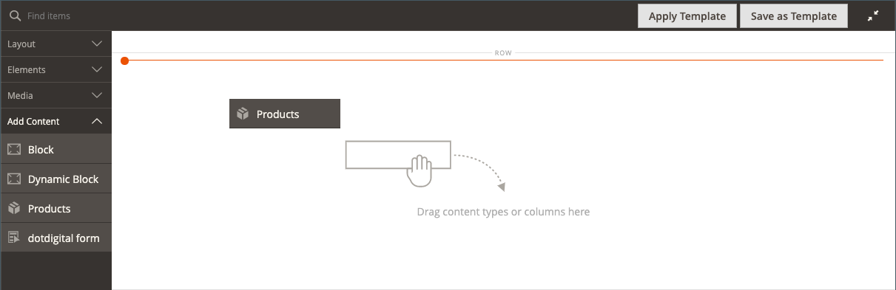
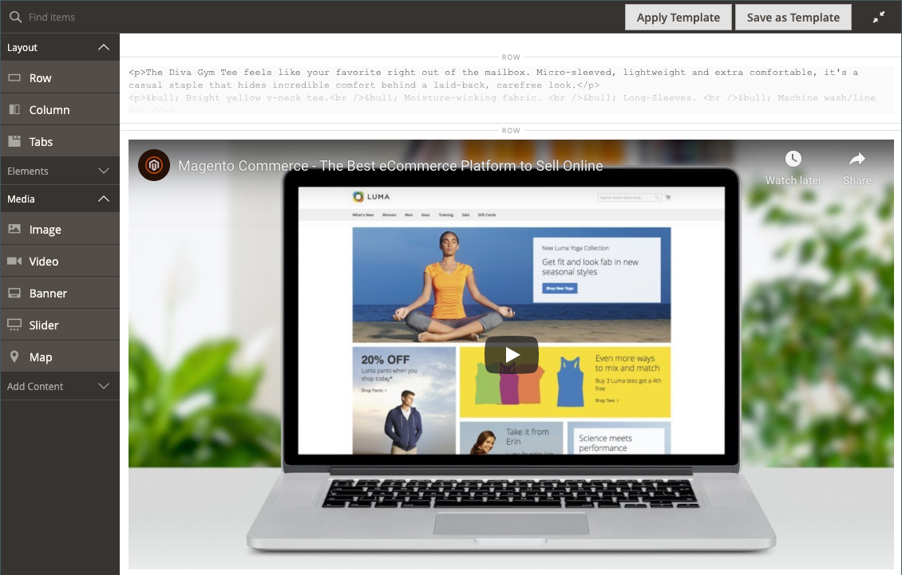
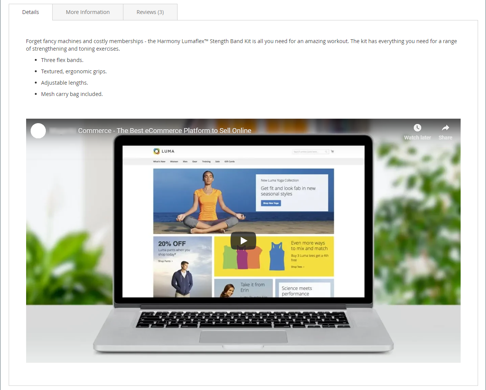

# [!DNL Page Builder] Doorlopen, deel 3: inhoud catalogus

Deze oefening toont aan hoe gemakkelijk het is om een productlijst aan een pagina toe te voegen, productpagina&#39;s aan te passen en een douanekenmerk te creëren dat toevoegt [!DNL Page Builder] werkruimte naar een set productkenmerken.

{width="600" zoomable="yes"}

Deze oefening veronderstelt dat u hebt voltooid [Deel 1: Eenvoudige pagina](1-simple-page.md) en [Deel 2: Blokken](2-blocks.md), inclusief de voorwaarden en gedownloade voorbeeldbestanden. Volg de drie onderdelen van deze oefening in orde.

## Deel 1: Een productlijst toevoegen

[!DNL Page Builder] maakt het gemakkelijk om een productlijst aan het stadium toe te voegen. In dit voorbeeld wordt de productlijst rechtstreeks aan een pagina toegevoegd.

### Stap 1: Een productlijst toevoegen aan het werkgebied

1. Op de _Beheerder_ zijbalk, ga naar **[!UICONTROL Content]** > _[!UICONTROL Elements]_>**[!UICONTROL Pages]**.

1. Zoek de _Eenvoudige pagina_ die u in de eerste oefening creeerde en in de tweede veranderde, en uitgezocht **[!UICONTROL Edit]** in de _[!UICONTROL Action]_kolom.

1. Uitbreiden  de **[!UICONTROL Content]** sectie en klik op **[!UICONTROL Edit with Page Builder]** of in het voorvertoningsgebied van de inhoud.

1. In de [!DNL Page Builder] paneel onder _[!UICONTROL Layout]_, sleept u **[!UICONTROL Row]**boven aan het werkgebied.

1. In de [!DNL Page Builder] deelvenster, uitvouwen **[!UICONTROL Add Content]** en sleep een **[!UICONTROL Products]** tijdelijke aanduiding voor de nieuwe rij.

   {width="600" zoomable="yes"}

### Stap 2: De voorwaarde samenstellen

1. Houd de muisaanwijzer boven de lege productcontainer om de gereedschapset weer te geven en kies de optie _Instellingen_ ( {width="20"} ).

   {width="600" zoomable="yes"}

1. Voor **[!UICONTROL Select Products By]**, kiest u `Condition`.

1. Voeg een voorwaarde toe:

   - Klik op de knop _Toevoegen_ ().

   - Onder _[!UICONTROL Product Attribute]_, kiest u **[!UICONTROL Category]**.

     {width="600" zoomable="yes"}

   - Voltooi de _[!UICONTROL Category is]..._ door op het pictogram Meer (...) te klikken en vervolgens op het pictogram _Kiezer_ ().

     {width="600" zoomable="yes"}

   - Blader in de categoriestructuur naar de **Vrouwen > Tops** en selecteert u de **Tees** selectievakje.

     {width="600" zoomable="yes"}

   - Klik op het vinkje ().

     De bijbehorende categorie-id wordt in het veld weergegeven om de voorwaarde te voltooien.

### Stap 3: De instellingen voltooien

1. Voer de **[!UICONTROL Number of Products to Display]**.

   Standaard worden in de lijst vijf producten weergegeven.

1. Vul de overige instellingen naar wens in.

   Gebruik zo nodig de veldbeschrijvingen aan het einde van de [Inhoud toevoegen - Producten](products.md) pagina ter referentie.

1. Klik op **[!UICONTROL Save]** om de instellingen op te slaan en terug te keren naar de [!DNL Page Builder] werkruimte.

   {width="600" zoomable="yes"}

1. Klik in de rechterbovenhoek van het werkgebied op de knop _Volledig scherm sluiten_ ( {width="20"} ).

   Als u op dit pictogram klikt, keert u terug naar het dialoogvenster _[!UICONTROL Content]_de pagina waarop de voorvertoning wordt weergegeven.

1. Klik in de rechterbovenhoek op de knop **[!UICONTROL Save]** en kiest u **[!UICONTROL Save & Close]**.

## Deel 2: De productpagina aanpassen

>[!NOTE]
>
>Een Admin-gebruiker moet [!UICONTROL Content] machtigingen voor [rolbereik](../systems/permissions-user-roles.md) om te zien [!UICONTROL Edit with Page Builder] knoppen gebruiken en in staat zijn om Page Builder te gebruiken.

In dit gedeelte van de oefening leert u hoe gemakkelijk het is om een productpagina aan te passen door een video onder de reeks lusjes op de productpagina te plaatsen. Het proces voor bijwerken [rubriekspagina](../catalog/categories-content-settings.md) inhoud is in wezen hetzelfde .

1. Op de _Beheerder_ zijbalk, ga naar **[!UICONTROL Catalog]** > **[!UICONTROL Products]**.

1. Een eenvoudig product zoeken dat u voor dit voorbeeld kunt gebruiken en openen in de bewerkingsmodus.

1. Omlaag schuiven en uitbreiden  de **[!UICONTROL Content]** sectie.

1. Volgende tot _[!UICONTROL Description]_, klikt u op **[!UICONTROL Edit with Page Builder]**.

   {width="600" zoomable="yes"}

   Als de productbeschrijving eerder is ingevoerd zonder [!DNL Page Builder], wordt de huidige beschrijving weergegeven als HTML in een [HTML-code](html-code.md) container. Bij het thema Luma wordt de productbeschrijving weergegeven op het tabblad Details.

1. In de [!DNL Page Builder] paneel onder _[!UICONTROL Layout]_, sleept u **[!UICONTROL Row]**naar het werkgebied, door het onder de container van de HTML-code te plaatsen.

   De rode hulplijn wordt weergegeven wanneer de rij zich op de juiste positie bevindt.

   {width="600" zoomable="yes"}

1. In de [!DNL Page Builder] deelvenster, uitvouwen **[!UICONTROL Media]** en sleep een **[!UICONTROL Video]** tijdelijke aanduiding voor de nieuwe rij.

   {width="600" zoomable="yes"}

1. Houd de muisaanwijzer boven de lege videopcontainer om de gereedschapset weer te geven en kies de optie _Instellingen_ ( {width="20"} ).

   {width="500" zoomable="yes"}

1. Voer de **[!UICONTROL Video URL]**.

   De video kan worden gehost op [YouTube][1] of [Vimeo][2]. De video in dit voorbeeld is te vinden op YouTube op de volgende URL:

   `https://www.youtube.com/watch?v=ZpFrNyD4100`

   {width="500" zoomable="yes"}

1. Voer de **[!UICONTROL Maximum Width]** in pixels voor de videoweergave.

   Als u deze optie leeg laat, vult de video de beschikbare ruimte.

1. Klikken **[!UICONTROL Save]** om de instellingen op te slaan en terug te keren naar de [!DNL Page Builder] werkruimte.

   {width="600" zoomable="yes"}

1. Klik in de rechterbovenhoek van het werkgebied op de knop _Volledig scherm sluiten_ ( {width="20"} ).

   Als u op dit pictogram klikt, keert u terug naar het dialoogvenster _[!UICONTROL Content]_de pagina waarop de voorvertoning wordt weergegeven.

1. Klik in de rechterbovenhoek op de knop **[!UICONTROL Save]** en kiest u **[!UICONTROL Save & Close]**.

In de winkel wordt de video weergegeven onder de tabs. Als u wilt zien hoe de pagina er op een mobiel apparaat uitziet, kunt u de grootte van het venster aanpassen.

{width="600" zoomable="yes"}

**Gefeliciteerd!** U hebt het tweede gedeelte van de zelfstudie Catalogusinhoud voltooid. Behoud het werk dat u hebt gemaakt, zodat u er later naar kunt verwijzen.

## Deel 3: Aangepaste kenmerken toevoegen

Gebruik de [!DNL Page Builder] aangepast kenmerk om een volledig functionerende [!DNL Page Builder] naar een productpagina, die u kunt gebruiken om aantrekkelijke inhoud te maken. In dit deel van de oefening, leert u hoe te om een douanekenmerk tot stand te brengen gebruikend [!DNL Page Builder] invoertype en pas het toe op productpagina&#39;s in uw catalogus. Zie voor meer informatie over deze kenmerken [Productkenmerken](../catalog/product-attributes.md).

### Stap 1: Een product maken

Als u wijzigingen in uw live winkel wilt voorkomen, maakt u een product met de beschreven eigenschappen.

1. Op de _Beheerder_ zijbalk, ga naar **[!UICONTROL Catalog]** > **[!UICONTROL Products]**.

1. Klik in de rechterbovenhoek op **[!UICONTROL Add Product]**.

1. Maak het product met de volgende eigenschappen:

   - 
     [!UICONTROL, kenmerkset]: Default
   - [!UICONTROL Product Name]: Mijn product
   - 
     [!UICONTROL SKU]: Tutorial
   - 
     [!UICONTROL Price]: 75.00
   - 
     [!UICONTROL Quantity]: 100
   - [!UICONTROL Stock Status]: in voorraad
   - 
     [!UICONTROL Weight]: 1
   - [!UICONTROL Categories]Betreft: Vrouwen > Tops > Teeën

1. Klik in de rechterbovenhoek op de knop **[!UICONTROL Save]** en kiest u **[!UICONTROL Save & Close]**.

### Stap 2: Aangepaste kenmerken maken

In deze stap maakt u twee nieuwe aangepaste kenmerken om te tonen hoe de [!DNL Page Builder] en de invoertypen van de Teksteditor kunnen worden gebruikt.

1. Op de _Beheerder_ zijbalk, ga naar **[!UICONTROL Stores]** > _[!UICONTROL Attributes]_>**[!UICONTROL Product]**.

1. Klik in de rechterbovenhoek op **[!UICONTROL Add New Attribute]**.

1. Voer een **[!UICONTROL Default Label]** voor het kenmerk.

   In dit voorbeeld kunt u `My Page Builder Attribute` voor het etiket.

1. Set **[!UICONTROL Catalog Input Type for Store Owner]** tot `Page Builder`.

   Wanneer u een aangepast kenmerk maakt, kunt u de editor die het meest geschikt is voor de toepassing als een van de `Page Builder` of de standaard, WYSIWYG `Text Editor`.

   ![[!DNL Page Builder] Invoertype](./assets/pb-attribute-page-builder.png){width="600" zoomable="yes"}

1. Uitbreiden  de **[!UICONTROL Advanced Attribute Properties]** en stel de volgende instellingen in:

   - [!UICONTROL Attribute Code]: Voer een kenmerkcode in kleine letters in met afbreekstreepjes in plaats van spaties. In dit voorbeeld kunt u `my_page_builder_attribute`.
   - [!UICONTROL Scope]: Accepteer de standaardwaarde, `Store View`.
   - [!UICONTROL Default Value]: Voer een standaardwaarde voor het kenmerk in.
   - 
     [!UICONTROL Unique Value]: `No`
   - 
     [!UICONTROL Add to Column Options]: `No`
   - 
     [!UICONTROL Use in Filter Options]: `Yes`

1. In de _[!UICONTROL Attribute Information]_links, kiest u **[!UICONTROL Storefront Properties]**en stel de volgende instellingen in:

   - 
     [!UICONTROL Use for Promo Rule Conditions]: `Yes`
   - 
     [!UICONTROL Visible on Catalog Pages on Storefront]: `Yes`
   - 
     [!UICONTROL Used in Product Listing]: `Yes`

1. Klik op **[!UICONTROL Save Attribute]**.

1. Herhaal de vorige stappen om een tweede kenmerk te maken met dezelfde basiseigenschappen, maar met het invoertype van de Teksteditor:

   - [!UICONTROL Default Label]: Kenmerk van mijn teksteditor
   - [!UICONTROL Catalog Input Type for Store Owner]: Teksteditor
   - 
     [!UICONTROL-kenmerkcode]: `my_text_editor_attribute`

### Stap 3: Werk de set met productkenmerken bij

1. Op de _Beheerder_ zijbalk, ga naar **[!UICONTROL Stores]** > _[!UICONTROL Attributes]_>**[!UICONTROL Attribute Set]**.

   In dit voorbeeld voegt u tijdelijk de nieuwe kenmerken toe aan de `default` kenmerkset. Verwijder aan het einde van deze exercitie de kenmerken uit de kenmerkset, dus niet van invloed op de catalogus.

   >[!NOTE]
   >
   >Als u uw live winkel niet wilt wijzigen, kunt u de stappen volgen zonder de kenmerkset bij te werken.

1. Zoek de _[!UICONTROL Default]_in de lijst ingestelde kenmerk en dubbelklik erop om het in de bewerkingsmodus te openen.

1. In de _Niet toegewezen kenmerken_ lijst, zoek de nieuwe attributen u creeerde en sleep elk aan _[!UICONTROL Groups]_kolom, onder **[!UICONTROL Content]**.

   De locatie van het kenmerk in het dialoogvenster [!UICONTROL Groups] bepaalt waar deze op de pagina wordt weergegeven.

   {width="600" zoomable="yes"}

1. Klikken **[!UICONTROL Save]** om terug te keren naar de lijst met kenmerksets.

1. Klik op de knop **[!UICONTROL Cache Management]** bovenaan op de pagina koppelen en eventuele ongeldige cache vernieuwen.

### Stap 4: Het product bijwerken

1. Op de _Beheerder_ zijbalk, ga naar **[!UICONTROL Catalog]** > **[!UICONTROL Products]**.

1. In het raster Producten vindt u _Mijn product_ en opent u deze in de bewerkingsmodus.

1. Omlaag schuiven en uitbreiden  de **[!UICONTROL Content]** sectie.

   Bovenaan in de sectie staan twee standaardkenmerken voor productinhoud:

   - _Korte beschrijving_, die de standaard WYSIWYG gebruikt [editor](../content-design/editor.md).
   - _Beschrijving_, die de [!DNL Page Builder] voorvertoning.

   {width="600" zoomable="yes"}

   Als u naar de onderste helft van de sectie scrolt, zijn er twee kenmerken die u hebt gemaakt en toegewezen:

   - _Mijn [!DNL Page Builder] Kenmerk_, die de [!DNL Page Builder] voorvertoning.
   - _Kenmerk van mijn teksteditor_, die de standaard redacteur WYSIWYG gebruikt.

   {width="600" zoomable="yes"}

1. In de **Kenmerk van mijn teksteditor** editor, enter `Text Editor Attribute placeholder text`.

   - Klik in de rechterbovenhoek op de knop **[!UICONTROL Save]** en kiest u **[!UICONTROL Save & Close]**.

1. Voor **Kenmerk Mijn pagina Builder**, klikt u op **[!UICONTROL Edit with Page Builder]** en voeg de beschrijvende tekst toe:

   - In de [!DNL Page Builder] deelvenster, uitvouwen **[!UICONTROL Elements]** en sleep een **[!UICONTROL Text object]** naar het werkgebied.

   - Enter `Page Builder attribute placeholder text`.

   - Klik in de rechterbovenhoek van het werkgebied op de knop _Volledig scherm sluiten_ ( {width="20"} ).

     {width="600" zoomable="yes"}

1. Omhoog schuiven tot **[!UICONTROL Description]**, klikt u op **[!UICONTROL Edit with Page Builder]** en voeg tekst toe die u leuk vindt met dezelfde methode als de vorige stap.

1. Klik in de rechterbovenhoek van de productpagina op de knop **[!UICONTROL Save]** en kiest u **[!UICONTROL Save & Close]**.

1. Klik op de knop **[!UICONTROL Cache Management]** in het bericht boven aan de pagina en vernieuw een ongeldige cache.

### Stap 5: het resultaat weergeven

1. Navigeer naar de pagina met voorbeeldproducten in de winkel.

   In dit voorbeeld vindt u het product in de bovenste navigatie onder Vrouwen > Tops > Tees.

1. Omlaag schuiven naar de _Kenmerk Mijn pagina Builder_ informatie.

   De positie van de kenmerken op de productpagina wordt bepaald door het thema. In het thema Luminantie bevinden de nieuwe kenmerken zich vlak na de beschrijving van het product.

   ![[!DNL Page Builder] en kenmerken van de Teksteditor in de winkel](./assets/pb-storefront-product-attribute.png){width="600" zoomable="yes"}

U hebt de [!DNL Page Builder] Inhoudsoefening catalogus. Behoud het werk dat u hebt gemaakt, zodat u er later naar kunt verwijzen.

[1]: https://www.youtube.com/
[2]: https://vimeo.com/
