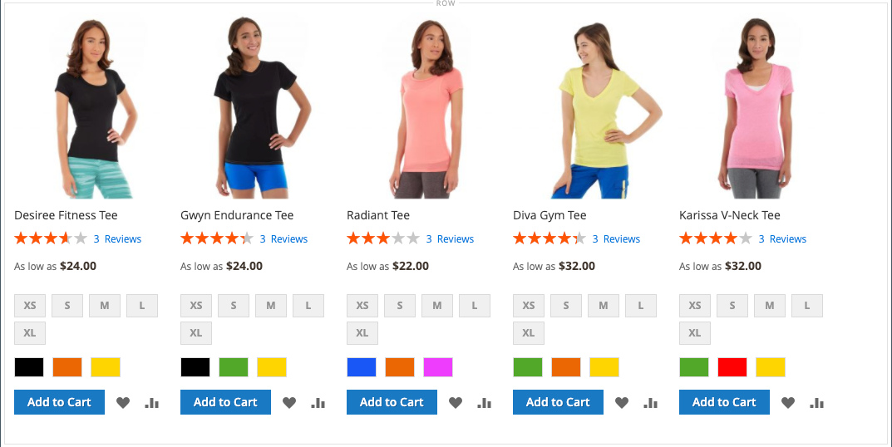

# [!DNL Page Builder] Doorlopen, deel 3: inhoud catalogus

Deze oefening toont aan hoe gemakkelijk het is om een productlijst aan een pagina toe te voegen, productpagina&#39;s aan te passen, en een douanekenmerk te creëren dat de [!DNL Page Builder] werkruimte aan een reeks productattributen toevoegt.

{width="600" zoomable="yes"}

Deze oefening veronderstelt dat u [&#x200B; Deel 1 hebt voltooid: Eenvoudige Pagina &#x200B;](1-simple-page.md) en [&#x200B; Deel 2: Blokken &#x200B;](2-blocks.md), met inbegrip van de eerste vereisten en gedownloade steekproefdossiers. Volg de drie onderdelen van deze oefening in orde.

## Deel 1: Een productlijst toevoegen

Met [!DNL Page Builder] kunt u eenvoudig een productlijst aan het werkgebied toevoegen. In dit voorbeeld wordt de productlijst rechtstreeks aan een pagina toegevoegd.

### Stap 1: Een productlijst toevoegen aan het werkgebied

1. Voor _Admin_ sidebar, ga **[!UICONTROL Content]** > _[!UICONTROL Elements]_>**[!UICONTROL Pages]**.

1. Vind de _Eenvoudige Pagina_ die u in de eerste oefening creeerde en in de tweede veranderde, en **[!UICONTROL Edit]** in de _[!UICONTROL Action]_&#x200B;kolom selecteert.

1. Breid  de **[!UICONTROL Content]** sectie uit en klik **[!UICONTROL Edit with Page Builder]** of binnen het gebied van de inhoudsvoorproef.

1. Sleep in het deelvenster [!DNL Page Builder] onder _[!UICONTROL Layout]_&#x200B;een **[!UICONTROL Row]**&#x200B;naar de bovenkant van het werkgebied.

1. Vouw **[!UICONTROL Add Content]** uit in het deelvenster [!DNL Page Builder] en sleep een tijdelijke aanduiding **[!UICONTROL Products]** naar de nieuwe rij.

   {width="600" zoomable="yes"}

### Stap 2: De voorwaarde samenstellen

1. Beweeg over de lege productcontainer om toolbox te tonen en de _pictogram van Montages_ te kiezen ( {width="20"}).

   {width="600" zoomable="yes"}

1. Kies `Condition` bij **[!UICONTROL Select Products By]** .

1. Voeg een voorwaarde toe:

   - Klik _toevoegen_ ( toe) pictogram.

   - Kies onder _[!UICONTROL Product Attribute]_&#x200B;de optie **[!UICONTROL Category]**.

     {width="600" zoomable="yes"}

   - Voltooi _[!UICONTROL Category is].._ deel van de voorwaarde door Meer (...) te klikken pictogram en dan de _Kiezer_ () te klikken.

     {width="600" zoomable="yes"} bepaalt

   - In de categorieboom, boor neer aan de **Vrouwen > Tops** categorie en selecteer **Tees** checkbox.

     {width="600" zoomable="yes"}

   - Klik het Vinkje () pictogram.

     De bijbehorende categorie-id wordt in het veld weergegeven om de voorwaarde te voltooien.

### Stap 3: De instellingen voltooien

1. Voer de **[!UICONTROL Number of Products to Display]** in.

   Standaard worden in de lijst vijf producten weergegeven.

1. Vul de overige instellingen naar wens in.

   Indien nodig, gebruik de gebiedsbeschrijvingen aan het eind van [&#x200B; toevoegen Inhoud - Producten &#x200B;](products.md) pagina voor verwijzing.

1. Klik wanneer u klaar bent op **[!UICONTROL Save]** om de instellingen op te slaan en terug te keren naar de werkruimte van [!DNL Page Builder] .

   {width="600" zoomable="yes"}

1. In de hoger-juiste hoek van het stadium, klik het _Dichte Volledige Scherm_ ( {width="20"}) pictogram.

   Wanneer u op dit pictogram klikt, keert u terug naar de sectie _[!UICONTROL Content]_&#x200B;voor de pagina waarop de voorvertoning wordt weergegeven.

1. Klik in de rechterbovenhoek op de pijl **[!UICONTROL Save]** en kies **[!UICONTROL Save & Close]** .

## Deel 2: De productpagina aanpassen

>[!NOTE]
>
>Een gebruiker Admin moet [!UICONTROL Content] toestemmingen voor hun [&#x200B; rolwerkingsgebied &#x200B;](../systems/permissions-user-roles.md) hebben om [!UICONTROL Edit with Page Builder] knopen te zien en de Bouwer van de Pagina te kunnen gebruiken.

In dit gedeelte van de oefening leert u hoe gemakkelijk het is om een productpagina aan te passen door een video onder de reeks lusjes op de productpagina te plaatsen. Het proces om [&#x200B; categorie pagina &#x200B;](../catalog/categories-content-settings.md) inhoud bij te werken is fundamenteel het zelfde.

1. Voor _Admin_ sidebar, ga **[!UICONTROL Catalog]** > **[!UICONTROL Products]**.

1. Een eenvoudig product zoeken dat u voor dit voorbeeld kunt gebruiken en openen in de bewerkingsmodus.

1. De rol neer en breidt  uit de **[!UICONTROL Content]** sectie.

1. Klik naast _[!UICONTROL Description]_&#x200B;op **[!UICONTROL Edit with Page Builder]**.

   {width="600" zoomable="yes"}

   Als de productbeschrijving eerder zonder [!DNL Page Builder] was ingegaan, verschijnt de huidige beschrijving als HTML in een [&#x200B; container van de Code van de HTML &#x200B;](html-code.md). Bij het thema Luma wordt de productbeschrijving weergegeven op het tabblad Details.

1. Sleep in het deelvenster [!DNL Page Builder] onder _[!UICONTROL Layout]_&#x200B;een **[!UICONTROL Row]**&#x200B;naar het werkgebied en plaats het onder de container met HTML-code.

   De rode hulplijn wordt weergegeven wanneer de rij zich op de juiste positie bevindt.

   {width="600" zoomable="yes"}

1. Vouw **[!UICONTROL Media]** uit in het deelvenster [!DNL Page Builder] en sleep een tijdelijke aanduiding **[!UICONTROL Video]** naar de nieuwe rij.

   {width="600" zoomable="yes"}

1. Beweeg over de lege videocontainer om toolbox te tonen en de _pictogram van Montages_ te kiezen ( {width="20"}).

   {width="500" zoomable="yes"}

1. Voer de **[!UICONTROL Video URL]** in.

   De video kan op of [ YouTube ][1] of [ Vimeo ][2] worden ontvangen. De video in dit voorbeeld is te vinden op YouTube op de volgende URL:

   `https://www.youtube.com/watch?v=ZpFrNyD4100`

   {width="500" zoomable="yes"}

1. Voer de **[!UICONTROL Maximum Width]** in pixels in voor de videoweergave.

   Als u deze optie leeg laat, vult de video de beschikbare ruimte.

1. Klik op **[!UICONTROL Save]** om de instellingen op te slaan en terug te keren naar de werkruimte van [!DNL Page Builder] .

   {width="600" zoomable="yes"}

1. In de hoger-juiste hoek van het stadium, klik het _Dichte Volledige Scherm_ ( {width="20"}) pictogram.

   Wanneer u op dit pictogram klikt, keert u terug naar de sectie _[!UICONTROL Content]_&#x200B;voor de pagina waarop de voorvertoning wordt weergegeven.

1. Klik in de rechterbovenhoek op de pijl **[!UICONTROL Save]** en kies **[!UICONTROL Save & Close]** .

In de winkel wordt de video weergegeven onder de tabs. Als u wilt zien hoe de pagina er op een mobiel apparaat uitziet, kunt u de grootte van het venster aanpassen.

{width="600" zoomable="yes"} wordt getoond

**Gefeliciteerd!** U hebt het tweede gedeelte van de zelfstudie Catalogusinhoud voltooid. Behoud het werk dat u hebt gemaakt, zodat u er later naar kunt verwijzen.

## Deel 3: Aangepaste kenmerken toevoegen

Met het aangepaste kenmerk [!DNL Page Builder] kunt u een volledig functionerende [!DNL Page Builder] -werkruimte toevoegen aan een productpagina die u kunt gebruiken om aansprekende inhoud te maken. In dit deel van de oefening, leert u hoe te om een douanekenmerk tot stand te brengen gebruikend het [!DNL Page Builder] inputtype en het op productpagina&#39;s in uw catalogus toe te passen. Voor meer informatie over deze attributen, zie {de Attributen van het 0} Product [&#128279;](../catalog/product-attributes.md).

### Stap 1: Een product maken

Als u wijzigingen in uw live winkel wilt voorkomen, maakt u een product met de beschreven eigenschappen.

1. Voor _Admin_ sidebar, ga **[!UICONTROL Catalog]** > **[!UICONTROL Products]**.

1. Klik in de rechterbovenhoek op **[!UICONTROL Add Product]** .

1. Maak het product met de volgende eigenschappen:

   - &#x200B;

     [!UICONTROL , kenmerkset]: Default
   - [!UICONTROL Product Name]: Mijn product
   - &#x200B;

     [!UICONTROL SKU]: Tutorial
   - &#x200B;

     [!UICONTROL Price]: 75.00
   - &#x200B;

     [!UICONTROL Quantity]: 100
   - [!UICONTROL Stock Status]: in voorraad
   - &#x200B;

     [!UICONTROL Weight]: 1
   - [!UICONTROL Categories]: Vrouwen > Tees > Tees

1. Klik in de rechterbovenhoek op de pijl **[!UICONTROL Save]** en kies **[!UICONTROL Save & Close]** .

### Stap 2: Aangepaste kenmerken maken

In deze stap maakt u twee nieuwe aangepaste kenmerken om te tonen hoe de invoertypen [!DNL Page Builder] en Text Editor kunnen worden gebruikt.

1. Voor _Admin_ sidebar, ga **[!UICONTROL Stores]** > _[!UICONTROL Attributes]_>**[!UICONTROL Product]**.

1. Klik in de rechterbovenhoek op **[!UICONTROL Add New Attribute]** .

1. Voer een **[!UICONTROL Default Label]** in voor het kenmerk.

   In dit voorbeeld gebruikt u `My Page Builder Attribute` voor het label.

1. Stel **[!UICONTROL Catalog Input Type for Store Owner]** in op `Page Builder` .

   Wanneer u een aangepast kenmerk maakt, kunt u de editor die het meest geschikt is voor de toepassing opgeven als `Page Builder` of als de standaard, WYSIWYG `Text Editor` .

   ![[!DNL Page Builder] Invoertype &#x200B;](./assets/pb-attribute-page-builder.png){width="600" zoomable="yes"}

1. Breid  de **[!UICONTROL Advanced Attribute Properties]** sectie uit en maak de volgende montages:

   - [!UICONTROL Attribute Code]: voer een kenmerkcode in kleine letters in met afbreekstreepjes in plaats van spaties. Gebruik `my_page_builder_attribute` voor dit voorbeeld.
   - [!UICONTROL Scope]: accepteer de standaardwaarde, `Store View` .
   - [!UICONTROL Default Value]: voer een standaardwaarde voor het kenmerk in.
   - &#x200B;

     [!UICONTROL Unique Value]: `No`
   - &#x200B;

     [!UICONTROL Add to Column Options]: `No`
   - &#x200B;

     [!UICONTROL Use in Filter Options]: `Yes`

1. Kies in het deelvenster _[!UICONTROL Attribute Information]_&#x200B;aan de linkerkant de optie **[!UICONTROL Storefront Properties]**&#x200B;en stel de volgende instellingen in:

   - &#x200B;

     [!UICONTROL Use for Promo Rule Conditions]: `Yes`
   - &#x200B;

     [!UICONTROL Visible on Catalog Pages on Storefront]: `Yes`
   - &#x200B;

     [!UICONTROL Used in Product Listing]: `Yes`

1. Klik op **[!UICONTROL Save Attribute]** als de bewerking is voltooid.

1. Herhaal de vorige stappen om een tweede kenmerk te maken met dezelfde basiseigenschappen, maar met het invoertype van de Teksteditor:

   - [!UICONTROL Default Label]: Kenmerk van mijn teksteditor
   - [!UICONTROL Catalog Input Type for Store Owner]: Teksteditor
   - &#x200B;

     [!UICONTROL -kenmerkcode]: `my_text_editor_attribute`

### Stap 3: Werk de set met productkenmerken bij

1. Voor _Admin_ sidebar, ga **[!UICONTROL Stores]** > _[!UICONTROL Attributes]_>**[!UICONTROL Attribute Set]**.

   In dit voorbeeld voegt u tijdelijk de nieuwe kenmerken toe aan de `default` -kenmerkset. Verwijder aan het einde van deze exercitie de kenmerken uit de kenmerkset, dus niet van invloed op de catalogus.

   >[!NOTE]
   >
   >Als u uw live winkel niet wilt wijzigen, kunt u de stappen volgen zonder de kenmerkset bij te werken.

1. Zoek het kenmerk _[!UICONTROL Default]_&#x200B;dat is ingesteld in de lijst en dubbelklik erop om het te openen in de bewerkingsmodus.

1. In de _Niet toegewezen Lijst van Attributen_, vind de nieuwe attributen u creeerde en sleep elk aan de _[!UICONTROL Groups]_&#x200B;kolom, onder **[!UICONTROL Content]**.

   De locatie van het kenmerk in de kolom [!UICONTROL Groups] bepaalt waar het kenmerk op de pagina wordt weergegeven.

   {width="600" zoomable="yes"}

1. Klik op **[!UICONTROL Save]** om terug te keren naar de lijst met kenmerksets.

1. Klik wanneer daarom wordt gevraagd op de koppeling **[!UICONTROL Cache Management]** boven aan de pagina en vernieuw eventuele ongeldige cache.

### Stap 4: Het product bijwerken

1. Voor _Admin_ sidebar, ga **[!UICONTROL Catalog]** > **[!UICONTROL Products]**.

1. In het net van Producten, vind _Mijn Product_ en open het op geef wijze uit.

1. De rol neer en breidt  uit de **[!UICONTROL Content]** sectie.

   Bovenaan in de sectie staan twee standaardkenmerken voor productinhoud:

   - _Korte Beschrijving_, die de standaardWYSIWYG [&#x200B; redacteur &#x200B;](../content-design/editor.md) gebruikt.
   - _Beschrijving_, die [!DNL Page Builder] voorproef toont.

   {width="600" zoomable="yes"}

   Als u naar de onderste helft van de sectie scrolt, zijn er twee kenmerken die u hebt gemaakt en toegewezen:

   - _Mijn [!DNL Page Builder] Attribuut_, dat de [!DNL Page Builder] voorproef toont.
   - _Mijn Kenmerk van de Redacteur van de Tekst_, dat de standaard redacteur van WYSIWYG gebruikt.

   {width="600" zoomable="yes"} uitgeeft

1. In de **Mijn redacteur van de Tekst van het Attribuut** redacteur, ga `Text Editor Attribute placeholder text` in.

   - Klik in de rechterbovenhoek op de pijl **[!UICONTROL Save]** en kies **[!UICONTROL Save & Close]** .

1. Voor **Mijn Attribuut van de Bouwer van de Pagina**, klik **[!UICONTROL Edit with Page Builder]** en voeg de beschrijvingstekst toe:

   - Vouw **[!UICONTROL Elements]** uit in het deelvenster [!DNL Page Builder] en sleep een **[!UICONTROL Text object]** naar het werkgebied.

   - Voer `Page Builder attribute placeholder text` in.

   - In de hoger-juiste hoek van het stadium, klik het _Dichte Volledige Scherm_ ( {width="20"}) pictogram.

     {width="600" zoomable="yes"}

1. Schuif omhoog naar **[!UICONTROL Description]** , klik op **[!UICONTROL Edit with Page Builder]** en voeg alle tekst toe die u leuk vindt met dezelfde methode als de vorige stap.

1. Klik in de rechterbovenhoek van de productpagina op de pijl **[!UICONTROL Save]** en kies **[!UICONTROL Save & Close]** .

1. Als daarom wordt gevraagd, klikt u op de koppeling **[!UICONTROL Cache Management]** in het bericht boven aan de pagina en vernieuwt u eventuele ongeldige cache.

### Stap 5: het resultaat weergeven

1. Navigeer naar de pagina met voorbeeldproducten in de winkel.

   In dit voorbeeld vindt u het product in de bovenste navigatie onder Vrouwen > Tops > Tees.

1. De rol neer aan _Mijn attributen van de Bouwer van de Pagina_ informatie.

   De positie van de kenmerken op de productpagina wordt bepaald door het thema. In het thema Luminantie bevinden de nieuwe kenmerken zich vlak na de beschrijving van het product.

   ![[!DNL Page Builder] en de attributen van de Redacteur van de Tekst in storefront &#x200B;](./assets/pb-storefront-product-attribute.png){width="600" zoomable="yes"}

U hebt de oefening Inhoud catalogus van [!DNL Page Builder] voltooid. Behoud het werk dat u hebt gemaakt, zodat u er later naar kunt verwijzen.

[1]: https://www.youtube.com/
[2]: https://vimeo.com/
